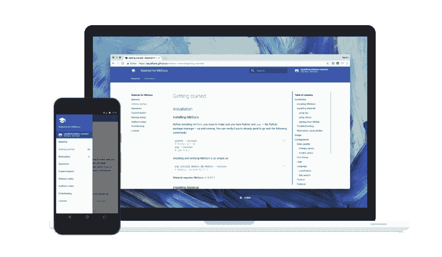

# MkDocs 材料样板-初学者工具包

> 原文：<https://dev.to/peaceiris/mkdocs-material-boilerplate---starter-kit-7i4>

[](https://res.cloudinary.com/practicaldev/image/fetch/s--KHeKk0tt--/c_limit%2Cf_auto%2Cfl_progressive%2Cq_auto%2Cw_880/https://thepracticaldev.s3.amazonaws.com/i/zuxbp93aoriife88tla9.png)

* * *

## 概述

我发布了 **MkDocs 材料样板-初学者工具包**🚀

👉[peace iris/mkdocs-material-boilerplate-GitHub](https://github.com/peaceiris/mkdocs-material-boilerplate)

MkDocs 材料样板(初学者工具包)——通过 Docker、pipenv 和 GitHub 操作将文档部署到平台(Netlify、GitHub 页面、GitLab 页面和 AWS Amplify 控制台)。

问题、拉请求、评论和 GitHub 明星⭐️都是 welcome❗️

* * *

## 什么是 MkDocs

MkDocs 是最好的静态站点生成器之一。我们可以使用 markdown 编写我们的文档，MkDocs 从 markdown 构建静态站点。

[MkDocs 材质](https://github.com/squidfunk/mkdocs-material)是基于[材质设计](https://material.io/)的 MkDocs 主题之一。

* * *

## 部署到平台

我们有很多选择来管理和部署文档。

*   [github pages](https://pages.github.com/)+[github](https://github.com/)
    *   `mkdocs gh-deploy`命令
    *   循环
    *   GitHub 操作
*   [gitlab pages](https://about.gitlab.com/product/pages/)+[gitlab](https://about.gitlab.com/)+[gitlab ci/CD](https://about.gitlab.com/product/continuous-integration/)
*   [Netlify](https://www.netlify.com/) +
    *   开源代码库
    *   GitLab
    *   [BitBucket](https://bitbucket.org/)
*   [AWS 放大器控制台](https://aws.amazon.com/amplify/console/) +
    *   开源代码库
    *   GitLab
    *   BitBucket
    *   [AWS 代码提交](https://aws.amazon.com/codecommit/)

这个样板文件包括构建和部署设置。我们现在就可以**轻松**发布我们的文档**❗️**

👉[GitHub 页面上的演示站点](https://peaceiris.github.io/mkdocs-material-boilerplate/)(使用 GitHub 动作构建&部署)

* * *

## 更

进入[peace iris/mkdocs-material-boilerplate-GitHub](https://github.com/peaceiris/mkdocs-material-boilerplate)获取更多信息。

感谢阅读，享受 MkDocs❗️

## [peace iris](https://github.com/peaceiris)/[mkdocs-material-样板文件](https://github.com/peaceiris/mkdocs-material-boilerplate)

### MkDocs 材料样板(初学者工具包)-使用 CircleCI、Docker、pipenv、GitHub 操作将文档部署到托管平台(Netlify、GitHub 页面、GitLab 页面和 AWS Amplify 控制台)

<article class="markdown-body entry-content container-lg" itemprop="text">

# [](https://raw.githubusercontent.com/peaceiris/mkdocs-material-boilerplate/master/docs_sampimg/graduate-cap.png) 
MkDocs 材料
样板文件-入门套件

[](https://raw.githubusercontent.com/peaceiris/mkdocs-material-boilerplate/master/docs_sampimg/material.png)

[](https://github.com/peaceiris/mkdocs-material-boilerplate/blob/master/LICENSE)[](https://github.com/peaceiris/mkdocs-material-boilerplate/releases/latest)[](https://github.com/peaceiris/mkdocs-material-boilerplate/releases)[T11】](https://github.com/peaceiris/mkdocs-material-boilerplate/actions)

[ ](https://app.netlify.com/sites/mkdocs-material/deploys) [ ](https://hub.docker.com/r/peaceiris/mkdocs-material)

## 细节

阅读更多信息<g-emoji class="g-emoji" alias="point_right" fallback-src="https://github.githubassets.cimg/icons/emoji/unicode/1f449.png">👉</g-emoji> [文档- MkDocs 素材样板](https://peaceiris.github.io/mkdocs-material-boilerplate/)

## 快速启动

```
git clone https://github.com/peaceiris/mkdocs-material-boilerplate.git
cd mkdocs-material-boilerplate
pipenv sync --dev
pipenv shell
inv serve --config-file mkdocs-sample.yml
```

## 链接

*   [mkdocs/mkdocs:使用 Markdown - GitHub 的项目文档](https://github.com/mkdocs/mkdocs/)
*   [squid funk/MkDocs-Material:MkDocs 的材料设计主题](https://github.com/squidfunk/mkdocs-material)

## 许可证

*   [麻省理工学院许可证](https://github.com/peaceiris/mkdocs-material-boilerplate/blob/master/LICENSE)
*   [来自 www.flaticon.com](https://www.flaticon.com/free-icon/graduate-cap_62627)[的](https://www.flaticon.com/) [Freepik](https://www.freepik.com/) 制作的毕业帽图标由授权 [CC 3.0](http://creativecommons.org/licenses/by/3.0/)

## 支持作者

*   [亚马逊愿望清单](http://amzn.asia/ilWK0Yj)

</article>

[View on GitHub](https://github.com/peaceiris/mkdocs-material-boilerplate)