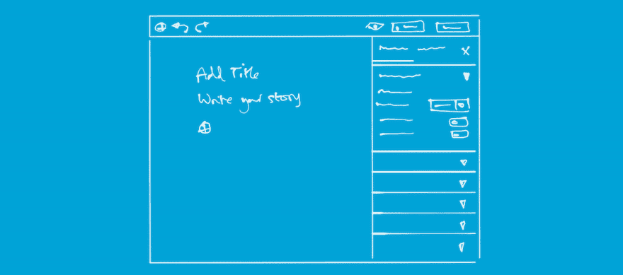
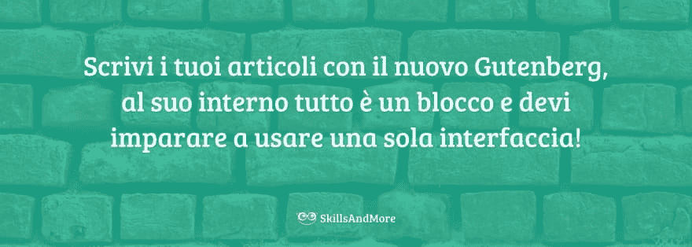
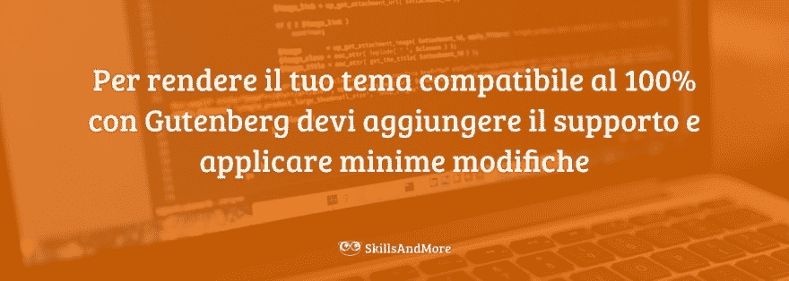
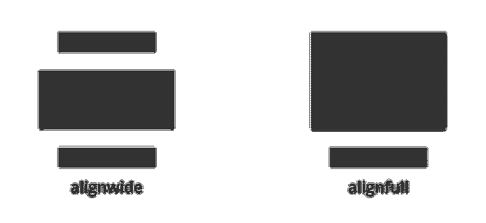
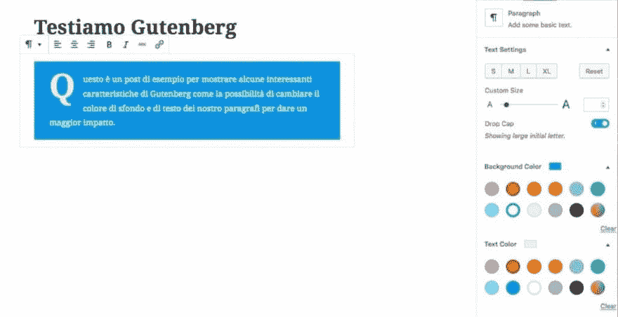
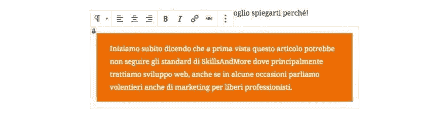
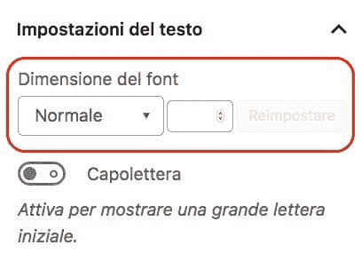

# 让你的主题与古腾堡一致！

> [https://dev . to/andreabargainii/make-compatible-il-tuo-theme-con-Gutenberg-142d](https://dev.to/andreabarghigiani/rendi-compatibile-il-tuo-tema-con-gutenberg-142d)

最近，我们目睹了 WordPress 世界发生的巨大变革，从第 5 版开始，推出了一款全新的编辑器，彻底革新了平台。你确定你的主题是兼容的吗？

如果像许多其他技能一样，您是一名开发者，而[为您的客户创建 WordPress](https://skillsandmore.org/corso/crea-il-tuo-primo-tema-wordpress/) 主题，这一消息让您非常感兴趣，本文将向您介绍如何使您的主题兼容！

从版本 5 开始 WordPress 平台查找**包括取代经典 TinyMCE 的新编辑器**，我们很熟悉。

<figure>[](https://res.cloudinary.com/practicaldev/image/fetch/s--toqCarW0--/c_limit%2Cf_auto%2Cfl_progressive%2Cq_auto%2Cw_880/https://skillsandmore.org/wp-content/uploads/2018/04/confronto-tinymce-gutenberg.png)

<figcaption>TinyMCE e Gutenberg a confronto</figcaption>

</figure>

本图展示了编辑在新 WordPress 安装中所经历的变化，我们需要为自己和客户做好准备。

如果您想知道这个新功能**是否可以停用，答案是**，您可以随时安装[这个外挂程式](http://it.wordpress.org/plugins/classic-editor/)，虽然我认为拥抱这个新功能会更好，了解这对我们的客户有何好处

这篇文章你会发现我在上次研讨会上分享的同样的信息[【2018 年都灵 word camp】](http://2018.torino.wordcamp.org/session/come-preparare-il-tuo-tema-allavvento-di-gutenberg/)，但我在这个平台上发表是因为无法录音。

我会详细地向您说明使您的主题与古腾堡兼容所需的步骤，但如果您更感兴趣的是此事的 gist，您可以参考[幻灯片](http://www.slideshare.net/AndreaBarghigiani/prepara-il-tema-wordpress-per-gutenberg)。

## 古腾堡是什么？

我们先回答问题，试着了解一下这个新编辑提出了什么。

任何使用过经典 WordPress 编辑器的人都知道，他无疑是一个优秀的编辑器，可以通过“[插件存储库“](http://wordpress.org/plugins/search/tinymce/)”中的一系列附加插件来丰富功能。

如果您还不知道，在撰写文章时或在 4.8 版中引入的最新文本小部件中使用的“t1”**不是开发的工具 WordPress** ，而是在创建此 CMS 时使用的工具

考虑到 WordPress(现在的[在 33.3%](http://w3techs.com/technologies/overview/content_management/all) 的网站中使用)的普及，以及需要能够帮助新手创建网页的工具，TinyMCE 和我们喜爱的平台的街道开始划分。

不要误会，TinyMCE 是一个很好的文本编辑器，它具有很强的兼容性，使您可以在几乎任何设备上创建可读的 web 文档，但是 WordPress 用户的需求随着时间的推移而变化，**发展到了与经典编辑器**不同的方向。

WordPress 开发人员多年来一直试图通过在此编辑器中引入“t0”的复杂元素来弥补这些缺陷。

为了满足您的所有需求，我们创建了快捷方式代码，其中一些用于将内容放在同一平台上(如“T1”电子商务产品)，而另一些则用于调用外部资源，如 YouTube 视频(由于 oembed“”)，而另一些则用于调用外部资源，如“T2”

也就是说，所有这些片段都是一个很大的可用性问题，加上我们工作的快照，就可以看出 WordPress 的创作迄今受到了限制。

这就是为什么今天开发了名为古腾堡的新编辑器！

[](https://res.cloudinary.com/practicaldev/image/fetch/s--JiaPPScw--/c_limit%2Cf_auto%2Cfl_progressive%2Cq_auto%2Cw_880/https://skillsandmore.org/wp-content/uploads/2018/06/gutenberg-blueprint.png)

此新编辑器是**简化此平台网页**的创建。

最初，它的方法是将内容插入转换为更直观的东西(从名称上来说)，创建类似于媒体的写入，现在也可以在 LinkedIn 等其他平台上使用。

但是在它的演变过程中，人们发现“T0”用户想要更多的东西——“t1”，每天上网的人不仅想输入文字，还想构建“T2”动态、引人注目的内容——“T3”帮助他们保持活力

并介绍了 _*块的概念。*

古腾堡**每种内容类型都是块**。无论我们谈论的是标题、段落、youtube 视频还是行动呼吁；**一切都是块**用同样的工具插入。

[](https://res.cloudinary.com/practicaldev/image/fetch/s--0_QWZVkS--/c_limit%2Cf_auto%2Cfl_progressive%2Cq_auto%2Cw_880/https://skillsandmore.org/wp-content/uploads/2019/02/gutenberg-blocchi.jpg)

这种方法，不管您喜不喜欢，已经成为 WordPress 中的创作标准，帮助我们更快地摆脱旧的快捷方式解决方案，同时提供我们在编辑器中从未见过的功能。

在这篇文章里，我答应向你解释‘t0’是如何准备你的主题‘古腾堡’t1’，这就是我准备做的。

如果您想逐步了解我稍后将向您介绍的代码块，我建议您安装 WordPress 版本，这样您就可以实时测试我们对本文所做的所有更改。

## 如何在古腾堡准备您的 WordPress 主题

第一个好消息是任何主题**都与所有古腾堡街区**兼容。这是因为用来从我们的页面调用它们的函数总是`the_content()`，即[任何循环](https://skillsandmore.org/wp-query-wordpress-loop-personalizzati/)调用的经典函数，以获取数据库中保存的链接到页面的内容。

但是，即使我们的主题能够检索到使用此新编辑器保存的内容，它们也不一定能够充分利用所有新功能。

[](https://res.cloudinary.com/practicaldev/image/fetch/s--xMhCk2JK--/c_limit%2Cf_auto%2Cfl_progressive%2Cq_auto%2Cw_880/https://skillsandmore.org/wp-content/uploads/2019/02/tema-compatibile-gutenberg.jpg)

这就是为什么我将剩馀的内容组织成不同的部分，以便您可以快速查看您感兴趣的主题，从您的代码中的一个小提示开始。

### 我们分开文件增加

创建 WordPress 主题不再像以前那样简单，只需看一眼我们的“`functions.php`”即可了解到，到达数千行代码太容易了，这使得浏览文件本身变得非常困难。

为此，在讨论如何激活这个新编辑器的一些最有趣的功能之前，我想给大家一个提示，您也可以在[的](http://github.com/Automattic/_s/blob/master/functions.php#L153)[著名主题](http://github.com/Automattic/_s/blob/master/functions.php#L153)的`functions.php`代码中找到，也就是说，我想建议您将**代码分开**

为了做到这一点，你所要做的就是依靠`get_template_direcoty()`函数并调用文件──您将从中声明所有与古腾堡相关的自定义和函数。

继□de _ s 之后，我也在我的主题内创建了一个名为`inc/`的文件夹，并添加了如下内容:

```
<?php // Inserito soltanto per la colorazione della sintassi
/**
 * Codice aggiuntivo per Gutenberg
 */
if ( defined( 'GUTENBERG_VERSION' ) ) {
   get_template_directory() . '/inc/gutenberg.php';
} 
```

Enter fullscreen mode Exit fullscreen mode

我建议你把古腾堡的所有代码都放在文件`inc/gutenberg.php`里，或者至少这是我们在这篇文章里拿的。

我建议您遵循这一良好做法，因为它将帮助您**保持主题代码**的更有条理，并且将来能够更轻松地修改所需的部分。

### 声明与宽图像和全图像兼容

现在，我们已经准备好了“”字段，并创建了一个专用于古腾堡兼容性的文件，现在是开始使用最需要的功能之一自定义主题的时候了:插入跨越宽度的“*”图像的能力*

[](https://res.cloudinary.com/practicaldev/image/fetch/s--wh_iBMKT--/c_limit%2Cf_auto%2Cfl_progressive%2Cq_auto%2Cw_880/https://skillsandmore.org/wp-content/uploads/2018/06/esempio-immagine-fuori-contenuto-1024x666.jpg)

如上所述，∞与页面内容相比稍宽一些，虽然主题开发人员为了达到这一目的，通过古腾堡**这一切都是固有的**，可以随意激活

这是因为古腾堡为我们的图像插入了**两个新的对齐方式**，尽管它们实际上是其他块中可用的对齐方式。

[](https://res.cloudinary.com/practicaldev/image/fetch/s--9_hbYs8O--/c_limit%2Cf_auto%2Cfl_progressive%2Cq_auto%2Cw_880/https://skillsandmore.org/wp-content/uploads/2018/06/align-wide-full-icons.png)

这是两个新图标，它们将插入兼容的块对齐方式，并且按照名称的建议，允许插入大于“宽”(wide)的块，或者允许插入大于“全”(full)窗口宽度的块。

从这一定义中可以明显看出，这些类型的对齐在单列站点上运行良好，但您可能也可以利用它们。

别害怕，只是 CSS！

涴虳陔勤硐岆蜡褫眕籵彻翋栀赻隅砱腔 CSS 寞寀﹝。

到了关键时刻，该扪心自问:_ **如何激活这一新功能呢？**

问这个问题是正确的，因为即使您在您的平台上安装了古腾堡，或者使用 WordPress 版本，这些新的对齐方式也不会出现在您的主题中。

如同其他新功能一样，例如 *title-tag* 、*post thumbnail*或 HTML5 中的结构(仅举几个例子)，我们开发的主题**必须自行声明**

对于新的宽对齐和全对齐，只需打开文件`inc/gutenberg.php`，并输入如下内容:

```
<?php // Inserito soltanto per la colorazione della sintassi
/**
 * Dichiaro supporto per le funzionalità di Gutenberg
 */
add_action('after_setup_theme', 'sam_add_gutenberg_support');
function sam_add_gutenberg_support(){

  // Dichiaro supporto per allineamenti wide e full
  add_theme_support('align-wide');

} 
```

Enter fullscreen mode Exit fullscreen mode

如果您是一位经验丰富的 WordPress 开发人员，您应该注意到一件事，使用“`add_theme_support()`”不需要挂接，或许“`add_action( 'after_setup_theme')`”的存在使您产生了兴趣(或使您鼻子生锈)。

说到古腾堡，我更喜欢插入它，因为正如您在其他示例中所看到的那样，我们将再次声明与古腾堡功能的新兼容性，并且为了保持我的代码以最佳方式组织，我更喜欢这样做。

既然我们已经声明了与这些新排列的兼容性，您现在可以使用它们了吗？

您也可以使用它们，因为古腾堡将会有两个新的对齐图示，但是 WordPress 只会新增类别:`.alignwide`和`.alignfull`，就像任何其他对齐一样，我们开发人员应该新增 CSS 程式码来套用此效果。

小升级

在过去几周中，还增加了通过【`add_theme_support('wp-block-styles')`从前端检索古腾堡块样式的功能，为定制提供了良好的起点。

如果您要自订这些新对齐方式，可以使用下列程式码做为起点。

```
.alignfull {
  margin-left: calc(50% – 50vw);
  margin-right: calc(50% – 50vw);
  width: auto;
  max-width: 1000%;
}

.alignwide {
  margin-left: calc(25% – 25vw);
  margin-right: calc(25% – 25vw);
  width: auto;
  max-width: 1000%;
}

.alignwide img,
.alignfull img {
  display: block;
  margin: 0 auto;
} 
```

Enter fullscreen mode Exit fullscreen mode

这是我在实验中使用的 CSS 代码，让*的图像能够超越*的内容增长。随心所欲地使用它。

### 提出专用调色板

现在，我们已经看到古腾堡公司推出的第一个引人注目的功能，我们继续我们的旅程，发现作为一个开发人员，我并不太喜欢它，但我认识到它对所有想要为自己的页面添加颜色的用户都非常有用。

[](https://res.cloudinary.com/practicaldev/image/fetch/s--tZT6hXJ2--/c_limit%2Cf_auto%2Cfl_progressive%2Cq_auto%2Cw_880/https://skillsandmore.org/wp-content/uploads/2018/06/gutenberg-change-color-1024x526.jpg)

这也是一项非常有用的功能，因为它与 Drop Cap 一起，有助于创建更具吸引力的文章部分。

颜色的选择非常重要，即使有帮助我们选择最佳对比度的警告，我担心总是可以做到的

好消息是，作为现在的主题创作者**，我们可以建议具体的颜色**，抑制添加新颜色的可能性！

∞很简单，因为只需回到我们的`inc/gutenberg.php`上，在原有功能上添加一个新的`add_theme_support()`。下面是完整的代码，其中还包含新对齐兼容性声明。

```
<?php // Inserito soltanto per la colorazione della sintassi

/**
 * Dichiaro supporto per le funzionalità di Gutenberg
 */
add_action('after_setup_theme', 'sam_add_gutenberg_support');
function sam_add_gutenberg_support(){

    // Dichiaro supporto per allineamenti wide e full
    add_theme_support('align-wide');

    // Dichiaro i colori da usare nel template
    add_theme_support( 'editor-color-palette',
    array(
      array(
          'name' => 'Verde SAM',
          'slug' => 'verde-sam',
          'color' => '#1ABC9C',
      ),
      array(
          'name' => 'Arancione SAM',
          'slug' => 'arancione-sam',
          'color' => '#EF6C00',
      ),
      array(
          'name' => 'Bianco',
          'slug' => 'white',
          'color' => '#FFF',
      ),
      array(
          'name' => 'Grigio',
          'slug' => 'grigio',
          'color' => '#333',
      ),
    )
  );

    // Disabilito la scelta dei colori
    add_theme_support( 'disable-custom-colors' );

} 
```

Enter fullscreen mode Exit fullscreen mode

建议的颜色是以 WordPress(WordPress)的形式声明的，正如在“[WP _ query“](https://skillsandmore.org/wp-query-wordpress-loop-personalizzati/)”中所看到的那样，数组只需建议有关建议名称的详细信息即可。

例如，如果在创建 WordPress 文本块时使用*Sam 橙色*作为背景，而*白色*作为文本颜色，则会为我生成以下类，我可以在 CSS 中自定义这些类:`.has-arancione-sam-background-color`和`.has-bianco-color`。

[](https://res.cloudinary.com/practicaldev/image/fetch/s--Z40QZel6--/c_limit%2Cf_auto%2Cfl_progressive%2Cq_auto%2Cw_880/https://skillsandmore.org/wp-content/uploads/2019/02/blocco-sfondo-arancione-testo-bianco.jpg)

除此之外，我们还禁用了选择其他颜色的功能，这样，我们的客户只会使用定义为 *in-brand* 的颜色。这是由于`add_theme_support('disable-custom-colors' )`而得以实现的。

### 管理文本的标准测量

当我们深入了解这个强大的编辑器所引入的新功能时，我们看到的功能看起来可能很简单，但实际上更正确，因为 WordPress 用户每天都会用到这些功能。

[](https://res.cloudinary.com/practicaldev/image/fetch/s--zBN-WBqM--/c_limit%2Cf_auto%2Cfl_progressive%2Cq_auto%2Cw_880/https://skillsandmore.org/wp-content/uploads/2019/02/impostazioni-grandezza-testo.jpg)

使用此编辑器，用户还可以使用滑块或方便的按钮来更改文本大小*。* 

```
.has-small-font-size{ … }

.has-large-font-size{ … }

.has-larger-font-size{ … } 
```

Enter fullscreen mode Exit fullscreen mode

这样一来，如果选择字体大小的*，我们就可以放心地用我在上面给你介绍的类复盖古腾堡风格。*

这是一个很简单的步骤，反正我想给你介绍一下，以便于你的工作。

### 了解块的整体结构

现在，如果我必须对你说实话，我们没有其他伟大的功能需要申报我们与古腾堡的兼容性。

只要“`add_theme_support('wp-block-styles')`中包含的样式不会复盖所有块，至少是 GitHub 中描述的那些被认为是演示性的块，我们的开发人员就必须开发样式，以便更好地呈现用户输入的内容。

因此，我认为这是一个很好的机会来快速研究古腾堡如何在网站前端创建这些块。

```
<figure class="wp-block-image aligncenter">
  
  <figcaption>…</figcaption>
</figure> 
```

Enter fullscreen mode Exit fullscreen mode

我要分析的第一个区块之一是专用区块□

与旧 TinyMCE 不同，带有字幕的的的新编辑器为我们提供了一个包含类“`.wp-block-image`”和其他专用类的元素“`<figure>`”

幸运的是，古腾堡已经推出了其他有趣的图像块，因为除了我们已经知道的对齐方式之外，它还为我们提供了一个全新的块:“T0”

```
<div class="wp-block-cover-image has-background-dim-40 has-background-dim" style="background-image:url(…)">
    <p class="wp-block-cover-image-text">…</p>
<div> 
```

Enter fullscreen mode Exit fullscreen mode

上面显示的代码是由新块封面生成的，这块首次允许我们**在图片**上写字，也创造了引人注目的视差效果！

除了类别`.wp-block-cover-image`之外，此元素还有其他非常有趣的类别，例如`.has-background-dim`和`.has-background-dim-40`，这些类别可让我们使用现有的专用设定来自订此元素

在这种情况下，额外的类别可让您在【**上方加入较暗的层级，并将其透明度设定为 40%** ，但在其他情况下(如前面的蓝色段落)，则可让您传递更多资讯，而无需在元素上加入任何属性`style`

也许你已经明白为什么我在前端给你展示了这么多块代码的示例，但给最后一块代码留出了空间。

```
<blockquote class="wp-block-quote">
    <p>…</p>
    <cite>…</cite>
</blockquote> 
```

Enter fullscreen mode Exit fullscreen mode

总是引用某人是我们写作的一个组成部分。这就是为什么古腾堡为我们提供了一个同时尊重正确用法语法的块。

## 结论

古腾堡是一个不断发展的项目，仅在一年内就创造了近 30 个版本，所以我可以向你保证，“**这不是一个最终的职位**，我将再次详细讲述这个工具，因为它将成为我们最喜欢的平台的一部分。

现在，我想向大家介绍一些有趣的功能，但由于我们已经超过 2500 个字，我认为现在是向大家道别的时候了，让大家知道你们的想法。

我对这个工具有很多的了解，因为我想更好地了解‘t0’如何创造我们的方块，并把所有在未来几年将要退休的旧的短队列和小部件放在一边。

我还在考虑开设一门关于这一主题的课程。

你觉得呢？

您是否值得学习如何创建您的数据块并集成此主题工具，或者您是否会禁用客户的 WordPress 安装？

文章[使你的话题与古腾堡兼容！](https://skillsandmore.org/rendi-compatibile-il-tuo-tema-con-gutenberg/)来自[技能更多](https://skillsandmore.org)。*