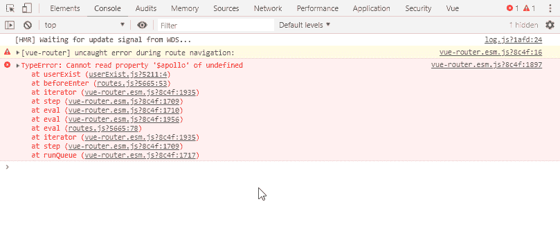

# 如何在 vue 组件外访问' $apollo '？

> 原文：<https://dev.to/mittalyashu/how-to-access-apollo-outside-vue-component-3ab6>

不知道关于`vue-apollo`、[的检查文档](https://vue-apollo.netlify.com/)。

如果你试图在 vue 组件之外使用`$apollo`，你会得到类似的错误。

[](https://res.cloudinary.com/practicaldev/image/fetch/s--5zyVB_Qa--/c_limit%2Cf_auto%2Cfl_progressive%2Cq_auto%2Cw_880/https://thepracticaldev.s3.amazonaws.com/i/xr1d8ixfkkrgykjibcq9.png)

要实现这一点，不要在`App.vue`文件中初始化 apollo 客户机，而是在另一个文件中初始化它。类似`mixin/apollo.js`的东西，并导出客户端:

```
const httpLink = new HttpLink({
    uri: process.env.VUE_APP_DB_URL,
})

const cache = new InMemoryCache()

export const apolloClient = new ApolloClient({
    link: httpLink,
    cache
}) 
```

然后，将`export`导入回`App.vue`文件:

```
import { apolloClient } from './clients.js';

Vue.use(VueApollo)

const apolloProvider = new VueApollo({
    defaultClient: apolloClient,
})

new Vue({
    render: h => h(App),
    router,
    apolloProvider
}).$mount('#app') 
```

然后，您可以在任何其他文件中导入相同的客户端

```
import { apolloClient } from './client.js';
import gql from "graphql-tag"

export default function userExist(username) {
apolloClient
    .query({
        query: gql`
    query($username: String!) {
        login(username: $username) {
            username
            email
        }
    }
`,
        variables: {
            username: username
        }
    })
    .then(res => {
        console.log(res);
        return res
    })
    .catch(err => {
        console.log(err);
        return err
    });
} 
```

### 引用

*   [阿波罗文档视图](https://vue-apollo.netlify.com/)
*   [堆栈溢出](https://stackoverflow.com/a/54862097/8623417)

谢谢