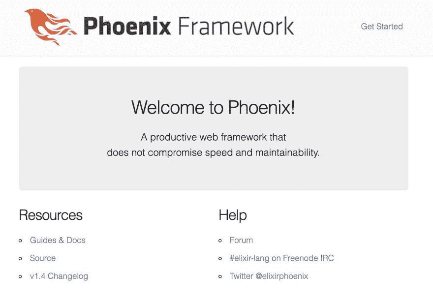
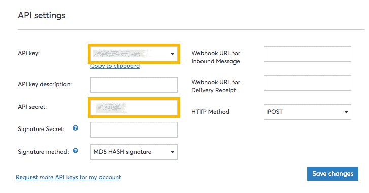

# 用 Phoenix 发送短信

> 原文：<https://dev.to/vonagedev/sending-an-sms-with-phoenix-20od>

开发人员越来越多地采用这种[灵丹妙药](https://elixir-lang.org/)编程语言，这是有道理的。它是一种函数式语言，有直观的语法和支持它的社区。Elixir 生态系统中最流行的 web 框架是 [Phoenix](https://phoenixframework.org/) 。它像灵丹妙药一样，是为了直观和低门槛而建造的。

作为一个在 Ruby 和 Rails 方面做了大量工作的人，我一直想学习 Elixir 和 Phoenix。我开始钻研 Elixir 教程，并在过去的这个周末创建了我的第一个简单的 Phoenix 应用程序，能够与 [Nexmo](https://developer.nexmo.com) SMS API 交互并发送文本消息。

让我们来看看我是如何构建它的。

## 启动你的凤凰服务器

你需要做的第一件事是确保你的系统上安装了 Elixir 和 Phoenix。您可以使用他们的向导[这里](https://elixir-lang.org/install.html)和[这里](https://hexdocs.pm/phoenix/installation.html)来开始安装并运行。

一旦安装了语言和框架，就可以通过从控制台运行以下命令来创建一个新的 Phoenix 应用程序:

```
$ mix phx.new sms_app 
```

Enter fullscreen mode Exit fullscreen mode

这将在一个`/sms_app`目录中创建新应用程序的基础。为了简单起见，当安装程序询问您是否要安装依赖项时，我建议回答肯定。Phoenix 使用 npm 来获取和安装它的节点依赖项。

继续前进，进入您的新应用程序目录。一旦到了那里，我们需要为我们的应用程序创建数据库。默认情况下，Phoenix 使用 PostgreSQL，并假设有一个`postgres/postgres` PostgreSQL 超级用户。您可以首先在`config/devs.exs`中修改 Phoenix 数据库设置，一旦准备好，您就可以从控制台运行`mix ecto.create`来为您的应用程序设置数据库。

如果您现在运行`mix phx.server`并在浏览器中导航到`https://localhost:4000`，您将会看到来自 Phoenix 的欢迎页面。

[](https://res.cloudinary.com/practicaldev/image/fetch/s--aBJQCELe--/c_limit%2Cf_auto%2Cfl_progressive%2Cq_auto%2Cw_880/https://thepracticaldev.s3.amazonaws.com/i/m8yyucnj82n2vbqmjbnx.jpg)

你的凤凰服务器已经启动并运行了！现在让我们设置我们的应用程序来与 Nexmo SMS API 交互，并开始发送文本消息。不过，在此之前，我们需要创建一个 Nexmo 帐户并接收我们的 API 凭证。

## 创建 Nexmo 账户

### 获取 API 凭证

创建一个 Nexmo 帐户是免费的，一旦你这样做了，你就可以立即开始使用 Nexmo APIs。继续前进，导航到 Nexmo 仪表板上的[注册](https://dashboard.nexmo.com/sign-up)页面，并提交注册表单。

完成注册后，导航到[设置](https://dashboard.nexmo.com/settings)页面并获取您的 API 证书。

[](https://res.cloudinary.com/practicaldev/image/fetch/s--tzXOm33X--/c_limit%2Cf_auto%2Cfl_progressive%2Cq_auto%2Cw_880/https://thepracticaldev.s3.amazonaws.com/i/8gun9xogjgrddu4386k9.png)

### 购买虚拟号码

在许多国家，您可以在没有有效发件人电话号码的情况下发送短信，但如果您计划在美国发送短信，您需要提供一个 Nexmo 虚拟号码，并将其用作您的原始电话号码。

使用 Nexmo 获取虚拟号码有两种方式。您可以使用 [Nexmo CLI](https://github.com/nexmo/nexmo-cli) 并从您的控制台执行以下命令:

```
$ nexmo number:search US --sms
14155550100
14155550101
14155550102
$ nexmo number:buy 14155550102 --confirm
Number purchased: 14155550102 
```

Enter fullscreen mode Exit fullscreen mode

上面显示的数字只是一个输出示例。当您运行该命令时，您将看到可供您购买的实时数字。您还可以在第一个命令中将两个字母的美国国家代码替换为另一个两个字母的国家代码，从而指定美国以外的特定国家。

获取号码的另一种方法是导航到 Nexmo 仪表板中的[号码](https://dashboard.nexmo.com/buy-numbers)页面，并使用 web 界面购买号码。

## 配置您的凤凰 App

### 定义路线

在`/lib/sms_app_web/router.ex`中为您的应用打开路由器，并在`scope "/", SmsAppWeb do`块中添加以下内容:

```
get "/sms", SmsController, :index

post "/send", SmsController, :send

get "/update", SmsController, :update 
```

Enter fullscreen mode Exit fullscreen mode

这告诉我们的应用程序将两个`GET`请求和一个`POST`请求定向到哪里。`GET` `/sms`路由是用户提交短信的地方。`POST` `/send`路线是信息提交的目的地。`GET` `/update`路线是我们从 Nexmo API 接收反馈信息的地方。

我们现在需要创建那些控制器方法。

### 定义控制器方法

让我们在`/lib/sms_app_web/controllers`中创建一个名为`sms_controller.ex`的新控制器，并添加以下方法:

```
defmodule SmsAppWeb.SmsController do
    use SmsAppWeb, :controller

    def index(conn, _params) do
        render(conn, "index.html", token: get_csrf_token())
    end

    def send(conn, %{"number" => number, "message" => message}) do
        url = "https://rest.nexmo.com/sms/json"
        req_body = "" 

        response = HTTPoison.post(url, req_body, [], params: %{api_key: "#{System.get_env("NEXMO_API_KEY")}", api_secret: "#{System.get_env("NEXMO_API_SECRET")}", from: "#{System.get_env("NEXMO_NUMBER")}", text: "#{message}", to: "#{number}"})
        if {:ok} do
            conn
            redirect(_conn, to: Routes.update_path(conn, :update))
        else {:error}
            Flash.put(:error, "Something went wrong.")
        end
    end

    def update(conn, _params) do
        render(conn, "update.html")
    end
end 
```

Enter fullscreen mode Exit fullscreen mode

如您所见，我们为路由器中创建的每条路由定义了一种方法:

*   `index/2`方法呈现我们的索引页面并产生 CSRF 令牌，我们必须在 Phoenix 的每个表单中提交该令牌，以防止跨站脚本攻击。
*   方法是我们应用程序的核心。我们使用 HTTPoison 模块创建一个对 Nexmo SMS API 的`POST`请求，该请求包含我们的 API 凭证和用户在索引页面的表单上提交的信息。然后我们检查消息是否成功。如果成功，那么我们重定向到`update/2`方法，如果失败，我们与用户共享一条错误消息。
*   `update/2`方法呈现更新页面。

### 添加 HTTPoison 依赖

打开应用程序根目录中的`mix.exs`文件，在`defp deps do`代码块中，在新的一行中添加以下内容:

```
[{:httpoison, "~> 1.4"}] 
```

Enter fullscreen mode Exit fullscreen mode

然后，从命令行运行以下命令来安装新的依赖项:

```
$ mix deps.get 
```

Enter fullscreen mode Exit fullscreen mode

现在我们需要建立我们的视图，所以让我们继续这样做。

## 设置视图

在`/lib/sms_app_web/views`中增加`sms_view.ex`。添加以下内容:

```
defmodule SmsAppWeb.SmsView do
    use SmsAppWeb, :view
end 
```

Enter fullscreen mode Exit fullscreen mode

现在导航到`/lib/sms_app_web/templates`并添加一个`sms`文件夹，在其中我们将创建`index`和`update`模板。

```
# index.html.eex

<h2>Send an SMS with the Nexmo SMS API</h2>

<form action="/send" method="post">
  <input type="hidden" value="<%= @token %>" name="_csrf_token"/>
  <div class="field">
    <label for="number">
      Recipient Phone Number:
    </label>
    <br />
    <input type="text" name="number">
  </div>

  </div class="field">
    <label for="message">
      Message:
    </label>
    <br />
    <textarea name="message" placeholder="Enter message here"></textarea>
  </div>

  <div class="actions">
    <input type="submit" value="Send">
  </div>
</form> 
```

Enter fullscreen mode Exit fullscreen mode

```
# update.html.eex

<div class="phx-hero">
  <h2>Your message was sent successfully.</h2>
</div> 
```

Enter fullscreen mode Exit fullscreen mode

在本演练中，我们不打算修改默认的应用程序布局，因此您仍会看到 Phoenix 徽标等。如果你愿意，你可以编辑`/lib/sms_app_web/templates`中的`app.html.eex`来改变其中的一些。另外，应用程序的 CSS 样式表在`/assets/css`中，如果你也想修改的话。

要使我们的应用程序正常工作，我们需要做的最后一步是将我们的 API 凭证配置为环境变量。

### 配置环境变量

在应用程序的根目录下创建一个`.env`文件，并在其中添加以下内容:

```
export NEXMO_API_KEY=""
export NEXMO_API_SECRET=""
export NEXMO_NUMBER="" 
```

Enter fullscreen mode Exit fullscreen mode

在有空白引号的地方添加您从 Nexmo 仪表板收到的 API 凭证，以及您购买的虚拟电话号码。

如果您承诺使用 GitHub 来保护您的凭证，请确保将`/.env`添加到您的`.gitignore`文件中。

完成并保存文件后，从命令行运行以下命令，将环境变量合并到应用程序中:

```
$ source.env 
```

Enter fullscreen mode Exit fullscreen mode

[](https://i.giphy.com/media/11sBLVxNs7v6WA/giphy.gif)

就是这样！

现在，您拥有了一个功能完整的 Phoenix 应用程序，它可以使用 Nexmo SMS API 发送 SMS 消息。您可以导航到`https://localhost:4000/sms`开始发送消息。

如果您有兴趣查看这个演练的完整代码，可以访问[库](https://github.com/benhayehudi/phoenix_sms_nexmo)。

感谢您加入我开始学习凤凰城的旅程。还有很多东西要学，我很高兴能继续沿着这条路走下去！