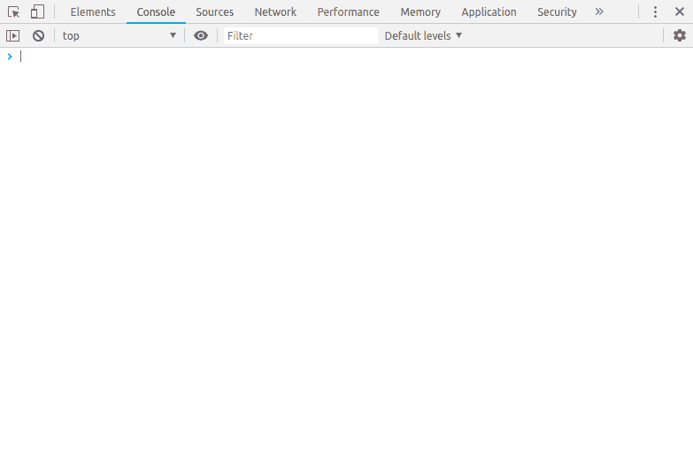

# 开发者控制台

> 原文：<https://dev.to/5anthosh/developer-console-2lf7>

这篇文章最初发表在我的博客上，在这里找到原文

无论你想尝试一些 JavaScript 函数，检查一个 JavaScript 对象或看看是否有任何错误。开发者控制台(*网络控制台*)将为您提供帮助

## **开发者控制台**

大多数现代浏览器都提供了开发者控制台，你可以在类似外壳的界面上玩 JavaScript。

我们可以在 Linux 和 Windows 上用键盘快捷键`CTRL + SHIFT + K`打开 web 控制台，或者在 macOS 上用`COMMAND + OPTION + K`打开。

我们可以输入一个 JavaScript 命令，检查变量并声明函数。

> 使用`console.log`函数可以实现登录 JavaSript

> 我们可以使用`SHIFT + ENTER`添加多行 JavaScript 命令