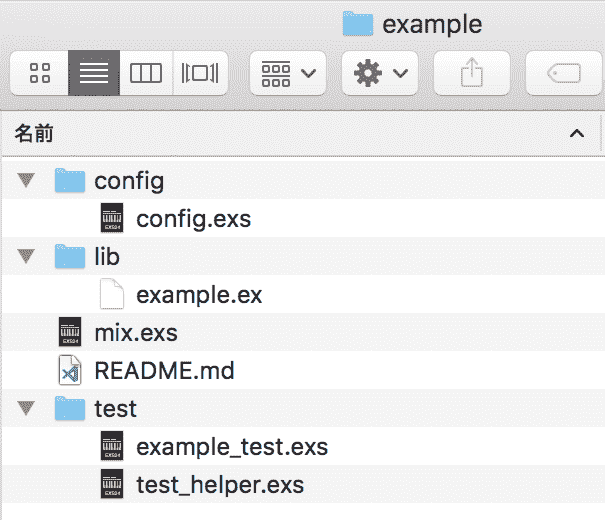

# Elixir 入门 23 :下一步

> [https://dev . to/橡胶/长生不老药-23-50k】](https://dev.to/gumi/elixir-23--50ik)

本文在 Elixir 官网的许可下，根据“[Where to go next](https://elixir-lang.org/getting-started/where-to-go-next.html) ”的解说，加以修改，介绍今后关于 Elixir 的学习项目。

# 第一个 Elixir 项目

为了方便地塑造项目的雏形，Elixir 包含了一个名为 Mix 的构建工具。 只需从命令行工具向`mix new`命令指定项目的路径，除了其名称的雏形之外，还会创建设置和测试文件等(图 001 )。

```
$  mix new example
* creating README.md
* creating .formatter.exs
* creating .gitignore
* creating mix.exs
* creating config
* creating config/config.exs
* creating lib
* creating lib/example.ex
* creating test
* creating test/test_helper.exs
* creating test/example_test.exs

Your Mix project was created successfully.
You can use "mix" to compile it, test it, and more:

    cd example
    mix test

Run "mix help" for more commands. 
```

Enter fullscreen mode Exit fullscreen mode

#### t0-t1 -用 001■Mix 制作的项目文件

[](https://res.cloudinary.com/practicaldev/image/fetch/s--D5hiQhxc--/c_limit%2Cf_auto%2Cfl_progressive%2Cq_auto%2Cw_880/https://thepracticaldev.s3.amazonaws.com/i/3z40eotdwwjbeenfd5ld.png)

“[Mix and OTP](https://elixir-lang.org/getting-started/mix-otp/introduction-to-mix.html) ”对使用 Mix 的 APP 应用程序的制作方法进行说明。 本指南的日语解说为“Mix 和 OTP”，在本博客上连载(参照《[Elixir 进阶教程开始连载( Mix 和 OTP 也抽签)](https://dev.to/gumi/elixirmixotp-ci5))。

# 元编程

Elixir 是一种可以元编程，因此容易扩展和定制的编程语言。 Elixir 的元编程经常使用宏。 特别是写 DSL 时宏非常方便。 关于宏的基本结构和写法，以及宏中如何制作 DSL，请参阅“[Meta-programming in Elixir](https://elixir-lang.org/getting-started/meta/quote-and-unquote.html) ”。

# 社区和其他信息源

“[Learning resources](https://elixir-lang.org/learning.html) ”介绍了以下书籍、截屏视频和其他学习素材。

1.  [书籍](https://elixir-lang.org/learning.html#books)
2.  [视频/互动资源](https://elixir-lang.org/learning.html#videointeractive-resources)
3.  [其他资源](https://elixir-lang.org/learning.html#other-resources)
4.  [截屏](https://elixir-lang.org/learning.html#screencasts)
5.  [深度资源](https://elixir-lang.org/learning.html#in-depth-resources)

另外，[Elixir 的源代码](https://github.com/elixir-lang/elixir)也可以在 GitHub 上打开看到。 主要存储在`lib`目录中的代码大多是用 Elixir 编写的。 另请参阅“[Documentation](https://elixir-lang.org/docs.html) ”。

# 错误的编程

Elixir 在 Erlang 虚拟机( VM )上运行。 不久，Elixir 的开发人员就会想使用 Erlang 库的界面了吧。 以下是解说 Erlang 的基础到应用的在线文档。

*   “[Erlang/elixir syntax:a crash course](https://elixir-lang.org/crash-course.html)”:简单介绍 Erlang 的语法。 除了 Erlang 之外，代码示例还包含功能相同的 Elixir 的代码。 不仅仅是了解 Erlang 的语法，还会成为 Elixir 的复习吧。
*   [Concurrent Programming](http://www.erlang.org/course/concurrent_programming.html) : Erlang 官方网站的教程。 在插图中可以快速学习 Erlang 的原语和并行编程。
*   “[Learn You Some Erlang for Great Good！](http://learnyousomeerlang.com/) :从 Erlang 的介绍中，对设计思想、标准库、最佳实践等进行了出色的解说。 读了前文的《Erlang/elixir syntax:a crash course》之后，可以跳过主要关于句法的开头几章吧。 如果读到“[hitch hiker’s guide to concurrency](http://learnyousomeerlang.com/the-hitchhikers-guide-to-concurrency)”一章，Erlang 应该会变得开心。 “[Learn you some Erlang for great good！ 日语翻译](https://www.ymotongpoo.com/works/lyse-ja/)上映了。

#### Elixir 入门彩票

*   [Elixir 入门 01 :编写代码并尝试](https://dev.to/gumi/elixir-01--2585)
*   [Elixir 入门 02 :型的基本](https://dev.to/gumi/elixir-02--30n1)
*   [Elixir 入门 03 :运算符的基本](https://dev.to/gumi/elixir-03--33im)
*   [Elixir 入门 04 :模式匹配](https://dev.to/gumi/elixir-04--1346)
*   [仙丹入門 05: 条件-情况/条件/条件](https://dev.to/gumi/elixir-05----casecondif-60o)
*   [Elixir 入门 06 :二进制和字符串以及字符列表](https://dev.to/gumi/elixir-06--35na)
*   [Elixir 入门 07 :关键词列表和地图](https://dev.to/gumi/elixir-07--39hi)
*   [Elixir 入门 08 :模块和函数](https://dev.to/gumi/elixir-08--1c4c)
*   [Introduction T0】 Elixir 09: Rethink](https://dev.to/gumi/elixir-09--1a0p)
*   [仙丹入門 10: EnumとStream](https://dev.to/gumi/elixir-10-enumstream-4fpb)
*   [Elixir 入门 11 :流程](https://dev.to/gumi/elixir-11--2mia)
*   [Elixir 入门 12 :输入输出和文件系统](https://dev.to/gumi/elixir-12--4og6)
*   [仙丹入門 13: aliasとrequireおよびimport](https://dev.to/gumi/elixir-13-aliasrequireimport-55c1)
*   [Elixir 入门 14 :模块的属性](https://dev.to/gumi/elixir-14--3511)
*   [T0】 Elixir Beginner 15: Structure
*   [Elixir 入门 16 :协议](https://dev.to/gumi/elixir-16--lif)
*   [T0】 Elixir Beginner's Level 17: Record of Internal Package
*   [Elixir 入门 18 :锡吉尔](https://dev.to/gumi/elixir-18--5791)
*   [仙丹入門 19: tryとcatchおよびrescue](https://dev.to/gumi/elixir-19-trycatchrescue-50i8)
*   [Elixir 入门 20 :类型规格和行为](https://dev.to/gumi/elixir-20--j50)
*   [Elixir 入门 21 :调试](https://dev.to/gumi/elixir-21--21a1)
*   [Elixir 入门 22: Erlang 库](https://dev.to/gumi/elixir-22-erlang-2492)
*   Elixir 入门 23 :下一步

##### Fanwai

*   [Elixir 入门:使用 Plug 为](https://dev.to/gumi/elixir-plug-40lb)