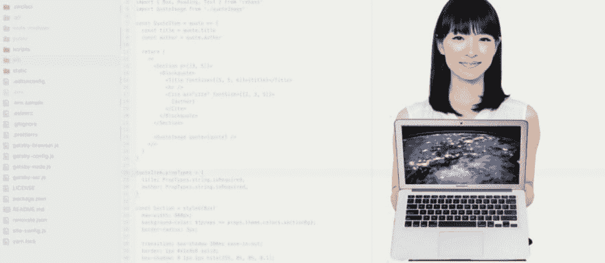
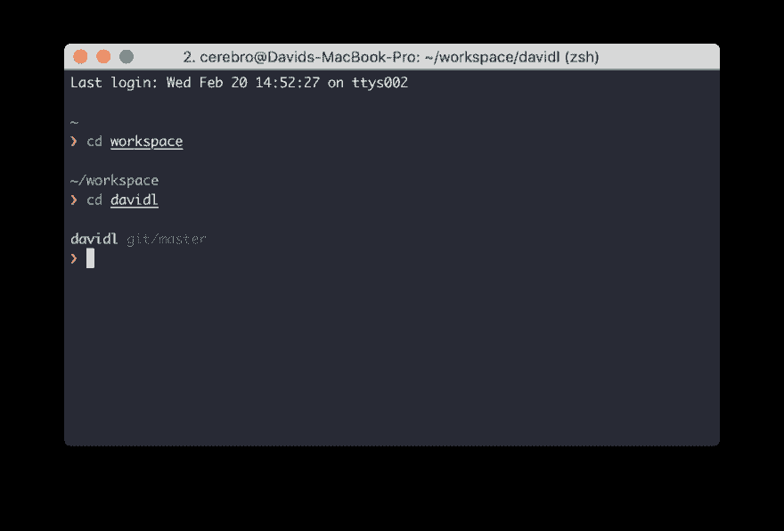
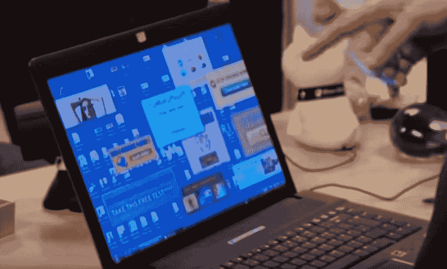
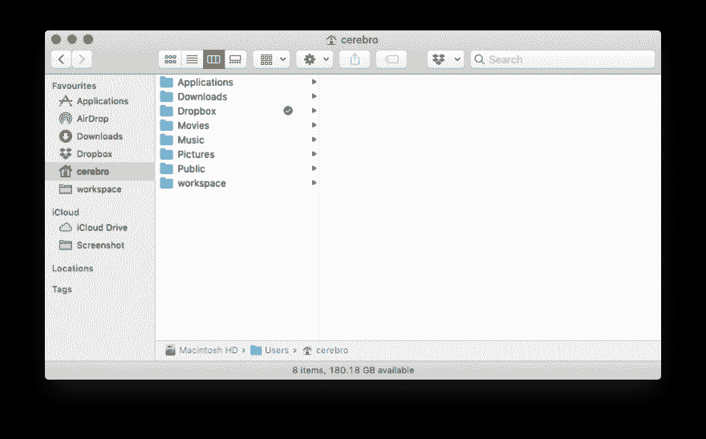
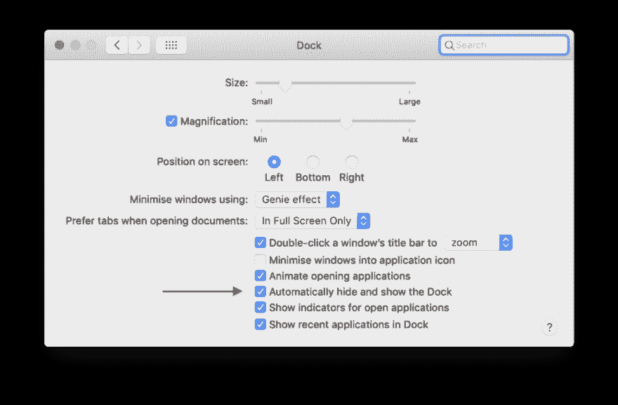
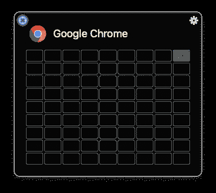
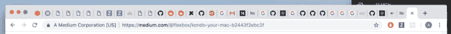
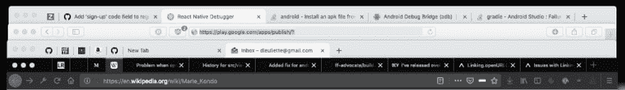
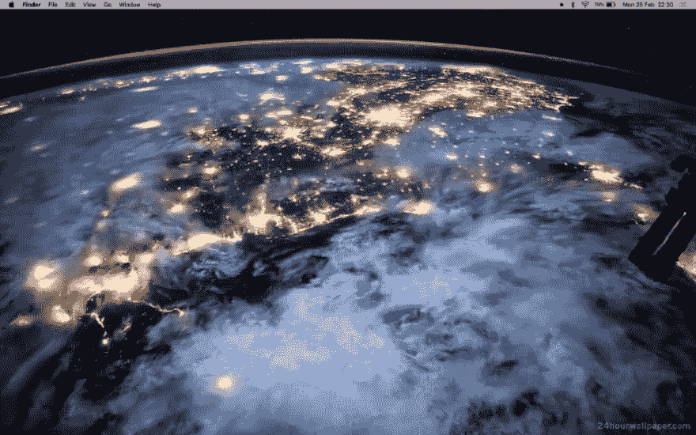
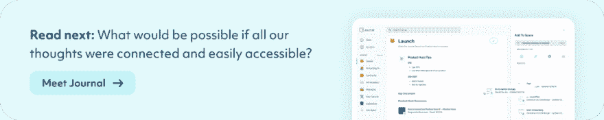

# 近藤你的 Mac

> 原文：<https://dev.to/flexbox/kondo-your-mac-41dp>

#### 如何设置一个不受干扰的 macOS 来关注发货代码

[](https://res.cloudinary.com/practicaldev/image/fetch/s--kfRqPw-l--/c_limit%2Cf_auto%2Cfl_progressive%2Cq_auto%2Cw_880/https://cdn-images-1.medium.com/max/1024/1%2A4k5ibuLtmD_KWTpLBKoPPw.jpeg)

上周，我在网飞放松，我发现了一个著名的电视节目与玛丽近藤。她是一名日本组织顾问和作家。组织…顾问…哇！我们真的生活在激动人心的时代…

然后我发现了鲁本斯·坎图尼 [写的这篇关于组织你的草图文件](https://uxdesign.cc/marie-kondo-your-sketch-files-with-these-plugins-bcbe9321ea8e)的文章。我被痛打一顿。

在开我自己的清洁顾问公司之前，我决定与你分享我整理你的 Mac 和改变你的开发者生活的最好方法。

> 你真正的生活是在把你的房子整理好之后开始的。
> 
> –玛丽·近藤

### 在你的终端点燃欢乐

作为一名开发人员，我每天在终端花费大约 1 小时。这就是我的遥控器。我为我的编码项目设计的令人敬畏且组织良好的命名框架是这样的:

```
~/workspace/\<CLIENT\>/\<PROJECT\_NAME\> 
```

Enter fullscreen mode Exit fullscreen mode

我使用 iTerm2 来分割和浏览项目和文件。如果你使用脚本[z-jump about](https://github.com/rupa/z)，你实际上比使用键盘+鼠标组合的人有效 125%。

<figure>[](https://res.cloudinary.com/practicaldev/image/fetch/s--6QxiPRQy--/c_limit%2Cf_auto%2Cfl_progressive%2Cq_auto%2Cw_880/https://cdn-images-1.medium.com/max/1024/1%2A3Eem2GiSeJtsffTgItZypA.png) 

<figcaption>提炼主题为 iTerm2</figcaption>

</figure>

多亏了 **oh-my-zsh** ，我有了很多快捷方式——这个干净的主题叫做“精致”——超级高效。如果我需要**只保留一个生产力黑客**，我肯定会选择这个:**从终端**启动你的编辑器。

```
// Sublime Text
st .

// Atom
atom .

// VSCode
code . 
```

Enter fullscreen mode Exit fullscreen mode

*   为 oh-my-zsh 安装 [sublime 插件](https://github.com/robbyrussell/oh-my-zsh/tree/master/plugins/sublime)
*   在 Mac 上安装 [atom 和 APM](https://flight-manual.atom.io/getting-started/sections/installing-atom/#installing-atom-on-mac)
*   在 VSCode 的路径中安装 code [命令](https://code.visualstudio.com/docs/setup/mac#_launching-from-the-command-line)

### 在你的取景器中，每样东西都有它的位置

面对现实吧，你机器上的脏乱比例是指数级的。如果你在开始时不制定一些规则，一个月后你崭新的电脑就会充满垃圾。

<figure>[](https://youtu.be/IUSaZ1EvHeg?t=21) 

<figcaption>你的电脑被感染了</figcaption>

</figure>

以下是我清理和组织文件的神道工作流程:

#### 添加收藏夹

打开你的终端，写`open .`打开 finder。删除所有分散注意力的链接，然后像这样添加最喜欢的链接。

[](https://res.cloudinary.com/practicaldev/image/fetch/s--bIqRFgoD--/c_limit%2Cf_auto%2Cfl_progressive%2Cq_auto%2Cw_880/https://cdn-images-1.medium.com/max/882/1%2AXejnb5rTkb6R6e3jmvNpOA.png)

#### 创建截图文件夹

默认情况下，所有屏幕截图都保存在桌面上。我把它换成了另一个名为… `Screenshots`的文件夹。

```
# Save screenshots to the Screenshot (or elsewhere)
defaults write com.apple.screencapture location ${HOME}/Screenshots 
```

Enter fullscreen mode Exit fullscreen mode

### 垂直存放

你不能同时做两件事。那么，你为什么要保留 Mac 上所有可用应用程序的 dock 呢？借助 spotlight 和快捷键`⌘` + `space`，你可以用键盘启动它们。

Marie Rondo 表示，垂直存放可以节省空间，让你的物品更加引人注目。让我们**隐藏我们的 dock** 当我们不需要它的时候，用一个左边的垂直位置。

[](https://res.cloudinary.com/practicaldev/image/fetch/s--9E5CsM_L--/c_limit%2Cf_auto%2Cfl_progressive%2Cq_auto%2Cw_880/https://cdn-images-1.medium.com/max/1024/1%2APOLl8IbLSoSryt89Shd9mw.png)

### 自定义窗口管理器

Windows 用户会喜欢这个:你可以用`windows` + `→`整理你的应用程序。

在 macOS 上，我们有全屏模式。但是并不是真的 powerfull，分配键盘快捷键才有效，很复杂。

<figure>[](https://res.cloudinary.com/practicaldev/image/fetch/s--6Eieh31W--/c_limit%2Cf_auto%2Cfl_progressive%2Cq_auto%2Cw_880/https://cdn-images-1.medium.com/max/366/1%2AV-eZWobtmXdmtX0SbVuBaQ.png) 

<figcaption>分屏</figcaption>

</figure>

我一直在用 Divvy 来解决这个问题，我可以分割我的屏幕，我有不同的快捷方式来满足我的需要:全屏，左半边，右半边...你可以用任何一个窗口管理器来“打发”你的工作日。

*   [Mizage - Divvy](https://mizage.com/divvy/)
*   [奇观](https://www.spectacleapp.com/)
*   [$ chunkwm - tiling wm](https://koekeishiya.github.io/chunkwm/index.html)

### 清理你的菜单栏图标

你拥有的一切都需要他自己指定的空间。Dozer 是一个隐藏菜单栏图标的小应用程序。有了这个技巧，你终于可以摆脱聚光灯图标了！最简单的安装方法是用`brew`。

```
$ brew cask install dozer 
```

Enter fullscreen mode Exit fullscreen mode

你可以在 [GitHub 上查看安装说明](https://dev.to/scottw/dozer-k1f-temp-slug-6358636)。

**之前:**

[](https://res.cloudinary.com/practicaldev/image/fetch/s--lUij0YYB--/c_limit%2Cf_auto%2Cfl_progressive%2Cq_auto%2Cw_880/https://cdn-images-1.medium.com/max/565/1%2AxqKaGG6TfWHLfxHzq8_pxQ.png)

**之后:**

[](https://res.cloudinary.com/practicaldev/image/fetch/s--nX4Ni3OG--/c_limit%2Cf_auto%2Cfl_progressive%2Cq_auto%2Cw_880/https://cdn-images-1.medium.com/max/571/1%2Ah-FtnbUW9fBWrVe9uru16Q.png)

### **按类别整理**

是啊！我在看你现代全栈开发者！我知道你有宣传，可以用 JavaScript 解决 cancert 问题，但在我看来，**你打开了太多标签页**。

这意味着注意力不集中，因为你注意力不集中，我们的火星任务就要迟到了。

<figure>[](https://res.cloudinary.com/practicaldev/image/fetch/s--1xk6byth--/c_limit%2Cf_auto%2Cfl_progressive%2Cq_auto%2Cw_880/https://cdn-images-1.medium.com/max/1024/1%2A6XE8pjxrUjzplgIMhenpGw.png)

<figcaption>【soooooooooooooooooooooooooooooooooooo】许多标签页打开了</figcaption>

</figure>

**如果你想保留一些东西，你可以钉上标签**，并尝试按类别组织你的**浏览体验**:

*   Google Chrome:ZenHub 中的工作邮件和积压邮件
*   **Safari:** 在 app Store 和 play store 上反应原生发布
*   **谷歌 Chrome 金丝雀:**个人邮件和 youtube
*   火狐开发者版:其他一切的主浏览器

<figure>[](https://res.cloudinary.com/practicaldev/image/fetch/s--8_Spck5o--/c_limit%2Cf_auto%2Cfl_progressive%2Cq_auto%2Cw_880/https://cdn-images-1.medium.com/max/1024/1%2AU_uzjZ7T3gtexA9yZfbYIw.png) 

<figcaption>至少在这里我可以根据上下文退出/恢复选项卡</figcaption>

</figure>

在这些小的黑客攻击之后，你将拥有同样的 zen 无分心笔记本电脑，随时可以专注和发送代码！

[](https://res.cloudinary.com/practicaldev/image/fetch/s--C1b7JRBx--/c_limit%2Cf_auto%2Cfl_progressive%2Cq_auto%2Cw_880/https://cdn-images-1.medium.com/max/1024/1%2AUt3c3MWSsg4ojm2CGJYYvw.png)

[](https://usejournal.com/?utm_source=medium.com&utm_medium=noteworthy_blog&utm_campaign=guest_post_image)

📝稍后在[杂志](https://usejournal.com/?utm_source=medium.com&utm_medium=noteworthy_blog&utm_campaign=guest_post_read_later_text)上阅读这个故事。