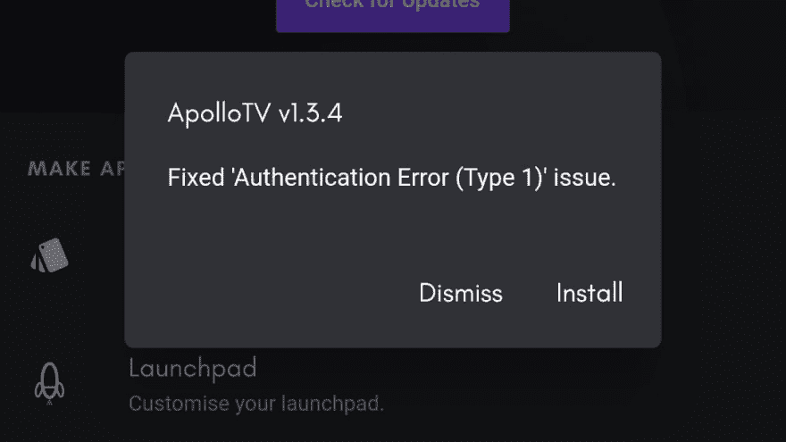

# 在 Flutter 中构建应用内更新程序(OTA)

> 原文：<https://dev.to/samjakob/building-an-in-app-updater-ota-in-flutter-11p9>

这篇文章是从我的博客导入的[。请通过评论这篇文章让我知道是否有任何问题(由于缺少字符导致的链接中断或语法错误)。](https://blog.samjakob.com/building-an-in-app-updater-ota-in-flutter-b0becddee8ca)

* * *

在许多方面，Flutter 是构建跨平台移动应用程序的一个极好的框架，但是当涉及到开发非平台无关的功能时，许多人似乎求助于平台通道代码。

[](https://res.cloudinary.com/practicaldev/image/fetch/s--2rlzmW5F--/c_limit%2Cf_auto%2Cfl_progressive%2Cq_auto%2Cw_880/https://cdn.hashnode.com/res/hashnode/image/upload/v1628740465239/5xb-dn8K4.png)

我试图在 Dart 中保留尽可能多的代码，原因有三:

1.  它维护了我的代码库的可移植性；如果我需要在另一个平台上实现一个特性，我几乎不用重写代码。

2.  它减少了我们项目的学习曲线；开发人员只需要知道 Dart，他们不需要定位和解释平台通道代码。

3.  保持简单愚蠢(KISS)方法论；当您开始摆弄平台通道时，您必须担心 Dart 代码和平台代码之间的通信。当您将异步操作融入其中时，这可能会很快失控。

因此，由于我们专注于将代码保存在 Dart 中，理论上我们的主要障碍是我们需要处理文件、系统权限，然后我们需要启动一个 intent。Dart 中的文件支持实际上不是问题，系统权限可以通过一个方便的插件来解决，但是我们确实不得不求助于平台通道来达到目的，但是那大约是 10 行简单的同步代码。

### 第一步:系统权限

多亏了一个名为 [`simple_permissions`](https://pub.dartlang.org/packages/simple_permissions) 的 Flutter 插件，这并不是什么大问题。

```
import 'package:simple_permissions/simple_permissions.dart';

// ...

bool permissionStatus = await SimplePermissions.checkPermission(Permission.WriteExternalStorage);
if(!permissionStatus) permissionStatus = (await SimplePermissions.requestPermission(Permission.WriteExternalStorage)) == PermissionStatus.authorized; 
```

Enter fullscreen mode Exit fullscreen mode

记得给你的`AndroidManifest.xml`
加上`uses-permission`标签

```
<uses-permission android:name="android.permission.WRITE_EXTERNAL_STORAGE" /> 
```

Enter fullscreen mode Exit fullscreen mode

### 步骤 2:文件系统

虽然理论上这是一个挑战，因为 Flutter 的平台无关性，在内置的`dart:io`库和`path-provider`插件之间，Flutter 实际上为操作文件提供了一个优秀的 API。

```
import 'dart:io';
import 'package:path_provider/path_provider.dart';
import 'package:http/http.dart' as http;

// Don't forget to check that you have Filesystem permissions or this will fail!
class FileIO {

  static const downloadDirReference = "/.apollo";

  ///
  /// Download and install the app at [url]. 
  /// You should call this method *after* querying your server for any available updates
  /// and getting the download link for the update.
  ///
  static Future<void> runInstallProcedure(String url) async {

    / **************************************** /
    /* Setup and clean directories */
    / **************************************** /

    // Instantiate a directory object
    final downloadDir = new Directory(
      (await getExternalStorageDirectory()).path + downloadDirReference
    );

    // Create the directory if it doesn't already exist.
    if(!await downloadDir.exists()) await downloadDir.create();

    // Instantiate a file object (in this case update.apk within our download folder)
    final downloadFile = new File("${downloadDir.path}/update.apk");

    // Delete the file if it already exists.
    if(await downloadFile.exists()) await downloadFile.delete();

    / **************************************** /
    /* Download the APK */
    / **************************************** /

    // Instantiate an HTTP client
    http.Client client = new http.Client();

    // Make a request and get the response bytes.
    var req = await client.get(url); // (The link to your APK goes here)
    var bytes = req.bodyBytes;

    // Write the response bytes to our download file.
    await downloadFile.writeAsBytes(bytes);

    // TODO: Trigger intent.

  }

} 
```

Enter fullscreen mode Exit fullscreen mode

您可能注意到的关键点是，在 Dart 中，您使用`Directory`类来引用一个目录，使用`File`类来引用一个文件；在我看来，这比在 Java 中更符合逻辑，名字也更恰当。

一切都是不言自明的，下载文件绝对是轻而易举的事，因为 Darts 内置在库中。

### 注:安卓 N 支持

虽然与 Flutter 无关，但我还是把它包括进来了，因为我确实花了一些时间来进行设置。

```
<manifest >
  <application>

    <!-- ... -->

    <provider
      android:name="xyz.apollotv.kamino.OTAFileProvider"
      android:authorities="xyz.apollotv.kamino.provider"
      android:exported="false"
      android:grantUriPermissions="true">

      <!-- The @xml/filepaths file (see below) is located at /android/app/src/main/res/xml/filepaths.xml
            relative to the Flutter project root. -->

      <meta-data
          android:name="android.support.FILE_PROVIDER_PATHS"
          android:resource="@xml/filepaths" />
    </provider>

  </application>
</manifest> 
```

Enter fullscreen mode Exit fullscreen mode

```
package xyz.apollotv.kamino;

import android.support.v4.content.FileProvider;

// You need to reference this FileProvider in your AndroidManifest.xml
public class OTAFileProvider extends FileProvider {} 
```

Enter fullscreen mode Exit fullscreen mode

```
<?xml version="1.0" encoding="utf-8"?>
<paths xmlns:android="http://schemas.android.com/apk/res/android">

    <!-- In our example, the APK is downloaded to the /storage/emulated/0/.apollo/ folder. -->
    <external-path name=".apollo" path=".apollo/"/>

</paths> 
```

Enter fullscreen mode Exit fullscreen mode

在 Android 清单文件的`application`标签中，应该包含一个引用文件提供者类的`provider`标签。在这个标签中，您应该有一个`meta-data`标签，它列出了允许提供者访问的所有文件路径。(参见`filepaths.xml`)。

有关 FileProvider 的更多信息，请参见[https://developer . Android . com/reference/Android/support/v4/content/file provider](https://developer.android.com/reference/android/support/v4/content/FileProvider)

### 第三步:平台渠道

最后一步，是发起一个`ACTION_INSTALL_PACKAGE`意向。你应该从建立一个基本的平台渠道开始。

```
OTAHelper.installOTA(downloadFile.path);

class OTAHelper {

  // Replace xyz.apollotv.kamino with your package.
  static const platform = const MethodChannel('xyz.apollotv.kamino/ota');

  static Future<void> installOTA(String path) async {
    try {
      await platform.invokeMethod('install', <String, dynamic>{
        "path": path
      });
    } on PlatformException catch (e) {
      print("Error installing update: $e");
    }
  }

} 
```

Enter fullscreen mode Exit fullscreen mode

最后，编辑您的`MainActivity.java`文件来声明`MethodChannel`并执行代码来调用我们的意图。

这里没有什么特别高级的概念，因为我们已经将文件下载到外部存储器，所以我们需要做的就是访问它并触发安装。

```
public class MainActivity extends FlutterActivity {

  @Override
  protected void onCreate(Bundle savedInstanceState) {

    // ...

    new MethodChannel(getFlutterView(), "xyz.apollotv.kamino/ota").setMethodCallHandler((methodCall, result) -> {
        if(methodCall.method.equals("install")){
            if(installOTA(methodCall.argument("path"))){
                result.success(true);
            }else{
                result.error("ERROR", "An error occurred whilst installing OTA updates.", null);
            }
            return;
        }
        result.notImplemented();
    });

  }

  private boolean installOTA(String path){
      try {
          Uri fileUri = Uri.parse("file://" + path);

          Intent intent;
          if (Build.VERSION.SDK_INT >= Build.VERSION_CODES.N) {

              // This line is important: after Android N, an authority must be provided to access files for an app.
              Uri apkUri = OTAFileProvider.getUriForFile(getApplicationContext(), "xyz.apollotv.kamino.provider", new File(path));

              intent = new Intent(Intent.ACTION_INSTALL_PACKAGE);
              intent.setData(apkUri);
              intent.setFlags(Intent.FLAG_GRANT_READ_URI_PERMISSION);
          } else {
              intent = new Intent(Intent.ACTION_VIEW);
              intent.setDataAndType(fileUri, "application/vnd.android.package-archive");
              intent.setFlags(Intent.FLAG_ACTIVITY_NEW_TASK);
          }

          getApplicationContext().startActivity(intent);
          return true;
      }catch(Exception ex){
          System.out.println("[Platform] Error during OTA installation.");
          System.out.println(ex.getMessage());
          return false;
      }
  }

} 
```

Enter fullscreen mode Exit fullscreen mode

这样，OTA 安装就开始了！