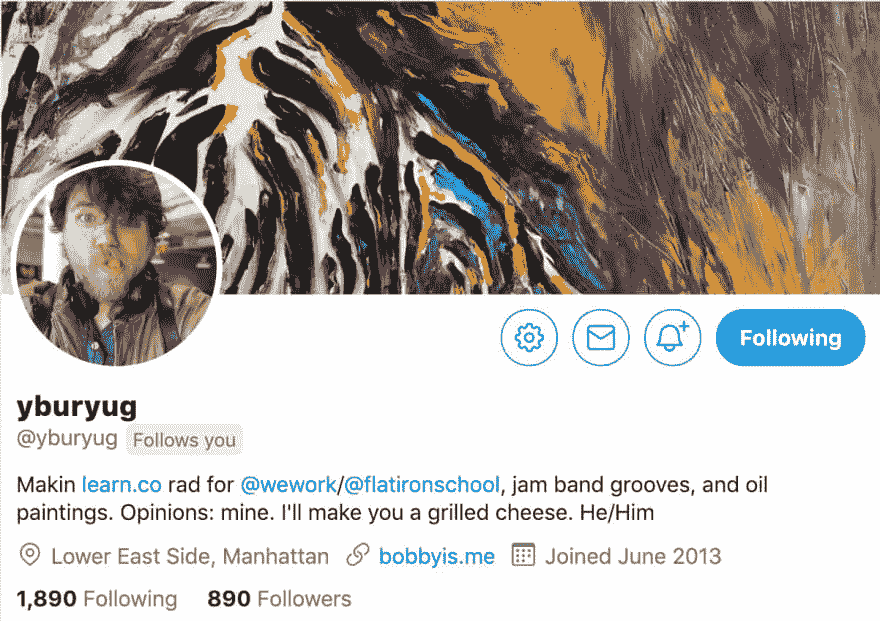
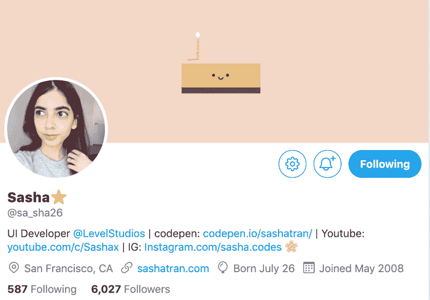
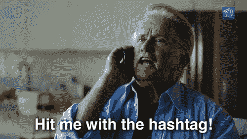

# 如何发微博

> 原文：<https://dev.to/lucysuddenly/how-to-tweet-3lll>

Twitter 可能会令人生畏。你可以跟踪其他人，但不保证他们会跟踪你。你如何获得追随者？你可以整天发微博，但不能保证你会得到任何赞、转发或评论。你如何让其他用户与你互动？这里有一个简单的入门指南。

### 步骤 0:你为什么要这样做？

首先你必须决定你的目标。这是你的 twitter 账户还是你的品牌账户？你希望它是专业的还是个人的？非常清楚你的意图是很重要的。

无论你做什么决定，都要保持一致:用户通常会根据你在推特上的一致性来决定是否关注你。如果你在运营一个品牌推特，那就留在品牌上。如果你正在为你的编码事业运行一个专业的 twitter，保持它的专业性。如果你正在寻找一个个人推特来将你的观点注入推特圈，做真实的你自己！

### 第一步:填写你的简历。

如果其他用户对你一无所知，他们不太可能跟踪你。尤其是如果你不怎么发微博，另一个用户怎么知道你是不是他们可能有兴趣关注的人呢？填写你的个人资料图片、横幅、名字、关于你的一些基本信息、你的 github 或 linkedin 的链接，也许还有你的一些兴趣，这是其他用户确定你是否有可能发布他们感兴趣的推文的一个很好的方式。

这里有一些成功的 twitter 账户的很好的例子，这些账户的简历很好地描述了他们是谁以及他们发了什么微博。

### 第二步:找一个标签。

在推特上发布任何东西，给你最重要的词添加标签，通常不会让你有任何其他用户与你的内容互动，除非你选择的词碰巧很流行。一个更好的方法是看看流行的标签趋势。你会看到两种趋势:

*   常见的重复出现的标签，如#周四思想或#变革周二--用户喜欢一周又一周地回来的趋势。

*   与当前事件相关的一次性趋势标签——名人动态、政治新闻、媒体如电影或即将上映的节目——无论现在正在发生什么。

所以这里的交易是:找到一个流行的标签或趋势，并用这个标签或趋势关键字发推文。查找当前事件进行评论或加入已经发生的对话。说出你的感受并标记#FeelingsFriday 比仅仅在推特上发布你的感受更有可能让其他用户与你互动。

在一个趋势中评论流行的推文是产生用户互动的另一个好方法。如果你在总统、名人或者仅仅是一个有很多粉丝的用户的推特上发表评论，你很可能会得到其他用户的评论和喜欢。

### 第三步:自信地发微博。

当你发微博时，避免使用“我觉得”、“我的观点是”甚至“我认为”这样的短语。将你的想法或观点作为事实陈述进行阐述。“黑麦面包很难吃”比说“我认为黑麦面包很难吃”要好。

从浏览者的角度想想:喜欢一条推文的动作本质上是在说“我同意这个”，或者“我认为这个。”赞同明确阐述的立场要容易得多。想想你喜欢什么类型的帖子。你会更喜欢某个陈述或某人对某事的观点吗？(剧透:声明往往在 twitter 上更受欢迎。)

### 第四步:标记组织

twitter 上有很多公司、组织和其他实体将人们聚集在一起进行对话。不管你使用的是什么特定的程序、语言或框架，总有一个组织值得在你的推文中标注出来。该实体将欣赏这种表现，并且根据该实体的情况，甚至可能增加你的推文！

### 第五步:保护自己

我希望这不会把你从 Twitter 上吓跑！在这里，你可以与来自世界各地的用户建立有益的联系，但它也有不好的一面。进入更广阔的推特圈，有时会避免遭遇巨魔或其他希望对你产生负面影响的人。把你的屏蔽按钮放在手边，不要和巨魔接触，不管你有多诱惑，都不要在网上和陌生人争吵。我的意思是，你可以，但你最终会有一个更加负面的 Twitter 体验。

解决这些问题的一个先发制人的方法是加入区块链。其他人整理了列表，这样你就可以避开特定的用户范围。例如，如果你强烈认同某种政治信仰，并打算进入政治对话，考虑搜索“对立”政治领域的区块链用户——你将过滤掉其他阵营的“巨魔”,但仍能与真诚对话的用户互动。

区块链可以派上用场的另一个例子是，如果你是某个弱势群体的一员:如果你是有色人种、LGBTQ 等等。找出对立个体的区块链是很值得的。你会保证自己的安全，并策划一个更愉快的社交体验。

### 第六步:推特成功！

我希望这已经提供了信息！！如果你对 Twitter 成功的基本秘诀有其他建议，请在评论中留下吧！