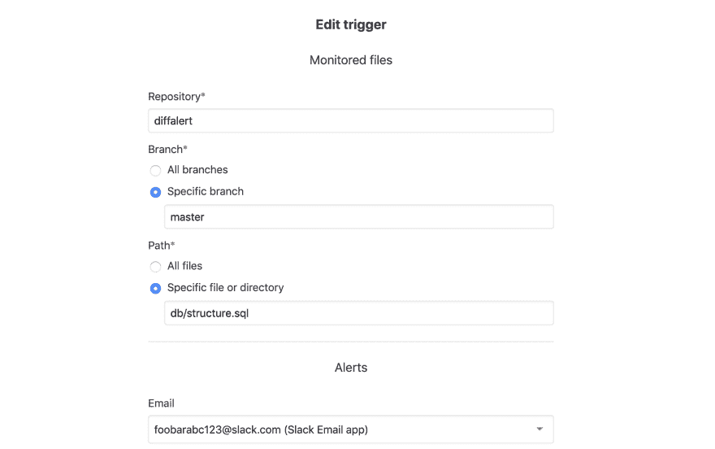
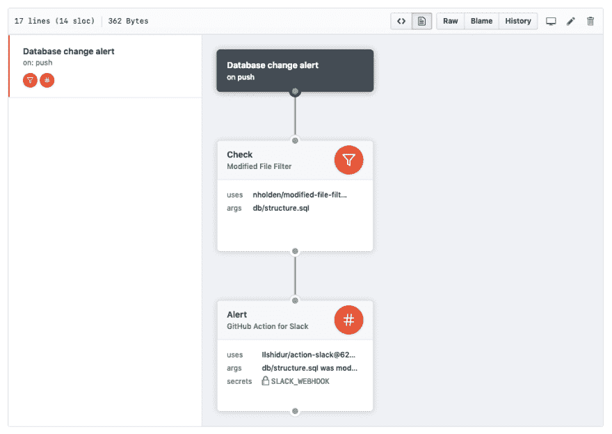

# 我如何用几十行 Ruby 代码替换了一个 Rails 应用程序

> 原文：<https://dev.to/nholden/how-i-replaced-a-rails-app-with-a-few-dozen-lines-of-ruby-3l1m>

几年前，我在工作时弄坏了一个仪表板。

作为构建新特性的一部分，我更改了我们的数据库模式。我仔细地制定了一个计划，添加一些新列并迁移现有数据。我确保对数据库的更改将适用于新旧应用程序代码，并且可以在不停机的情况下部署该功能。

我忘了考虑我们的应用程序并不是我们数据的唯一消费者。我们的数据团队维护仪表板，公司用它来通知产品决策和进行财务预测。那些仪表板期望我们的数据库模式看起来像某种特定的方式，当我在没有与数据团队交谈的情况下进行更改时，其中一个仪表板坏了。

在我们修好仪表板后，我开始思考如何防止自己将来犯同样的错误。我决定每次修改数据库模式时都需要提醒。为了得到这个提醒，我使用了我最熟悉的工具，开发了一个新的 Rails 应用。

## Rails 应用程序有很多功能

我用这个名为 [DiffAlert](https://github.com/nholden/diffalert) 的应用程序的目标是，每当有人对我们公司应用程序的`master`分支上的`db/structure.sql`进行更改时，就向 Slack 发送一个警报。我看到 GitHub 有 [webhooks](https://developer.github.com/webhooks/) 和 [push 事件](https://developer.github.com/v3/activity/events/types/#pushevent)发送关于提交的数据，包括哪些文件被更改。

在几个小时内，我启动了应用程序，为 GitHub webhook 事件创建了一个端点，并编写了代码来判断在给定的推送中`db/structure.sql`是否发生了变化。DiffAlert 的核心逻辑是完整的。然后真正的工作开始了。

接下来，我必须弄清楚如何向 Slack 发送警报。我们已经在使用 [Slack 的电子邮件应用](https://nickholden.slack.com/apps/A0F81496D-email)，所以我注册了一个新的 [Mailgun](https://www.mailgun.com/) 账户，并用[动作邮件](https://guides.rubyonrails.org/action_mailer_basics.html)创建了一个电子邮件模板。然后我必须在某个地方部署 DiffAlert，所以我创建了一个新的 [Heroku](https://www.heroku.com) 应用程序，并做了一些调整，以使我的工作流配置正确。

除了`db/structure.sql`，我们还想监控我们代码库中的一些其他文件，所以我开始构建一个 UI 来配置警报设置。我需要身份验证，所以我设计了数据模型并创建了登录和注册表单。然后我需要另一个视图来显示所有的警报，我需要表单来创建新的警报和编辑现有的警报。我需要后台工作，以便像 webhook 解析和电子邮件发送这样的较长进程不会阻碍常规的 web 请求。

[](https://res.cloudinary.com/practicaldev/image/fetch/s--7MPylijV--/c_limit%2Cf_auto%2Cfl_progressive%2Cq_auto%2Cw_880/https://user-images.githubusercontent.com/7942714/53303553-6ec4a200-3820-11e9-83d9-3123582f4d57.png)

DiffAlert 持续了大约一年半的时间，当我们对数据库模式进行更改时，它会提醒我的团队。每一次，我们都联系了数据团队，并且没有再破坏任何仪表板。

DiffAlert 是一个附带项目，所以当我离开公司时，他们需要决定是继续向一名前员工发送 GitHub 元数据，还是维护他们自己的 DiffAlert 实例，或者停止接收警报。可以理解，他们决定停止接收警报。

## GitHub 的行动帮助我专注于这个问题

我为 GitHub 工作，当我了解到 [GitHub 动作](https://github.com/features/actions)时，我想知道我是否可以用一个单独的动作来代替 DiffAlert。GitHub 动作是用任何语言编写的代码，当存储库中发生指定事件时，它在 Docker 容器中运行。我看到[推送事件](https://developer.github.com/actions/creating-workflows/workflow-configuration-options/#events-supported-in-workflow-files)可以触发 GitHub 动作工作流。我还看到[有一个 GitHub 动作](https://github.com/marketplace/actions/github-action-for-slack)可以向 Slack 发布消息。我开始写[修改文件过滤器](https://github.com/nholden/modified-file-filter-action)。

首先，我需要一个`Dockerfile`。我想用 Ruby 编写我的动作，所以我使用了`FROM`指令从[一个官方的 Ruby 基础映像](https://hub.docker.com/_/ruby)创建一个 Docker 容器。我写了[一些`LABEL`指令](https://developer.github.com/actions/creating-github-actions/creating-a-docker-container/#label)，这样我的动作就能在 GitHub Actions 可视化工作流编辑器中正确显示。最后，我指定 Docker 容器需要访问哪些文件夹，并将`ENTRYPOINT`指向一个可执行的 Ruby 脚本。

```
# Dockerfile

FROM ruby:2.6.0

LABEL "com.github.actions.name"="Modified File Filter"
LABEL "com.github.actions.description"="Stops a workflow unless a specified file has been modified."
LABEL "com.github.actions.icon"="filter"
LABEL "com.github.actions.color"="orange"

ADD bin /bin
ADD lib /lib

ENTRYPOINT ["entrypoint"] 
```

Enter fullscreen mode Exit fullscreen mode

可执行的 Ruby 脚本将大部分工作委托给一个普通的旧 Ruby 类`PushEvent`，它解析来自 GitHub 的事件数据，并回答特定路径下的文件是否被修改。当推送事件修改文件时，操作以`0`状态退出，以触发工作流中的下一个操作。当推送事件没有修改文件时，动作退出`1`以暂停工作流。

```
# bin/entrypoint

require_relative "../lib/push_event"

file_path = ARGV.first
push_event = PushEvent.new(File.read(ENV.fetch("GITHUB_EVENT_PATH")))

if push_event.modified?(file_path)
  puts "#{file_path} was modified"
  exit(0)
else
  puts "#{file_path} was not modified"
  exit(1)
end 
```

Enter fullscreen mode Exit fullscreen mode

我不需要配置电子邮件或弄清楚如何与 Slack 集成，因为我可以依靠现有的 GitHub 动作来支持 Slack。我不需要设计任何 UI 或认证，因为这些都由 GitHub 处理。我不需要配置数据库或后台作业。我不需要启动 Heroku 应用程序和设置部署。

[](https://res.cloudinary.com/practicaldev/image/fetch/s--lGl0ki5j--/c_limit%2Cf_auto%2Cfl_progressive%2Cq_auto%2Cw_880/https://user-images.githubusercontent.com/7942714/52525036-7ef15480-2c58-11e9-807e-c999e9c297a1.png)

## 开始变小

Rails 以作为验证想法的伟大框架而闻名。你可以使用 Rails 在 15 分钟内创建一个博客！因为我喜欢使用 Rails，所以当我有一个想法的时候，我通常会首先使用它。

但是，即使有 Rails 提供的所有魔力，大多数应用程序需要一大堆东西——比如认证、UI、后台工作、电子邮件发送、部署——这并不是我的想法所独有的。下次我有想法的时候，我会想办法写更少的代码，维护更少的基础设施，至少是开始。

伊恩·法雷尔在 [Flickr](https://flic.kr/p/mg8ZsL) 上的封面图片。