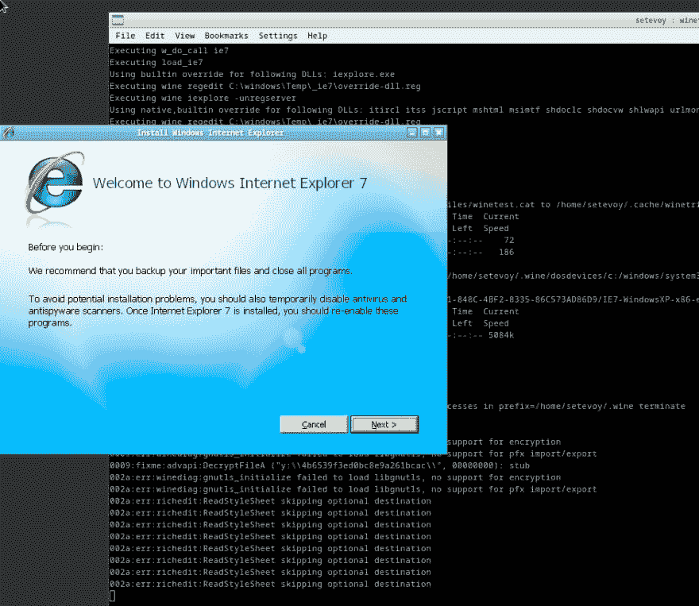
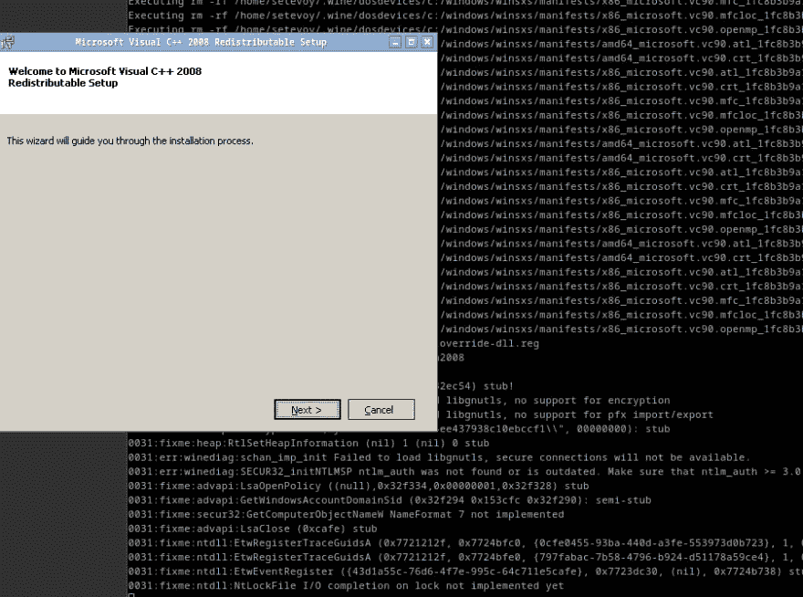
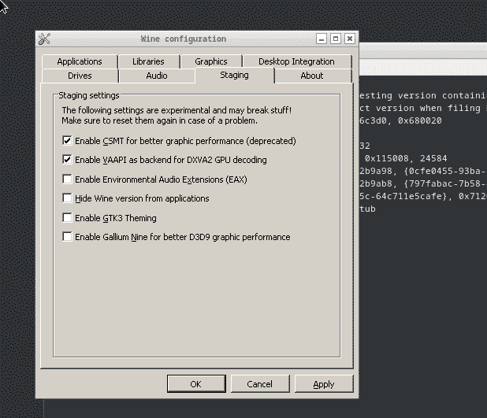
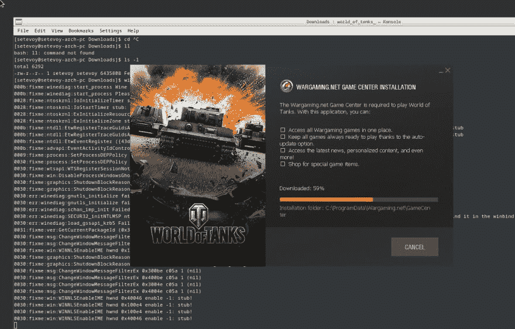
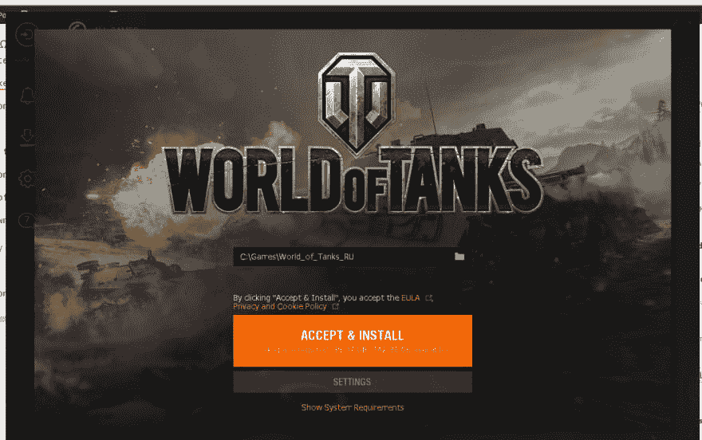
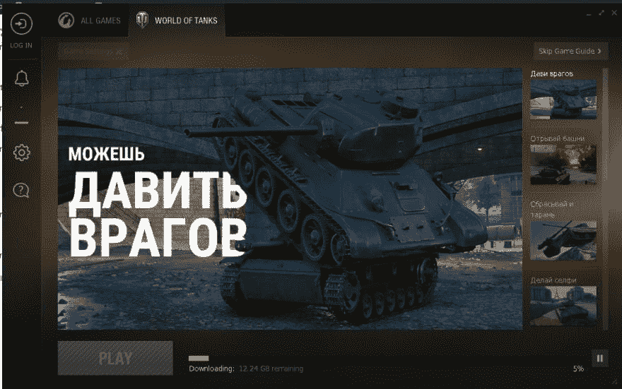
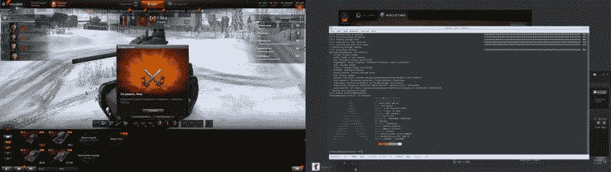
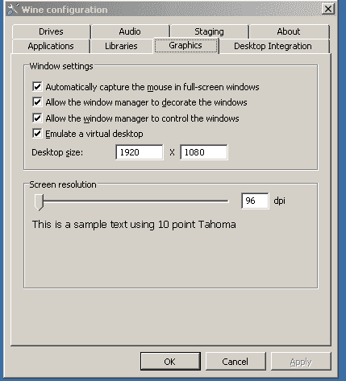
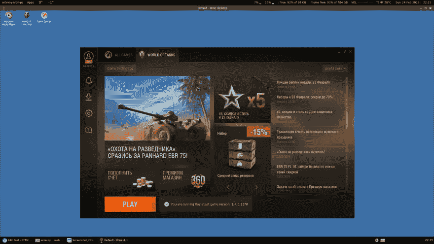

# 坦克世界:在 Arch Linux 上安装和运行

> 原文：<https://dev.to/setevoy/world-of-tanks-installing-and-running-on-arch-linux-ofo>

[](https://res.cloudinary.com/practicaldev/image/fetch/s--DN1jXw5A--/c_limit%2Cf_auto%2Cfl_progressive%2Cq_auto%2Cw_880/https://rtfm.co.ua/wp-content/uploads/2014/08/world_of_tanks_logo.png) 没想到它会起作用，但它确实起作用了！

用了 2017 年的指南从[这里> > >](http://forum.worldoftanks.eu/index.php?/topic/635330-how-to-install-wot-arch-linux/) ，一切搞定之后——又发现了一个[这里> > >](https://worldoftanks.eu/en/content/soft/pc_programs/1311/) 。

不确定它是否对`nouveau`驱动有效——我对 [`nvidia`](https://wiki.archlinux.org/index.php/NVIDIA) 用过。

启用[多库](https://wiki.archlinux.org/index.php/official_repositories#Enabling_multilib)回购。

更新包:

```
$ sudo pacman -Syu 
```

安装`wine`包:

```
$ sudo pacman -S wine 
```

安装其他依赖项:

```
$ yay wine gecko
$ yay wine mono
$ sudo pacman -S winetricks 
```

安装 Internet Explorer 7[](https://res.cloudinary.com/practicaldev/image/fetch/s--S57mErcD--/c_limit%2Cf_auto%2Cfl_progressive%2Cq_auto%2Cw_880/https://s.w.oimg/core/emoji/11.2.0/72x72/1f600.png)(2019 年！).

配置`wine`作为 [32 位系统](https://wiki.archlinux.org/index.php/wine#WINEARCH):

```
$ export WINEARCH=win32 
```

安装 IE:

```
$ winetricks ie7
------------------------------------------------------
WINEPREFIX INFO:
Drive C: total 28
drwxr-xr-x  7 setevoy setevoy 4096 Feb 24 18:37 .
drwxr-xr-x  4 setevoy setevoy 4096 Feb 24 18:38 ..
drwxr-xr-x  6 setevoy setevoy 4096 Feb 24 18:37 Program Files
drwxr-xr-x  6 setevoy setevoy 4096 Feb 24 18:37 Program Files (x86)
drwxr-xr-x  3 setevoy setevoy 4096 Feb 24 18:37 ProgramData
drwxr-xr-x  4 setevoy setevoy 4096 Feb 24 18:37 users
drwxr-xr-x 18 setevoy setevoy 4096 Feb 24 18:37 windows
Registry info:
/home/setevoy/.wine/system.reg:#arch=win64
/home/setevoy/.wine/user.reg:#arch=win64
/home/setevoy/.wine/userdef.reg:#arch=win64
------------------------------------------------------

------------------------------------------------------

wine cmd.exe /c echo '%ProgramFiles%' returned empty string, error message "wine: WINEARCH set to win32 but '/home/setevoy/.wine' is a 64-bit installation." 
```

好吧…

让我们试试[这个> > >](https://askubuntu.com/questions/136714/how-to-force-wine-into-acting-like-32-bit-windows-on-64-bit-ubuntu) 的解决方案:

移除`~/.wine`目录:

```
$ rm -rf .wine/ 
```

再次运行:

[](https://rtfm.co.ua/wp-content/uploads/2019/02/Screenshot_20190224_184125.png)

安装更多依赖项:

```
$ winetricks d3dx9_36 d3dx9_43 vcrun2008 msxml3 wininet corefonts ie7 d3dcompiler_43 
```

[](https://rtfm.co.ua/wp-content/uploads/2019/02/Screenshot_20190224_184459.png)

重启`wine`:

```
$ sudo wineboot
...
wine: configuration in '/root/.wine' has been updated. 
```

安装字体:

```
$ winetricks allfonts 
```

安装`lib32-libldap`:

```
$ yay -S lib32-libldap 
```

安装[`wine-staging`](https://www.archlinux.org/packages/multilib/x86_64/wine-staging-nine/)——它将取代`wine`:

```
$ yay -S wine-staging-nine 
```

安装修复程序和其他软件包:

```
$ winetricks wmp9 msxml3 msxml4 msxml6 
```

Windows Media Player 从这里开始运行，然后挂起-杀死它。

配置`wine`–运行`winecfg`。

在 *Staging* 选项卡中启用下一个选项:

*   *“启用 CSMT 以获得更好的图形性能*_”_
*   *“启用 VAAPI 作为 DXA2 GPU 解码的*后端

 *[](https://rtfm.co.ua/wp-content/uploads/2019/02/Screenshot_20190224_190307.png)

转到*图形*选项卡，并启用此处的所有内容。

首先，我在没有启用虚拟桌面的情况下进行了尝试，但它让我看到了一个稍微弯曲的图片，所以现在最好启用它并设置您的显示器分辨率:

[](https://rtfm.co.ua/wp-content/uploads/2019/02/Screenshot_20190224_190339.png)

下载 [Wargaming 游戏中心安装程序](https://worldoftanks.com/en/game/download/):

```
$ ls -l Downloads/
total 6292
-rw-r--r-- 1 setevoy setevoy 6435808 Feb 24 18:59 world\_of\_tanks\_install\_ru\_bs813vc8ybyz.exe 
```

用`wine`运行它:

```
$ wine world\_of\_tanks\_install\_ru\_bs813vc8ybyz.exe 
```

[](https://rtfm.co.ua/wp-content/uploads/2019/02/Screenshot_20190224_190516.png)

安装游戏:

[](https://rtfm.co.ua/wp-content/uploads/2019/02/Screenshot_20190224_190544.png)

[](https://rtfm.co.ua/wp-content/uploads/2019/02/Screenshot_20190224_190647.png)

在安装过程中，WGC 死了几次-只要重新启动它。

几乎准备好了:

[](https://rtfm.co.ua/wp-content/uploads/2019/02/Screenshot_20190224_195259.png)

在这里你可以看到我上面提到的图片问题。

修复它——再次运行`winecfg` = > *图形*，启用*模拟虚拟桌面*，并设置屏幕分辨率:

[](https://rtfm.co.ua/wp-content/uploads/2019/02/Screenshot_20190224_221105.png)

好的——现在需要找出如何运行游戏！

检查`~/.wine/drive_c/users/setevoy/Desktop/World\ of\ Tanks\ RU.desktop`文件:

```
$ cat .wine/drive\_c/users/setevoy/Desktop/World\ of\ Tanks\ RU.desktop 
```

```
[Desktop Entry]
Name=World of Tanks RU
Exec=env WINEPREFIX="/home/setevoy/.wine" /usr/bin/wine C:\\\\Games\\\\World\_of\_Tanks\_RU\\\\wgc\_api.exe --open
Type=Application
StartupNotify=true
IconA12C\_WorldOfTanks.0

StartupWMClass=wgc\_api.exe 
```

这是我正在寻找的命令—`/usr/bin/wine C:\\\\Games\\\\World_of_Tanks_RU\\\\wgc_api.exe --open`。

执行它:

```
$ wine ~/.wine/drive\_c/Games/World\_of\_Tanks\_RU/wgc\_api.exe --open 
```

或者直接运行:

```
$ winefiles 
```

[](https://rtfm.co.ua/wp-content/uploads/2019/02/Screenshot_20190224_221507.png)

我打了几场仗，都很好。

将会看到游戏升级后的效果。

### 类似的帖子

*   t002/25/2019 t1t2tanks:在 Arch Linux 上安装和发射 T3
*   <small>05/06/2017</small>[Arch Linux:запускаем暗黑破坏神 2](https://rtfm.co.ua/arch-linux-zapuskaem-diablo-2/) <small>(3)</small>
*   <small>08/10/2014</small>[Ubuntu:установка坦克世界через PlayOnLinux](https://rtfm.co.ua/ubuntu-ustanovka-world-of-tanks-cherez-playonlinux/) <small>(8)</small>
*   T003/29/2017 t1t2arch:SKYPE-T3T 4 音频和麦克风
*   T003/16/2017 t1t 2 arch:T3t 4 笔记本电脑的电池配置(*