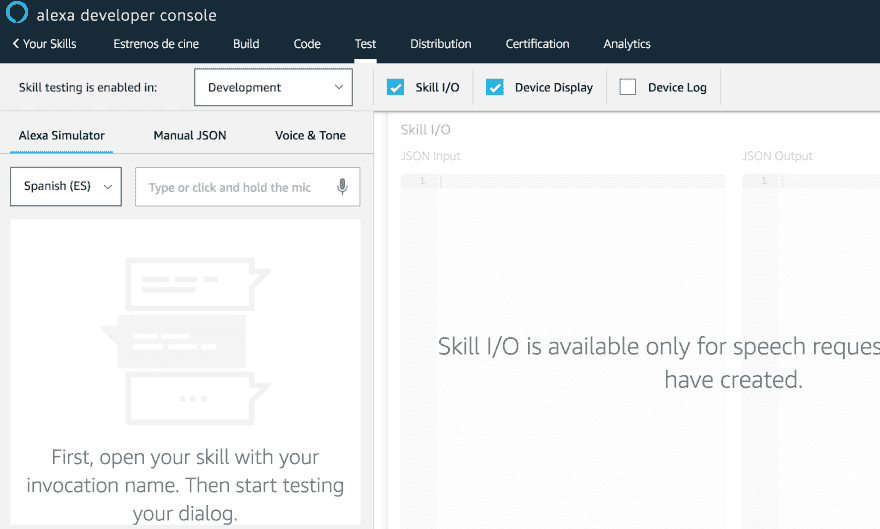
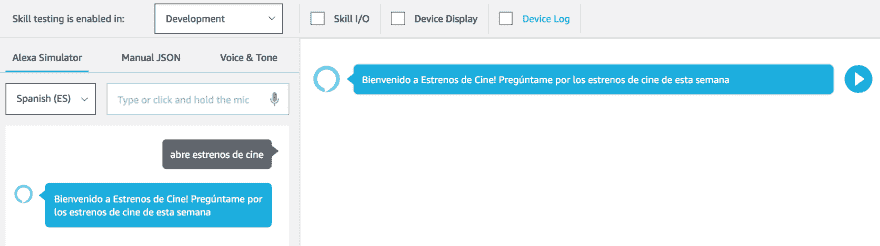
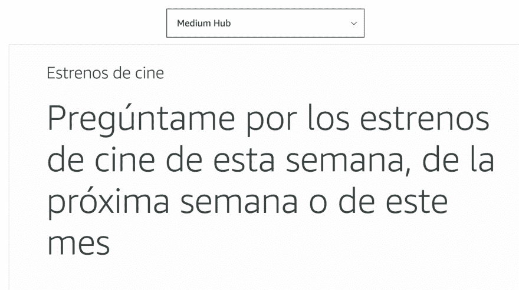
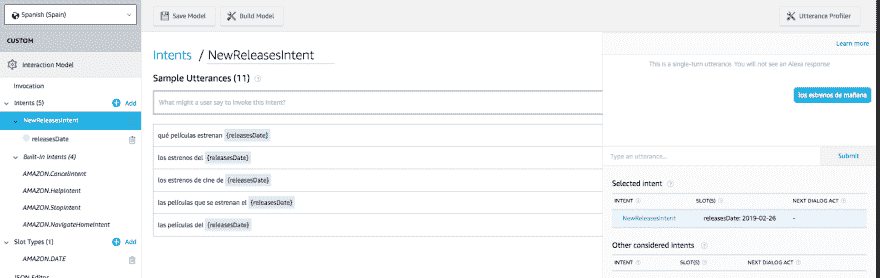
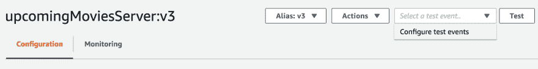
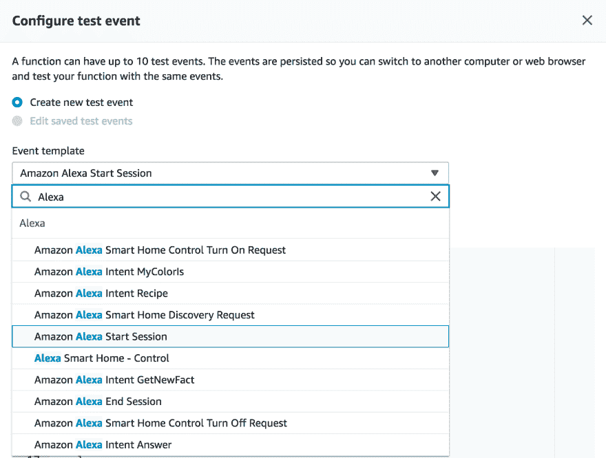
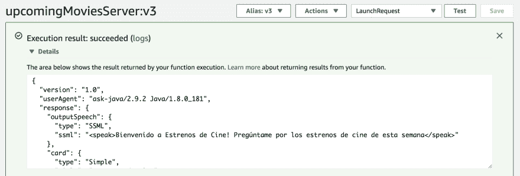

# 为 Alexa (V)创建自定义技能:使用 Amazon 工具测试我们的技能

> [https://dev . to/kini/创建-un-custom-skill-to-Alexa-v-test-our-skill-with-tools-from-Amazon-3 ced](https://dev.to/kini/creando-un-custom-skill-para-alexa-v-probando-nuestro-skill-con-las-herramientas-de-amazon-3ced)；

在[之前的岗位](https://kinisoftware.com/creando-un-custom-skill-para-alexa-iv-codido-basico-del-skill-backend-en-java-8/)中，我们已经完成了我们技能的第一个功能版本的开发。我们在 Alexa 开发者控制台中创建了[前端](https://kinisoftware.com/creando-un-custom-skill-para-alexa-estrenos-de-cine-ii/)，在 AWS Lambda 中创建了[后端](https://kinisoftware.com/creando-un-custom-skill-para-alexa-iii-alexa-developer-console/)。现在我们可以用亚马逊自己的工具来测试技能了。这是我做的第一件事，看到我们以前的帖子做得很好。

## Probando El skill desde la Alexa 开发者控制台

Amazon 为我们提供了一种通过既支持文本输入又支持语音的模拟器来测试我们技能的方法。您还可以选择直接放置 JSON 或通过支持 SSM 测试我们技能的个性。这是我还没玩过的东西，但我很想见他。

我用这个模拟器来测试我说话和输入文字的技巧。请记住，不同的设备可以使用该技能。例如，手机可以与文本交互，而不仅仅是语音。

此外，模拟器还为我们提供了有关技能响应的附加信息。如果我们的技能能够产生视觉反应，一张卡片，我们还可以在模拟器上看到它，以及其他日志。

要测试技能，我们必须用“唤醒字”调用它。开始时不要使用 Alexa 这个词，因为它不起作用，真实故事:)

在我举的例子中，我只是引用了技能，没有一击即中的调用，并给出了 LaunchRequestHandler 的回答，因为它是一个类似于`LaunchRequest`的请求。这个答案既有文字上的，也有语音上的。

侧注:第一次响应有点慢，因为您正在提升 lambda，从而创建了一个新会话。这种经验也将提供给第一次提出要求的用户。一旦创建了会话，一切都变得更快了。

### 技能输入输出

此模拟器选项允许我们查看 JSON 格式的技能输入和输出。

**输入**

在输入中，我们可以看到特定于我们的技能和调用中创建的会话的信息。此外，我们还可以看到用于与技能交互的设备的信息，最后我们将看到有关请求的非常有用的信息。

`LaunchRequest`在此例中为`LaunchRequest`。这会使申请到达〔T2〕。如果我们在发射后进行了一次发射，或者已经发出了意图，我们将会有一次`IntentRequest`:

例如，我已经执行了援助意向，我们可以看到 Alexa 是如何通过指出意向是`AMAZON.HelpIntent`来解决的，并给出了与该意向相关的其他信息。

当我们在我们的意图中添加一个插槽时，我们将看到 Alexa 解释的值将如何显示在此处并返回。对于我来说，这将有助于准确了解将要返回的日期格式，例如示例。等着瞧吧。

**输出**

此模拟器选项将向我们显示按需执行技能的输出。

下面我们看到的是调用的响应。有趣的是:

*   参数`shouldEndSession`的值，重要的是在认证我们的技能时要考虑到它。
*   SSM 的使用，无论是在`outputSpeech`还是`reprompt`中(如果有的话)。
*   要显示在萤幕装置上的介面卡资讯。

### 设备显示

这里我们可以看到在屏幕设备上调用我们的技能的结果。此外，我们还可以在选择器中更改屏幕类型。

对我来说，这是一个相当可悲的出路，因为我还没有准备好我的技能，但我认为它可能是有趣的发展为展示电影海报，甚至是电影的拖车。让我们看看我是否会这样做。)

### 设备日志

从这里我不能告诉你们太多，因为事实是，我没有仔细看它提供了什么。因此，它提供了 I/O 技能等信息以及有关每个请求的更多详细信息。默认情况下，它在进入模拟器时处于禁用状态，第一次发生在我身上。如果你们中的任何一个人使用这个选项，我很乐意就此发表意见；）

### Bola Extra:话语剖析器

Alexa 开发者控制台在我做这项技能时没有的一项功能是，

您可以使用此工具，从螺帽编辑视窗本身测试螺帽的范例提示行为。当我们有插槽来查看它的价值时尤其有用。

我在这里给你们留一个视频链接[德国 Viscuso](https://twitter.com/germanviscuso) 讲述如何使用。

## 从 AWS Lambda 控制台测试后端

我已经告诉你了，我们正在测试 E2E 技能，无论是正面还是背面，我们可以留在那里。就我而言，为了了解更多 AWS Lambda，我一直在研究如何测试部署的后端，而无需经过模拟器。

我们可以配置不同类型的“`test events`”帮助我们分别测试后端。在这些类型中，我们可以使用预定义的 Alexa 技能模板创建一个新类型。

一个简单的例子就是创建一个事件来模拟我们在前面的步骤中看到的‘t0’。为此，我们可以使用 Amazon Alexa Start Session 模板，为其命名，然后保存它，而不需要触摸其他任何内容。

我称之为`LaunchRequest`，推出时，我们可以看到与我们在 I/O 技能输出中看到的一样的结果。这样，我们就可以通过模拟其他尝试和插槽值(如果有)来创建所需数量的测试事件。除了技能信息外，我们还会有关于 lambda 本身的信息，如通话时间、bill 的时间、使用的内存等。

* * *

根据我迄今为止的经验，我们可以鼓励自己把技能带到认证过程中，因为我们有一些功能性的东西。我，到了这一步，我决定在尝试发布任何内容之前，在我的主要意图中添加一个时间槽的管理。我会在下一篇文章里告诉你：）