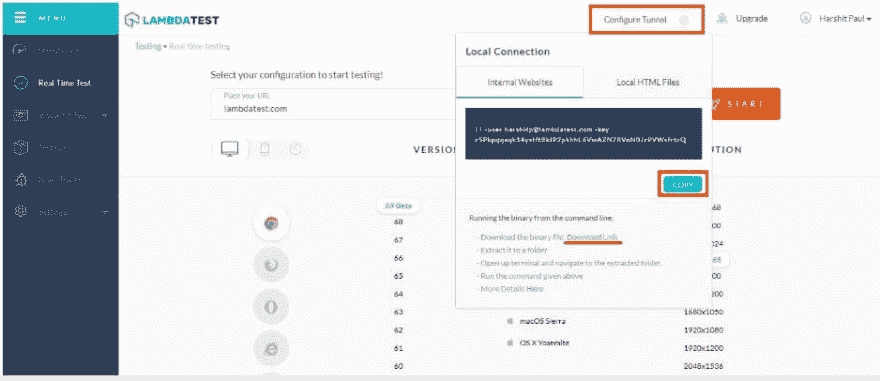
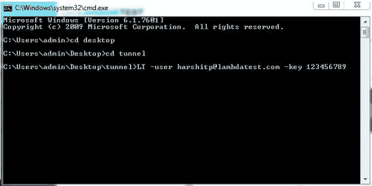
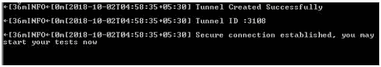
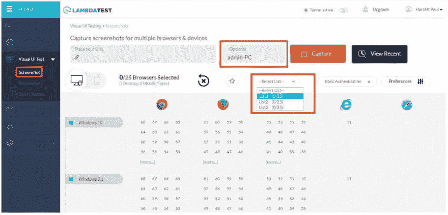
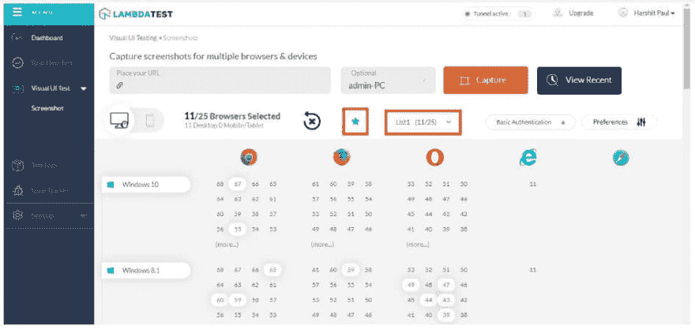

# 使用 Lambda 隧道自动截取本地托管页面的屏幕截图

> 原文：<https://dev.to/lambdatestteam/taking-automated-screenshot-of-locally-hosted-pages-with-lambda-tunnel-3mj8>

从一开始，LambdaTest 的主要目标就是帮助用户快速跟踪他们的测试和开发，尤其是他们的跨浏览器测试工作流。每一个 LambdaTest 特性，无论是实时测试特性还是集成，都是为了减轻开发人员和测试人员的工作负担而从头开始构建的。

它克服了许多开发和部署挑战，并需要对特性的架构进行彻底的重新思考，但我们也做到了。现在，用户可以通过 Lambda 隧道将他们的本地或私人服务器与 LambdaTest 连接起来，并对托管在那里的页面进行截图。现在，在您将更改部署到生产环境或将其投入使用之前，您可以在每个发布周期中对不同浏览器上的用户界面体验比以往任何时候都更有信心。

我们知道这听起来令人兴奋。在我们开始改变之前，这里有一个快速的纲要，通过本地测试环境来反映这些类型的测试的基本目的。

## 什么是自动化截图测试？

这种类型的测试将有助于您一次性通过运行在各种操作系统上的不同桌面和移动设备捕获大量屏幕截图！这是通过使用仪表化的 UI 测试用例来实现的，以帮助您认识到 webapp 使用不同的浏览器在不同的屏幕尺寸下是如何无缝呈现的。在 LambdaTest，您可以在一次测试中捕获多达 25 种不同的浏览器版本配置的屏幕截图。

## 什么是响应性测试？

正如响应式这个词所暗示的，这种测试是用来检查 RWD(响应式网页设计)网站的外观。这种设计有助于网站以灵活而恰当的方式呈现内容，这种呈现方式基于网站所依赖的设备和操作系统。在 LambdaTest，您可以一次通过 44 种不同的设备检查 RWD！

## 什么是λ隧道？

Lambda Tunnel 是一个特性，允许你在一个安全的 shell 测试环境中彻底测试你的开发，托管在 LambdaTest 云服务器上。它为您提供了安全测试 2000 多种浏览器及其各种版本的灵活性，在真实的操作系统代码上运行，以实现跨浏览器和跨平台的兼容性，甚至在部署到生产环境之前也是如此。

## 设置 Lambda 隧道来测试本地托管的 web 应用程序？

*   步骤 1 →从左侧导航菜单进入实时测试，点击“配置隧道”按钮。

*   步骤 2 →下载二进制文件并复制显示的字符串。
    [T3】](https://res.cloudinary.com/practicaldev/image/fetch/s--2dtPs3Kn--/c_limit%2Cf_auto%2Cfl_progressive%2Cq_auto%2Cw_880/https://www.lambdatest.com/blog/wp-content/uploads/2018/10/asw3.jpg)

*   第 3 步→解压下载的 zip 文件。转到 cmd(命令提示符)并将指针指向解压 zip 文件的同一个目录。

*   步骤 4 →粘贴复制的字符串。
    [T3】](https://res.cloudinary.com/practicaldev/image/fetch/s--BlgO4X9v--/c_limit%2Cf_auto%2Cfl_progressive%2Cq_auto%2Cw_880/https://www.lambdatest.com/blog/wp-content/uploads/2018/10/asp1-1.jpg)

*   第 5 步→按回车键并等待，直到你得到消息说“你可以开始你的测试了”。
    [T3】](https://res.cloudinary.com/practicaldev/image/fetch/s--R5yhprLS--/c_limit%2Cf_auto%2Cfl_progressive%2Cq_auto%2Cw_880/https://www.lambdatest.com/blog/wp-content/uploads/2018/10/asp3.jpg)

## 使用 Lambda 隧道截取私有或本地托管页面的屏幕截图

到目前为止，作为最终用户，您只能在实时测试中对本地托管的网页或 webapp 进行跨浏览器兼容性测试。如果你的目标仅仅是快速识别视觉界面的错误，这种方法会更详细但更耗时。这就是我们的截图测试和响应测试功能的由来。

截图测试现在可以通过 Lambda Tunnel 进行。当你连接了 Lambda Tunnel 之后，在开始截图之前只需要选择连接的机器。
[T3】](https://res.cloudinary.com/practicaldev/image/fetch/s--cS_uf_FP--/c_limit%2Cf_auto%2Cfl_progressive%2Cq_auto%2Cw_880/https://www.lambdatest.com/blog/wp-content/uploads/2018/10/asw.jpg)

同样的道理也适用于响应测试。成功连接隧道后，您可以通过检查顶部导航栏上的隧道状态图标来验证，您也可以开始生成本地托管页面的响应测试截图。

## 在 Mac 和 iOS 上测试本地托管页面

本机 MacOS 和 iOS 浏览 Safari，不翻译 URL 字符串 Localhost。这是所有新旧 safari 浏览器的通病。因此，任何为页面 localhost(例如 localhost:3000)生成屏幕截图的人都可能在 Mac 和 iOS 设备中得到一个错误。解决这个问题的方法很简单。不要使用字符串 localhost，只需用本地计算机的 IP 替换它。例如，如果您想要测试的 url 是[https://localhost:3000/dashboard](https://localhost:3000/dashboard)，并且您的本地系统的 IP 是 192.168.5.6，那么您必须输入用于测试的 URL 将是[https://192 . 168 . 5 . 6:3000/dashboard](https://192.168.5.6:3000/dashboard)。这将在包括 windows 和 android 在内的所有浏览器中提供完美的结果。

## 保存选中的浏览器进行快速截图测试

除了添加隧道功能，我们还推出了一个新的保存收藏夹浏览器功能，允许您保存特定的浏览器列表以供测试。在测试本地托管页面之后，这是自动截图中第二受欢迎的功能。😀

选择列表后，单击星号按钮保存这些特定的浏览器。保存列表后，星星会以蓝色突出显示。所以下次你访问我们的平台在相同的浏览器上进行截图测试时，你只需要从下拉列表中选择列表，瞧！您还可以保存 3 个不同的列表。

## 更多功能来了

我们不断升级和扩展我们的平台，以促进一个完整的测试生态系统。由于我们客户的宝贵反馈和建议，他们已经成为使我们基于云的平台更加强大的支柱。

希望你喜欢我们最新的 Lambda 隧道。请随意评论什么最吸引您，以及您认为我们可以做得更好的地方！让我们知道您对最新更新的想法，并通过您的宝贵意见帮助我们改进。你也可以在这里给我们留言或者和我们聊天。我们的产品专家总是乐意帮助您解决任何困难。

测试愉快！🙂
[T3】](https://goo.gl/uejyYK)

原文出处:[lambdatest.com](https://goo.gl/8XqZXE)