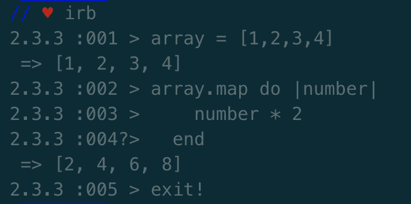
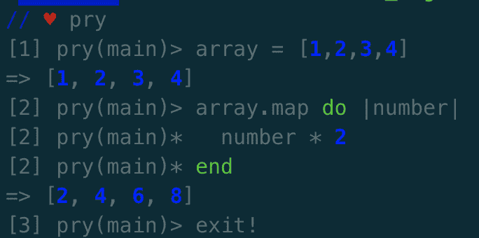
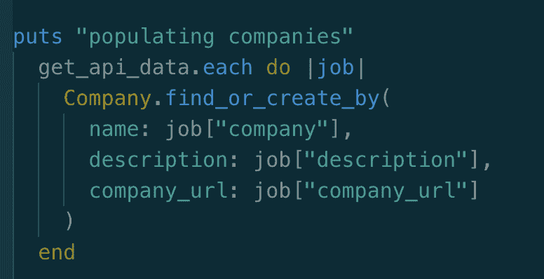
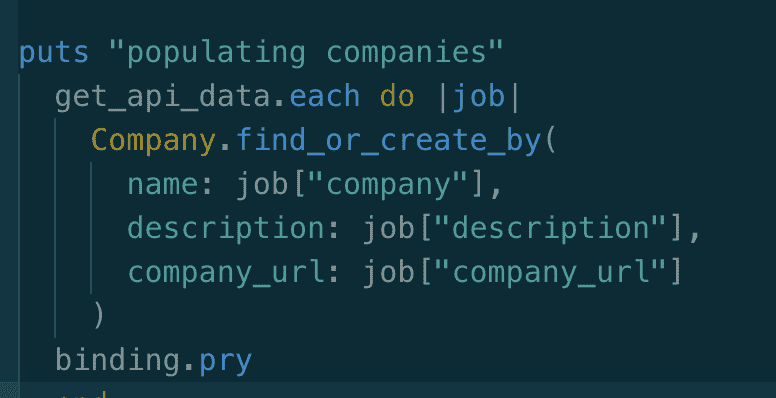
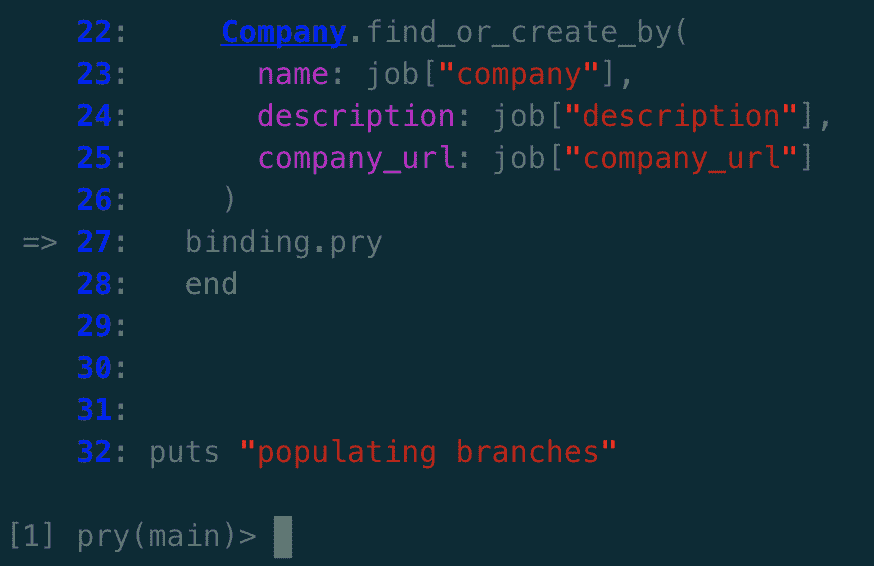
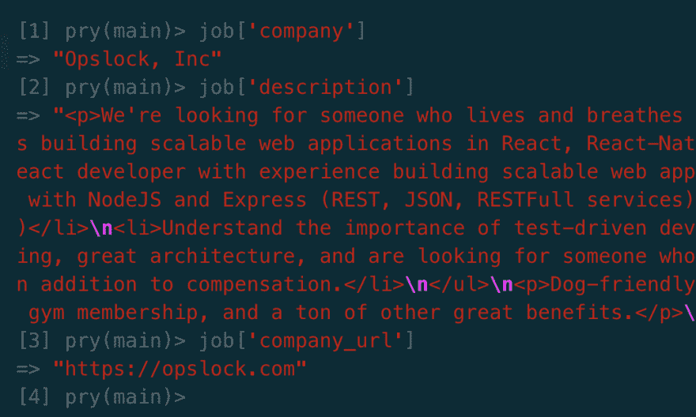
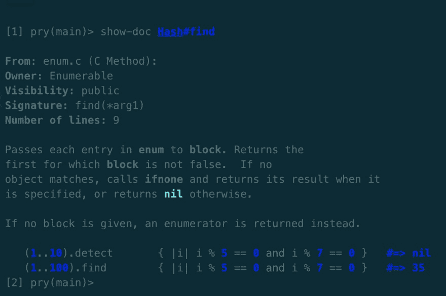

# 用 Pry 调试:初学者指南

> 原文：<https://dev.to/elimerrell/debugging-with-pry-a-beginners-guide-3p99>

* * *

在学习 Flatiron School 提供的预备训练营课程时，我经常发现自己在迭代和嵌套数据结构中努力检查和调试返回值。Learn.co 课程引入了一个叫做 Pry 的工具，但是我很难理解如何在我的代码中实现它。直到一个名叫 Hashketball 的困难实验室，事情才最终明朗起来。在实验室挣扎了太久之后，我终于强迫自己通读了 Pry 的文档，我编写和调试哈希迭代的能力立即得到了提高。

如果你发现自己正在努力构建一个 Ruby 程序，Pry 可能会成为你武器库中一个无价的工具。Pry 是一个强大的工具，Ruby 开发人员可以用它来调试程序并克服障碍。像其他 Ruby gems 一样，为了访问它的功能，您的环境设置或特定的 Ruby 文件中必须有 Pry gem。此外，还有几个 Pry 插件，包括 pry-doc 和 pry-byebug，它们扩展了 gem 的特性和功能。您可以将这些插件看作是您的 gem 文件中必需的独立的 gem。

一旦你用 Pry gem 配置了你的程序，是时候撬开你的代码，体验用 Pry 调试的快乐了。Pry 有很多特性，但下面的例子突出了我认为最有用的特性。

## REPL(阅读、评估、打印、循环)

Pry 可以替换 Ruby 的集成 IRB shell，并在 IRB 的 REPL 功能基础上增加一些额外的特性。IRB 和 Pry 都允许您在终端中执行 Ruby 命令，并在终端中立即收到结果。在您的终端中拥有 REPL 功能是一个非常有用的工具，它允许您在不运行整个程序的情况下快速测试 Ruby 代码。比方说，你想迭代一个数组，看看返回什么值。您可以简单地输入数组，在数组上使用迭代器，然后检查结果:

注意，虽然 IRB 和 Pry 在这个简单的迭代中返回相同的值，但是 Pry 打印到终端的方式看起来有点不同。Pry 优于标准 IRB 的一个优点是它使用了语法高亮。其他超越 IRB 的特性包括:

1.  制表符结束

2.  调试工具

3.  查看文档的能力

## 运行时调用

也许 Pry 最有用的特性是它能够停止程序的运行。Ruby 程序员可以在运行时调用 pry 控制台，方法是在他们想要停止程序的地方插入‘binding . pry’行。当解释器点击 binding.pry 时，pry 将在控制台中打开一个 REPL 会话，允许您测试变量、返回值、迭代等等。

下面是一个例子，展示了 Pry 在分析程序中的嵌套数据结构时的应用。我最近参与开发了一个 dev job search CLI，它依赖于 GitHub Jobs API 提供的职位空缺数据库。API 数据是用 JSON 散列构造的，我们的数据库表是用这些嵌套散列的值作为种子的。下图显示了我们如何填充该项目的公司表:

在填充数据库表时，用正确的数据创建进入表的记录是至关重要的！我们如何检查我们的迭代值，以确保一切都如预期的那样工作？答案是撬。在“填充公司”块的末尾附近插入 binding.pry 允许我们通过停止运行时并进入 REPL 会话来调查返回值:

一旦 binding.pry 被插入到块中，就必须再次执行代码以打开 pry 控制台。当 Pry 控制台在我们的终端中打开时，我们在填充公司数据库表的块中，现在我们能够测试变量并返回值:

现在我们已经打开了“填充公司”块，是时候检查一些值了！当“工作”被插入到 pry 控制台时，单个工作空缺的散列被打印到屏幕上。作业散列有几个关键字，包括类型、url、公司、company_url、位置、标题等。为了确保将正确的值发送到数据库，我们可以在 Pry 终端中输入以下命令:

一旦我们确定我们的迭代按预期运行，binding.pry 可以被删除，我们的表将在程序的下一次执行时被填充！

## 文档和源代码浏览

让我们面对现实吧，成为一名开发者意味着你将严重依赖谷歌。我经常在网上研究 Ruby 方法和搜索文档，以确保我正确地构建了语法。如果我告诉你，Pry 提供了一个插件，允许你在你的控制台上浏览文档，会怎么样？欢迎来到撬博士宝石。Pry-doc 使您能够在当前的 Pry 控制台会话中阅读 Ruby 文档。现在举个例子。假设我不记得。find 方法在散列上工作。我可以在控制台输入以下命令，瞧！Pry 控制台在终端中打印该方法的文档:

万岁！现在，您可以在终端中访问有用的文档，而无需依赖 Google！

## 有用的窥探命令

1.  撬-打开终端中的撬控制台

2.  binding . pry-停止运行并打开 Pry 控制台

3.  退出-退出当前循环

4.  退出！-退出撬控制台

5.  打印程序中的当前位置

6.  显示一个类或类方法的文档

7.  history-向终端打印 Pry 命令的历史

8.  ls-打印程序当前范围内的变量和方法

9.  帮助-打印当前可用的撬动命令列表

Pry 极大地提高了我调试 Ruby 程序的能力，是我陷入困境时经常求助的工具。我希望这些提示和技巧对你有用，记住，每当你在杂草中时，放一个活页夹在里面！