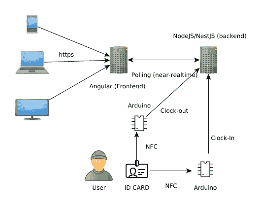

# 第一部分。上下班打卡系统图

> 原文：<https://dev.to/carlillo/part-1-clock-inout-system---diagram-4kgj>

这篇文章是我正在描述的一个上下班打卡系统的系列文章的一部分
如果你想了解更多，你可以阅读下面的文章:

* * *

*原载于 2018 年 11 月 25 日[www . carloscaballero . io](https://carloscaballero.io/part-1-clock-in-out-system-diagram/)T3。*

*   第一部分。上下班打卡系统:图表。
*   第二部分。上下班打卡系统:基本后端— AuthModule。
*   第三部分。上下班打卡系统:基本后端—用户模块。
*   第四部分。上下班打卡系统:基本后端应用模块。
*   第五部分。打卡系统:种子数据库和迁移数据
*   第六部分。上下班打卡系统:基本前端。
*   第七部分。打卡/下班系统:使用 docker/docker-compose 部署后端(nestJS)。
*   第八部分。上下班打卡系统:使用环境部署前端(角度 2+)。
*   第九部分。测试:后端测试—单元测试—服务
*   第十部分。测试:后端测试—单元测试—控制器
*   第十一部分。测试:后端测试— E2E 测试
*   第十二部分。测试:前端测试—单元测试
*   第十三部分。测试:前端测试—集成测试

在这个关于上下班打卡系统的系列文章的第一篇中，我将描述这个系统的架构。描述我们的系统将解决的问题
的最佳方式是使用图表。在此图中，您可以看到
不同的组件，它们可能在不同的服务器中，也可能在相同的服务器中。图
1 显示了用于构建上下班打卡系统的图表。

 
图 1。上下班打卡系统:示意图

因此，我们系统的组件如下:

*   **ID 卡**:所有用户都有一张卡，用 **UID** 识别。工作方式是用户将他们的卡放在一个有 **NFC 读卡器的 Arduino 系统附近。**
*   **Arduino** :系统中有两个 [Arduino](https://www.arduino.cc/) 。第一个用于上班打卡，第二个用于下班打卡。因此，每个 Arduino 通过使用 **POST** 动词和 **HTTPS** 向后端发送 UID 卡。Arduino 系统有一个 NFC 和一个 WiFi 芯片:1)第一个用于读卡；2)第二个用于连接到局域网，向服务器发送 UID。
*   **后端**:后端是使用 [NestJS](https://www.nestjs.com/) 开发的，这是一个基于 [express](https://expressjs.com/) 的框架(尽管你可以使用其他库作为 [fastify](https://www.fastify.io/) )，它可以使用 [SOLID](https://en.wikipedia.org/wiki/SOLID) 原则和语法作为 [Angular](https://angular.io/) 开发软件。这个后端将连接到一个关系数据库 [Postgres](https://www.postgresql.org/) ，使用 [TypeORM](http://typeorm.io/) 作为 [ORM](https://en.wikipedia.org/wiki/Object-relational_mapping) 。
*   **前端**:前端使用 [Angular](https://angular.io/) 开发，这是一个基于 JavaScript 的**框架，当你想要扩展大型 webapps(客户端)时，这是一个很好的选择。在这种情况下，用来举例说明如何使用**最后一个角度的版本和良好的做法**。前端使用 [RxJS](https://github.com/ReactiveX/rxjs) 开发，RxJS 是一个使用 **Observables** 的反应式编程库，使其更容易编写**异步或基于回调的代码**。前端和后端之间的连接可以使用**套接字来获得实时**，但是使用**轮询**可以获得一个套接字结果(**接近实时**)但是更容易。**

有几个组件可以在未来开发为一个
**管理面板**来管理关于用户和卡的信息，个人
关于我在系统中的签到/签出的信息，前端可以通过
用户进行搜索，以了解用户是否在大楼中。也许将来会开发这种
功能，但今天将展示一个基本的
打卡/下班系统。

GitHub 项目是[https://github.com/Caballerog/clock-in-out](https://github.com/Caballerog/clock-in-out)

* * *

*最初发布于[www . carloscaballero . io](https://carloscaballero.io/part-1-clock-in-out-system-diagram/)2018 年 11 月 25 日。*