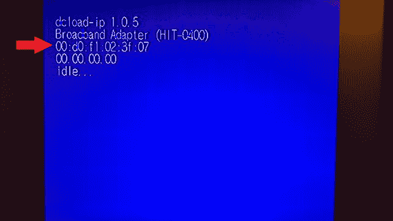
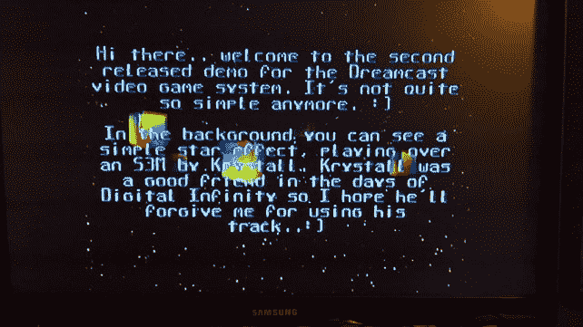

# 在 Windows 上使用 KOS 和 Bash 的 Dreamcast GameDev

> 原文：<https://dev.to/brianpeek/dreamcast-gamedev-with-kos-and-bash-on-windows-3a57>

*交叉张贴自[brianpeek.com](https://brianpeek.com/dreamcast-gamedev-with-kos-and-bash-on-windows/)。*

很多年前，一个被称为 [KallistiOS](http://gamedev.allusion.net/softprj/kos/) (KOS)的开源世嘉 Dreamcast SDK 被创建出来，至今仍在开发中。我很久以前就用这个 SDK 创建了几个[发布的](http://www.ganksoft.com/)模拟器，以及各种未完成的游戏...

KOS 很容易在各种平台上安装和运行，但是在 Windows 上，这总是需要安装 Cygwin。但是，随着 Windows 10 周年更新中添加了 Windows Linux 子系统(LXSS ),人们现在可以在 Windows 10 中本机运行 Ubuntu 和 Bash shell，这意味着人们可以轻松设置 KOS、SH4 工具链和(几乎)开发和部署 Sega Dreamcast 应用程序所需的其他一切。以下是如何…

# 要求

*   能够启动 MIL-CD 的世嘉 Dreamcast...这是 2000 年 10 月之前制造的任何机器。
*   Dreamcast 宽带适配器(HIT-0300 或 HIT-0400 均可)
*   Dreamcast 通过以太网接入你的网络
*   用于 Windows 的 Linux 子系统[已安装](https://docs.microsoft.com/windows/wsl/install-win10?WT.mc_id=devto-blog-brpeek)并已配置

# 更新 LXSS

确保通过发出以下两个命令来升级子系统:

```
sudo apt-get update
sudo apt-get upgrade 
```

# 下载并构建工具链和 KOS

一旦完成，您将需要安装一些检索和构建 SDK 所需的包和工具:

```
sudo apt-get -y install git make gcc texinfo libjpeg-dev libpng-dev subversion genromfs libelf-dev python 
```

现在已经安装了合适的包，确保你在你的主目录下，然后下载 KOS repos:

```
git clone git://git.code.sf.net/p/cadcdev/kallistios kos
git clone git://git.code.sf.net/p/cadcdev/kos-ports 
```

接下来，您需要下载并解压缩用于构建 Dreamcast 工具链的工具链位:

```
cd ~/kos/utils/dc-chain/
./download.sh
./unpack.sh 
```

这个解包过程不会显示任何输出，可能需要很长时间，所以不要取消！

解包后，您现在可以构建工具链了。这个过程为 Dreamcast 的 SH4 CPU 构建了一个兼容的编译器(gcc)和其他工具。在与上述相同的目录中，运行:

```
sudo make 
```

这需要一段时间，所以请耐心等待...

完成之后，现在需要设置 Bash 环境，以便可以找到并使用 SDK 和工具。首先，复制以下文件并更改其权限:

```
cp ~/kos/doc/environ.sh.sample ~/kos/environ.sh
chmod 777 ~/kos/environ.sh 
```

接下来，编辑我们刚刚复制的 environ.sh 文件，使其指向工具位置。为此，我使用使用 nano，但任何其他文本编辑器都可以:

```
nano ~/kos/environ.sh 
```

查找导出 **KOS_BASE** 的条目，并将其设置为:

```
/home/YOUR_USERNAME/kos 
```

很明显，用你的用户名替换**你的用户名**。我的是这样的:

```
export KOS_BASE="/home/brian/kos" 
```

接下来，查找导出 **KOS_LOADER** 的条目，并在-x 参数前添加以下内容:

```
-t IP_ADDRESS 
```

...其中 **IP 地址**是网络上未使用的有效 IP 地址。我的是这样的:

```
export KOS_LOADER="dc-tool -t 192.168.2.250 -x" 
```

> 关于 IP 地址的说明:您不能选择世界上的任何 IP 地址...它必须在您自己的子网中有效(可能是 192.168.X.X 或 10。X.X.X 或类似的设备)，并且不能被网络上的任何其他设备使用。检查您的路由器的有效选择和更多信息。

最后，编辑。您的主目录中的 bashrc 文件:

```
nano ~/.bashrc 
```

...在最底部，添加这一行，这样您刚刚编辑的 **environ.sh** 文件就会在登录时运行:

```
. ~/kos/environ.sh 
```

> 别忘了句号作为第一个角色！

现在，退出并在 Windows 上重启 Bash。为了确保环境已经设置好，使用 **printenv** 命令，您应该会看到以 **KOS_** 开头的各种环境变量。

接下来，KOS 本身也需要建设。为此，切换到 **kos** 目录并运行 make 命令:

```
cd ~/kos
make 
```

一旦完成，建立 **kos-ports** 项目:

```
cd ~/kos-ports/utils/
./build-all.sh 
```

最后，构建 KOS 示例项目:

```
cd ~/kos/examples
make 
```

其中一些例子可能无法构建，但现在不用担心。

# 下载并构建 dcload-ip

接下来，您需要下载并构建 dcload-ip 工具。这将允许您通过宽带适配器(BBA)将游戏部署到零售 Dreamcast。回到您的主目录，运行以下命令:

```
cd ~
git clone git://git.code.sf.net/p/cadcdev/dcload-ip
cd dcload-ip
sudo make install 
```

> 您可能会在最后一步看到一个关于/usr/local/bin 的错误，忽略它是安全的。

现在，您需要将主机 dcload 程序刻录到 CD 上，这样我们就可以在 Dreamcast 物理机上运行它，并上传我们的二进制文件。但是，在这里我们不得不作弊。因为 Windows 的 Linux 子系统还没有硬件支持，所以它不能与 CD-R 驱动器对话。但是，我已经整理了一个快速包，其中包含运行它们所需的工具和 cygwin 库。您可以在此下载该软件包:

[dcload-disc.zip (1.42 mb)](https://brianpeek.com/downloads/projects/dcload-disc.zip)

在机器上的某个地方解压缩这个文件，然后打开一个管理窗口命令提示符(不是 Bash)并导航到这些文件。然后，运行以下命令:

```
wodim -scanbus 
```

这将返回它找到的每个驱动器的一些信息。在输出中，在列表中查找您的可记录驱动器，并记下标识驱动器总线和位置的 3 个逗号分隔的数字。我的长这样:

```
scsibus0:  
        0,0,0     0) 'HL-DT-ST' 'BD-RE  WH16NS40 ' '1.02' Removable CD-ROM
        0,1,0     1) *  
        0,2,0     2) *  
        0,3,0     3) *  
        0,4,0     4) *  
        0,5,0     5) *  
        0,6,0     6) *  
        0,7,0     7) HOST ADAPTOR 
```

所以，对我来说这 3 个数字是“0，0，0”。对于接下来的这些步骤，用您的值替换 **X，X，X** 。

将一张空白 CD-R 插入光驱，并刻录光盘的第一部分，即音轨，如下所示:

```
wodim dev=X,X,X -multi -audio -tao audio.raw 
```

现在，刻录数据轨道:

```
wodim dev=X,X,X -xa -tao -multi data.raw 
```

刻录了这两个项目后，您现在可以弹出 CD，将其放入您的 Dreamcast 中，然后它就会运行。

# 运行样本

在 Dreamcast 上运行 dcload-ip 时，您应该会看到显示的 MAC 地址。

[](https://brianpeek.com/conteimg/WP_20160731_01_40_04_Pro_2.jpg)

我们需要告诉我们的 Windows 机器如何通过 IP 地址找到那个设备。如果您还记得，之前您为您的 Dreamcast 选择了一个 IP。你在这里会需要的。

打开一个管理命令提示符(不是 Bash，而是标准命令提示符)并如下运行 **arp** 命令:

```
arp -s IP_ADDRESS MAC_ADDRESS 
```

将 **IP_ADDRESS** 替换为上面选择的那个，将 **MAC_ADDRESS** 替换为屏幕上显示的那个，但是使用连字符代替冒号。这里有一个例子:

```
arp -s 192.168.2.250 00-d0-f1-02-3f-07 
```

> 每次重新启动后都必须运行该命令...Windows 不会保存它。

在运行这个命令之后，您可能需要退出并重新启动 Windows 上的 Bash，这样它就会知道所做的更改。

现在，您可以运行 2ndmix(或任何其他)示例:

```
cd ~/kos/examples/dreamcast/2ndmix
make run 
```

如果一切按计划进行，这应该可以在您的 Dreamcast 上构建、部署和执行 2ndmix 演示！

[](https://brianpeek.com/conteimg/WP_20160731_01_40_30_Pro.jpg)

# 下一步

现在你已经有了一个配置好的工作工具链和 SDK，你可以开始构建你自己的 Dreamcast 游戏了。查看 kos 目录中的所有示例，了解关于该 API 的更多信息。此外，这里有几个链接提供了更多信息:

*   [斜率](http://gamedev.allusion.net/softprj/kos/)
*   [文档](http://gamedev.allusion.net/docs/kos-2.0.0/)