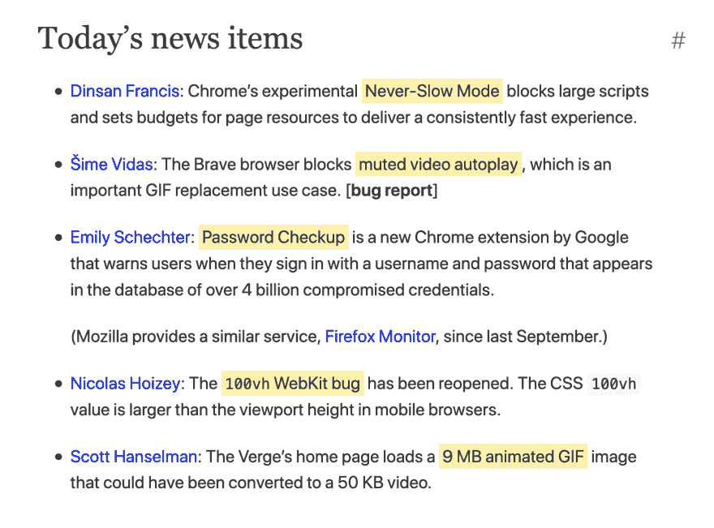

# Dev.to 可以添加对<mark>元素的支持吗？</mark>

> 原文：<https://dev.to/simevidas/could-devto-add-support-for-the-mark-element-2fn2>

`<mark>`元素对于突出显示文本中的某些单词和短语很有用，这减少了“文本墙”问题。浏览器已经使用黄色背景呈现该元素。

我要求 dev . to*而不是*从文章的 HTML 输出中删除`<mark>`元素。作者可以在 Markdown 中正常使用该元素。

关于`<mark>`如何提高内容可读性的一个例子:

