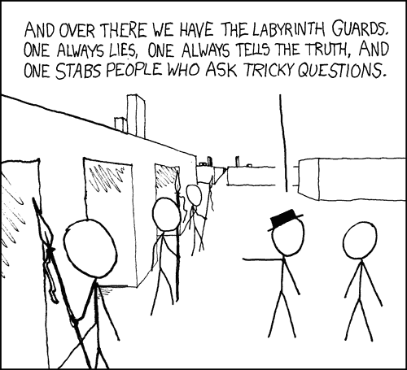

# 说谎的兄弟，一个明确的解决方案

> 原文：<https://dev.to/involans/lying-brothers-a-categorical-solution-5caa>

两个说谎兄弟的著名谜题是一个既众所周知又鲜为人知的谜题:

[](https://res.cloudinary.com/practicaldev/image/fetch/s--IplNUVcf--/c_limit%2Cf_auto%2Cfl_progressive%2Cq_auto%2Cw_880/https://www.explainxkcd.com/wiimg/2/26/labyrinth_puzzle.png)

> 你面前有两扇门，分别由两个兄弟中的一个把守。一扇门通向自由，另一扇门通向毁灭。兄弟中的一个只能说真话，不管你问什么问题，另一个只能说假话。你只能问一个是或不是的问题，只针对一个兄弟，然后你必须选择其中一个门。你问什么问题？

它出现在整个流行文化中(包括在《迷宫》),但无论在哪里发现它，遇到它的人物通常都会像现实世界中的人一样，产生困惑和半记忆解决方案的混合反应。大多数人记得如何回答这个谜题，在某个时候，可能是在他们还是孩子的时候，他们已经走过这个谜题了。

他们知道你应该问一个兄弟，当被问到这扇门是否通向自由时，另一个兄弟会说什么。很容易说服某人相信这是真的，通过一个一个案例地走过那个兄弟会如何反应的真值表。但是不太明显的是*为什么*这是答案，以及你如何从基本原理得出这个解。

事实证明，这里的推理非常简单，让我们使用我们所知道的函数来找到正确的问题(以及答案)。

# 我们需要知道什么

这个难题实际上是要求我们用一个是或否的问题来确定一个实际的信息。具体来说:

*   这扇门是自由之门吗？

问题是:

*   这位哥哥在说谎吗？

似乎是找出答案的关键，因为虽然我们只关心门在一天结束时通向哪里，但我们无法确定这一点，直到我们知道哥哥是否在说谎。所以第一个任务就是搞清楚这位兄弟是不是骗子。

# 审讯技巧

我们可以按照警方的调查进行，并询问警卫。

[](https://res.cloudinary.com/practicaldev/image/fetch/s--BN3EVfJ2--/c_limit%2Cf_auto%2Cfl_progressive%2Cq_auto%2Cw_880/https://m.media-amazon.cimg/M/MV5BMjNkMWQ3NzMtYTkwZi00ZWVhLWE2NDUtMTc3OTUwOWJiZWFmXkEyXkFqcGdeQXVyODY4Njc0ODk%40._V1_SY1000_SX1500_AL_.jpg)

如果我们想知道我们是否被骗了，我们可以问一些关于已知事实的问题:

```
(def  facts  {:sky-is-blue  true  :water-is-wet  true  :black-is-white  false  :up-is-down  false  }) 
```

然后我们可以询问这些已知的事实，然后看看警卫是否给出了正确的答案。假设守卫是接受一组事实，然后回答关于该组事实的问题的函数，例如:

```
(defn  truth-teller  [memory]  (fn  [question]  (question  memory))) 
```

说真话的人很简单，只是从记忆中提取一个事实，然后把它传递给我们。

```
(defn  liar  [memory]  (fn  [question]  (not  (question  memory)))) 
```

说谎者完全一样，只是在回忆了一个事实后，他们会告诉我们与他们所知道的事实相反的事情。所以尝试一下:

```
(let  [a  (truth-teller  facts)  b  (liar  facts)]  (doseq  [fact  (keys  facts)  guard  [a,b]]  (println  (str  "Guard is telling the truth? "  (=  (facts  fact)  (guard  fact)))))) 
```

由于这两个守卫之间的唯一区别是他们处理内存内容的方式，我们可以这样来重构:

```
(def  lying  not)  (def  truthfully  identity)  (doseq  [fact  (keys  facts)  guard  [lying  truthfully]  ]  (println  (str  "Guard is telling the truth? "  (str  (=  (facts  fact)  (guard  (facts  fact))))))) 
```

所以确定警卫是不是骗子就相当于问一个未知函数是否等于`identity`或者`not`，我们可以通过看他们的输出来做到。

# 我们不在乎你是谁，只要告诉我们真相

到目前为止，如果我们有一组可以达成共识的共享事实，我们就可以发现说谎者，然后我们就可以比较结果了。然后我们知道我们是否有一个`not-guard`或者一个`identity-guard`。但是如果我们能把一个`not-guard`变成一个`identity-guard`不是很好吗？然后我们可以相信我们的答案。好吧，让我们看看相反的情况，把一个`identity-guard`变成一个`not-guard`。

如果我们记住函数合成的法则，`identity`就是中性元素:

```
id . a  === a
a  . id === a 
```

或者在`not`的情况下:

```
id . not === not
not . id === not 
```

这意味着，如果我们将两个守卫组合在一起，我们每次都可以获得一个`not-guard`，不管他们以哪个顺序进来，我们都保证获得一个`not-guard`回来:

```
(defn  not-guard  [[a  b]]  (comp  a  b)) 
```

嗯，一个`not-guard`有什么用？当我们不知道他们是不是一个的时候，这并不多，但是一旦我们确定他们是什么，我们就可以把他们变成一个说真话的人，因为`not . not === id`。所以这意味着无论守卫是`[liar truth-teller]`还是`[truth-teller liar]`，我们都可以通过应用这些变换来得到一个真相讲述者:

```
(defn  tell-the-truth  [guards]  (comp  not  (not-guard  guards))) 
```

# 寻找出路

令人高兴的是，这意味着给定守卫的任何顺序，我们总是可以通过将他们组合在一起来塑造一个真相讲述者，并使用这个组合守卫来解决这个难题:

```
(defn  solve  [guards  door-a-leads-to-freedom]  (let  [truth-teller  (tell-the-truth  guards)]  (if  (truth-teller  door-a-leads-to-freedom)  :door-a  :door-b))) 
```

这当然是一种迂回的说法:

```
doorA === (not . not . id) doorA
doorA === (id . id) doorA
doorA === id doorA
doorA === doorA 
```

这对于谜题来说意味着什么？组合两个函数意味着通过两个函数来线程化一个输入，这里的两个兄弟是纯粹的事实函数，一个是恒等式函数。组成两个回答者意味着问一个人另一个如何回答。每当我们有一个恒等函数和其他东西时，我们就消除恒等，并简化成无论其他东西是什么，不管组合的顺序如何。那么我们可以假设我们正在处理这个问题。对于警卫来说，这意味着不管哪个是 A，哪个是 B，我们都把他们当成说谎者，我们知道如何处理谎言。

从某些方面来说，这个难题就像是通过除以一个公因数来解一个方程。当我们知道`1`中的一个因子时，我们甚至不必这样做，因为`(x * 1)`和`(1 * x)`都等于`x`，正如`(f . id)`和`(id . f)`都等于`f`。几乎令人惊讶的是，我们可以用如此简单的等式推理来推理函数，就像我们推理数字一样，这是定律很重要的一个例子。

# 范畴理论后记

有些人甚至可能听说过将幺半群描述为“内函子范畴中的幺半群”，那么“内函子范畴中的幺半群”就是有趣的确切情况。函数`identity`和`not`是内函子，是来自`Bool -> Bool`的函数。并且它们形成了一个由`(.)`组成的范畴，具有身份`id`，或者等价地，它们是一个幺半群，其中`mappend`是`(.)`,`mempty`是`id`。所以我们可以使用任何一套定律，来证明我们可以排除身份元素，也就是说实话的守卫，只留下说谎者。

### 图片来源:XKCD，IMDB