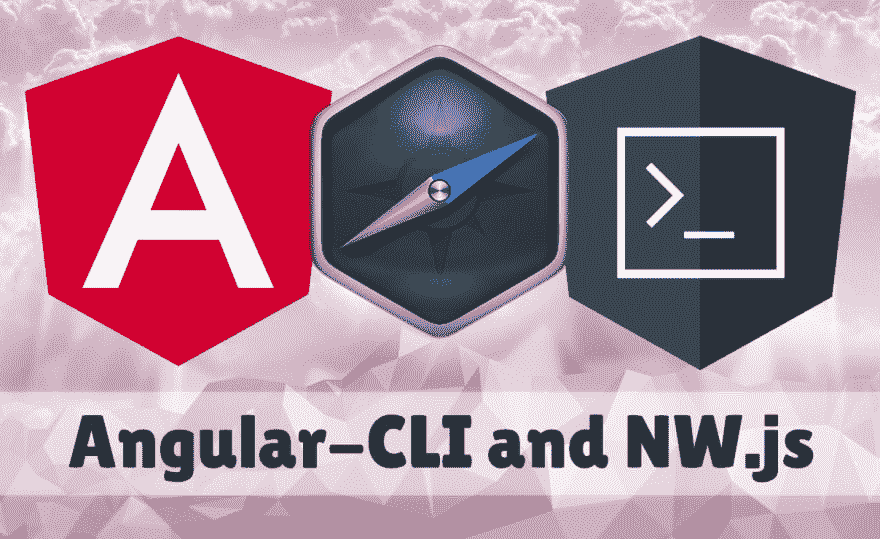

# Angular-CLI 和 NW.js 用于开发

> 原文：<https://dev.to/thejaredwilcurt/angular-cli-and-nwjs-for-development-49gl>

[](https://res.cloudinary.com/practicaldev/image/fetch/s--RYLpNEo7--/c_limit%2Cf_auto%2Cfl_progressive%2Cq_auto%2Cw_880/https://thepracticaldev.s3.amazonaws.com/i/qim6c92bwih0ws7imjgw.jpg)

这将引导您从头开始设置 NW.js 和 Angular-CLI。

*“为什么不为我做这一切，给我一份样板文件呢”*

你想要一条鱼，还是想学习如何钓鱼？另外，样板文件已经存在，你可以到处找找。

* * *

**编者注:**

由于[dev . to](https://github.com/thepracticaldev/dev.to/issues/1855)的限制，下面的一些代码块格式不正确。抱歉，我控制不了。

* * *

## 第一步:角度 CLI

Angular 相当复杂，需要很多工具来让你的标准 Angular 应用离开地面。幸运的是，他们提供了一个生成和搭建项目的工具。

1.  `npm install -g @angular/cli`
2.  `ng new`
    *   填写应用程序名称、路由、Sass 预处理等选项
    *   它会自动用你的应用程序名称创建一个文件夹
    *   CLI 将生成一个包含文件的默认项目，并安装其依赖项

## 步骤 2:验证角度 CLI 是否正常工作

在我们添加任何其他内容之前，让我们确保一切都按预期运行。我们将导航到项目文件夹，启动服务器并在浏览器中查看它。

1.  `cd your-app-name`
2.  `npm start`
    *   这将运行一个本地 web 服务器，并记录它运行在哪个端口上。对我来说是港口。
3.  在浏览器中访问本地服务器。
    *   [http://localhost:4200](http://localhost:4200)
4.  打开文件`src/app/app.component.ts`
5.  将`title = 'your-app-name';`改为`title = 'Does this update automatically?';`
6.  保存文件并在浏览器中查看，一两秒钟后，您应该会看到页面上的文本自动更改！

## 第三步:在 NW.js 中添加

现在我们知道基本的 Angular 项目如预期的那样工作，我们可以开始添加 NW.js 并为开发设置它。

1.  终止您运行的本地 web 服务器
2.  `npm install --save-dev nw@sdk concurrently`
3.  打开`package.json`文件
4.  在`"scripts"`部分，更改:
    *   `"start": "ng serve",`
    *   收件人:
    *   `"start": "concurrently \"ng serve --port=8964\" \"nw .\"",`
5.  在`package.json`对象的根上添加这些值:

    ```
    "main": "http://localhost:8964",
    "node-remote": "http://localhost:8964",
    "window": {
      "width": 960,
      "height": 600,
      "min_width": 700,
      "min_height": 500,
      "icon": "your-app-logo.png"
    }, 
    ```

6.  由于某些(貌似愚蠢的)原因，Angular 在加载时添加了一个“全局”对象。因为 Node.js 使用一个`global`对象的方式与浏览器使用一个`window`对象的方式相似，所以 NW.js 公开它以便于访问。我们需要将节点全局对象移动到其他地方，以便 Angular 可以自私地使用该名称空间。

7.  打开`src/index.html`文件

8.  在`<head>`部分添加以下内容:

    ```
    <script>
      window.nw_global = window.global;
      window.global = undefined;
    </script> 
    ```

9.  NW.js 将其所有的 API 存储在`window.nw`对象中，因为 Angular 有这个奇怪的*东西*用于 Typescript，我们需要通知它`window.nw`的存在。

10.  打开`src/polyfill.ts`并添加这个:

    ```
    declare global {
      interface Window {
        nw: any;
      }
    } 
    ```

## 第四步:验证 NW.js 载荷

1.  现在你可以运行`npm start`
2.  NW.js 应该会弹出来，尝试加载`package.json`的`"main"`中指定的 localhost 地址。由于 Webpack 需要一段时间来启动本地服务器，您应该会看到一条消息，提示页面无法加载。服务器启动后，您可以刷新 NW.js 中的页面来查看应用程序。
3.  窗口大小将与放置在`package.json`的`"window"`部分的内容相匹配。这里还有许多其他的设置可以添加到[中。](http://docs.nwjs.io/en/latest/References/Manifest%20Format/#window-subfields)
4.  **重要提示:**通常在 NW.js 中你可以直接访问`nw`，但是由于 Typescript 的优点，你必须用`window.nw`来访问它。类似地，你通常可以直接访问`process`和`require`(node . js 特有的特性)，但是现在你需要从`window.nw.process`和`window.nw.require`获得它们。但是您仍然可以访问它们，并且可以用您喜欢的变量给它们起别名。
5.  让我们回到文件`your-app-name/src/app/app.component.ts`
6.  将`title = 'Does this update automatically?';`改为`title = String(window.nw.require('fs').readFileSync('./package.json'));`
7.  保存，您应该会看到应用程序自动重新加载并在页面上显示使用 Node 的内置文件系统模块`fs`访问的`package.json`文件的内容。您也可以通过这种方式访问任何第三方 node_modules。

* * *

## 结束

就是这样！您现在有了一个正常运行的开发环境，但是在您的桌面应用程序中。您可以直接从 DOM 编写角度代码和访问节点命令！

*但是如何包装以供销售呢*

我们得把那个留到下一次。现在你可以看看 NW.js 文档，也许可以先在一个更简单的“Hello World”应用程序上尝试一下，然后应用这些想法。谁知道呢，也许你就是那个为别人写那些说明的人。

如果您对 Angular 和 NW.js 有任何其他问题，请查看这个 Github 问题:

*   [https://github . com/nwjs/NW . js/issues/6804](https://github.com/nwjs/nw.js/issues/6804)

**参考文献:**

*   [NW-Angular-CLI-Example(GitHub)](https://github.com/nwutils/nw-angular-cli-example)
*   [NW.js Docs - Package &分发](http://docs.nwjs.io/en/latest/For%20Users/Package%20and%20Distribute/)
*   这是另一个 Dev。致我的文章:[缩小 NW.js 应用的大小](https://dev.to/thejaredwilcurt/reducing-app-distribution-size-in-nwjs-3d5f)
*   [初学者友好的 NW.js 教程，底部包含打包/分发的步骤](https://gitlab.com/TheJaredWilcurt/battery-app-workshop)
*   [XPDA.net-跨平台桌面应用工具对比](https://xpda.net)