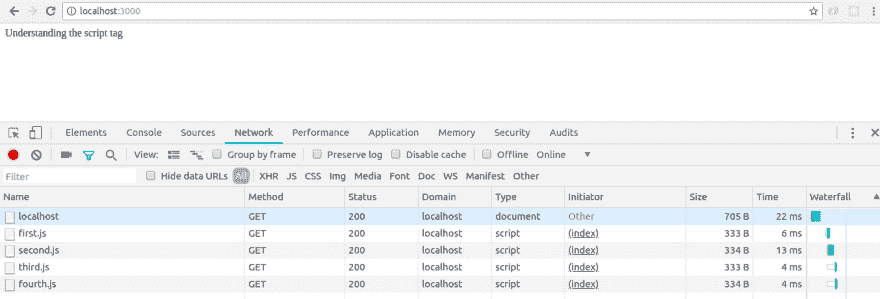
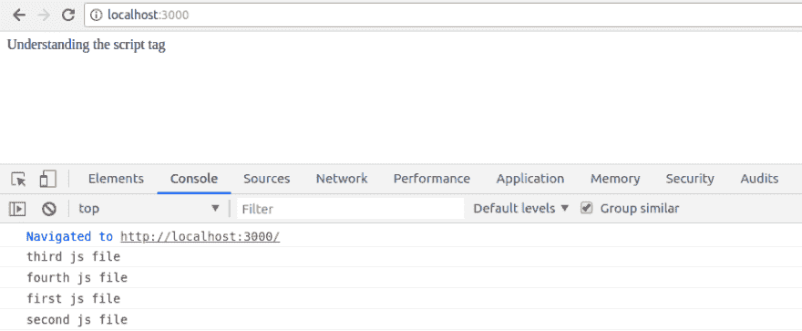
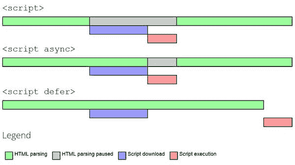
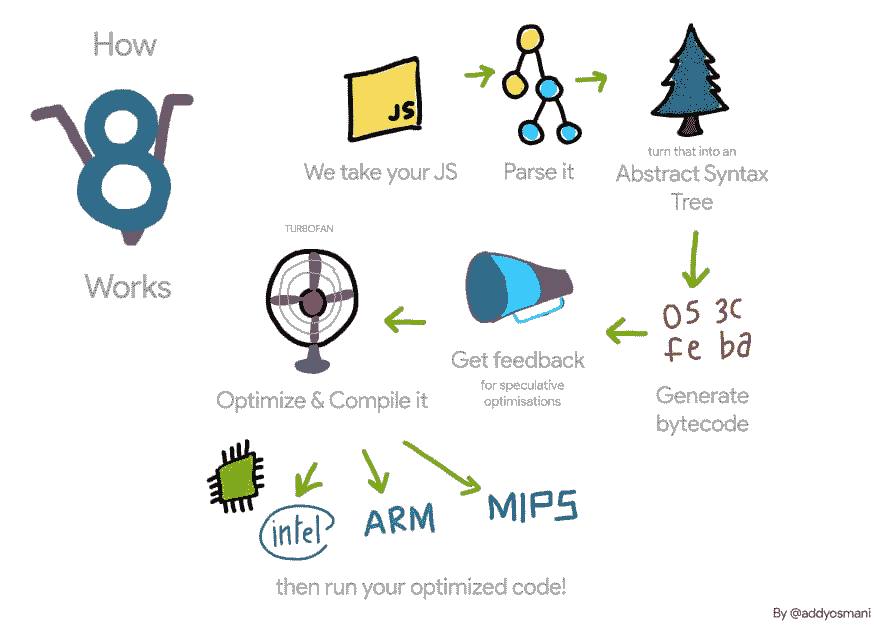
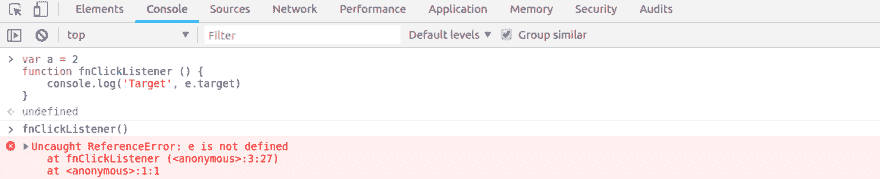
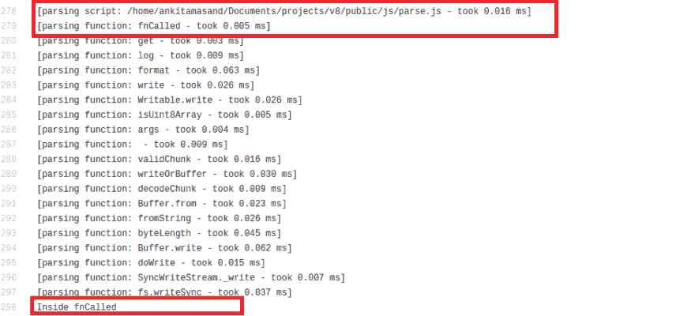

# JavaScript 之旅:从下载脚本到执行——第一部分

> 原文：<https://dev.to/progresstelerik/the-journey-of-javascript-from-downloading-scripts-to-execution---part-i-3a4>

这篇文章将帮助你理解 JavaScript 的内部——甚至是奇怪的部分。一旦你知道底层引擎是如何解释的，你用 JavaScript 写的每一行代码都会变得完全有意义。您将学习基于用例下载脚本的多种方式，以及解析器在解析代码时如何生成抽象语法树及其试探法。让我们深入探究 JavaScript 引擎的内部——从下载脚本开始。

JavaScript 是当今最流行的语言之一。人们将 JavaScript 仅仅用于处理 DOM 事件监听器和一些要求不高的任务的日子已经一去不复返了。今天，您可以使用 JavaScript 从头开始构建整个应用程序。JavaScript 已经占领了风、土地和海洋。随着 Node.js 侵入服务器端技术的领域，以及 React、Angular 和 Vue 等丰富而强大的客户端库和框架的出现，JavaScript 已经征服了 web。应用程序通过网络传输大量的 JavaScript。现在，几乎所有复杂的应用程序任务都是使用 JavaScript 实现的。

虽然这一切都很棒，但令人沮丧的是，大多数应用程序甚至缺乏最起码的用户体验。我们不断地给我们的应用程序添加功能，却没有考虑到它的性能影响。我们遵循适当的技术来交付优化的代码是很重要的。

在这一系列教程中，我们将首先了解传统技术有什么问题，然后我们将更深入地学习一些有助于我们编写优化代码的技术。我们还将了解底层 JavaScript 引擎如何解析、解释和编译我们的代码，以及什么最适合我们的引擎。虽然 JavaScript 的语法很容易掌握，但是理解它的内部结构是一项更艰巨的任务。我们将从最基本的开始，并最终接管野兽。我们走吧。

## 理解脚本标签

让我们考虑一个简单的 HTML 文件:

```
<!DOCTYPE html>
<html>
    <head>
        <script src='./js/first.js'></script>
        <script src='./js/second.js'></script>
        <script src='./js/third.js'></script>
        <script src='./js/fourth.js'></script>
    </head>
    <body>
        <div>Understanding the script tag</div>
    </body>
</html> 
```

first.js 包括以下代码:

```
console.log('first.js file') 
```

second.js 包括以下代码:

```
console.log('second.js file') 
```

我已经建立了一个 express 服务器来演示本文中解释的概念。如果你想一路实验，请随意克隆我的 [GitHub 库](https://github.com/ankita1910/js-internals)。

让我们看看当我们在浏览器中打开这个 HTML 文件时会发生什么:

[](https://res.cloudinary.com/practicaldev/image/fetch/s--R44bW_Fn--/c_limit%2Cf_auto%2Cfl_progressive%2Cq_auto%2Cw_880/https://d585tldpucybw.cloudfront.net/sfimages/default-source/default-album/loading-scripts.png%3Fsfvrsn%3D9c36ac48_1)

浏览器开始解析 HTML 代码。当它在 head 部分遇到一个脚本标记时，HTML 解析就会暂停。一个 HTTP 请求被发送到服务器以获取脚本。浏览器会一直等到整个脚本下载完毕。然后，它解析、解释和执行下载的脚本(我们将在本文后面讨论整个过程的细节)。这种情况在四个脚本中都会发生。

完成后，浏览器继续解析 HTML 和创建 DOM 节点的工作。耐心地盯着屏幕等待加载的用户不知道他的大部分时间都花在了执行 JavaScript 代码上(甚至是启动时可能不需要的代码)。脚本标签本质上是阻塞的。它们阻止了 DOM 的呈现。你的高中老师可能告诉过你，“总是把脚本标签放在正文下面。”既然您知道脚本标签会阻止 DOM 的呈现，那么将它们放在 HTML 下面是有意义的。显示非交互内容(几毫秒，直到 JavaScript 代码准备好)比什么都不显示要好。

假设您有一个非常大的 DOM 节点链——成千上万个。根据我们目前了解到的情况，在这种情况下，用户会看到很多内容，但他将无法与哪怕是最微小的部分进行交互。我相信你一定访问过一些网站，这些网站几乎可以立即向你展示全部内容，但不允许你向下滚动，甚至不允许你点击任何元素。页面似乎几秒钟都没动。这难道不令人沮丧吗？下一个明显的问题是:我们应该什么时候加载脚本——在解析 HTML 之前开始还是在 HTML 之后结束？让我们进一步分析这个问题。

我们的最终目标很明确——在启动时立即加载资产。我们的第一种方法是首先解析脚本，然后 HTML 呈现良好的用户体验，但是当内容正在执行时，向用户显示空白屏幕会消耗用户大量的时间。这种方法的问题是，随着脚本数量的增加，情况会变得更糟，因为等待时间(加载时间)与脚本数量成正比。对于每一个脚本，我们都要到达服务器，等待它被下载。

我们能把所有的 JavaScript 代码都放在一个文件里吗？这将减少我们对服务器的访问次数。这意味着将数万行 JavaScript 代码放入一个文件中。我绝对不会这么做。这将意味着与我的职业道德妥协。

听说过 Gulp 吗，webpack？简单来说，他们只不过是模块打包者。模块捆扎机，嗯？您可以在任意数量的文件中编写 JavaScript 代码(任意数量的模块)。模块捆绑器将所有的 JavaScript 文件和静态资产捆绑在一个大块中，你可以简单地将这个大文件添加到你的 HTML 中。

当然，我们减少了对服务器的 HTTP 请求的数量。我们不是还在下载、解析和执行全部内容吗？我们能做点什么吗？有种东西叫做代码分割。使用 webpack，您可以将代码分成不同的包。将所有公共代码转储到一个包中(比如 Vendor.js，它包含了整个项目中使用的所有公共库)以及其他特定于模块的代码。

例如，假设你正在建立一个电子商务网站。商店、交易历史和支付有不同的模块。在商店特定页面加载你的支付特定代码是没有意义的。Bundlers 通过减少对服务器的 HTTP 请求解决了我们的问题。

现在，让我们考虑一个用例。我添加了谷歌分析，以深入了解用户如何与我的电子商务网站互动。启动时不需要谷歌分析脚本。我们可能希望先加载特定于应用的内容，然后再加载其他二级脚本。

## 异步下载脚本

当您在脚本标签中添加了 *async* 关键字时，浏览器会异步下载该脚本。当浏览器遇到带有 *async* 关键字的脚本标签时，它不会暂停对 DOM 的解析。脚本被下载到另一个线程中，而不会干扰主线程，并且，一旦它被下载，浏览器暂停 HTML 的解析并忙于解析这个脚本代码。一旦 JavaScript 代码解析完成，它将在另一个线程中执行，浏览器将继续解析 HTML。我们节省了下载脚本时浏览器的等待时间。

假设我们想要异步下载我们的两个脚本:

```
<!DOCTYPE html>
<html>
    <head>
        <script async src='./js/first.js'></script>
        <script async src='./js/second.js'></script>
        <script src='./js/third.js'></script>
        <script src='./js/fourth.js'></script>
    </head>
    <body>
        <div>Understanding the script tag</div>
    </body>
</html> 
```

## 推迟脚本的执行

当您在脚本标签中添加 *defer* 关键字时，浏览器不会执行该脚本，直到 HTML 解析完成。延期仅仅意味着文件的执行被推迟或延迟。该脚本在另一个线程中下载，并且仅在 HTML 解析完成后执行。

```
<!DOCTYPE html>
<html>
    <head>
        <script defer src='./js/first.js'></script>
        <script defer src='./js/second.js'></script>
        <script src='./js/third.js'></script>
        <script src='./js/fourth.js'></script>
    </head>
    <body>
        <div>Understanding the script tag</div>
    </body>
</html> 
```

[](https://res.cloudinary.com/practicaldev/image/fetch/s--29BqQs6x--/c_limit%2Cf_auto%2Cfl_progressive%2Cq_auto%2Cw_880/https://d585tldpucybw.cloudfront.net/sfimages/default-source/default-album/defer-scripts.png%3Fsfvrsn%3D8df6a065_1)

在上面的截图中我们可以看到，third.js 和 fourth.js 是在 first.js 和 second.js 之前执行的。

以下是添加脚本的三种技术的简要概述:

[](https://res.cloudinary.com/practicaldev/image/fetch/s--aQfm3kt5--/c_limit%2Cf_auto%2Cfl_progressive%2Cq_auto%2Cw_880/https://d585tldpucybw.cloudfront.net/sfimages/default-source/default-album/comparison.jpg%3Fsfvrsn%3D63483a10_1)

到目前为止，我们已经了解了脚本是如何下载的，以及下载脚本最有效的方式是什么。让我们来理解一个脚本下载后会发生什么。(我们正在考虑 Chrome 浏览器，尽管几乎所有流行的浏览器都遵循类似的步骤。)

Chrome 使用 V8 作为底层 JavaScript 引擎。它由以下组件组成。

[](https://res.cloudinary.com/practicaldev/image/fetch/s--Q9EM6Jow--/c_limit%2Cf_auto%2Cfl_progressive%2Cq_auto%2Cw_880/https://d585tldpucybw.cloudfront.net/sfimages/default-source/default-album/js-engine.png%3Fsfvrsn%3Ddc2f64eb_1)

1.  *解析器*——JavaScript 被输入解析器，解析器生成一个抽象语法树
2.  *解释器* -抽象语法树是 V8 点火解释器的输入，它生成字节码
3.  编译器-V8 引擎的涡轮风扇编译器接收字节码并生成机器码
4.  *优化编译器*——它将字节码和一些分析数据作为输入，生成优化的机器码

我们将深入了解每个组件的细节。

## 解析 JavaScript 代码

JavaScript 源代码首先被转换成令牌。记号代表一种语言的字母表。源代码中的每一个单元都由你正在使用的语言的语法来标识。

因此，类似于`var a = 1`的语句是有效的 JavaScript 语句。它可以分解为与语言语法匹配的标记(' var '，' a '，' = '，1 ')。然而，类似于`variable a = 2`的语句不是有效的 JavaScript 语句，因为它的语法没有指定任何与*变量*关键字相关的内容。现在，在这些标记的帮助下，解析器生成一个抽象语法树(AST)和范围。简单来说，AST 是一种用于表示源代码的数据结构。作用域也是数据结构，用于标识变量在其定义的块中的作用域。例如，局部变量在局部范围内是可访问的，而在全局范围内是不可访问的。这些约束在这些范围数据结构中定义。

考虑这个简单的 JavaScript 代码片段-

`var a = 2`

我引用 [AST Explorer](https://astexplorer.net/) 来检查为我的代码生成的 AST。上面代码的 AST 看起来像这样:

```
{
  "type": "Program",
  "start": 0,
  "end": 9,
  "body": [
    {
      "type": "VariableDeclaration",
      "start": 0,
      "end": 9,
      "declarations": [
        {
          "type": "VariableDeclarator",
          "start": 4,
          "end": 9,
          "id": {
            "type": "Identifier",
            "start": 4,
            "end": 5,
            "name": "a"
          },
          "init": {
            "type": "Literal",
            "start": 8,
            "end": 9,
            "value": 2,
            "raw": "2"
          }
        }
      ],
      "kind": "var"
    }
  ],
  "sourceType": "module"
} 
```

让我们试着理解一下上面的 AST。它是一个 JavaScript 对象，属性为*类型*、*开始*、*结束*、*主体*和*源类型*。 *start* 是第一个字符的索引， *end* 是你的代码长度，本例中为`var a = 2`。*正文*包含代码的定义。这是一个只有一个对象的数组，因为在我们的程序中只有一个类型为`VariableDeclaration`的语句。在`VariableDeclaration`内部，它指定了标识符`a`，其初始值为`2`。检查`id`和`init`物体。申报的种类是`var`。也可以是`let`或者`const`。

让我们再考虑一个例子来更好地理解 ASTs:

```
function foo () {
    let bar = 2
    return bar
} 
```

其 AST 如下-

```
{
  "type": "Program",
  "start": 0,
  "end": 50,
  "body": [
    {
      "type": "FunctionDeclaration",
      "start": 0,
      "end": 50,
      "id": {
        "type": "Identifier",
        "start": 9,
        "end": 12,
        "name": "foo"
      },
      "expression": false,
      "generator": false,
      "params": [],
      "body": {
        "type": "BlockStatement",
        "start": 16,
        "end": 50,
        "body": [
          {
            "type": "VariableDeclaration",
            "start": 22,
            "end": 33,
            "declarations": [
{
                "type": "VariableDeclarator",
                "start": 26,
                "end": 33,
                "id": {
                  "type": "Identifier",
                  "start": 26,
                  "end": 29,
                  "name": "bar"
                },
                "init": {
                  "type": "Literal",
                  "start": 32,
                  "end": 33,
                  "value": 2,
                  "raw": "2"
                }
}
            ],
            "kind": "let"
          },
          {
            "type": "ReturnStatement",
            "start": 38,
            "end": 48,
            "argument": {
"type": "Identifier",
"start": 45,
"end": 48,
"name": "bar"
            }
          }
        ]
      }
    }
  ],
  "sourceType": "module"
} 
```

同样，它有属性— *类型*、*开始*、*结束*、*主体*和*源类型*。*开始*为 0，表示第一个字符在位置 0，*结束*为 50，表示代码长度为 50。 *body* 是一个数组，有一个类型为`FunctionDeclaration`的对象。函数`foo`的名称在`id`对象中指定。这个函数不接受任何参数，因此 *params* 是一个空数组。`FunctionDeclaration`的主体是`BlockStatement`型。`BlockStatement`标识功能的范围。`BlockStatement`的主体有两个对象`VariableDeclaration`和`ReturnStatement`。`VariableDeclaration`与我们在前面的例子中看到的一样。`ReturnStatement`包含一个名为`bar`的参数，因为函数`foo`正在返回`bar`。

这就是了。这就是 ASTs 是如何产生的。当我第一次听说 ASTs 时，我认为它们是具有复杂节点的可怕大树。但是现在我们已经很好地理解了什么是 ast，难道你不认为它们只是一组精心设计的代表程序语义的节点吗？

解析器也负责作用域。

```
let globalVar = 2
function foo () {
    let globalVar = 3
    console.log('globalVar', globalVar)
} 
```

函数`foo`将打印 3 而不是 2，因为在其作用域内`globalVar`的值是 3。在解析 JavaScript 代码时，解析器也会生成相应的作用域。

当一个`globalVar`在函数`foo`中被引用时，我们首先在函数作用域中寻找`globalVar`。如果在函数作用域中没有找到该变量，我们将查找它的父变量，在本例中是*全局*对象。让我们再考虑一个例子:

```
let globalVar = 2
function foo () {
    let localVar = 3
    console.log('localVar', localVar)
    console.log('globalVar', globalVar)
}
console.log('localVar', localVar)
console.log('globalVar', globalVar) 
```

函数`foo`内的控制台语句将打印 3 和 2，而函数`foo`外的控制台语句将打印未定义的*和 3。这是因为`localVar`在功能`foo`之外是不可访问的。它是在函数`foo`的范围内定义的，因此在函数范围外查找`localVar`会导致*未定义*。*

## [V8 中的](#parsing-in-v8)解析

V8 使用两个解析器来解析 JavaScript 代码，称为解析器和预解析器。为了理解两个解析器的需要，让我们考虑下面的代码:

```
function foo () {
    console.log('I\'m inside function foo')
}

function bar () {
    console.log('I\'m inside function bar')
}

/* Calling function foo */
foo() 
```

当上述代码被解析时，解析器将生成一个 AST，表示函数 *foo* 和函数 *bar* 。然而，函数*栏*在程序中没有被调用。我们花时间解析和编译不使用的函数，至少在启动时是这样。bar 可能会在稍后的阶段被调用，可能是点击一个按钮。但是在启动期间显然不需要它。启动时不编译函数*栏*可以节省这个时间吗？是的，我们可以！

解析器是我们一直在做的东西。它解析你所有的代码，构建 ast，作用域，发现所有的语法错误。预解析器就像一个快速解析器。它只编译需要的东西，跳过没有被调用的函数。它构建作用域，但不构建 AST。它只查找有限的一组错误，速度大约是解析器的两倍。V8 采用启发式方法来确定运行时的解析技术。

让我们考虑一个例子来理解 V8 如何解析 JavaScript 代码:

```
(function foo () {
    console.log('I\'m an IIFE function')

    function bar () {
        console.log('I\'m an inner function inside IIFE')
    }

})() 
```

当解析器遇到左括号时，它知道这是一个生命，它将被立即调用，所以它使用完全解析器或急切解析器解析`foo`函数。在`foo`内部，当它遇到函数`bar`时，它懒洋洋地解析或预解析函数`bar`，因为根据它的试探法，它知道函数`bar`不会被立即调用。随着函数`foo`被完全解析，V8 构建了它的 AST 和作用域，但它没有为函数`bar`构建 AST。它只为函数`bar`构建作用域。

您在编写 JavaScript 代码时遇到过这种情况吗:

[](https://res.cloudinary.com/practicaldev/image/fetch/s--0jyzl0tS--/c_limit%2Cf_auto%2Cfl_progressive%2Cq_auto%2Cw_880/https://d585tldpucybw.cloudfront.net/sfimages/default-source/default-album/parser-error.png%3Fsfvrsn%3Df08c6652_1)

只有当您调用函数`fnClickListener`时，代码才会抛出错误。这是因为 V8 不会在第一次加载时解析这个函数。只有在您调用函数`fnClickListener`时，它才会解析它。

让我们再考虑几个例子，以便更好地理解 V8 遵循的启发法。

```
function toBeCalled() {}
toBeCalled() 
```

V8 引擎延迟解析函数`toBeCalled`。当它遇到对函数`toBeCalled`的调用时，它现在使用一个完整的解析器来完全解析它。懒散地解析函数`toBeCalled`所花费的时间实际上是浪费时间。当 V8 正在懒惰地解析函数`toBeCalled`时，它不知道立即语句会调用这个函数。为了避免这种情况，您可以告诉 V8 哪些函数需要立即解析(完全解析)。

```
(function toBeCalled () {})
toBeCalled() 
```

将一个函数放在括号中是对 V8 的一个指示，表明这个函数将被急切地解析。您还可以在函数声明前添加一个感叹号，告诉 V8 急切地解析该函数。

```
!function toBeCalled () {}
toBeCalled() 
```

## 解析内部函数

```
function outer () {
    function inner () {}
} 
```

在这种情况下，V8 延迟解析函数`outer`和`inner`。当我们调用`outer`时，`outer`函数被急切地/完全地解析，而`inner`函数再次被迟缓地解析。这意味着`inner`函数被延迟解析两次。当函数大量嵌套时，情况会变得更糟。

```
function outer () {
    function inner () {
        function insideInner () {}
    }
    return inner
} 
```

最初，所有三个函数`outer`、`inner`和`insideInner`都被延迟解析。

```
let innerFn = outer()
innerFn() 
```

当我们调用函数`outer`时，它被完全解析，而函数`inner`和`insideInner`被延迟解析。现在，当我们调用`inner`时，`inner`被完全解析，`insideInner`被延迟解析。这使得`insideInner`被解析三次。不需要的时候不要使用嵌套函数。适当使用嵌套函数！

## 解析闭包

```
(function outer () {
    let a = 2
    let b = 3
    function inner () {
        return a
    }
    return inner
}) 
```

在上面的代码片段中，由于函数`outer`被括在括号中，所以它被急切地解析。函数`inner`被延迟解析。`inner`返回变量 a，该变量在其`outer`函数范围内。这是一个合理的结案理由。

```
let innerFn = outer()
innerFn() 
```

 `innerFn` very well 返回值 2，因为它可以访问其父作用域的变量 a。在解析函数`inner`时，当 V8 遇到变量 a 时，它会在`inner`函数的上下文中查找变量 a。由于 a 不在`inner`的范围内，它在`outer`的范围内检查它。V8 理解变量 a 将被保存在函数上下文中，并且即使在`outer`函数已经完成其执行之后也将被保留。因此，变量 a 被存储在`outer`的函数上下文中，并一直保存到它的依赖函数`inner`完成执行。请注意，在这种情况下，变量 b 没有被保留，因为它没有在任何内部函数中使用。

当我们调用函数`innerFn`时，在调用栈中找不到 a 的值，然后我们在函数上下文中查找它的值。与在调用堆栈中查找相比，在函数上下文中查找的成本很高。

让我们检查 V8 生成的解析代码。

```
function fnCalled () {
    console.log('Inside fnCalled')
}

function fnNotCalled () {
    console.log('Inside fnNotCalled')
}

fnCalled() 
```

按照我们的理解，这两个函数都将被延迟解析，当我们对`fnCalled`进行函数调用时，它将被完全解析并在 fnCalled 中打印出*。让我们来看看实际情况。以`node --trace_parse parse.js`的身份运行包含上述代码的文件。如果你已经克隆了我的 [GitHub 库](https://github.com/ankita1910/js-internals)，你会在 public/js 文件夹下找到这个文件。`parse.js`是文件名，`--trace_parse`是 nodejs 运行时打印解析输出的指示器。这个命令将生成解析日志的转储。我将把这个命令的输出保存在一个文件 [parsedOutput.txt](https://github.com/ankita1910/js-internals/blob/master/parsedOutput.txt) 中。目前，所有有意义的是下面的转储截图。*

[](https://res.cloudinary.com/practicaldev/image/fetch/s--jsokMOn4--/c_limit%2Cf_auto%2Cfl_progressive%2Cq_auto%2Cw_880/https://d585tldpucybw.cloudfront.net/sfimages/default-source/default-album/parsed-output.png%3Fsfvrsn%3D4c64e1d6_1)

函数`fnCalled`被解析，但函数`fnNotCalled`未被解析。尝试在[垃圾场](https://github.com/ankita1910/js-internals/blob/master/parsedOutput.txt)中搜索`fnNotCalled`。

## 脚本流

现在我们知道了 V8 中解析的工作原理，让我们理解一个与脚本流相关的概念。脚本流从 Chrome 版本 41 开始生效。

根据我们目前所了解的，我们知道它是解析 JavaScript 代码的主线程(即使使用 async 和 defer 关键字)。有了脚本流，现在解析可以在另一个线程中进行。当主线程仍在下载脚本时，解析器线程可以开始解析脚本。这意味着解析将与下载一致地完成。这种技术对于大型脚本和慢速网络连接非常有用。查看下图，了解浏览器在有脚本流和没有脚本流的情况下是如何运行的。

[](https://res.cloudinary.com/practicaldev/image/fetch/s--6Toxc7Tn--/c_limit%2Cf_auto%2Cfl_progressive%2Cq_auto%2Cw_880/https://d585tldpucybw.cloudfront.net/sfimages/default-source/default-album/streaming.png%3Fsfvrsn%3D709711b0_1)

在本教程中，我们学习了基于用例下载脚本的多种方式。我们学习了解析器在解析代码时如何生成抽象语法树及其试探法。在本文的后面，我们学习了脚本流。在下一篇文章中，我们将了解 V8 编译器如何编译解析代码。

## 关于使用 jQuery 构建应用程序的更多信息:

想了解更多关于使用 jQuery 创建优秀用户界面的知识吗？查看 jQuery 的[剑道 UI——我们完整的 UI 组件库，允许您快速构建高质量、响应迅速的应用程序。它包括你需要的所有组件，从网格和图表到时间表和刻度盘。](https://www.telerik.com/kendo-jquery-ui)