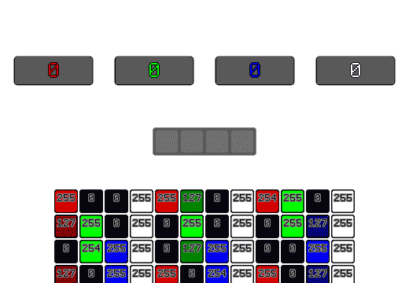
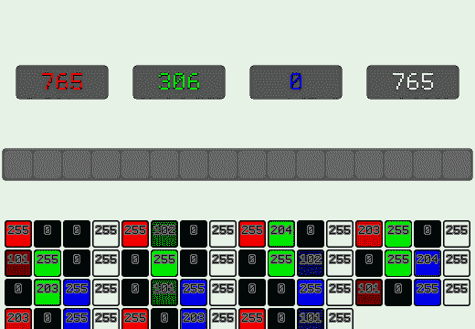

# 图像的平均颜色，矢量化

> 原文：<https://dev.to/wunk/average-color-of-an-image-vectorized-4802>

这是一小段代码，通过利用`psadbw` ( `_mm_sad_epu8`)指令将每个通道的总和累加到一个(非常安全的溢出)64 位累加器中，找到 RGBA8 像素(每像素 32 位，每通道 8 位)图像的平均颜色。

受[Wojciech mua](https://twitter.com/pshufb)撰写的[“数组中所有字节的模拟和”](http://0x80.pl/notesen/2018-10-24-sse-sumbytes.html)的启发。

获取图像中每个颜色通道的统计平均值的常用方法非常简单:

1.  载入一个像素
2.  拆开单个颜色通道的包装
3.  将通道值相加到累加器中
4.  当你将它们相加后，将这些总和除以总像素数
5.  将这些平均值交织成新的颜色值

大概是这样的:

[](https://res.cloudinary.com/practicaldev/image/fetch/s--EGO1N4Zc--/c_limit%2Cf_auto%2Cfl_progressive%2Cq_66%2Cw_880/https://thepracticaldev.s3.amazonaws.com/i/l8hyfkk4j3gymb4l23t6.gif)T3】

```
std::uint32_t AverageColorRGBA8(
    std::uint32_t Pixels[],
    std::size_t Count
)
{
    std::uint64_t RedSum, GreenSum, BlueSum, AlphaSum;
    RedSum = GreenSum = BlueSum = AlphaSum = 0;
    for( std::size_t i = 0; i < Count; ++i )
    {
        const std::uint32_t& CurColor = Pixels[i];
        AlphaSum += static_cast<std::uint8_t>( CurColor >> 24 );
        BlueSum  += static_cast<std::uint8_t>( CurColor >> 16 );
        GreenSum += static_cast<std::uint8_t>( CurColor >>  8 );
        RedSum   += static_cast<std::uint8_t>( CurColor >>  0 );
    }
    RedSum   /= Count;
    GreenSum /= Count;
    BlueSum  /= Count;
    AlphaSum /= Count;

    return
        (static_cast<std::uint32_t>( (std::uint8_t)AlphaSum ) << 24 ) |
        (static_cast<std::uint32_t>( (std::uint8_t) BlueSum ) << 16 ) |
        (static_cast<std::uint32_t>( (std::uint8_t)GreenSum ) <<  8 ) |
        (static_cast<std::uint32_t>( (std::uint8_t)  RedSum ) <<  0 );
} 
```

这是一种非常连续的方式。拿起一个像素，解包，加到一个和上。

这些解包和求和的每一个都是相互独立的，可以通过一些 SIMD 技巧并行化，以 4，8，甚至 **16** 像素的块并行地一次完成这些解包和求和。

在任何 [x86 SIMD 变体](https://en.wikipedia.org/wiki/Streaming_SIMD_Extensions#Later_versions)中，都没有用于向量寄存器内的 8 位元素的水平和的专用指令。
最接近的重言式是一条指令，它获得 64 位通道内 **8** 位元素的**A**b 绝对 **D** 的 **S** um，然后将这些 8 位差水平加到 64 位通道的低 16 位中。这基本上是计算八个 8 位元素的两个向量之间的[曼哈顿距离](https://en.wikipedia.org/wiki/Taxicab_geometry)。

```
AD(A,B) = ABS(A - B) # Absolute difference

X = ( 1, 2, 3, 4, 5, 6, 7, 8) # 8 byte vectors
Y = ( 8, 9,10,11,12,13,14,15)

# Sum of absolute differences
SAD(X,Y) =
    # Absolute difference of each of the pairs of 8-bit elements
    AD(X[0],Y[0]) + AD(X[1],Y[1]) + AD(X[2],Y[2]) + AD(X[3],Y[3]) +
    AD(X[4],Y[4]) + AD(X[5],Y[5]) + AD(X[6],Y[6]) + AD(X[7],Y[7])
    =
    ABS(  1 -  8 ) + ABS(  2 -  9 ) + ABS(  3 - 10 ) + ABS(  4 - 11 ) +
    ABS(  5 - 12 ) + ABS(  6 - 13 ) + ABS(  7 - 14 ) + ABS(  8 - 15 )
    =
    ABS( -7 ) + ABS( -7 ) + ABS( -7 ) + ABS( -7 ) +
    ABS( -7 ) + ABS( -7 ) + ABS( -7 ) + ABS( -7 )
    # Horizontally sum all these differences into a 16-bit value
    = 7 + 7 + 7 + 7 + 7 + 7 + 7 + 7
    = 56 
```

起初，这可能看起来像是一个非常小众的指令。你可能想知道为什么这样一个特定的操作系列是作为正式的 x86 指令实现的，但自从最初的 SSE 时代以来，它已经被大量使用，以帮助视频编码中基于块的[运动估计](https://en.wikipedia.org/wiki/Sum_of_absolute_differences)。
这里的技巧是认识到一个*无符号*数和*零*数之间的绝对差值，也是无符号数。无符号值的向量和 vector-0 之间的绝对差的*和*是提取 SAD 的水平相加步长的一种方式，用于这种特定用途。

```
(A is unsigned)
AD(A,B) = ABS(A - 0) = A

X = ( 1, 2, 3, 4, 5, 6, 7, 8) # 8 byte vectors
Y = ( 0, 0, 0, 0, 0, 0, 0, 0)

SAD(X,Y) =
    AD(X[0],0) + AD(X[1],0) + AD(X[2],0) + AD(X[3],0) +
    AD(X[4],0) + AD(X[5],0) + AD(X[6],0) + AD(X[7],0)
    =
    X[0] + X[1] + X[2] + X[3] + X[4] + X[5] + X[6] + X[7]
    =
    1 + 2 + 3 + 4 + 5 + 6 + 7
    = 28 
```

这种对`psadbw`的利用将允许 8 个连续字节的向量被水平求和到 64 位通道的低 16 位，然后该 16 位值可以被直接添加到更大的 64 位累加器。有了这个，一大块 RGBA 颜色值可以被加载到一个向量中，解包使得它们所有的 R、G、B、A 字节被分组到 64 位通道中，`psadbw`这些 64 位通道得到 16 位和，然后将这些和累加到一个 64 位累加器中以稍后得到它们的平均值。

通常，取大量值的平均值会导致溢出。有了像`psadbw`这样在 64 位通道上操作的指令，它有助于使用非常抗溢出的 64 位累加器。
一个单独的通道将需要`2^64 / 2^8 == 72057594037927936`个像素(大约 690 亿像素)的值`0xFF`，以使该颜色通道溢出其 64 位累加器。
我得说相当抗拒。

SSE 向量寄存器为 128 位，每个向量寄存器将能够保存两个 64 位累加器，因此一个 SSE 寄存器可用于累加`|Green|Red|`值的和，另一个向量寄存器用于累加`|Alpha|Blue|`值的和。

主循环如下所示:

1.  将 4 个 32 位像素加载到 128 位寄存器中
    *   `|ABGR|ABGR|ABGR|ABGR|`
2.  打乱向量中的 8 位通道，使寄存器的高 64 位有一个通道，低 64 位有另一个通道。
    *   有一点“浪费”,因为特定通道只有 4 个字节，通道内有 8 个字节。使用`_mm_shuffle_epi8`时，通过传递高位设置的混洗索引，可以将这些值设置为零(诸如`-1`的值将使`pshufb`写`0`)。这样，这些字节不会影响总和。
    *   `|0G0G0G0G|0R0R0R0R|`或`|0A0A0A0A|0B0B0B0B|`
    *   `|0000GGGG|0000RRRR|`或`|0000AAAA|0000BBBB|`也可以
    *   只要未使用的元素不影响水平和并且为 0，任何排列都特别有效
3.  `_mm_sad_epu`向量在每个 64 位通道内获得两个 16 位和，将其添加到 64 位累加器中
    *   `|0000ΣG16|0000ΣR16|`或`|0000ΣA16|0000ΣB16|` 16 位和，在 128 位寄存器的上半部分和下半部分 64 位内

一次处理四个像素的`psadbw`加速像素求和循环如下所示:

[](https://res.cloudinary.com/practicaldev/image/fetch/s--1gUH5H_w--/c_limit%2Cf_auto%2Cfl_progressive%2Cq_66%2Cw_880/https://thepracticaldev.s3.amazonaws.com/i/0fwkl4qvjd7mmztew66v.gif)T3】

```
// | 64-bit Red Sum | 64-bit Green Sum |
__m128i RedGreenSum64  = _mm_setzero_si128();
// | 64-bit Blue Sum | 64-bit Alpha Sum |
__m128i BlueAlphaSum64 = _mm_setzero_si128();

// 4 pixels at a time! (SSE)
for( std::size_t j = i/4; j < Count/4; j++, i += 4 )
{
    const __m128i QuadPixel = _mm_stream_load_si128((__m128i*)&Pixels[i]);
    RedGreenSum64 = _mm_add_epi64( // Add it to the 64-bit accumulators
        RedGreenSum64,
        _mm_sad_epu8( // compute | 0+G+0+G+0+G+0+G | 0+R+0+R+0+R+0+R |
            _mm_shuffle_epi8( // Shuffle the bytes to | 0G0G0G0G | 0R0R0R0R |
                QuadPixel,
                _mm_set_epi8(
                    // Green
                    -1,13,-1, 5,
                    -1, 9,-1, 1,
                    // Red
                    -1,12,-1, 4,
                    -1, 8,-1, 0
                )
            ),
            // SAD against 0, which just returns the original unsigned value
            _mm_setzero_si128()
        )
    );
    BlueAlphaSum64 = _mm_add_epi64( // Add it to the 64-bit accumulators
        BlueAlphaSum64,
        _mm_sad_epu8( // compute | 0+A+0+A+0+A+0+A | 0+B+0+B+0+B+0+B |
            _mm_shuffle_epi8( // Shuffle the bytes to | 0A0A0A0A | 0B0B0B0B |
                QuadPixel,
                _mm_set_epi8(
                    // Alpha
                    -1,15,-1, 7,
                    -1,11,-1, 3,
                    // Blue
                    -1,14,-1, 6,
                    -1,10,-1, 2
                )
            ),
            // SAD against 0, which just returns the original unsigned value
            _mm_setzero_si128()
        )
    );
} 
```

在一次处理 4 个像素块后，它可以通过从向量寄存器中提取 64 位累加器来处理未对齐的像素(只剩下 3 个或更少的像素),并退回到通常的串行方法。
尽管这里也可以做一些细微的优化。`bextr`可以更快地提取连续位，而不需要移动蒙版来获得较高的颜色通道。x86 对于其通用寄存器的低两个字节有[寄存器混淆，尽管如此，对于低字节中的低颜色通道来说`bextr`可能会处理过度。](http://flint.cs.yale.edu/cs421/papers/x86-asm/x86-registers.png) 

```
// Extract the 64-bit accumulators from the vector registers of the previous loop
std::uint64_t RedSum64 = _mm_cvtsi128_si64(RedGreenSum64);
std::uint64_t GreenSum64   = _mm_extract_epi64(RedGreenSum64,1);
std::uint64_t BlueSum64 = _mm_cvtsi128_si64(BlueAlphaSum64);
std::uint64_t AlphaSum64  = _mm_extract_epi64(BlueAlphaSum64,1);

// New serial method
for( ; i < Count; ++i )
{
    const std::uint32_t CurColor = Pixels[i];
    AlphaSum64 += _bextr_u64( CurColor, 24, 8);
    BlueSum64  += _bextr_u64( CurColor, 16, 8);
    // I'm being oddly specific here to make it obvious for the
    // compiler to do some ah/bh/ch/dh register trickery
    //                                              V
    GreenSum64 += static_cast<std::uint8_t>( CurColor >>  8 );
    RedSum64   += static_cast<std::uint8_t>( CurColor       );
}
// Average
RedSum64   /= Count;
GreenSum64 /= Count;
BlueSum64  /= Count;
AlphaSum64 /= Count;

// Interleave
return
    (static_cast<std::uint32_t>( (std::uint8_t)AlphaSum64 ) << 24 ) |
    (static_cast<std::uint32_t>( (std::uint8_t) BlueSum64 ) << 16 ) |
    (static_cast<std::uint32_t>( (std::uint8_t)GreenSum64 ) <<  8 ) |
    (static_cast<std::uint32_t>( (std::uint8_t)  RedSum64 ) <<  0 ); 
```

到目前为止，在一台 [i7-7500U](https://en.wikichip.org/wiki/intel/core_i7/i7-7500u) 上使用 3840x2160 图像的这种实现方式显示，与串行方法相比，性能大约提高了 **x2.6** 。现在处理一幅图像只需要不到一半的时间。

```
Serial: #10121AFF |      7100551ns
Fast  : #10121AFF |      2701641ns
Speedup: 2.628236 
```

利用 [AVX2](https://en.wikipedia.org/wiki/Advanced_Vector_Extensions) ，该算法可以被更新为一次处理 **8** 个像素，然后一次处理 **4** 个像素，之后诉诸串行算法处理未对齐数据(将只有 7 个或更少的未对齐像素，想想[贪婪算法](https://en.wikipedia.org/wiki/Greedy_algorithm))。对于更大的 256 位向量，所有四个 64 位累加器都可以驻留在一个 AVX2 寄存器中。
不过，AVX2 的大规模 256 位向量寄存器几乎只是以前两个常规 128 位 SSE 寄存器的别名，其额外优势是能够用一条指令紧凑地处理两个 128 位寄存器。
这也意味着跨通道算法(在 256 位寄存器的整个宽度上混洗元素，而不是停留在 128 位的上半部分和下半部分)可能很棘手，因为跨越 128 位边界需要一些特别的注意。对此的解决方案是首先在较高和较低的 128 位通道内进行混洗，然后使用更大的跨通道混洗来进一步将通道解包为连续值，然后在四个 64 位通道的每一个上计算`_mm256_sad_epu8`。

```
// Vector of four 64-bit accumulators for Red,Green,Blue, and Alpha
__m256i RGBASum64  = _mm256_setzero_si256();
// 8 pixels at a time! (AVX/AVX2)
for( std::size_t j = i/8; j < Count/8; j++, i += 8 )
{
    const __m256i OctaPixel = _mm256_loadu_si256((__m256i*)&Pixels[i]);
    // Shuffle within 128-bit lanes
    // | ABGRABGRABGRABGR | ABGRABGRABGRABGR |
    // | AAAABBBBGGGGRRRR | AAAABBBBGGGGRRRR |
    // Setting up for 64-bit lane sad_epu8
    __m256i Deinterleave = _mm256_shuffle_epi8(
        OctaPixel,
        _mm256_broadcastsi128_si256(
            _mm_set_epi8(
                // Alpha
                15,11, 7, 3,
                // Blue
                14,10, 6, 2,
                // Green
                13, 9, 5, 1,
                // Red
                12, 8, 4, 0
            )
        )
    );
    // Cross-lane shuffle
    // | AAAABBBBGGGGRRRR | AAAABBBBGGGGRRRR |
    // | AAAAAAAA | BBBBBBBB | GGGGGGGG | RRRRRRRR |
    Deinterleave = _mm256_permutevar8x32_epi32(
        Deinterleave,
        _mm256_set_epi32(
            // Alpha
            7, 3,
            // Blue
            6, 2,
            // Green
            5, 1,
            // Red
            4, 0
        )
    );
    // | ASum64 | BSum64 | GSum64 | RSum64 |
    RGBASum64 = _mm256_add_epi64(
        RGBASum64,
        _mm256_sad_epu8(
            Deinterleave,
            _mm256_setzero_si256()
        )
    );
}

// Pass the accumulators onto the next SSE loop from above
__m128i BlueAlphaSum64  = _mm256_extractf128_si256(RGBASum64,1);
__m128i RedGreenSum64 = _mm256_castsi256_si128(RGBASum64);
for( std::size_t j = i/4; j < Count/4; j++, i += 4 )
{
... 
```

到目前为止，在 [i7-7500U](https://en.wikichip.org/wiki/intel/core_i7/i7-7500u) 上使用与之前相同的 3840x2160 图像的这种实现(AVX2、SSE 和串行)显示出与串行方法相比大约有 **x4.1** 的性能提升。现在计算串行版本的颜色平均值只需要不到四分之一**的时间！** 

```
Serial: #10121AFF |      7436508ns
Fast  : #10121AFF |      1802768ns
Speedup: 4.125050 
```

### RGB8？RG8？R8？

这篇小文章中没有探讨其他像素格式，例如没有 alpha 的三通道`RGB`或只有两通道`RG`图像，甚至只有一个通道的单色“R8”图像。
其他格式的工作原理与`RGBA`格式相同，只要你考虑到所需的适当洗牌。

根据你在像素处理中所处的位置，考虑如何从 3 字节`RGB`像素流中取出 16 字节块的不同情况
如果你的字节被组织`|RGB|RGB|RGB|RGB|...`并且向量寄存器具有 16 字节的宽度，那么你将总是一次取出`16/3 = 15.3333...` `RGB`像素。而每一个 **3** rd chunk ( `0.333.. * 3 = 1.0`)都是周期重复的时候。因此，根据你的索引`i`在数组中的位置，只需要 3 个洗牌。一些 ASCII 艺术可能有助于形象化它

```
Note how different the bytes align when taking regular 16-byte chunks out of a
stream of 3-byte pixels.
Different shuffle patterns must be used to account for each case:

 >RGBRGBRGBRGBRGBRG<
0:|---SIMD Reg.---|
  RGBRGBRGBRGBRGBRGBRGBRGBRGBRGBRGBRGBRGBRGBRGBRGBRGBRGBRGBRGBRGBRGBRGBRGBRGB...
                  >BRGBRGBRGBRGBRGBR<
1:                 |---SIMD Reg.---|
  RGBRGBRGBRGBRGBRGBRGBRGBRGBRGBRGBRGBRGBRGBRGBRGBRGBRGBRGBRGBRGBRGBRGBRGBRGB...
                                   >GBRGBRGBRGBRGBRGB<
2:                                  |---SIMD Reg.---|
  RGBRGBRGBRGBRGBRGBRGBRGBRGBRGBRGBRGBRGBRGBRGBRGBRGBRGBRGBRGBRGBRGBRGBRGBRGB...
                   This is the same as iteration 0  >RGBRGBRGBRGBRGBRG<
3:                                                   |---SIMD Reg.---|
  RGBRGBRGBRGBRGBRGBRGBRGBRGBRGBRGBRGBRGBRGBRGBRGBRGBRGBRGBRGBRGBRGBRGBRGBRGB... 
```

您还可以处理大得多的 **48** 字节(`lcd(16,3)`)对齐的块，以便在更高的粒度上进行更高效的迭代:

```
Now you don't have to worry about byte-level alignment and can do all the shuffles at once
 >RGBRGBRGBRGBRGBRGBRGBRGBRGBRGBRGBRGBRGBRGBRGBRGBRGB<
0:|---SIMD Reg.---||---SIMD Reg.---||---SIMD Reg.---|
  RGBRGBRGBRGBRGBRGBRGBRGBRGBRGBRGBRGBRGBRGBRGBRGBRGBRGBRGBRGBRGBRGBRGBRGBRGB... 
```

一旦你得到了你的总和，那么它只是一个除法和交错将这些统计平均值变成一个新的颜色值。

对于 RG8，同样的原理适用，但更为简单，因为 2 字节像素自然地与 2 的幂寄存器宽度对齐。

对于 R8 来说，求和步骤简化为字节的总和，这正是 Wojciech mua 所涵盖的主题。得到总和后，除以像素数，得到统计平均值。

##  [温科罗](https://github.com/Wunkolo) / [ qAverageColor](https://github.com/Wunkolo/qAverageColor)

### 获取 RGBA8 图像平均颜色的 SIMD 加速方法

<article class="markdown-body entry-content container-lg" itemprop="text">

# qAverageColor [](https://raw.githubusercontent.com/Wunkolo/qAverageColor/master/LICENSE)

| 连续的 | SSE4.2 | AVX2 | AVX512 |
| [](https://raw.githubusercontent.com/Wunkolo/qAverageColor/master/media/Pat-Serial.gif) | [](https://raw.githubusercontent.com/Wunkolo/qAverageColor/master/media/Pat-SSE.gif) | [](https://raw.githubusercontent.com/Wunkolo/qAverageColor/master/media/Pat-AVX2.gif) | [](https://raw.githubusercontent.com/Wunkolo/qAverageColor/master/media/Pat-AVX512.gif) |
| 处理器 | 加速 |
| [i7-7500u](https://en.wikichip.org/wiki/intel/core_i7/i7-7500u) | - | x2.8451 | x4.4087 | *不适用* |
| [i3-6100](https://en.wikichip.org/wiki/intel/core_i3/i3-6100) | - | x2.7258 | x4.2358 | *不适用* |
| [i5-8600k](https://en.wikichip.org/wiki/intel/core_i5/i5-8600k) | - | x2.4015 | x2.6498 | *不适用* |
| [i9-7900x](https://en.wikichip.org/wiki/intel/core_i9/i9-7900x) | - | x2.0651 | x2.6140 | x4.2704 |
| [i7-1065G7](https://en.wikichip.org/wiki/intel/core_i7/i7-1065g7) | - | x3.9124 | x4.6244 | x5.4683 |

<sup>针对 1000 万像素合成图像进行测试，GCC 版本 8.2.1</sup>

这是一小段代码，通过利用`psadbw` ( `_mm_sad_epu8`)指令将每个通道的总和累加到一个(非常安全的溢出)64 位累加器中，找到 RGBA8 像素(每像素 32 位，每通道 8 位)图像的平均颜色。

受[Wojciech mua](https://twitter.com/pshufb)撰写的[“数组中所有字节的模拟和”](http://0x80.pl/notesen/2018-10-24-sse-sumbytes.html)的启发。

获取图像中每个颜色通道的统计平均值的常用方法非常简单:

1.  载入一个像素
2.  拆开单个颜色通道的包装
3.  将通道值相加到累加器中
4.  当你把它们加起来后，用这些总数除以…

</article>

[View on GitHub](https://github.com/Wunkolo/qAverageColor)