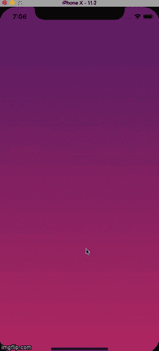

# 对本地动画输入做出反应

> 原文：<https://dev.to/saadbashar/react-native-animated-inputs-2o6e>

这是一个非常直接的探索，关于我如何在我的 react 原生形式中做动画输入。演示如下:

因此，我基本上有三个文本输入，我需要一个接一个地动画。我用 react 原生动画模块来做这种动画。

在动画模块中，有一种叫做**交错**的方法，它有助于用**连续延迟**一个接一个地制作动画组件。我只需要将我的数组输入传递给这个方法来实现这个动画。完整的代码如下所示: