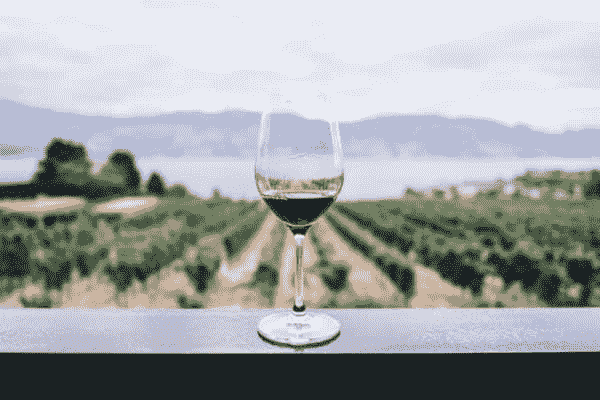
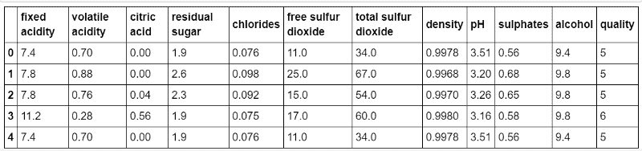
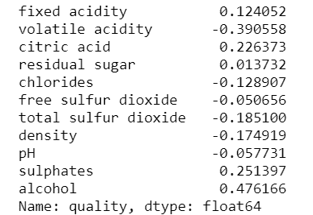
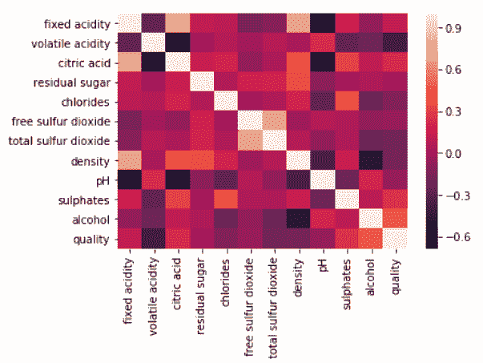
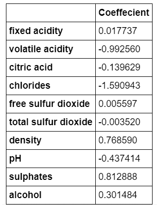

# 从零开始回归-葡萄酒质量预测

> 原文：<https://dev.to/apoorvadave/regression-from-scratch---wine-quality-prediction-3245>

在我们之前的帖子中，我们讨论了机器学习和回归类型的基础知识。在这篇文章中，我们将做我们的第一个机器学习项目。这将为我们如何在不同的数据集上实现回归提供一个思路。设置、理解和编码只需要一个小时。所以让我们开始吧！😃

[](https://res.cloudinary.com/practicaldev/image/fetch/s--MttaOcHF--/c_limit%2Cf_auto%2Cfl_progressive%2Cq_auto%2Cw_880/https://thepracticaldev.s3.amazonaws.com/i/gle5qxtt2exd3skg15d7.jpeg)

这里的任务是给定一组特征作为输入，在 0-10 的范围内预测红酒的质量。我已经用线性回归把它作为一个回归问题解决了。

使用的数据集是来自 UCI 机器学习知识库的葡萄酒质量数据集。您可以在此查看数据集

输入变量为固定酸度、挥发性酸度、柠檬酸、残糖、氯化物、游离二氧化硫、总二氧化硫、密度、pH、硫酸盐、酒精。并且输出变量(基于感官数据)是质量(得分在 0 到 10 之间)。下面是数据集前 5 行的屏幕截图。

[](https://res.cloudinary.com/practicaldev/image/fetch/s--D7-7UuZj--/c_limit%2Cf_auto%2Cfl_progressive%2Cq_auto%2Cw_880/https://thepracticaldev.s3.amazonaws.com/i/tja0ich0q4nmsctd6h7p.png) 

<figure>

<figcaption>前 5 行葡萄酒质量数据集</figcaption>

</figure>

## 依赖关系

代码是用 python 写的。除此之外，请使用 pip 安装以下库。

1.  熊猫:pip 安装熊猫
2.  matplotlib: pip 安装 matplotlib
3.  numpy: pip 安装 numpy
4.  scikit-learn: pip 安装 scikit-learn

就是这样！你已经完成一半了😄。接下来，按照下面的步骤，以建立一个线性回归模型在任何时候！

## 接近

创建一个新的 IPython 笔记本，插入下面的代码来导入必要的模块。如果您遇到任何错误，请使用 pip 安装必要的软件包。

```
import pandas as pd 
from sklearn.model_selection import train_test_split 
from sklearn.linear_model import LinearRegression 
from sklearn import metrics 
import matplotlib.pyplot as plt 
import numpy as np 
import seaborn as sns 
```

Enter fullscreen mode Exit fullscreen mode

使用 pandas 将数据读入数据帧。要检查数据集的前 5 行，请使用`df.head()`

```
df = pd.read_csv('winequality-red.csv')
df.head() 
```

Enter fullscreen mode Exit fullscreen mode

使用`corr()`
查找数据集各属性之间的相关性

```
# there are no categorical variables. each feature is a number. Regression problem. 
# Given the set of values for features, we have to predict the quality of wine. 
# finding correlation of each feature with our target variable - quality correlations = df.corr()['quality'].drop('quality')
print(correlations) 
```

Enter fullscreen mode Exit fullscreen mode

[](https://res.cloudinary.com/practicaldev/image/fetch/s--7iVxIXD4--/c_limit%2Cf_auto%2Cfl_progressive%2Cq_auto%2Cw_880/https://thepracticaldev.s3.amazonaws.com/i/j4g5z4hh6tx657w1w162.png) 

<figure>

<figcaption>各属性与目标变量的相关性—质量</figcaption>

</figure>

要绘制热图并获得详细的关联图，请插入以下代码。

```
sns.heatmap(df.corr())
plt.show() 
```

Enter fullscreen mode Exit fullscreen mode

[](https://res.cloudinary.com/practicaldev/image/fetch/s--xJw_b8dM--/c_limit%2Cf_auto%2Cfl_progressive%2Cq_auto%2Cw_880/https://thepracticaldev.s3.amazonaws.com/i/x2k2axmew1uj85j2q8hk.png) 

<figure>

<figcaption>热图</figcaption>

</figure>

定义一个函数`get_features()`，该函数仅输出相关性高于阈值的那些特征(作为输入参数传递给函数)。

```
def get_features(correlation_threshold):
    abs_corrs = correlations.abs()
    high_correlations = abs_corrs
    [abs_corrs > correlation_threshold].index.values.tolist()
    return high_correlations 
```

Enter fullscreen mode Exit fullscreen mode

创建两个向量，`x`包含输入特征，`y`包含质量变量。在`x`中，我们得到了除残糖以外的所有特征。如果你愿意，阈值可以增加。

```
# taking features with correlation more than 0.05 as input x and quality as target variable y features = get_features(0.05) 
print(features) 
x = df[features] 
y = df['quality'] 
```

Enter fullscreen mode Exit fullscreen mode

使用`train_test_split`创建训练和测试集。25%的数据用于测试，75%用于训练。您可以使用`x_train.shape`
检查数据集的大小

```
x_train,x_test,y_train,y_test=train_test_split(x,y,random_state=3) 
```

Enter fullscreen mode Exit fullscreen mode

一旦创建了训练集和测试集，就该构建线性回归模型了。您可以简单地使用内置函数来创建模型，然后根据训练数据进行拟合。一旦训练完毕，`coef_`给出每个特征的系数值。

```
# fitting linear regression to training data regressor = LinearRegression()
regressor.fit(x_train,y_train)
# this gives the coefficients of the 10 features selected above. 
print(regressor.coef_) 
```

Enter fullscreen mode Exit fullscreen mode

用这个模型预测葡萄酒的质量，用`predict()`。

```
train_pred = regressor.predict(x_train)
print(train_pred)
test_pred = regressor.predict(x_test) 
print(test_pred) 
```

Enter fullscreen mode Exit fullscreen mode

计算训练集和测试集的均方根误差。均方根误差(RMSE)是模型预测值(样本值和总体值)与实际观察值之间差异的常用度量。如果我们构建了一个好的模型，那么训练集和测试集的 RMSE 应该非常相似。如果测试集的 RMSE 比训练集的高得多，很可能我们严重地过度拟合了数据。

```
# calculating rmse train_rmse = mean_squared_error(train_pred, y_train) ** 0.5
print(train_rmse)
test_rmse = mean_squared_error(test_pred, y_test) ** 0.5
print(test_rmse)
# rounding off the predicted values for test set predicted_data = np.round_(test_pred)
print(predicted_data)
print('Mean Absolute Error:', metrics.mean_absolute_error(y_test, test_pred))
print('Mean Squared Error:', metrics.mean_squared_error(y_test, test_pred))
print('Root Mean Squared Error:', np.sqrt(metrics.mean_squared_error(y_test, test_pred)))
# displaying coefficients of each feature coeffecients = pd.DataFrame(regressor.coef_,features) coeffecients.columns = ['Coeffecient'] 
print(coeffecients) 
```

Enter fullscreen mode Exit fullscreen mode

[](https://res.cloudinary.com/practicaldev/image/fetch/s--xdaCEmzc--/c_limit%2Cf_auto%2Cfl_progressive%2Cq_auto%2Cw_880/https://thepracticaldev.s3.amazonaws.com/i/lcpcyoncut1780nu12b1.png) 

<figure>

<figcaption>各特征的系数</figcaption>

</figure>

***这些数字意味着，在所有其他特征不变的情况下，硫酸盐每增加 1 个单位，葡萄酒的质量就会增加 0.8，其他特征也是如此。
在其他特征不变的情况下，挥发性酸度每增加 1 个单位，葡萄酒质量就会下降 0.99，其他特征也是如此。***

因此，通过几行代码，我们能够构建一个线性回归模型来预测葡萄酒的质量，对于训练集和测试集，RMSE 得分分别为**0.65 和 0.63。这只是一个帮助你开始回归的想法。您可以尝试阈值、其他回归模型，也可以尝试特征工程😍。**

要获得完整的代码，请使用这个[链接](https://github.com/apoorva-dave/WineQualityPrediction)到我的库。数据集也被上传:)克隆存储库并运行笔记本来查看结果。

下一篇文章将是关于分类和一个类似的小项目。敬请关注更多内容！在那之前，祝你学习愉快😸