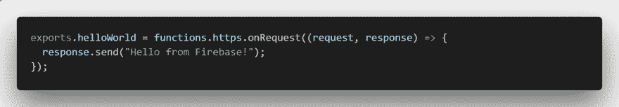
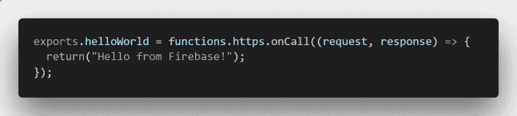
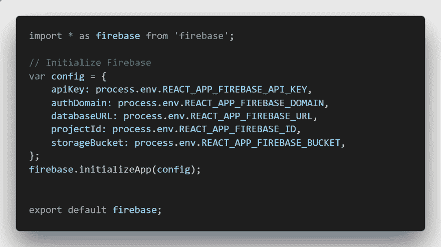
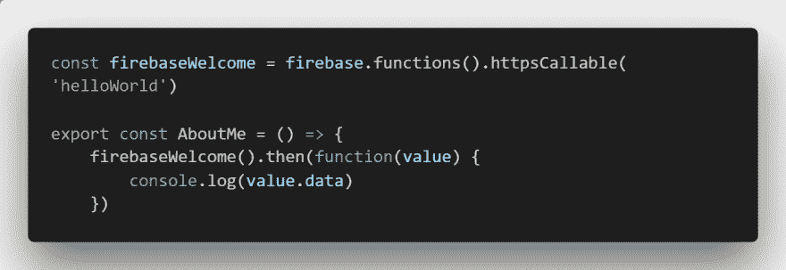
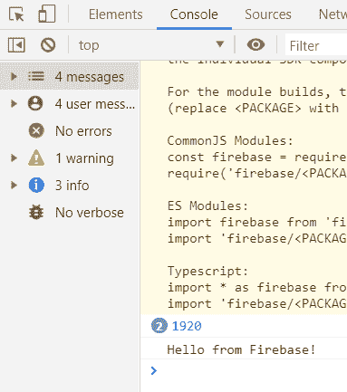
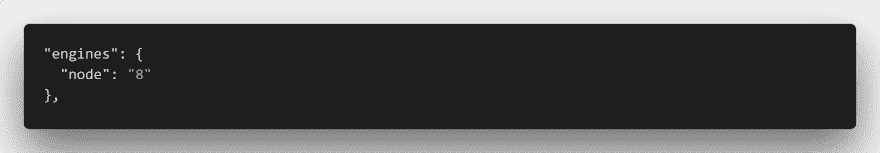
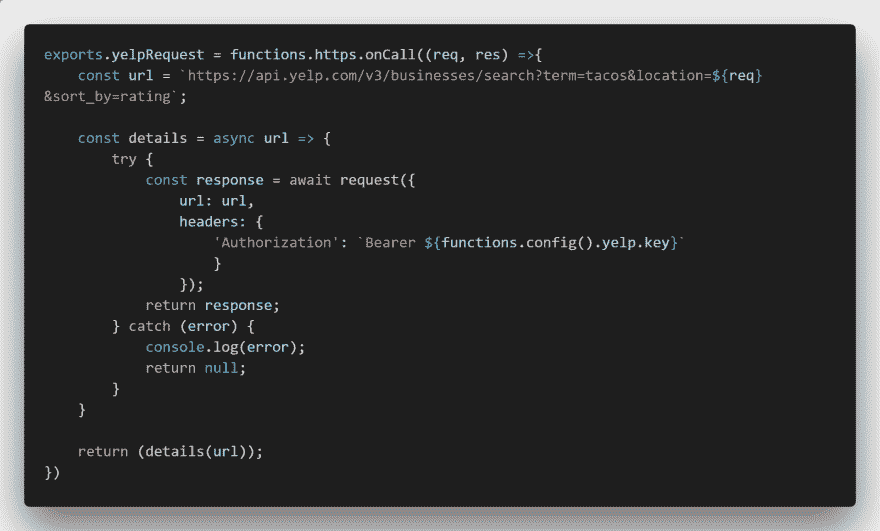
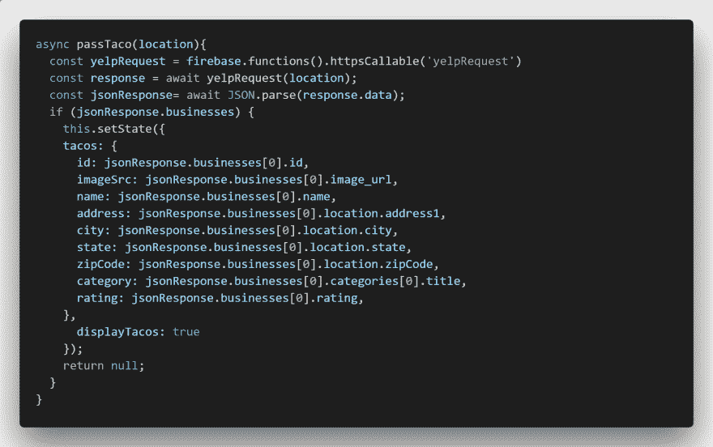

# Firebase 函数:React 用户需要停止在。env 文件！

> 原文：<https://dev.to/andersjr1984/firebase-functions-react-users-need-to-stop-storing-sensitive-api-keys-in-env-files-d35>

这是来自我的[数字作品集/博客](https://andersjr1984.github.io/portfolio)的教程。请停下来看一看，然后在评论中批评我。哈哈。

你们中的许多人正在阅读这篇文章，因为你是一个有着病态想法的优秀前端开发人员，但是不太知道如何在没有完整的后端环境的情况下保护一些必要的 API 调用。你上网，每个人都告诉你把你的 API 键放在一个。env 文件，然后废话废话废话，高枕无忧。好吧，如果你有敏感的 API 密匙并且你按照。env 建议，你正把自己置于高风险之中。

**以下是. env 文件在生产中不保护你的原因:**
背景是当 React 创建生产构建时，它将所有东西混杂成一个 chunk.js 文件。如果你有一个带有一些 API 键的 react 项目，帮我一个忙，去页面，然后使用开发工具检查它。转到**源**，然后转到**静态**文件夹，然后转到 **js** 文件夹。有一个奇怪的文件名，你可能不认识，它以 **chunk.js** 结尾。打开文件，将内容复制到文字处理软件中(我试着在 inspect 工具中搜索，但是速度太慢了)。去你神圣的。env 文件并复制您的“安全”API 密钥之一，然后跳回您的文字处理器。尝试查找您的 API 密钥。你说什么，你的钥匙在这个**公开**文件里？

好吧，你还有一些工作要做，但是不要担心，你可以使用 Google Firebase 作为后端服务器，保护你的后端免受 API 欺诈，就像这个[家伙](https://www.quora.com/My-AWS-account-was-hacked-and-I-have-a-50-000-bill-how-can-I-reduce-the-amount-I-need-to-pay)一样。我会列出我是如何做到的，如果我能做到，你也应该能做到。你确实需要加入火焰计划才能成功。如果你在一个月内进行了大量的外部 API 调用，你可能最终会付出代价。

1.  创建一个 Firebase 帐户，然后为这个小活动创建一个项目。我相信你可以用谷歌解决这个问题。
2.  安装 Firebase 工具(npm install -g firebase-tools)，登录(firebase login)并在项目文件夹中启动函数(firebase init 函数)。按照说明操作。
3.  现在，您的应用程序中有了一个漂亮的小文件夹来保存您的函数，还有一个 index.js 文件来保存您将使用的第一个函数。只需取消 helloWorld 函数的注释即可！但是，这是用什么奇怪的语言写的？

5.  我们将不得不在 React 中实现这一点。首先，如果你正在使用 React，并且你不能使用 response.send 返回你的响应，你必须使它成为一个 onCall 函数。。这需要回报:

7.  在 src 目录中创建一个 firebase.js 文件。保护您的 precious 中的配置信息。env 文件，所以它为窃取提供了一点困难。现在你会想，我刚刚告诉过你，你的 API 密匙需要是安全的。Firebase API 略有不同。如果你正在使用安全的 API 密匙，请听听这个人如何保护它们！

9.  在导出的组件中找一个不显眼的地方，创建一个指向 firebase 函数的变量。然后，您可以使用该变量调用您的函数，然后将该值记录到控制台。数据以对象的形式出现，所以您必须更深入一步，进入“数据”键。

11.  使用命令*firebase deploy-only functions*将您的函数推送到 fire base。
12.  结果出来了！

14.  Firebase 目前使用 Node.js 6，这在尝试编写 async/await 函数时是一个痛苦。这些通常比承诺更容易理解。对于我交谈过的许多初级开发人员来说，这很有用。幸运的是，您可以让 firebase 接受 Node.js 8 作为它的主服务器，打开您的 **Functions** 文件夹中的 package.json 文件，并添加下面一行:

16.  **在 function 文件夹的 index.js 中编写您的 API 函数:**我不打算重复我在编写对 Yelp 的 API 调用时所经历的所有尝试。我只是把代码给你，你可以把它重新应用到大多数使用头文件的 API 调用中。如果您是 React API 调用的高手，您会注意到授权是用引号括起来的。我花了很长时间才明白。你会看到我的 API 调用只返回玉米卷，那是因为我认为玉米卷是唯一重要的东西。您必须调整请求调用来添加额外变量。

18.  下面这条线是什么意思？*functions . config()yelp . key*从你的函数库的配置文件中调用你的 API 键。您可以通过在 functions 文件夹中使用命令提示符并键入[firebase functions:config:set someservice . KEY = " API KEY " someservice . ID = " CLIENT ID "](https://firebase.google.com/docs/functions/config-env)来保存它。
19.  拿出您的 console.log hat 并进行测试，直到您得到类似以下代码的东西。还有，async/await 函数是不是很漂亮？

我知道，你很兴奋，很想吃玉米卷。请随意评论或给我发电子邮件或给我一份工作。