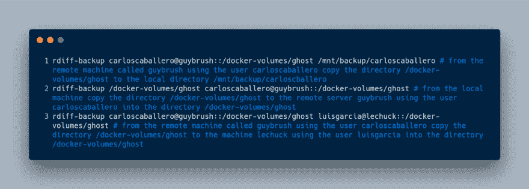
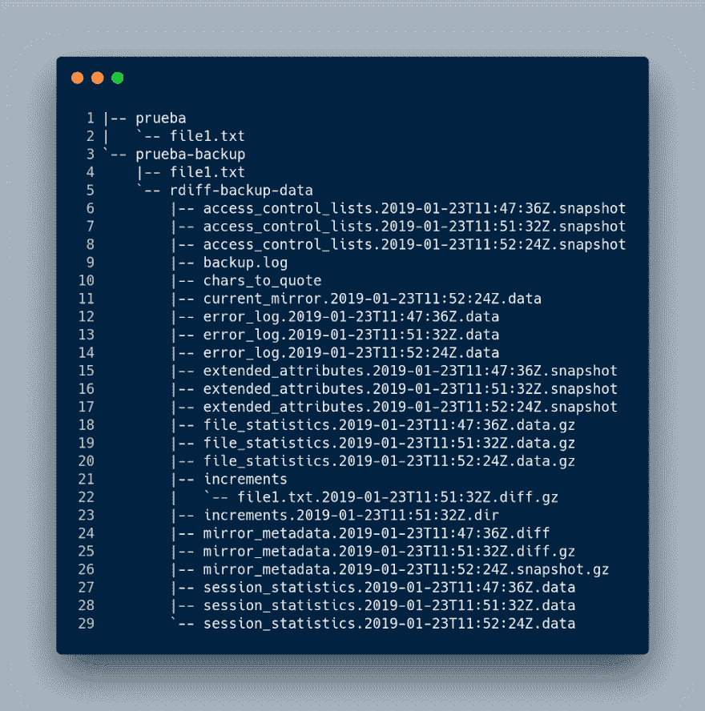
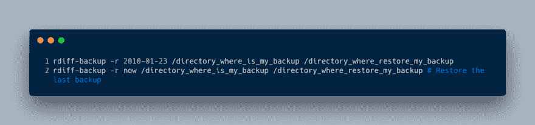
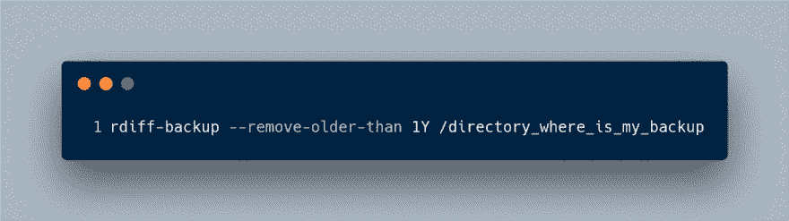
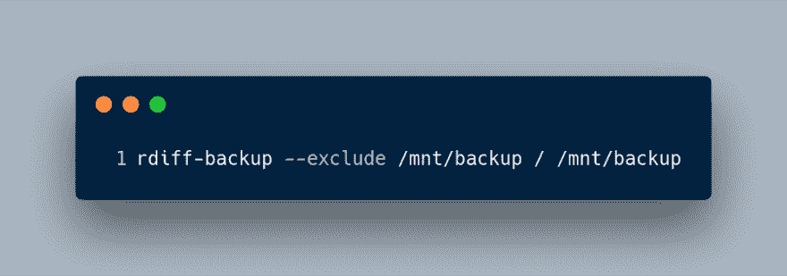
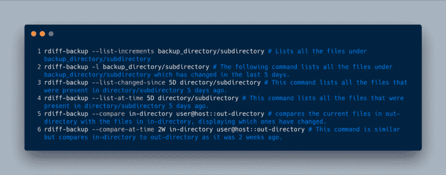
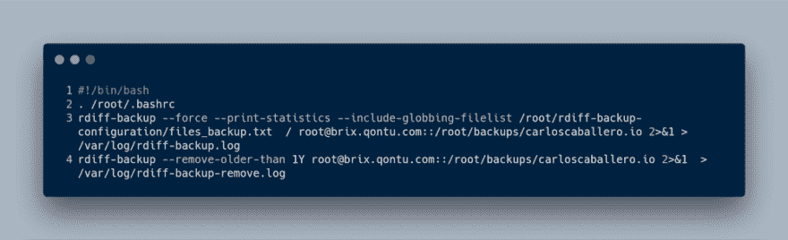

# 使用 rdiff-backup 自动备份

> 原文：<https://dev.to/carlillo/backup-automated-using-rdiff-backup-47p2>

* * *

最初发布于[www . carloscaballero . io](https://carloscaballero.io/backup-using-rdiff-backup/)2019 . 1 . 25。

* * *

有一天你的博客、代码或几乎任何东西都可能崩溃，可悲的是，你最有价值的信息可能会不可挽回地丢失！考虑一下如果
这种情况发生的后果(摸摸木头！).给他们拍照？吓人吧？现在，想象一下
如果你费心做一个
备份，你会多么放松。

今天我给大家展示一下我个人的备份方法。我使用令人敬畏的
`rdiff-backup`工具，它结合了增量备份和镜像。
你
可以在[官方
页面了解更多关于这个工具的信息。](https://www.nongnu.org/rdiff-backup/)

> *什么事？***【rdiff】** *将一个目录备份到另一个目录，可能通过
> 网络。目标目录最终是源目录的副本，但是
> 额外的反向差异存储在目标
> 目录的特殊子目录中，因此您仍然可以恢复前一段时间丢失的文件。想法是
> 结合镜像和增量备份的最佳特性。*

### 安装

rdiff-backup 在最重要的 linux 发行版中可用。在我的例子中，
我使用一个 ArchLinux 发行版( [Manjaro](https://manjaro.org/) )和
[yay 包](https://github.com/Jguer/yay)(又一个酸奶——用 Go 编写的 AUR 助手
)来安装这个工具。

如果您使用另一个发行版，也可以安装该软件:

### 使用 rdiff-backup

当你使用`rdiff-backup`时，制作备份是非常容易的。你可以把这个
工具想象成类似于`cp`命令。换句话说，`rdiff-backup`有两个
论点:

*   源目录。
*   目标目录。

两个目录都可以是本地或远程磁盘。例如，如果您想在本地目录中使用
`rdiff-backup`，您可以使用以下命令:

同样，如果任何目录在远程服务器中，您只需要使用经典的方式`user@server::PATH`用
来指示路径。下面的
命令显示了如何在
源和目标目录中使用远程或本地服务器:

当使用这些命令时，远程机器可能会请求用户的
密码(对于前面的命令，分别为`carloscaballero`和`luisgarcia`
)。您可以通过在 Linux
服务器上配置基于 [SSH 密钥的
认证来省略这个步骤。](https://www.digitalocean.com/community/tutorials/how-to-configure-ssh-key-based-authentication-on-a-linux-server)

当想要恢复
信息时，这个工具的真正威力才真正得到体现。如果你列出你制作
副本的目录的内容，你会看到你之前复制的内容，而且，
你会找到一个名为`rdiff-backup-data`的目录。这个目录非常
重要，因为它存储了我们数据的[增量
备份](https://en.wikipedia.org/wiki/Incremental_backup)。

在这个目录中，显示的内容包括我们备份的最后一个版本，
加上增量副本，它们存储在
`rdiff-backup-data/increments`目录中。

现在假设我创建了一个名为`file1.txt`的文件，其中包含一个
句子。使用`rdiff-backup`完成复制，几分钟后，另一个
复制完成。现在，我们展示了系统中的文件列表，下面是
:

您可能会注意到文件`file1.txt`在
`increments`目录中有一个增量副本。

### 恢复备份

我们可以使用`rdiff-backup`命令或者直接使用
`cp`命令来恢复副本，因为副本既没有被压缩，也没有改变任何元数据
。因此，文件处于与复制时相同的状态。
尽管你可以使用`cp`命令，但由于数据恢复更加灵活，使用`rdiff-backup`工具会更好。

用于恢复备份的命令的使用类似于进行
备份的命令，增加了选项(restore-as-of，`-r`)以及要恢复的
时间戳。时间戳非常灵活，因为可接受的时间
字符串是间隔，就像“3d 64s”；w3-datetime 字符串，如
“2002-04-26T04:22:01-07:00”(字符串如“2002-04-26t 04:22:01”也是
可接受的- rdiff-backup 将使用当前时区)；或者普通日期
，如 1997 年 2 月 4 日或 2001 年 4 月 23 日(各种组合都是可以接受的，记住
月份必须总是在日期之前)。

例如，以下命令恢复 2010 年 1 月 23 日制作的拷贝。

正如您已经知道的，`rdiff-backup`命令进行增量备份，
需要消耗大量磁盘空间。因此，
强烈建议删除旧的备份(当然，只要你有其他更新的
备份)。

`rdiff-backup`工具有`remove-older-than`选项，可以删除任何早于参数中使用的日期的
备份。一个很好的例子是
删除任何超过 1 年的备份:

### 过滤选项

大多数情况下，我们需要在备份中包含或排除文件。rdiff-backup 中最常用的选项有:

**-包括。

*   包含文件列表
*   排除。
*   排除文件列表**

除此之外，我们还可以使用更多的过滤选项来进行备份，例如:

在本例中，我们排除了/mnt/backup 以避免无限循环，尽管 rdiff-backup 可以自动检测如上所示的简单循环。这只是一个例子，实际上排除/proc 也很重要。

有时我们可能需要关于备份的信息(元数据)。
`rdiff-backup`允许我们获取这些信息。最常见的
选项如下:

*   列表-增量
*   列表-已更改-自
*   一次列表
*   比较
*   一次比较

因为它们非常具有描述性，所以不难想象不同选项的每个
的目标是什么。尽管如此，我将展示几个应用
的例子:

### 在 cron 中使用

一个好的做法是在我们的系统中自动备份。为此，我们可以使用
cron 服务。

在使用 cron 之前，我们必须记住确保 cron
中使用的脚本不会输出任何东西，否则:

*   cron 会认为有错误
*   如果有任何错误，您将无法看到它

我们在脚本中使用的命令如下:

`files_backup.txt`文件的内容如下:

重要的是要知道成功和错误日志都保存在同一个名为`rdiff-backup.log`的
日志文件中。另一个有趣的地方是，我使用了过滤选项`include-globbing-filelist`，它允许使用一个文件作为
参数。该文件包含将要备份的目录，通过使用
字符串`+`或`-`来表示该目录必须被包含或
排除。请注意，超过 1 年的备份将被删除，以保留磁盘
空间。

最后，使用`crontab -e`命令编辑 cron 文件。

### 结论

在这篇文章中，我解释了`rdiff-backup`工具，它允许我们进行
增量备份。我还向您展示了我用来备份我的项目的脚本，
，它由 cron 每天执行一次。

*   来自官方页面的更多示例。

* * *

最初发布于[www . carloscaballero . io](https://carloscaballero.io/backup-using-rdiff-backup/)2019 . 1 . 25。

* * *

嗨！我叫卡洛斯·卡瓦列罗，我是博士。来自西班牙马拉加的计算机科学。教开发人员和学位/硕士计算机科学如何成为专家！