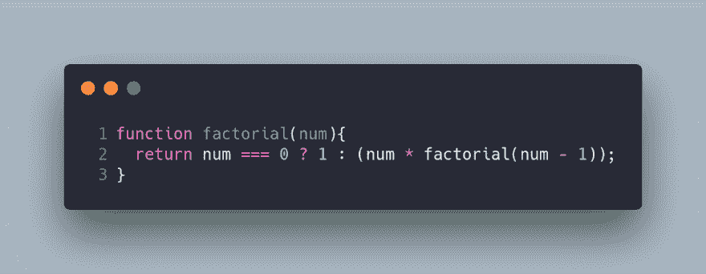
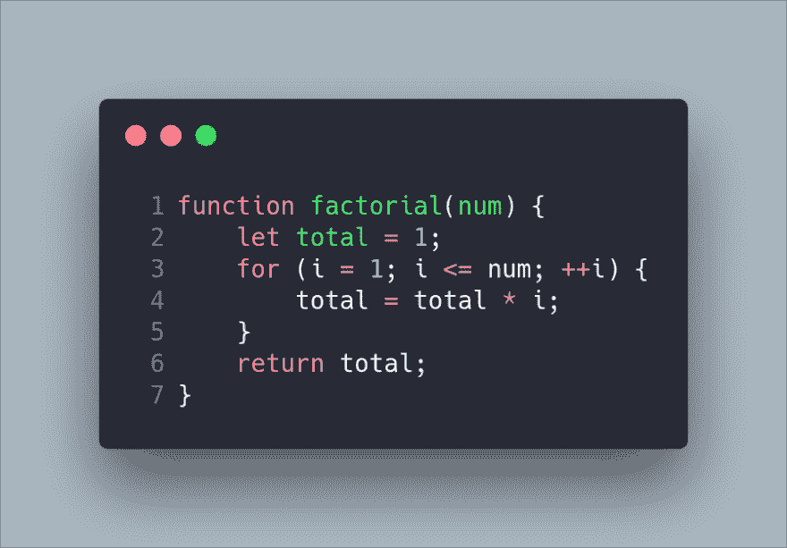
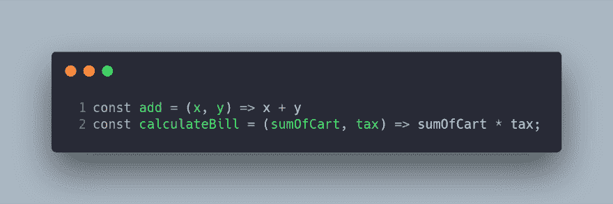
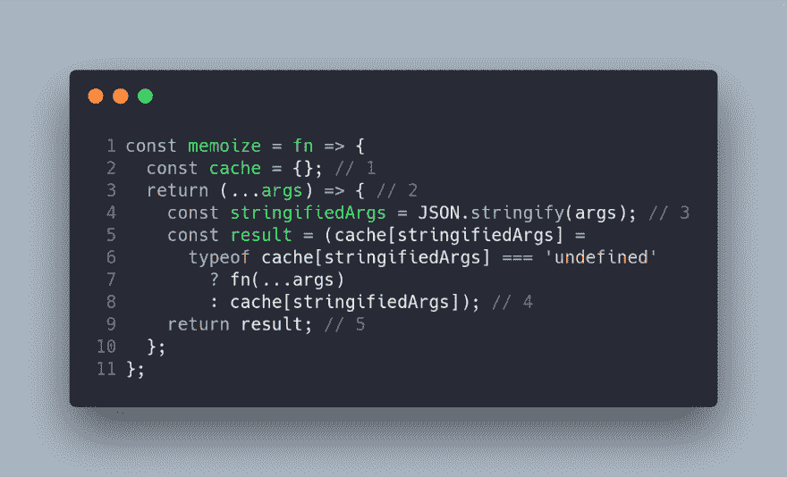
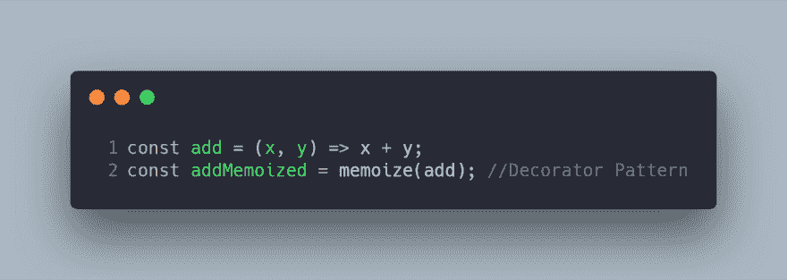
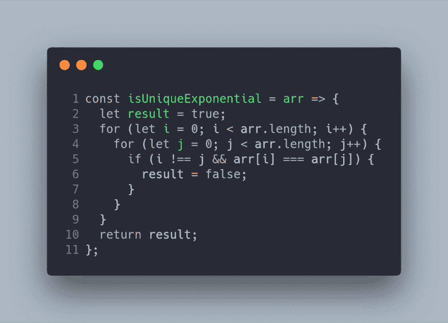
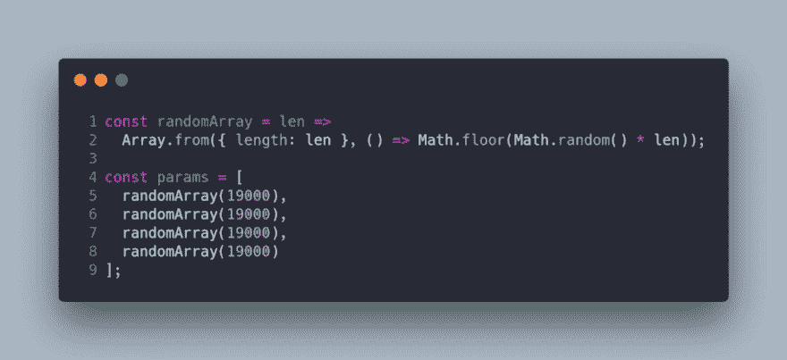
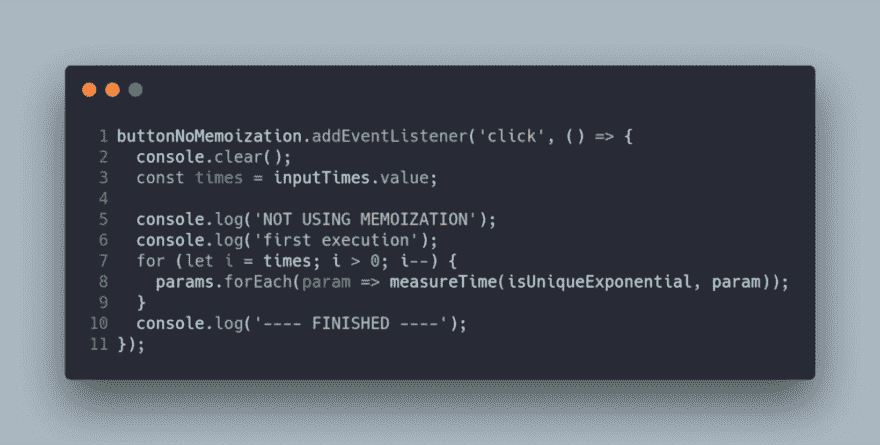
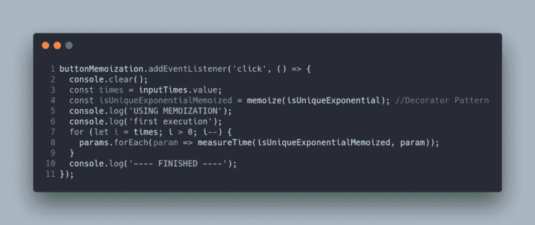
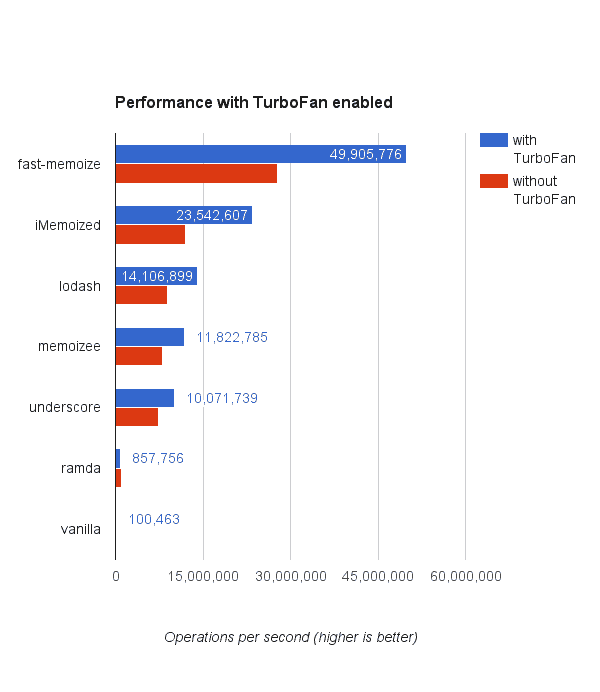

# 了解 JavaScript/TypeScript 记忆

> 原文：<https://dev.to/carlillo/understanding-javascripttypescript-memoization-o7k>

* * *

*最初发布于[www . carloscaballero . io](https://carloscaballero.io/understanding-javascript-typescript-memoization/)2019 年 2 月 8 日。*

* * *

### 什么叫记忆化？

维基百科对记忆的定义如下:

> *在计算中，记忆化是一种优化技术，主要用于通过存储昂贵的
> 函数调用的结果并在相同的输入再次出现时返回缓存的结果来加速计算机程序
> 。*

记忆化是一种编程技术，它允许用*空间成本*来减少函数的*时间
成本*。也就是说，被记忆的功能获得了*速度*
以更好地利用*存储空间*。

记忆只能用在纯函数中，所以第一点是已知的
这是一个**纯函数**

在下面的动画中，你可以看到在我们的代码中应用记忆化
的最终结果。

### 什么是纯函数？

纯函数是满足以下标准的函数:

1.  当参数相同时，这个函数总是返回相同的结果。例如，以下函数是不纯的:

*   使用随机数的函数。
*   使用日期时间作为种子来生成结果的函数。

1.  这是一个在应用中不会产生副作用的函数:

*   数据突变或改变应用程序状态。
*   网络请求。
*   数据库或文件请求。
*   获取用户输入。
*   查询 DOM。

### 好处

纯函数在 web 开发中的使用有几个好处。虽然，纯粹的功能并不仅仅用于 web 开发。嗯，纯函数的主要
好处是:

1.  你的代码更具有声明性，它关注的是必须做什么，而不是必须怎么做。此外，这些功能还关注不同的输入与输出之间的关系。
2.  代码更易测试，而且比不纯的函数更容易发现错误。

但是，在现实生活中有副作用，这是代码
的一个很好的部分(例如，当您访问数据库或与不同的服务器通信
以请求关于系统的信息时)。所以，纯函数是你的
代码的一部分，你需要知道什么时候你可以使用纯函数，什么时候你可以在你的代码中
使用记忆化。

### 纯函数示例

递归函数经常使用纯函数，最经典的
递归问题是阶乘。

但是 factorial 函数的命令版本也是纯函数，因为
纯函数与输入和输出相关。在两种情况下，当输入
相同时，输出也将相同。

纯函数的另一个有趣的例子如下:

### 递归函数中的记忆

记忆是一种编程技术，它允许不重新计算纯函数的值
。即，当具有相同的输入时，纯函数返回相同的值
。所以，返回值可以使用
存储在系统的任何缓存系统中(例如一个 map 或 array)。所以，如果你计算了
`factorial(1)`的值，你可以存储返回值`1`，同样的动作可以在每次执行中完成
。所以，当你运行阶乘(100)时，你第一次需要一段时间，但是第二次和更多次的时间会减少！

在这种情况下，如果你注意到递归阶乘版本，你可以注意到
这个版本执行了几次函数`factorial`，它可以在我们的系统中缓存
(使用内存化)，但是如果你使用命令阶乘
版本，你的性能会更差。出于这个原因，`memoization`是声明性语言中一种很好的
已知技术。

### 记忆示例！—活代码！

在这一节中，我将向您展示如何使用`closure`
实现记忆化，以及如何使用 JavaScript 实现`decorator`模式。

装饰模式允许在运行时使用
组合而不是层次结构向任何对象添加新特性。模式目标是避免为我们的特性创建一个类层次结构。

理解这种模式的一个很好的例子可以在阿迪·奥斯马尼的博客中找到。

因此，JavaScript 中 memoize decorator 的一个基本实现如下:

1.  定义将存储执行结果的高速缓存。我们使用一个对象作为`map`来存储这个结果。
2.  装饰器返回一个新函数，该函数具有与原始函数相同的行为，但实现了记忆。
3.  键值映射的键是使用来自原始函数的`stringify`和 args 生成的。
4.  新功能的`result`将是
5.  原始函数的执行(`fn(...args)`)是否存在缓存中没有存储。
6.  存储在缓存中的值(之前是否有预先计算)。
7.  返回`result`。

### 如何使用我们的`memoized`装饰器？

使用 JavaScript 来使用这个装饰器的方法非常简单:

在这种情况下，`add`函数是没有记忆的原始函数，
函数是使用装饰模式的新函数，它有新的特性
(记忆)。

### 使用记忆化的真实演示！

现在，我将向你展示一个真正的记忆的故事。想象一下一个复杂的
算法，它指示你一个`array`是否有一个唯一的值(如
`Array.prototype.some`)但是被可怕地编程了。

下面的步骤是运行原始代码和使用 memoization 和
的代码，比较每个函数中使用的时间。记住
原始代码没有被修改，但是添加了记忆功能，这一点非常重要。

下面的函数用于测量每次执行所用的时间。

该数组在脚本开始时生成:

最后，当用户点击按钮时，功能被执行。

1.  没有记忆

1.  记忆化

结果如以下动画所示:

### 结论

记忆化在使用`TypeScript`
或`JavaScript`的 web 开发中得到了广泛的发展。下面的资源列表必须是在您的项目中使用它们的起点。

*   [快速记忆](https://github.com/caiogondim/fast-memoize.js)。
*   [磨](https://github.com/planttheidea/moize)。
*   [回忆录](https://github.com/medikoo/memoizee)
*   [装饰工](https://github.com/steelsojka/lodash-decorators)

`Fast-Memoize`使用此图比较 memoize 的不同实现:

*   GitHub 项目是[https://github.com/Caballerog/blog/memoization](https://github.com/Caballerog/blog/memoization)

* * *

*最初发布于[www . carloscaballero . io](https://carloscaballero.io/understanding-javascript-typescript-memoization/)2019 年 2 月 8 日。*

* * *

嗨！我叫卡洛斯·卡瓦列罗，我是博士。来自西班牙马拉加的计算机科学。教开发人员和学位/硕士计算机科学如何成为专家！