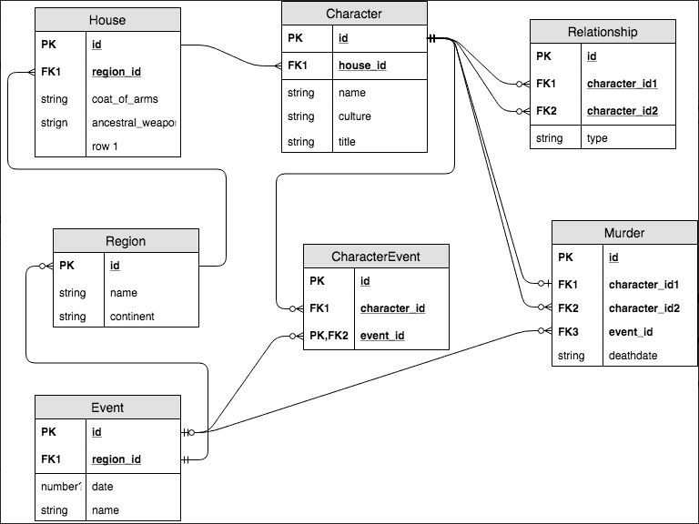
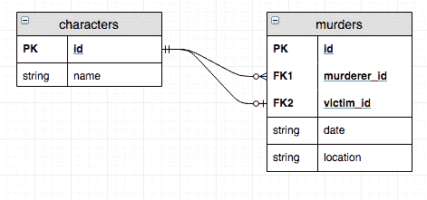
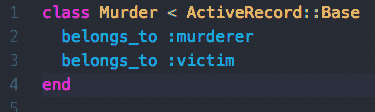
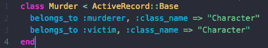
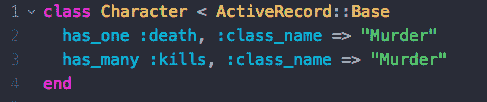
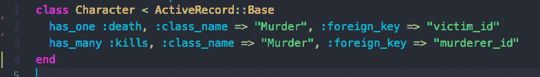
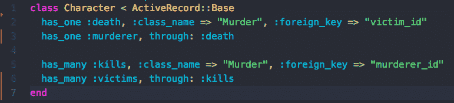

# 活动记录别名

> 原文：<https://dev.to/natreid/active-record-aliasing-1cai>

# 一步步引导主动记录关系别名

Flatiron 软件工程课程的整个第三周致力于构建一个命令行界面，该界面使用我们在 ActiveRecord 中实现的域模型。我和同样野心勃勃的搭档杰西卡·贝茨一起为我们的[权力的游戏 CLI](https://github.com/Nat-Reid/Game_Of_Thrones_CLI) 制作了这一大片域名:

我喜欢 UML，当我们在 flatiron 接触到领域建模和关系数据库时，我为之疯狂(你可能知道)，但我不知道的是，关系可以变得比仅仅`has_many`、`belongs_to`和`has_many, through:`更复杂

我们设计的这个模型的大部分都是由这些关系组成的，用活动记录实现这个模型总共花了 5 分钟。但是在这一点上，我只熟悉在一个`has_many`语句中使用一个参数(或者有时在关键字`through:`中使用两个参数)，但是这种模式很快被证明对于我们模型的复杂性是不够的。

如果您使用 ruby Active Record 已经有一段时间了，您会知道在整个项目中保持一致的名称是非常重要的。

当我刚开始使用 AR 时，我很快了解到类名、表名、外键名和关系符号都必须完全按照活动记录标准拼写和格式化(类名是 PascalCased 单数，表名是 snake_cased 复数，等等)。)来维持关系。在深层次上，这是有意义的；除此之外，AR 还能如何编写正确访问所有这些东西的代码呢？但是在系统停止工作之前，我从来没有意识到你传递给关系宏(例如`has_many :dogs`和`belongs_to :owner`)的那些符号有多重要。

当我们试图实现谋杀模型时，这种单符号参数模式停止了工作(这个例子相当病态...但是《权力的游戏》没有谋杀就不是《权力的游戏》)。让我们更具体地看看这个模型:

您在这里看到的是一个自连接表，这是一个稍微复杂一些的关系，打破了典型的关系调用。

这种关系是自连接表的一个例子；自连接表的功能与不同类之间的连接表完全一样，只是针对一个类。也就是说，它不是连接两个不同类的两个对象，而是连接同一个类的两个对象。乍一看，这似乎非常直观，但是通过研究，我们发现最基本的活动记录约定无法描述这个领域。

但是不用担心，Active Record 给了我们比最有经验的开发人员所能使用的更多的工具，其中最简单的一个:*别名*将解决我们所有的自连接问题！

## 开始吧:

让我们首先用简单的英语来思考这种关系:要让谋杀存在，它必须有一个凶手和一个受害者，这两者都是人物实例。这在直觉上完全说得通，并且很容易在谋杀类中实现:

但是当我们测试这段代码(通过手动创建一个谋杀对象)时，我们得到了一个错误！

T2`pry(main)> Murder.first.victim
NameError: uninitialized constant Murder::Victim
from /Users/nissenadam/.rvm/gems/ruby-2.3.3/gems/activerecord-5.2.2/lib/active_record/inheritance.rb:196:in `compute_type'`

关系在寻找一个杀人犯类来匹配它:杀人犯方法，但杀人犯只是一个角色对象。这个问题的解决方案是 ActiveRecord 关联宏可以接受更多的参数给*别名*它们负责匹配的各种东西(外键、类名和表名)

注意:在 ActiveRecord 4 中，有另一个方法使用了`alias_attribute`方法，但是在我看来，它使代码更加混乱。`¯\_(ツ)_/¯`

用这个已知的知识回到谋杀类，我们能够使用`:class_name`关键字参数告诉`belongs_to`方法凶手和受害者实际上都是角色对象:

`:class_name`参数更新它正在寻找的类名(duh ),这样它就知道凶手和受害者都是角色对象。这也使它与数据库兼容，因为它在数据库中寻找与类名匹配的外键，我们刚刚将类名设置为`”Character”`

转到角色模型，我们首先需要考虑它与谋杀模型的关系:它实际上有 2 个！我们希望我们的角色知道他们杀了谁，是谁杀了他们。想到谋杀对象，我们可以把这些不同的关系分别想成死亡和杀戮(我告诉过你这会变得病态)。最后，我们需要记住，这两种方法实际上都指向一个谋杀对象，所以我们必须给它们起别名，就像这样:

但是当我们试图测试时，我们得到了这个错误:

T2`pry(main)> Character.first.death
ActiveRecord::StatementInvalid: SQLite3::SQLException: no such column: murders.character_id: SELECT "murders".* FROM "murders" WHERE "murders"."character_id" = ? LIMIT ?
from /Users/nissenadam/.rvm/gems/ruby-2.3.3/gems/sqlite3-1.3.13/lib/sqlite3/database.rb:91:in `initialize'
Caused by SQLite3::SQLException: no such column: murders.character_id
from /Users/nissenadam/.rvm/gems/ruby-2.3.3/gems/sqlite3-1.3.13/lib/sqlite3/database.rb:91:in `initialize'`

这里，`has_many` / `has_one`宏在谋杀表中寻找外键“character_id ”,它是从类名中获得的，但是我们知道，谋杀表中的外键是杀人犯 id 和受害者 id。幸运的是，我们可以在两个`has_`语句中使用外键的别名来实现这一点！

现在一个谋杀者可以接触到它的凶手和受害者，一个角色可以接触到它所有的杀戮和死亡。

剩下的就是让角色知道他们的凶手和受害者——他们可以分别通过他们的死亡和杀戮来获得。这些关系从简单的英语无缝地转换成 ActiveRecord 代码，所以让我们来编写它们:

就这样，我们的代码开始工作了！角色可以知道他们的受害者和凶手，他们的杀戮和他们的死亡，谋杀模型成功地作为两者之间的连接，并可以扩展。

## 我猜这很酷..

这只是对活动记录别名和建模更复杂关系的介绍。

虽然自连接表和外键别名是*超级棒的*，但它们真的只是冰山一角！浏览这些关系宏的源代码[这里](https://github.com/rails/rails/tree/master/activerecord/lib/active_record/associations/builder)，我们可以看到我们刚刚使用的别名模式只是它们可以采用的许多不同选项中的一部分。同样，如果 SQL 没有给你带来很大的麻烦，在关系方法之后使用`.to_sql`命令可以准确地显示活动记录是如何实现这些关系的(例如`Character.first.victims.to_sql`

另一个非常常见的选项(也用于别名)的快速示例是`has_`宏中的`:source`选项，它可以修改它正在寻找的外键(与`:foreign_key`选项对`belongs_to`的处理方式相同)。

即使您无法想象任何需要这些选项(别名或其他)的域，浏览这些选项并试图弄清楚它们的作用也大大加深了我对活动记录的总体理解。Active Record 是一个非常强大的工具，它将支持您所有的 rails 应用程序，所以掀开盖子，成为一名 Active Record 主将把您的后端技能提升到一个新的水平。