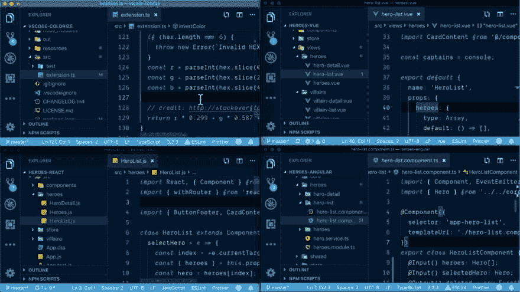

# 孔雀-深夜编码 FTW

> 原文：<https://dev.to/john_papa/peacock---late-night-coding-ftw-3pk0>

## 闪回

不久前，我为 [VS 代码](https://code.visualstudio.com?wt.mc_id=devto-blog-jopapa)创建了一个主题，叫做[冬天来了](https://marketplace.visualstudio.com/items?itemName=johnpapa.winteriscoming&wt.mc_id=devto-blog-jopapa)。通过阅读 VS 代码文档中关于主题化的的[伟大指南，我学会了如何做到这一点。我今天还在用它(我喜欢黑暗版本)。它教会了我很多关于如何在 VS 代码中自定义颜色的知识。然后我开始用它来帮助解决我遇到的另一个问题:快速直观地区分 VS 代码实例](https://code.visualstudio.com/api/extension-capabilities/theming?wt.mc_id=devto-blog-jopapa)

我经常在多个代码项目上工作，并在 markdown 上写文章。我的工作流程是为每一个打开不同的单独的 VS 代码实例，因为它们通常互不相关。随着我的思维在工作之间转移，我发现自己在实例之间循环，这花了我一点时间来确定我想要关注哪个实例。

> <video loop="" controls=""><source src="https://video.twimg.com/tweet_video/Dz_MAciX0AI6_Nb.mp4" type="video/mp4"></video>John Papa[@ John _ Papa](https://dev.to/john_papa)我经常有很多 VS @Code 实例打开。我一直用这种技术来区分标题栏的颜色，这样我就能看出哪个是哪个。我做了一个扩展，很快就会出版！
> 
> 选项
> 1。挑选定制颜色
> 2。随机挑选一种颜色
> 3。挑选一种预定义的颜色05:46AM-22 Feb 20192001038

## 关于昨晚

昨晚我同时在做 4 个应用程序，还有几篇我正在用 VS 代码制作 markdown 的文章。这激励我完成这个项目

在我完成一个工作扩展后，我创建了一个简单的动画 gif，并在 twitter 上分享，看看是否还有人感兴趣。然后我就去睡觉了。

今天早上醒来，我得到的积极反应比来自社区的更多(谢谢)。我也已经收到了许多伟大的贡献(再次感谢你！).

*   孔雀的名字和图标归功于 [@josephrexme](https://twitter.com/josephrexme)
*   感谢 [@codebeast](https://twitter.com/codebeast) 对 CLI 的建议
*   感谢 [@_clarkio](https://twitter.com/_clarkio) 和 [@burkeholland](https://twitter.com/burkeholland) 的几个问题/想法

特别感谢 VS 代码团队和他们令人难以置信的[创建扩展的有用指南](https://code.visualstudio.com/api/get-started/your-first-extension?wt.mc_id=devto-blog-jopapa)

## 试孔雀出来

如果你有兴趣试用孔雀，你可以在这里的市场找到它。它目前正在预览中，这意味着前面可能有龙。

*   在这里获取扩展名
*   贡献给 GitHub 库[这里](https://github.com/johnpapa/vscode-peacock?wt.mc_id=devto-blog-jopapa)

最坏的情况是，这个扩展只是我将使用的东西，这没关系。但如果你也喜欢，请试一试，并在 GitHub 中提交反馈。您可以[打开问题](https://github.com/johnpapa/vscode-peacock/issues?wt.mc_id=devto-blog-jopapa)或抓住[打开问题](https://github.com/johnpapa/vscode-peacock/issues?wt.mc_id=devto-blog-jopapa)并帮助投稿。

谢谢！

*十字贴[johnpapa.net](https://johnpapa.net/peacock-late-night-coding-ftw/)T3】*