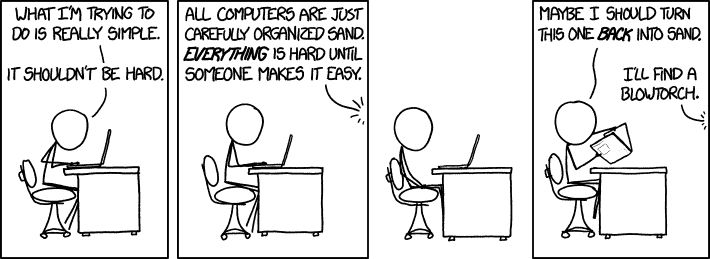

# 你还记得你第一次编码的经历吗？

> 原文：<https://dev.to/awwsmm/do-you-remember-your-first-coding-experience-1o7d>

日复一日地在科技行业工作，我们可能会厌倦*编程到底有多酷的现实。作为人类，我们已经知道如何让无生命的物体为我们计算东西:*

<figure>

<figcaption>[https://xkcd.com/1349/](https://xkcd.com/1349/)</figcaption>

</figure>

我依稀记得第一次写程序的感觉。我在高中上过 C++课和 Java 课，我想我先上了 Java 课。我记得当时语法对我来说没有任何意义，但我认为你可以在命令行中键入一些东西，你的程序可以接受你的输入并处理它，然后返回一个结果，这真的很酷。

我真的很喜欢创建基于文本的游戏，图形用户界面看起来太先进了，甚至没有考虑过学习。我确信这影响了我今天的编程偏好，因为我仍然坚持使用主要通过命令行交互的语言(对我来说没有太多的 web /图形工作)。

然后，每个人都有了账户(还记得吗，美国人？)并试图定制他们的个人资料，所以我开始学习 HTML 和 CSS。当时有很多不同种类的“尖端”网页设计的缩写:XHTML、DHTML 等等。现在这一切看起来如此离奇。

你的第一次编码经历是什么样的？是几十年前还是上个月？它令人紧张还是令人兴奋？