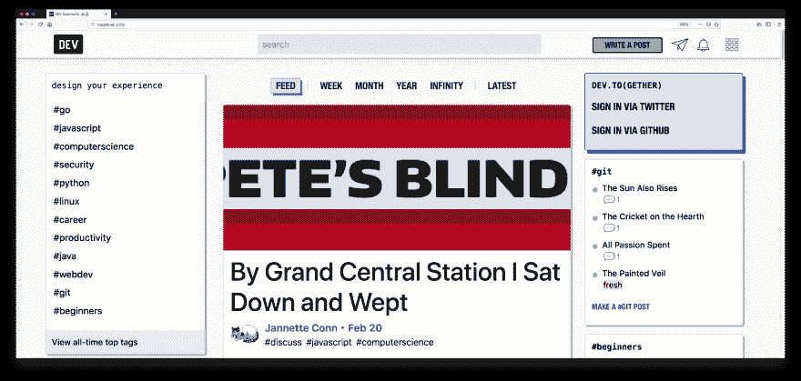
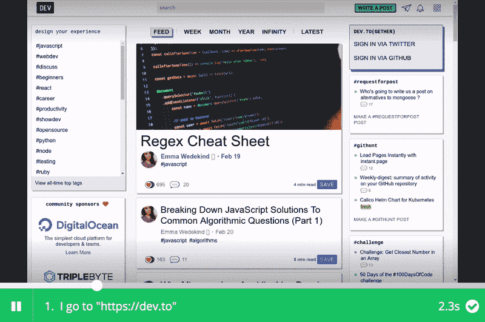
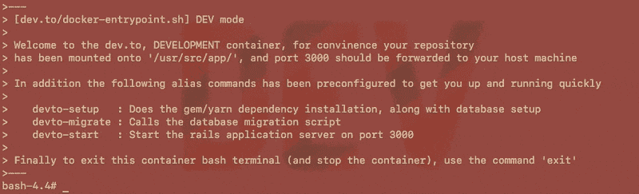

# 启动您自己的开发工具🐳服务器——只需一个命令(几乎)！

> 原文：<https://dev.to/uilicious/adopt-your-own-devto----with-a-single-command-almost-1c04>

*(免责声明 bash 脚本只在 Ubuntu / MacOS 上用 docker 测试过)*

克隆存储库，执行 bash 脚本，并按照屏幕上的说明进行操作。

```
git clone https://github.com/uilicious/dev.to-docker.git && \
cd dev.to-docker && sudo ./docker-run.sh INTERACTIVE-DEMO 
```

[](https://res.cloudinary.com/practicaldev/image/fetch/s--XibRlTD4--/c_limit%2Cf_auto%2Cfl_progressive%2Cq_66%2Cw_880/https://thepracticaldev.s3.amazonaws.com/i/nhlrb6e52kctxt4fzrmv.gif)

* * *

# 更长的基于 docker 的命令(没有 git 克隆)

注意:您需要更换所有不同的`<values>`

```
# Run a postgres server configured for dev.to
docker run -d --name dev-to-postgres \
    -e POSTGRES_PASSWORD=devto \
    -e POSTGRES_USER=devto \
    -e POSTGRES_DB=PracticalDeveloper_development \
    -v "<POSTGRES_DATA>:/var/lib/postgresql/data" \
    postgres:10.7-alpine;

# Wait about 30 seconds, to give the postgres container time to start
sleep 30

#
# Run the prebuilt dev.to container
# binded to localhost:3000
#
# Algoliasearch API key is required for dev.to,
# for login do consider adding github/twitter keys as well
# see : https://github.com/thepracticaldev/dev.to/blob/master/config/sample_application.yml
#
docker run -d -p 3000:3000 \
    --name dev-to-app \
    --link dev-to-postgres:db \
    -v "<DEVTO_UPLOAD_DIR>:/usr/src/app/public/uploads/" \
    -e ALGOLIASEARCH_APPLICATION_ID=<APP_ID> \
    -e ALGOLIASEARCH_SEARCH_ONLY_KEY=<SEARH_KEY> \
    -e ALGOLIASEARCH_API_KEY=<ADMIN_KEY> \
    uilicious/dev.to

#
# Also : do give 5~10 minutes for the server to be up. 
# It does take a long time to setup and start
# 
```

坞站集线器链接:【https://hub . docker . com/r/uilicious/dev . to】

* * *

[](https://res.cloudinary.com/practicaldev/image/fetch/s--ziXEi9GF--/c_limit%2Cf_auto%2Cfl_progressive%2Cq_66%2Cw_880/https://thepracticaldev.s3.amazonaws.com/i/7iwunbbyov3mftowthgc.gif)

<figure>

[](https://res.cloudinary.com/practicaldev/image/fetch/s--K5uJ7ci5--/c_limit%2Cf_auto%2Cfl_progressive%2Cq_auto%2Cw_880/https://thepracticaldev.s3.amazonaws.com/i/u4x9nfb5mlncywi37163.png)

<figcaption>Btw: I am very amused, by the various random article titles generated on a new deployment</figcaption>

</figure>

# [ 功能:docker-run.sh 脚本+ docker 容器构建 #1844](https://github.com/thepracticaldev/dev.to/pull/1844) 

[](https://github.com/PicoCreator) **[PicoCreator](https://github.com/PicoCreator)** posted on [<time datetime="2019-02-22T09:09:46Z">Feb 22, 2019</time>](https://github.com/thepracticaldev/dev.to/pull/1844)

## 这是什么类型的公关？(勾选所有适用选项)

*   [ ]重构
*   [x]功能
*   [ ]错误修复
*   [ ]文档更新

## 描述

一个 bash 脚本，帮助快速设置开发或演示环境

```
bash-3.2$ ./docker-run.sh 
```

```
#---
#
# This script will perform the following steps ... 
#
# 1) Stop and remove any docker container with the name 'dev-to-postgres' and 'dev-to'
# 2) Reset any storage directories if RUN_MODE starts with 'RESET-'
# 3) Build the dev.to docker image, with the name of 'dev-to:dev' or 'dev-to:demo'
# 4) Deploy the postgres container, mounting '_docker-storage/postgres' with the name 'dev-to-postgres'
# 5) Deploy the dev-to container, with the name of 'dev-to-app', and sets up its port to 3000
#
# To run this script properly, execute with the following (inside the dev.to repository folder)...
# './docker-run.sh [RUN_MODE] [Additional docker envrionment arguments]'
#
# Alternatively to run this script in 'interactive mode' simply run
# './docker-run.sh INTERACTIVE-DEMO'
#
#---
#---
#
# RUN_MODE can either be the following
#
# - 'DEV'  : Start up the container into bash, with a quick start guide
# - 'DEMO' : Start up the container, and run dev.to (requries ALGOLIA environment variables)
# - 'RESET-DEV'   : Resets postgresql and upload data directory for a clean deployment, before running as DEV mode
# - 'RESET-DEMO'  : Resets postgresql and upload data directory for a clean deployment, before running as DEMO mode
# - 'INTERACTIVE-DEMO' : Runs this script in 'interactive' mode to setup the 'DEMO'
#
# So for example to run a development container in bash its simply
# './docker-run.sh DEV'
#
# To run a simple demo, with some dummy data (replace <?> with the actual keys)
# './docker-run.sh DEMO -e ALGOLIASEARCH_APPLICATION_ID=<?> -e ALGOLIASEARCH_SEARCH_ONLY_KEY=<?> -e ALGOLIASEARCH_API_KEY=<?>'
#
# Finally to run a working demo, you will need to provide either...
# './docker-run.sh .... -e GITHUB_KEY=<?> -e GITHUB_SECRET=<?> -e GITHUB_TOKEN=<?>
#
# And / Or ...
# './docker-run.sh .... -e TWITTER_ACCESS_TOKEN=<?> -e TWITTER_ACCESS_TOKEN_SECRET=<?> -e TWITTER_KEY=<?> -e TWITTER_SECRET=<?>
#
# Note that all of this can also be configured via ENVIRONMENT variables prior to running the script
#
#---
```

并使用 docker 进行部署。包括在部署前进行重置的选项。

此处提供了可选的上下文信息:[单指令 https://dev.to/uilicious/adopt-your-own-devto-几乎-1c04](https://dev.to/uilicious/adopt-your-own-devto----with-a-single-command-almost-1c04)

## 需要指点...

如果有人能指导我如何在“生产”模式下运行 dev.to，这将有助于提高 docker 容器的整体性能

## 添加到文档中？

*   docker hub 的自述文件示例:[https://github . com/uilicious/dev . to-docker/blob/feature/docker-run-script/docker hub-readme . MD](https://github.com/uilicious/dev.to-docker/blob/feature/docker-run-script/dockerhub-readme.md)
*   [https://cloud . docker . com/u/uilicious/repository/docker/uilicious/dev . to](https://cloud.docker.com/u/uilicious/repository/docker/uilicious/dev.to)
*   我可以修改 readme 如果这个看起来不错？

## 什么 gif 最能描述这次公关

[](https://camo.githubusercontent.com/8bfe439f41fd2a49537c35ef8a372afa1795f462/68747470733a2f2f74686570726163746963616c6465762e73332e616d617a6f6e6177732e636f6d2f692f6e686c7262366535326b6374787434667a726d762e676966)

## 什么 gif 最能描述它给你的感觉？

[](https://camo.githubusercontent.com/4d650253e40f7666e135c1314b84586fe3e17b52/68747470733a2f2f74686570726163746963616c6465762e73332e616d617a6f6e6177732e636f6d2f692f376977756e6262796f76336d66746f77746867632e676966)

[View on GitHub](https://github.com/thepracticaldev/dev.to/pull/1844)

> PS:如果有人能指导我如何在“生产”模式下运行 dev.to，在这样的设置下，这将极大地提高 docker 容器的整体性能。

* * *

# 为什么要这样做？难道不能用官方的 readme 来设置服务器吗？？

一开始是这样的，然后...

[](https://res.cloudinary.com/practicaldev/image/fetch/s---hL_7O-U--/c_limit%2Cf_auto%2Cfl_progressive%2Cq_auto%2Cw_880/https://thepracticaldev.s3.amazonaws.com/i/9e1hod91kjx34o1xyc5u.jpg)

这不是 dev.to 的问题，只是我是一个 ruby 开发者。

我想要的只是简单地启动一个快速服务器，这样我就可以在上面写一些 UI 测试脚本(稍后会有更多的介绍)。

我真的不想弄清楚如何安装 ruby，整理丢失的操作系统依赖项，修复我的 npm 版本，试图弄清楚为什么现有的 docker 版本有丢失的映像，等等，等等.......

在修复这一切的过程中，我突然想起了@ben 过去的文章...

为了这个未来，在那里`dev.to`成长为一系列由社区运营的分散的`dev.to.like`网络。我们需要该网站是一个快速，易于部署的*任何人*。

不仅仅是那些“需要”知道如何使用 ruby、postgres、nodejs，甚至是 docker 和 docker 编写的人...

为了让一个软件被采用，我们已经有了数百个其他的人类障碍...

根据我的主观经验，快速启动并运行一个命令行演示程序的能力对说服他人大有帮助...这里少就是多...

说服其他人不要仅仅使用`https://dev.to/`本身，而是使用它的开源代码库，也许让它适应他们自己的需求，或者更重要的是为它做出贡献！

对于自制软件用户，想想你为自己或他人使用过多少次这一行

```
/usr/bin/ruby -e "$(curl -fsSL https://raw.githubusercontent.com/Homebrew/install/master/install)" 
```

有帮助，对吗？

> 当前的脚本可能还不存在(例如，如果 docker 不存在，我们可以自动安装它，也许将来会打破对 Algolia 的依赖)。但这是朝着那个方向迈出的又一步。

* * *

# 那么，你刚才说的 UI 测试是什么？

我在 uilicious 中所做的，是运行类似这些
的测试脚本

```
// Lets go to dev.to
I.goTo("https://dev.to")

// Fill up search
I.fill("Search", "uilicious")
I.pressEnter()

// I should see myself or my co-founder
I.see("Shi Ling")
I.see("Eugene Cheah") 
```

并生成[可共享的测试结果](https://snippet.uilicious.com/test/public/1cUHCW368zsHrByzHCkzLE)

[](https://snippet.uilicious.com/test/public/1cUHCW368zsHrByzHCkzLE)

像上面的。

然而，它有一个很大的问题，我正试图解决一般的 UI 测试(不仅仅是 Uilicious)...

这让每个人...一旦提交就运行 UI 测试——就像我们如何运行单元测试一样。(无论是作为一个开发公司，它的客户，还是任何一般的开发者)

因为不幸的是，据我所见，我们平台上的大多数用户只在生产环境中进行测试。不到一半的企业拥有测试/试运行服务器。最后，对 git 推送进行了非常小部分的测试。

[](https://res.cloudinary.com/practicaldev/image/fetch/s--rcCWDnfl--/c_limit%2Cf_auto%2Cfl_progressive%2Cq_auto%2Cw_880/https://thepracticaldev.s3.amazonaws.com/i/vdxtfl6d06nwxoekp2ck.jpg)

在开发中，测试越早失败并通知开发人员，对每个人都越好。

通常，达到这个目标的最大障碍，不仅仅是获得自动化的 UI 测试，而是...

> 你能一步到位吗？:如果过程超过一步，就容易出错
> ~过度简化乔尔·斯波尔斯基

或者更具体地说，您能一步完成构建、部署和测试吗？

因此，我有一个小小的希望，就是让 dev.to 更容易构建和运行。

接下来我需要做的就是将它与 travis 链接在一起，用于临时部署。最后，我可以用 git 推送来运行 UI 测试脚本。

允许它作为其他开发人员在特定 g it 推送上进行完整 UI 测试的示例用例....

或许，或许，说服[开发团队注册我们的产品。或者免费试用](https://uilicious.com/pricing.html)😉

* * *

# 哦，还有一件事——DEV 模式

```
./docker-run.sh DEV 
```

[](https://res.cloudinary.com/practicaldev/image/fetch/s--9JizBpBO--/c_limit%2Cf_auto%2Cfl_progressive%2Cq_66%2Cw_880/https://thepracticaldev.s3.amazonaws.com/i/c4b4tsy3qgtht0y2peda.gif)

一个 bash 脚本，不仅有助于测试和演示，也有助于开发。

一行命令，从克隆的存储库设置整个开发环境，并直接进入 bash。

不需要安装 ruby/npm。

* * *

> PS:如果有人对我如何更好地构建和部署这个脚本有反馈，等等。一定要让我知道

# 快乐航运🖖🏼🚀