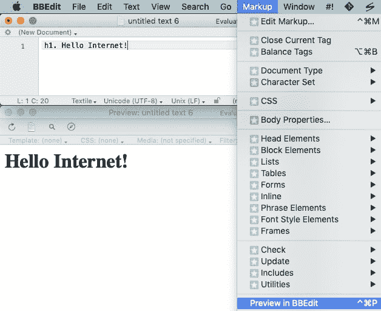
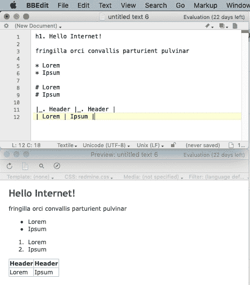

# 预览 BBEdit 红矿纺织的 CSS

> 原文：<https://dev.to/zeitschlag/preview-css-for-redmine-textile-in-bbedit-57aa>

几年前，我为 macOS 的商业文本编辑器 [BBEdit](https://www.barebones.com/products/bbedit/) 买了一个许可证，这还不错。但是:我从未读过[手册](https://s3.amazonaws.com/BBSW-download/BBEdit_12.5.2_User_Manual.pdf)，所以我不经常使用它。直到最近。

因为最近我发现，BBEdit 有几种标记语言的[预览模式](https://www.youtube.com/watch?v=4T673gfIP-s)，包括[纺织](https://en.wikipedia.org/wiki/Textile_(markup_language))和 [Markdown](https://en.wikipedia.org/wiki/Markdown) :只要打开一个 Markdown/纺织文件，然后按`CTRL+CMD+P`:

如果你愿意，你可以[写一些自定义 CSS](https://www.youtube.com/watch?v=_f_yG3ecaFM) 让预览看起来更好。自从我知道了 BBEdit 预览版，我就经常使用这个功能(当然还有 BBEdit ),至少一个小时一次。

在我的工作场所，我们使用 Redmine 作为项目管理工具。Redmine 内置了对[降价](http://www.redmine.org/projects/redmine/wiki/RedmineTextFormattingMarkdown)和[纺织](http://www.redmine.org/projects/redmine/wiki/RedmineTextFormattingTextile)的支持，所以你可以添加列表，或者*斜体文本*到你的问题或者维基页面。

在过去的几天里，我用 BBEdit 的试用版而不是 Redmine 来写我的问题或维基文本，然后再把它们复制粘贴回 Redmine。今天早上，我花了半个小时写了一些(基本的)CSS ，这使得一个纺织品文件的 BBEdit 预览看起来像渲染的 Redmine 文本。

我现在在 BBEdit 看到的(及其预览)是这样的:

Redmine 对完全相同文本的预览如下所示:

我[上传了 CSS 到 Github](https://gist.github.com/zeitschlag/7ea0b83469125e8425902e5eec8cc9e1) ，也许对你们有些人也有帮助？希望至少不会很糟糕。如果你错过了什么，请随意修改或写下评论。

感谢阅读。