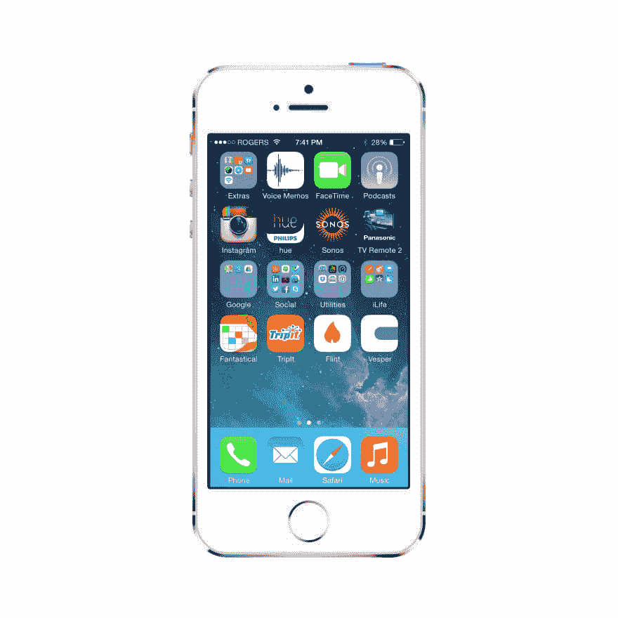
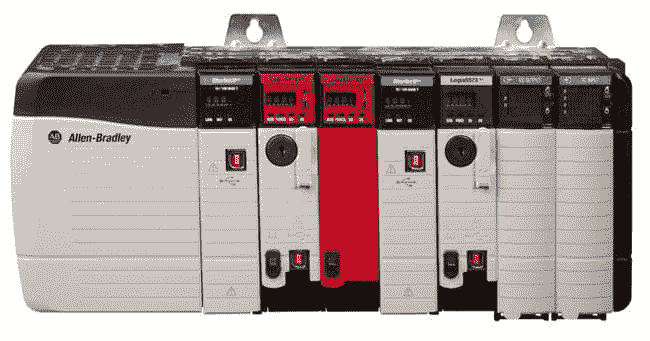

# 0:内核

> 原文：<https://dev.to/andcomputers_io/0-kernel-1f4k>

* * *

###### *本帖原载于 [&电脑. io](https://andcomputers.io/genesis/?utm_source=dev.to&utm_medium=crossplatformpost&utm_campaign=devtocrosspost)*

* * *

我们每天都要花大量的时间沐浴在电脑和科技的光芒中。这个事实不容争辩，也不难证明。

今天早上，我平静的睡眠被一台小得出奇、功能强大的电脑发出的声音打断了，这台电脑大部分时间都在我牛仔裤的右口袋里。

 

<figure>

<figcaption>今早打扰我睡觉的电脑。</figcaption>

</figure>

我睡过的床，是在网上订的。

记忆泡沫床垫由聚氨酯泡沫制成。你问这和电脑有什么关系？良好的...聚氨酯的生产只有通过严格控制的化学过程才有可能。这些过程基于在可编程逻辑控制器上运行的控制软件实现的测量和调整的连续循环，保持在超精确的操作条件下。

<figcaption>另一台电脑。在制作我舒适的床垫时发挥了重要作用。</figcaption>

还有更多更明显的例子可以说明计算机对我们日常生活的影响，但它们并没有那么有趣或随意。事实上，这个博客的任务是揭示计算机和技术影响我们日常生活的不太明显的例子。检验当你将计算机科学的逻辑和编程的力量应用于通常不会得到这种待遇的问题时会发生什么。

于是，就有了 **&电脑的称号。**这是对未开发的前沿领域的肯定，在新的视角下，这些领域可能会变得更加有趣。想*空白*T7】电脑；这里的*空白处*可以是你可能感兴趣的任何东西。

我对博客的希望有两个:

1.  触及“计算机人”(不管那是什么意思)通常不谈论的话题。
2.  将通常不觉得计算机特别有趣或不容易接触到的人带入圈子，让他们对技术/编程、它可以创造的魔力、它可以帮助我们回答的问题以及它可以帮助我们接触的人感到兴奋。

感谢阅读，请发表评论、讨论、反馈、文章建议等。在论坛上。我期待着收到大家的来信。说真的。

向前&向上，

我刚在网上做了十个架子，把我的作品放到网上，我还没完成。

-特雷斯数码

[https://w.soundcloud.com/player/?url=https://soundcloud.com/tres_digital/silicon-icon&auto_play=false&color=%23000000&hide_related=false&show_comments=true&show_user=true&show_reposts=false&show_teaser=true](https://w.soundcloud.com/player/?url=https://soundcloud.com/tres_digital/silicon-icon&auto_play=false&color=%23000000&hide_related=false&show_comments=true&show_user=true&show_reposts=false&show_teaser=true)