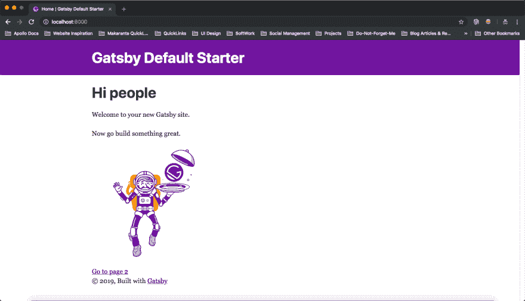
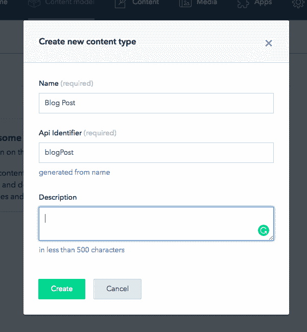
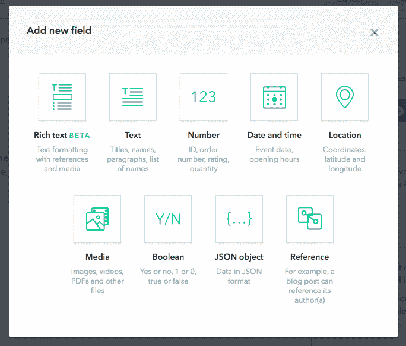
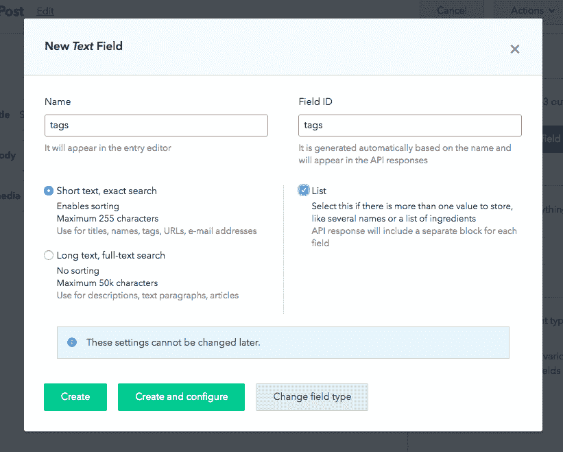
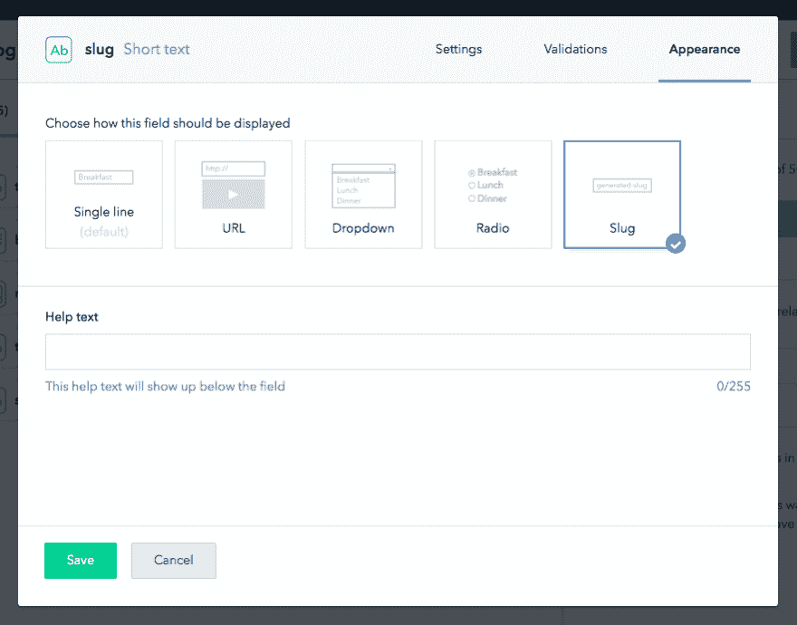
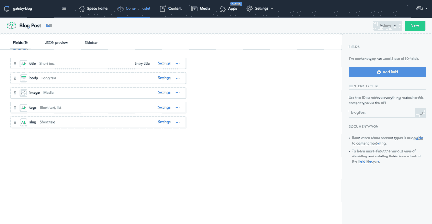
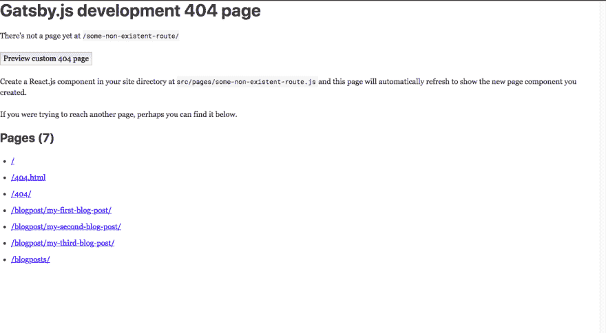
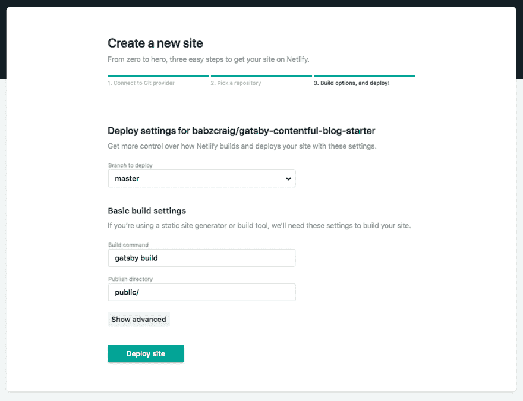
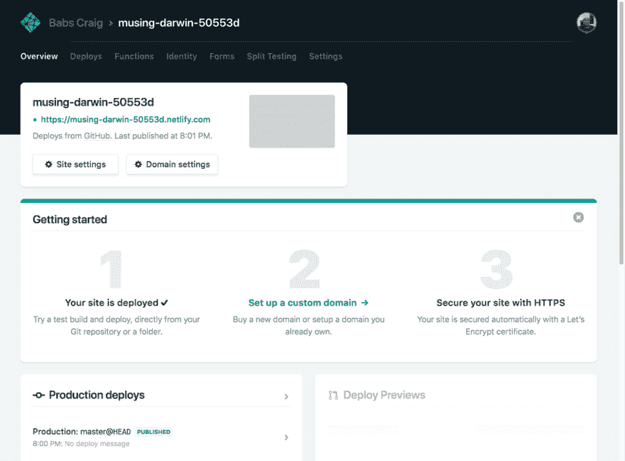
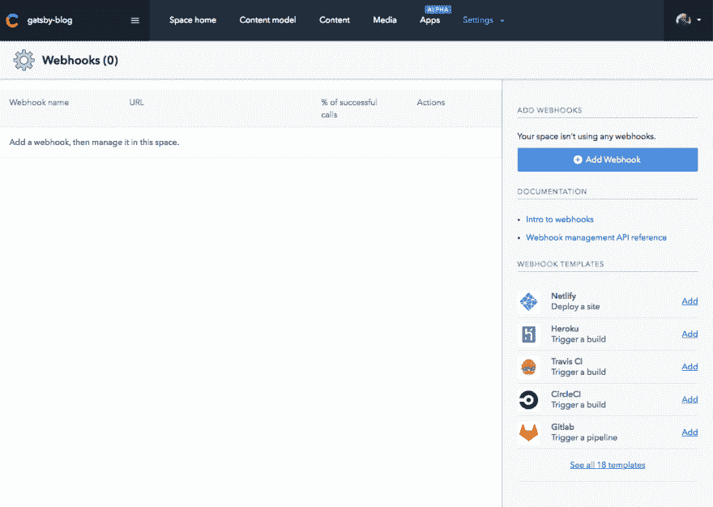

# 盖茨比的内容管理

> 原文：<https://dev.to/thebabscraig/content-management-with-gatsby-netlify-and-contentful-3kbg>

### Gatsby、Netlify 和 Contentful——内容管理成功的三重标签团队

我已经用了盖茨比大半年了。它很快成为我构建静态站点的首选。优势是巨大的。您将获得:

*   许多现成的配置和样板文件。
*   速度，搜索引擎优化和性能优化。
*   一个伟大的社区，伟大的文档，一个成长中的插件生态系统。
*   我个人最喜欢的是——编写所有我想要的 React & GraphQL 代码。

至少可以说，这是一次很棒的开发体验。然而，在构建静态站点时，选择工具的一个主要考虑因素是站点上的内容如何更新。许多老的平台已经以这样或那样的方式解决了这个问题，Wordpress 是其中最受欢迎的，但是使用 Gatsby、Netlify 和 Contentful 的三重威胁，我们可以建立一个很好的替代传统 CMS 工具的工具，同时保留我们的 SEO 兼容性。

本文将向您展示如何建立一个系统来管理 Gatsby 站点任何页面上的内容。在我们的例子中，我们将使用 Gatsby 强大的`gatsby-node` API 从 Contentful 获取内容并动态生成页面。您还可以通过提供的`graphql`查询在任何现有页面上使用内容丰富的数据。

我们开始吧。

你需要`gatsby-cli`工具来开始。在您的终端中运行`npm i -g gatsby`,一旦运行完毕，使用

```
$ gatsby new gatsby-contentul-blog 
```

这将在名为`gatsby-contentful-blog`的文件夹中创建一个新的 Gatsby 项目。`cd`进入新项目，运行`gatsby develop`。现在你有了默认的 Gatsby starter 主页:

[](https://res.cloudinary.com/practicaldev/image/fetch/s--UX1jDeRN--/c_limit%2Cf_auto%2Cfl_progressive%2Cq_auto%2Cw_880/https://thepracticaldev.s3.amazonaws.com/i/9ky37i99rfjj6z50dozl.png)

在您最喜欢的文本编辑器中打开项目，并导航至`pages`文件夹。让我们调整一下`index.js`中的一些内容:(您可以复制并粘贴进来)

```
 import React from "react";
    import { Link } from "gatsby";

    import Layout from "../components/layout";
    import Image from "../components/image";
    import SEO from "../components/seo";
    import "./index.css";

    const IndexPage = () => (
      <Layout>
        <SEO title="Home" keywords={[`gatsby`, `application`, `react`]} />
        <div className="home">
          <h1>Hello There</h1>
          <p>Welcome my awesome blog</p>
          <div>
            <div
              style={{
                maxWidth: `300px`,
                margin: "0 auto 1.45rem"
              }}
            >
              <Image />
            </div>
          </div>
          <Link to="/blogposts/">View all posts</Link>
        </div>
      </Layout>
    );

    export default IndexPage; 
```

接下来，找到 page-2.js 并将文件名改为 blogposts.js，Gatsby 使用 pages 文件夹中任何文件的名称作为路由名称，并将使导出的 React 组件在所述路由上可用。这意味着我们现在有了一个/blogposts 路由。我们稍后将回到这个文件，但同时，让我们也更改 gatsby-config.js 文件中的几个值。该文件位于项目根目录中。

```
siteMetadata: {
        title: `My Awesome Blog`,
        description: `An awesome blog displaying my awesome posts.`,
        author: `YOUR_NAME`,
    }, 
```

太好了！我们现在已经建立了基本的站点。因此，我们将转到 [Contentful](https://www.contentful.com/) 网站并创建一个新帐户。这是相当无痛的，你应该在任何时间设置。默认情况下，它们提供了一个示例空间，但是让我们为项目创建一个新的空间。

打开工具条，点击**创建空间**。选择免费选项，给你的共享空间起一个名字。我会把我的名字叫做**盖茨比博客**。选择空白处选项，点击**进行确认，点击**确认您的选项。

确认后，在仪表板上，单击标题中的“创建内容类型”按钮或“内容模型”按钮，并填写出现的表单。让我们调用内容类型 **Blog Post** 并保持 API 标识符不变。输入您想要的任何描述。

[](https://res.cloudinary.com/practicaldev/image/fetch/s--K_ZLabNy--/c_limit%2Cf_auto%2Cfl_progressive%2Cq_auto%2Cw_880/https://thepracticaldev.s3.amazonaws.com/i/2ug3idf8zpys1k33e7ku.png)

创建内容类型后，我们将开始向它添加一些字段，字段是我们内容的构建块。例如，如果你有一篇博客文章，一些字段可以是标题、*正文*、*标签*和*图片*。这将生成一个表单，稍后当我们开始创建实际的博客帖子时，您可以填写该表单。按照下面的步骤创建一个*标题*字段。

*   点击仪表板右侧的**添加字段**按钮。
*   选择**文本**作为您想要的字段类型。

[](https://res.cloudinary.com/practicaldev/image/fetch/s--_wATy207--/c_limit%2Cf_auto%2Cfl_progressive%2Cq_auto%2Cw_880/https://thepracticaldev.s3.amazonaws.com/i/qh9cq2jx7m4lj9f5tk3w.png)

*   添加另一个字段。选择**媒体**作为类型，而不是**文本**，称之为**图像**。
*   通过选择文本作为类型，添加一个*标签*字段。给它命名为**标签**，然后选择下面屏幕上的**列表**选项，因为我们将在这个字段中存储一个*标签*的列表。

[](https://res.cloudinary.com/practicaldev/image/fetch/s--eJC8dbd7--/c_limit%2Cf_auto%2Cfl_progressive%2Cq_auto%2Cw_880/https://thepracticaldev.s3.amazonaws.com/i/urcdr0k07cfnq8rwpayp.png)

*   最后，创建一个 slug 字段。首先选择文本作为类型，并将其命名为 slug。这一次，不是像上面那样单击 Create，而是单击 Create and Configure。在下一个屏幕上，转到 Appearance 选项卡，选择 slug 作为字段应该显示的方式。此外，在验证选项卡中选择唯一字段，以确保没有两个博客帖子具有相同的 slugs

[](https://res.cloudinary.com/practicaldev/image/fetch/s--Hrc8-kB1--/c_limit%2Cf_auto%2Cfl_progressive%2Cq_auto%2Cw_880/https://thepracticaldev.s3.amazonaws.com/i/p16x5r6dp3wf1zz60hpz.png)

您的内容模型现在应该如下所示:

[](https://res.cloudinary.com/practicaldev/image/fetch/s--biw4Z4m1--/c_limit%2Cf_auto%2Cfl_progressive%2Cq_auto%2Cw_880/https://thepracticaldev.s3.amazonaws.com/i/m1qq9crh579mc7z1fgc2.png)

内容模型就像我们的实际内容将遵循的模式。您可以创建所有类型的模型，例如案例研究、博客文章、产品数据、页面内容等等。

保存您的更改，点击页面顶部的**内容**按钮，并选择**添加博客文章**。我将添加三个带有占位符数据的帖子，您可以随意添加。对于图片，你可以从 unsplash.com[获得一些免费的、开放的许可。注意当您输入标题时，`slug`字段是如何自动生成的？这个以后会派上用场的。](https://unsplash.com)

厉害！这是很多，但我们已经走了一半了...

现在我们有了第一批博客文章，是时候把它们放到我们的盖茨比网站上了。为此，我们将依靠 Gatsby 出色的 GraphQL API 来获取数据。接下来让我们继续。

在 Contentful 中进入你的设置，点击下拉菜单中的 **API 键**选项。创建一个新的 API 密钥，并将详细信息保存在附近。

回到你的终端，安装 Gatsby 插件，我们需要开始拉我们的内容数据。

```
$ yarn add gatsby-source-contentful 
```

我们将使用 Contentful 的*内容交付 API* ，因为我们只想检索已发布的数据，所以一定要获取*内容交付 API* 密钥，而不是*内容预览 API 密钥*。

在您的`gatsby-config.js`文件中，将配置对象添加到`plugins`数组:

```
plugins: [
        ...
    {
      resolve: `gatsby-source-contentful`,
      options: {
        spaceId: `YOUR_SPACE_ID`,
        accessToken: `YOUR_CONTENT_DELIVERY_API_KEY`
      }
    }
], 
```

此时，您应该重新启动开发服务器，让新的配置生效。当服务器重新启动时，`gatsby-source-contentful`的 GraphQL 查询将可供使用。

通过使用 Gatsby 为我们提供的 GraphiQL playground，我们可以很容易地测试一切是否正常。在您的浏览器中打开[http://localhost:8000/_ _ _ graph QL](http://localhost:8000/___graphql)并运行下面的查询，将其粘贴到页面的左侧窗口中。查询名为`allContentfulBlogPost`，因为我们的内容模型名为 **Blog Pos** t。如果我们将其命名为 **Product** 或 **Case Study** ，那么我们可用的查询将是`allContentfulProduct`或`allContentfulCaseStudy`。

```
{
  allContentfulBlogPost {
    edges {
      node {
        id
    slug
        title
        tags
        image {
          file {
            url
          }         
        }
      }
    }
  }
} 
```

`gatsby-source-contentful`插件使用我们在`gatsby-config`文件中提供的键来处理从 Contentful API 中获取的所有幕后操作。然后，它使我们可以使用语义命名的 GraphQL 查询。

如果一切正常，您应该可以在 GraphiQL 窗口右侧的结果窗口中看到 JSON 格式的内容。

既然我们已经将 Gatsby 博客与内容丰富的数据连接起来，我们就可以开始为博客构建页面了。盖茨比给我们提供了一个叫做`gatsby-node.js`的文件。该文件可用于向您的站点动态添加页面。当 Gatsby 运行时，它会查看这里的代码，并创建您让它创建的任何页面。在`gatsby-node.js`文件中，我们放置以下代码:

```
const path = require(`path`);
const slash = require(`slash`);

exports.createPages = ({ graphql, actions }) => {
  const { createPage } = actions;
  // we use the provided allContentfulBlogPost query to fetch the data from Contentful
  return graphql(
    `
      {
        allContentfulBlogPost {
          edges {
            node {
              id
              slug
            }
          }
        }
      }
    `
  ).then(result => {
      if (result.errors) {
        console.log("Error retrieving contentful data", result.errors);
      }

      // Resolve the paths to our template
      const blogPostTemplate = path.resolve("./src/templates/blogpost.js");

      // Then for each result we create a page.
      result.data.allContentfulBlogPost.edges.forEach(edge => {
        createPage({
          path: `/blogpost/${edge.node.slug}/`,
          component: slash(blogPostTemplate),
          context: {
                        slug: edge.node.slug,
            id: edge.node.id
          }
        });
      });
    })
    .catch(error => {
      console.log("Error retrieving contentful data", error);
    });
}; 
```

这个模块导出一个名为`createPages`的函数。这个函数有两个参数，graphql 和一个 actions 对象。我们提取`createPage`动作，然后调用我们之前在 GraphiQL playground 中运行的相同 Graphql 查询。我们获取这个结果，并为每个结果(每篇博文)调用`createPage`函数。这个函数接受一个 config 对象，Gatsby 在呈现页面时会读取这个对象。我们将路径设置为连接的字符串`"/blogpost"`加上`slug`。注意，我们还在`./src/templates/blogpost.js`引用了一个模板文件，不用担心，我们很快就会创建那个文件。

此时，关闭您的服务器并再次启动它。如果你进入一个像 [`http://localhost:8000/some-non-existent-route/`](http://localhost:8000/dskl;sfd/) 这样的无用路线，你会看到盖茨比的发展 404 页。这个页面有一个所有路线的列表，你可以看到新创建的页面已经设置好了。

[](https://res.cloudinary.com/practicaldev/image/fetch/s--i79Vyr3H--/c_limit%2Cf_auto%2Cfl_progressive%2Cq_auto%2Cw_880/https://thepracticaldev.s3.amazonaws.com/i/vccxoje4ego29cotict2.png)

明白我们为什么选择一个独特的废料场了吗？每个帖子必须有一个独特的路线，使用 slugs 看起来比在 URL 中使用无意义的 ID 字符串好得多。此外，由于 Gatsby 生成了一个静态网站，可以有一个网站地图，这是更好的搜索引擎优化有你的路线名称匹配你想排名的内容类型。

现在我们可以专注于构建实际的页面了。

在你的`src`文件夹中创建一个`templates`文件夹，并添加一个名为`blogpost.js`的文件。这将是我们的模板组件，每次 Gatsby 调用`gatsby-node.js`文件中的`createPage`函数时都会用到它。

**注意**:如果出现任何错误，请务必在此时重启服务器。我们正在做大量的配置工作，Gatsby 可能需要重启才能正常运行。

```
import React from "react";
import { Link, graphql } from "gatsby";
import Layout from "../components/layout";
import SEO from "../components/seo";

const BlogPost = ({ data }) => {
  const { title, body, image, tags } = data.contentfulBlogPost;
  return (
    <Layout>
      <SEO title={title} />
      <div className="blogpost">
        <h1>{title}</h1>
        
        <div className="tags">
          {tags.map(tag => (
            <span className="tag" key={tag}>
              {tag}
            </span>
          ))}
        </div>
        <p className="body-text">{body.body}</p>
        <Link to="/blogposts">View more posts</Link>
        <Link to="/">Back to Home</Link>
      </div>
    </Layout>
  );
};

export default BlogPost;

export const pageQuery = graphql`
  query($slug: String!) {
    contentfulBlogPost(slug: { eq: $slug }) {
      title
      slug
      body {
        body
      }
      image {
        file {
          url
        }
      }
      tags
    }
  }
`; 
```

在页面底部，我们导出一个 Graphql 查询。盖茨比将在运行时运行这个查询，并将一个**数据**道具传递给包含内容丰富的数据的**博客**。注意，在这种情况下，我们查询的是一个帖子，并将该段文字作为过滤器参数传递。我们基本上是在请求与 slug ( `contentfulBlogPost(slug: { eq: $slug })`)中传递的帖子相匹配的帖子。这段代码对我们来说是可用的，因为我们在`gatsby-config.js`中将它作为页面上下文传入。

剩下的就是直截了当的反应。我们创建一个组件，并使用数据属性填充页面内容。我们还没有造型，但我们会得到一点。

我们现在需要的是一个列出所有可用博客文章页面的页面。我们不能每次需要阅读博客文章的时候都去 404 页面！

让我们回到这个项目开始时创建的`pages`文件夹中的`blogposts.js`文件，并对其进行调整。

```
import React from "react";
import { Link, graphql } from "gatsby";

import Layout from "../components/layout";
import SEO from "../components/seo";

const BlogPosts = ({ data }) => {
  const blogPosts = data.allContentfulBlogPost.edges;
  return (
    <Layout>
      <SEO title="Blog posts" />
            <h1>{"Here's a list of all blogposts!"}</h1>
      <div className="blogposts">
        {blogPosts.map(({ node: post }) => (
          <div key={post.id}>
            <Link to={`/blogpost/${post.slug}`}>{post.title}</Link>
          </div>
        ))}
        <span className="mgBtm__24" />
        <Link to="/">Go back to the homepage</Link>
      </div>
    </Layout>
  );
};

export default BlogPosts;

export const query = graphql`
  query BlogPostsPageQuery {
    allContentfulBlogPost(limit: 1000) {
      edges {
        node {
          id
          title
          slug
          body {
            body
          }
          image {
            file {
              url
            }
          }
          tags
        }
      }
    }
  }
`; 
```

模式现在应该很熟悉了。

在页面底部，我们导出一个 GraphQL 查询。该查询与我们在`gatsby-nod.js`中用来生成 blogpost 页面的查询相同。它提取所有 **BlogPost** 类型的内容数据。Gatsby 在数据对象中向我们提供查询结果，就像使用单个 blogpost 页面一样。但是对于这个页面，我们只需要`id`、`title`、`slug`和`tags`字段。

在这一点上，让我们添加一些非常基本的造型。出于这个例子的原因，我们将只在`layout.css`文件的末尾添加几行，但是在现实世界的项目中，您可能不希望这样做。用你觉得舒服的任何方法。

```
/* Add these lines to the end of the layout.css file */
@import url("https://fonts.googleapis.com/css?family=Open+Sans:300,400,600");
html {
  font-family: "Open Sans";
}

header {
  /* We use !important here to override
  the inline styles just for this example.
  in production code, avoid using it where
  possible*/
  background-color: cadetblue !important;
}

header div {
  text-align: center;
}

header div h1 {
  font-weight: 600;
}

.home {
  text-align: center;
}

.home img {
  margin: auto;
}

.blogpost {
  font-size: 18px;
  width: 35em;
}

h1 {
  font-weight: 400;
  margin-top: 48px;
  font-family: "Open Sans";
}

img {
  margin-bottom: 8px;
}

.tags {
  margin-bottom: 24px;
}

.tags span.tag {
  font-weight: bold;
  margin-right: 8px;
  background: cadetblue;
  padding: 2px 12px;
  border-radius: 4px;
  color: white;
  font-size: 12px;
}

.blogpost p.body-text {
  margin-bottom: 32px;
}

p {
  line-height: 1.8;
  color: #929191;
  font-weight: 300;
}

.blogpost a {
  display: block;
  margin-bottom: 8px;
}

.blogposts a {
  display: block;
  margin-bottom: 8px;
}

footer {
  margin-top: 120px;
}

.mgBtm__24 {
  display: inline-block;
  margin-bottom: 24px;
} 
```

现在我们有了自己的博客，下一步就是部署它，让全世界都能看到它。有了 Netlify，这变得超级简单。Netlify 与 GitHub 整合得非常好。在您的终端中，运行:

```
 $ git init 
```

转到您的 GitHub 并创建一个名为`gatsby-contentful-blog-starter`的新 repo，然后按照命令推送至一个现有的存储库。

```
 $ git add .
    $ git commit -m 'initial commit'
    $ git remote add origin git@github.com:YOUR_GITUHB_USERNAME/gatsby-contentful-blog-starter.git
    $ git push -u origin master 
```

把你的代码推送到 GitHub，然后去 [Netlify](https://www.netlify.com/) 创建一个账户。在您的仪表板中，点击 Git 的“**新网站”，选择 **GitHub** 作为提供商，并通过授权流程选择您觉得合适的选项。**

接下来，从提供的列表中选择一个回购。如果您找不到我们刚刚创建的回购，请选择**在 GitHub** 上配置 Netlify 应用程序。这将打开一个弹出窗口，允许您选择要授权用于 Netlify 的回购。按照提示，直到你找到回购。选择我们的博客项目后，您将被重定向到 Netlify deploy 屏幕，现在您应该能够选择`gatsby-contentful-blog-starter` repo。如你所见，Netlify 知道如何建立 Gatsby 站点，所以你只需点击页面末端的**部署站点**按钮。
[](https://res.cloudinary.com/practicaldev/image/fetch/s--yJFwyexX--/c_limit%2Cf_auto%2Cfl_progressive%2Cq_auto%2Cw_880/https://thepracticaldev.s3.amazonaws.com/i/hvd8yjxa964zhv2p8h26.png) 
Netlify 用最少的配置运行盖茨比网站真的很容易。您的新网站应该在几分钟内准备就绪。
[](https://res.cloudinary.com/practicaldev/image/fetch/s--mAQj2Zfs--/c_limit%2Cf_auto%2Cfl_progressive%2Cq_auto%2Cw_880/https://thepracticaldev.s3.amazonaws.com/i/gipumtmbmhslsc2godx5.png) 
还记得我们如何杀死服务器并重启它以获取新数据吗？我们不希望每次有人添加或更改内容时都必须手动触发重新部署。解决方案是使用 Contentful 的钩子来触发我们站点的自动网络重新部署(是的，这个三重标签团队考虑到了一切)。

这意味着你添加的每一篇博客文章都会自动添加新的页面到你的博客中。此外，如果您使用 Gatsby sitemap 插件，新页面将在部署时重新生成并包含在 sitemap 中，这使得关键字排名更加容易，并有助于您的 SEO 工作。

在 Netify 上点击**站点设置**，然后在左侧菜单中选择**构建&部署**。找到**添加构建钩子**按钮并点击它，给构建钩子一个名字(我用的是“ **contentful** ”)，然后点击 **Save** 。

现在复制 **buildhook** url 并返回到您的内容丰富的仪表板。点击设置下拉菜单，选择**网页挂钩**。Webhooks 屏幕的右下角已经有一个 Netlify 的模板。点击这个。
[](https://res.cloudinary.com/practicaldev/image/fetch/s--3gYik64L--/c_limit%2Cf_auto%2Cfl_progressive%2Cq_auto%2Cw_880/https://thepracticaldev.s3.amazonaws.com/i/obxnukrcw08z88hytngx.png) 
在出现的表单中，添加 Netlify 构建钩子 url，点击**创建 Webhook** 。

现在回到**内容**页面，添加一篇新的博客文章。只要点击 publish，Contentful 就会对您提供的构建挂钩进行 API 调用。这又会导致 Netlify 重新部署您的站点。Gatsby 将再次引入内容丰富的数据，现在包括您添加的新文章，并基于新的博客文章创建一个新页面。

就是这样！这是一个漫长的旅程，但是现在我们有了一个可以使用的博客，它使用了三个很棒的工具，它们可以很好地协同工作。从这里，您可以添加更多的内容类型和页面，扩展网站或从头开始一个新项目。黑客快乐！

页（page 的缩写）s:我知道这是一个很长的问题，如果你卡住了，我很乐意回答你的任何问题。如果你这样做了，请在下面的评论中给我留言，或者在 Twitter 上给我打电话:T0 @ thebascraig T1，我总是很乐意一起学习。我也希望在 Instagram 上与其他开发者联系，所以也可以在那里通过[@ the bascraig](https://www.instagram.com/thebabscraig)联系我！