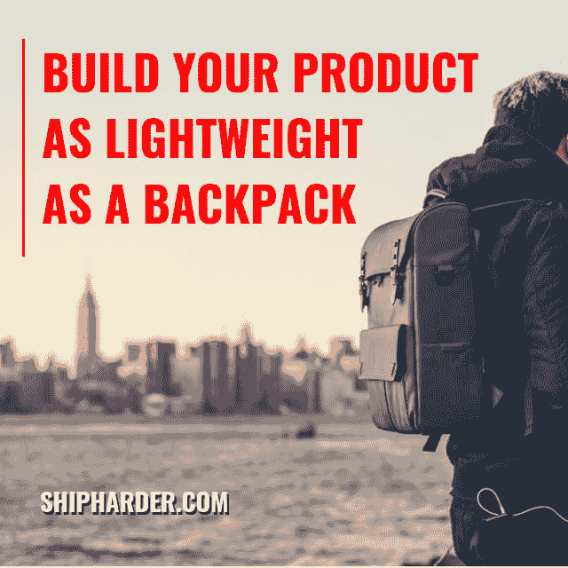

# 构建产品类似于打包背包

> 原文：<https://dev.to/eekayonline/building-product-is-similar-to-packing-a-backpack-4ein>

当你在制造你的产品时，想象你正在打包你的背包🎒。

你需要它只携带你要去旅行所需要的东西。

你需要尽可能少吃，因为每多吃一盎司会让你越来越努力📈。

这也适用于一对一的构建产品:打包太多的特性或者只是你想快速放进去的一点点功能...并且您可能最终会承担它的重量——无论是以修复 bug、处理支持、延长部署周期等形式。

因此，当你定义你的 MVP，或者建立概念证明时，明智地考虑下一次你将在“你的背包”里放什么，因为它可能只是后来额外的重量🏋️‍♂️.

相信我，我在这方面已经有过教训了👨🏻‍🏫...

轻装上阵，只为你想去的场合和旅行准备必需品。

比如，与需要立即阅读这篇文章的人分享或标记这篇文章🙌🏻

努力编码，努力运输✌🏻