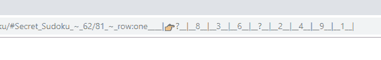

# 我把数独移植到你的地址栏，它玩起来像做梦一样

> 原文：<https://dev.to/healeycodes/i-ported-sudoku-to-your-url-bar-and-it-plays-like-a-dream-233d>

无需刷新。这是你从未见过的数独。远离同事和老板窥探的目光。由`window.location.hash`的黑魔法驱动。如此强大，以至于仅仅加载页面就会让你的浏览器历史后悔。

[](https://res.cloudinary.com/practicaldev/image/fetch/s--EIAfpXy6--/c_limit%2Cf_auto%2Cfl_progressive%2Cq_66%2Cw_880/https://thepracticaldev.s3.amazonaws.com/i/1mp3bmv7dyrryev0m67a.gif)

可玩的[就在这里](https://healeycodes.github.io/secret-sudoku/)，秘密 Suduko 为我开启了一系列独特的经历。并不是每天你都会发现自己野蛮地破解一个 19 世纪的报纸难题。或者，更好的是，让特拉维斯 CI 帮你做。

```
test('app plays without error', () => {
    const game = main(this, sudoku);
    game.startGame();
    for (let i = 0; i < 20000; i++) {
        // 0-81, 0-9
        if (game.play(Math.floor(Math.random() * 82), Math.floor(Math.random() * 10)) === true) {
            /* This test will usually complete the game six times over,
               adjust the difficulty randomly on completion */
            game.startGame(Math.floor(Math.random() * 6));
        };
    }
}); 
```

事实证明，你所需要的只是一些表情、几个事件监听器和一个梦想。非常感谢 Rob McGuire-Dale 和他奇妙的数独生成器/解算器。

```
// Main render functions
this.squaresFilled = () => this.board.join('').match(/[^.]/g).length
this.completeness = () => `${this.squaresFilled()}/81`;
this.start = () => `Secret_Sudoku_~_${this.completeness()}_~_row:`;
this.render = (extra = '') => {
    window.location.hash = `${this.start()}${this.rowMap[this.row]}__${this.prettifyRow(this.currRow(), this.cursor)}${extra}`;
} 
```

秘密数独是帮助我在晚上放松的完美项目。它让编程比逻辑抽象更有趣。今天和以后的每一天都接受拉取请求。

##  [ healeycodes ](https://github.com/healeycodes) / [秘密数独](https://github.com/healeycodes/secret-sudoku)

### 在浏览器的地址栏中玩数独！🎲 🀄

<article class="markdown-body entry-content container-lg" itemprop="text">

[](https://travis-ci.org/healeycodes/secret-sudoku)

### 秘密数独

*躲避窥探的目光..*

[](https://healeycodes.github.io/secret-sudoku/)

#### 在你的地址栏中玩经典的数独游戏！

一个周日项目，由`window.location.hash`和 <g-emoji class="g-emoji" alias="coffee" fallback-src="https://github.githubassets.cimg/icons/emoji/unicode/2615.png">☕</g-emoji> 提供动力

value @[https://Healey codes . github . io/secret-sudku/](https://healeycodes.github.io/secret-sudoku/)

### 安装

`npm install`

### 试验

`npm test`

*   使用 Jest 来测试主要功能，并在不同的难度下完成游戏。

*   在 GitHub 上，使用由 Travis CI 支持的持续集成！

### 部署

将项目文件放在您希望托管游戏的目录中(假设为 HTTP/S)。

对于本地使用，只需打开`index.html`

</article>

[View on GitHub](https://github.com/healeycodes/secret-sudoku)

* * *

加入我的关于编程和个人成长的[时事通讯](https://buttondown.email/healeycodes)的 150 多人注册！

我发关于科技的微博。