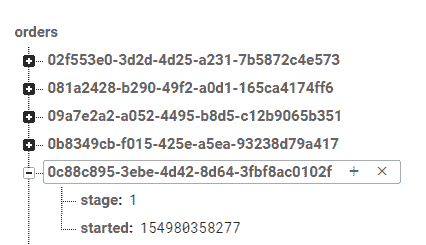
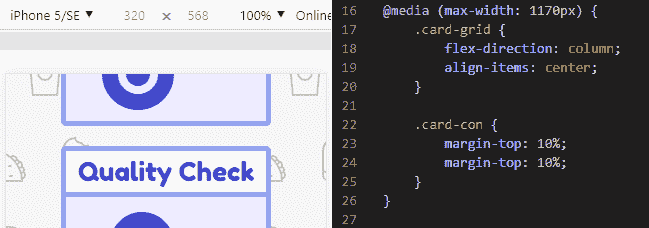

# 用 Node.js 和 Firebase 克隆多米诺订单跟踪器作为微服务！

> 原文：<https://dev.to/healeycodes/cloning-dominos-order-tracker-as-a-microservice-with-nodejs-and-firebase-52p2>

订单跟踪器是 AJAX 的一个很好的例子:一个网页在后台流畅地自我更新(即使客户会刷新垃圾邮件！)

在过去的一周里，我创建了一个最小订单跟踪器，我将重点介绍我的一些设计选择，并分享一些来自微小代码库最重要部分的摘录。

从后向前，我们从 Firebase 实时数据库开始。

[](https://res.cloudinary.com/practicaldev/image/fetch/s--Qi6WmI5s--/c_limit%2Cf_auto%2Cfl_progressive%2Cq_auto%2Cw_880/https://thepracticaldev.s3.amazonaws.com/i/mf2nlks3ju9hc2cz0c92.png)

在这里，我们定义了订单可能处于的五个阶段，并且我们还跟踪订单跟踪实例的创建时间，以便将来进行日志记录。

我们唯一需要的软件包是 Express 和 Firebase API。我们在合理的地方使用环境变量，这样我们的应用程序可以在不使用生产数据库的情况下进行测试。

```
/* Firebase */
const admin = require('firebase-admin');
const serviceAccount = require(process.env.KEY);
admin.initializeApp({
    credential: admin.credential.cert(serviceAccount),
    databaseURL: process.env.DB
});
const db = admin.database();

/* Express */
const express = require('express');
const app = express();
const server = require('http').Server(app);
app.use(express.static('public'));
app.use(express.json()); 
```

只有三条捷径可以创建一个我们(企业)和用户浏览器可以与之对话的 API。请注意，公共/私有路由的身份验证已留给读者作为练习。正如我们将在后面看到的，所有网页内容都是静态托管的。

```
// Create a tracking instance
app.get('/private/orders', (req, res) => {
    const orderId = uuidv4();
    db.ref(`orders/${orderId}`).set({
        started: Date.now(),
        // Integer: 1-5 inclusive
        stage: 1
    })
        .then(() => {
            return res.send(orderId);
        })
        .catch((err) => {
            console.error(`Error creating tracking instance: ${err}`);
            return res.status(500).send('Server error');
        })
});

// Set a tracking instance's state
app.post('/private/orders', (req, res) => {
    db.ref('orders').child(req.body.orderId).set({
        // Clamp stage
        stage: Math.max(1, Math.min(5, req.body.stage))
    })
        .then(() => {
            return res.send('OK');
        })
        .catch((err) => {
            console.error(`Error setting tracking instance state: ${err}`);
            return res.status(500).send('Server error');
        })
});

// Client access to a tracking insance
app.get('/public/orders/:orderId', (req, res) => {
    const orderId = req.params.orderId;
    db.ref(`orders/${orderId}`)
        .once('value')
        .then(data => {
            order = data.val();
            if (order !== null) {
                return res.send(order);
            } else {
                console.error(`Unknown tracking instance requested: ${orderId}.`);
                return res.status(500).send('Server error');
            }
        })
        .catch((err) => console.error(`Order: ${orderId} errored: ${err}`));
}); 
```

在前端，我们抓取一些字体很棒的图标，把它们放在一些红/蓝盒子里，里面有我们可以切换的类，我们就快完成了。为了保持范围尽可能小，我们用 JavaScript 读取查询参数。这样，我们的微服务可以托管一个静态页面，一个。js 文件和一个。css 文件。

```
// The query parameter `orderId` lets us provide order tracking
window.orderId = new URLSearchParams(window.location.search).get('orderId');

// If delivery in progress, check for new information every X seconds
window.localStage = null; // Integer: 1-5 inclusive
const checkStage = () => {
    fetch(`/public/orders/${window.orderId}`)
        .then(res => res.json())
        .then(data => {
            applyStage(data.stage);
        })
        .catch(err => console.error(`Error connecting to server: ${err}`))
    if (window.localStage < 5) {
        setTimeout(checkStage, 10000);
    }
} 
```

一些 CSS 媒体对我们手机朋友的询问。这就像翻转 flex 网格并添加一些填充一样简单。

[](https://res.cloudinary.com/practicaldev/image/fetch/s--4Q6NaqWR--/c_limit%2Cf_auto%2Cfl_progressive%2Cq_auto%2Cw_880/https://thepracticaldev.s3.amazonaws.com/i/sh4y45xkgot633xexxwl.png)

我喜欢确保我所有的项目都经过良好的测试。它帮助我在休息一会儿后跳回它们中，并阻止我践踏代码库破坏一切。对于这个应用程序，我选择了 SuperTest(摩卡自带)。

例如，该测试检查所有数据管道是否正常工作。

```
/**
 * Test client accessing a tracking instance
 */
describe('GET /public/orders/:orderId', () => {
    it('respond with an order stage', (done) => {
        // Create an order instance
        request(app)
            .get('/private/orders')
            .end((err, res) => {
                request(app)
                    // Request this instance's stage from client route
                    .get(`/public/orders/${res.text}`)
                    .expect((res) => {
                        const stage = res.body.stage
                        // An integer within 1-5
                        assert(stage > 0 && stage < 6 );
                    })
                    .expect(200, done);
            });
    });
}); 
```

[repo](https://github.com/healeycodes/order-tracking-microservice) 使用 Travis CI 在每次提交时运行测试。Travis 提供的开源项目对我作为开发人员的旅程来说是一种福音，它帮助我构建了可以跨平台工作(和测试)的软件！

* * *

加入我的关于编程和个人成长的[时事通讯](https://buttondown.email/healeycodes)的 150 多人注册！

我发关于科技的微博。