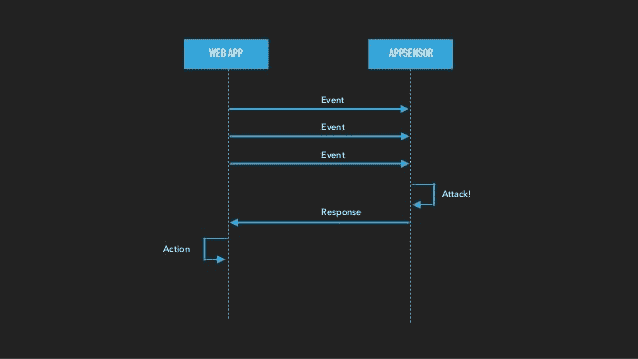

# 保护应用的十种方法

> 原文：<https://dev.to/heroku/ten-ways-to-secure-your-applications-48df>

*这篇博客文章改编自乔·考特纳在 Devoxx 2018 上的演讲，题目是“[黑客希望你犯的 10 个错误](https://www.youtube.com/watch?v=0jFAGmEVT7Y)*

构建自我保护的应用程序和服务不再是一种奢望，而是必须的。现在，应用安全补丁、正确处理密码、净化输入和正确编码输出是重中之重。我们的进攻者在不断进步，我们也必须如此。

在这篇博文中，我们将看看几种通常被忽视的保护 web 应用的方法。提供的许多例子都是针对 [Java](https://openjdk.java.net/) 的，但是任何现代编程语言都有相同的策略。请在评论中分享其他语言的方法。

## 1。确保依赖关系是最新的

每年， [OWASP](https://www.owasp.org/index.php/Main_Page) ，一个由安全专家和研究人员组成的小组，都会发布一份需要注意的常见应用程序安全风险列表。他们发现的一个更常见的问题是[使用具有已知漏洞的依赖关系](https://www.owasp.org/index.php/Top_10-2017_A9-Using_Components_with_Known_Vulnerabilities)。一旦一个已知的 [CVE](https://cve.mitre.org/) 发布，许多开源维护者和贡献者会集中精力发布流行框架和库的补丁更新。但是一份报告发现，超过 70%被利用的应用程序是由于过时的依赖关系造成的。

为了确保你的项目依赖于最新最好的包，并且推荐自动化你的依赖管理。

有了 [Maven](https://maven.apache.org/) ，你可以使用 [Maven 版本插件](https://www.mojohaus.org/versions-maven-plugin/)，它会自动更新你的`pom.xml`以使用最新的软件包。在 [Ruby](https://www.ruby-lang.org/en/) 中，`bundle update`命令做类似的事情。您可以将这些工具整合到您的 CI/CD 流程中，如果依赖关系过时，测试会彻底失败，从而迫使您在部署应用程序之前升级软件包。

一个更主动的方法可能是加入一个工具，自动监控你的依赖关系，比如 [Snyk](https://elements.heroku.com/addons/snyk) 。Snyk 不是在代码被修改时运行检查(如果不经常更新，这可能会使你的应用程序暴露在漏洞中长达数周或数月)，而是监控你的依赖关系，并将它们与[进行比较，后者是映射到依赖关系的已知漏洞列表](https://snyk.io/vuln)。如果发现问题，他们会用一份报告提醒您，指出哪些依赖项已经过时，哪个版本包含修补的修复程序。Snyk 也可以免费试戴 Heroku。

## 2。显式声明可接受的用户负载

通常，web 应用程序会接受用户通过表单或 API 提交的几乎任何东西。例如，用户可能试图创建一个密码超过 1000 个字符的帐户。当大量这样的请求被发送时，服务器可能会在加密这些请求所需的密集计算下崩溃。

减轻此类攻击的一种方法是实现数据库级约束。应该定义列的最大大小，否则您的数据模型应该拒绝接受`NULL`值。虽然在数据库上设置这些限制总是一个好主意，但它可能被认为太“低级”，因为某些攻击可以在请求周期的早期被利用。

如果您的应用程序暴露在互联网上，每个漏洞只需一个`curl`电话。[在 Jackson 数据绑定库](https://adamcaudill.com/2017/10/04/exploiting-jackson-rce-cve-2017-7525/)的一个例子中，一旦服务器收到请求，一个简单的 JSON 负载就能够执行任意代码。

通过**提供一个预期输入的明确列表**，你可以确保你的应用程序只对它知道将要到来的数据进行操作，而忽略(或者有礼貌地出错)其他的事情。如果您的应用程序接受 JSON，也许是作为 API 的一部分，实现 [JSON 模式](https://json-schema.org/)是建模可接受请求的一种极好的方式。例如，如果一个端点接受两个名为`firstName`和`lastName`的`string`字段，以及一个名为`age`的整数，那么验证用户提供的请求的 JSON 模式可能如下所示:

```
{  "title":  "Person",  "type":  "object",  "properties":  {  "firstName":  {  "type":  "string",  "description":  "The person's first name."  },  "lastName":  {  "type":  "string",  "description":  "The person's last name."  },  "age":  {  "description":  "Age in years which must be equal to or greater than zero.",  "type":  "integer",  "minimum":  1  }  }  } 
```

通过声明有效的类型，如果用户决定为`firstName`发送整数或为`age`发送负数，您可以防止意外问题的发生。

除了请求体之外，您还应该检查请求头和查询参数，它们同样可以被利用。

## 3。断言安全正则表达式

正则表达式对每个开发人员来说既是福音也是诅咒。它们可以使字符串的模式匹配变得很容易，但是一个拙劣的正则表达式也会导致应用程序崩溃。

考虑这样一个简单的模式:`(a|aa)+`。虽然看起来无害，但是与`+`操作符结合使用的`|`(“or”)可能会花费相当长的时间来匹配像`"aaaaaaaaaaaaaaaaaaaaaaaa!"`这样的字符串。恶意用户可以通过提交一个特别复杂(但在技术上仍然“有效”)的文本，在您的系统上造成拒绝服务攻击。([几年前，一个类似的问题影响了 Node.js 社区](https://medium.com/node-security/minimatch-redos-vulnerability-590da24e6d3c)。)

验证你的正则表达式将确保它们不会受到这种类型的[重做攻击](https://en.wikipedia.org/wiki/ReDoS#Malicious_regexes)。您可以使用的一个工具是 [saferegex](https://github.com/jkutner/saferegex) ，这是一个命令行 Java 实用程序，它将报告正则表达式导致问题的可能性:

```
$ java -jar target/saferegex.jar "(a|aa)+"

Testing: (a|aa)+
More than 10000 samples found.
***
This expression is vulnerable.
Sample input: aaaaaaaaaaaaaaaaaaaaaaaaaaaaaaaaaaaab 
```

## 4。防止滥用请求

构建一个流行的应用程序不仅仅是添加想要的特性。您的网站还需要处理随着增长而接收的流量。即使您的应用程序的每个部分都是安全的，反复攻击您的服务器的坏人也可能成功地使它们瘫痪。

为了确保用户的正常运行时间，你应该**抑制激进的客户端**。这可以通过几种不同的方式来实现，比如通过 IP 地址或用户代理来限制请求。

更好的实现是使用一个利用了令牌桶算法的库。 [Bucket4j](https://github.com/vladimir-bukhtoyarov/bucket4j) 就是这样一个库。传入的请求通过各种属性被分组到各个“桶”中，这些桶可以被限制或完全列入黑名单。通过分类哪些请求是可接受的，哪些是不可接受的，您将能够更好地处理突发的流量。

## 5。将您的代码调整为安全第一

通常，在一个特别令人沮丧的 bug 中，我们可能会匆忙地实现一个从互联网的某个角落偷来的解决方案。虽然解决问题可能是一种迫切需要的解脱，但再三检查你是否无意中引入了安全问题总是值得的。

几年前，[研究人员发现 StackOverflow 上大多数可接受的答案都包含不安全的缺陷](https://blog.acolyer.org/2018/06/27/secure-coding-practices-in-java-challenges-and-vulnerabilities)。**有效的代码并不意味着代码是安全的。**即使一个代码片段在短期内有效，绝对确定它可以安全使用也是很重要的。

## 6。将凭据存储在您的代码库之外

我们都知道(希望！)泄露你的个人密码可能是一个灾难性的错误。在任何足够复杂的应用程序中，都有许多不同的令牌和密码需要管理:您的数据库用户名和密码、对 New Relic 或 DataDog 或 Redis 进行身份验证的令牌...

将应用程序的配置与代码分开。即使您的存储库是私有的，嵌入明文凭证也不是一个好主意。一个不应该访问的心怀不满的员工可能会窃取令牌来冒充用户。为了确保您的项目是安全的，您应该确信，如果代码在任何时候成为开放源代码，您的任何凭证都不会受到损害。

将您的秘密存储在环境变量中。像 [dotenv](https://github.com/cdimascio/java-dotenv) 这样的库可以无缝地加载和利用这些变量，只要它们可以在安全的位置被访问。另一个选择是使用像 [Hashicorp Vault](https://www.vaultproject.io/) 这样的产品，它允许您的应用程序通过可配置的 CLI 管理机密。

## 7。拒绝 HTTP 请求

除非你有非常具体的用例，否则你应该**禁用到你的服务器**的 HTTP 连接。HTTPS 连接可以确保客户端和服务器之间的数据得到加密，从而防止中间人窥探攻击。大多数主流浏览器默认使用 HTTPS 连接，像 [Let's Encrypt](https://letsencrypt.org/) 这样的服务让你的应用程序比以往更容易获得 SSL 证书。

如果您需要在本地或在代理和您的 web 服务器之间支持 HTTP，您可以配置您的服务器只接受其 [`X-Forwarded-Proto`请求头](https://developer.mozilla.org/en-US/docs/Web/HTTP/Headers/X-Forwarded-Proto)设置为`https`的客户端。根据您的设置，这也可以通过 NGINX 或 Apache 配置在代码之外进行配置。

## 8。启用证书检查

有时，您的应用程序可能需要调用外部提供者。类似于上面的建议，您应该**为传出连接**启用证书检查。这确保了通过 HTTPS 与第三方 API 或服务的通信也是安全的。请注意，如果第三方网站具有错误配置的证书，当您的应用程序尝试连接时，可能会导致错误。您可能会尝试禁用证书检查以确保应用程序“正常工作”，但这是一个非常不安全的举动，会将用户的数据置于风险之中。

您可以使用像 [EnvKeyStore](https://github.com/heroku/env-keystore) 这样的库来促进密钥和证书的存储。与 dotenv 类似，EnvKeyStore 要求您将证书 PEM be 设置为一个环境变量。然后，您可以将此 PEM 用作任何传出客户端请求的默认检查器。比如:

```
KeyStore ts = EnvKeyStore.createWithRandomPassword("TRUSTED_CERT").keyStore();

String tmfAlgorithm = TrustManagerFactory.getDefaultAlgorithm();
TrustManagerFactory tmf = TrustManagerFactory.getInstance(tmfAlgorithm);
tmf.init(ts);

SSLContext sc = SSLContext.getInstance("TLS");
sc.init(null, tmf.getTrustManagers(), new SecureRandom());
HttpsURLConnection.setDefaultSSLSocketFactory(sc.getSocketFactory());

String urlStr = "https://ssl.selfsignedwebsite.xyz";
URL url = new URL(urlStr);
HttpsURLConnection con = (HttpsURLConnection)url.openConnection();
con.setDoInput(true);
con.setRequestMethod("GET");
con.getInputStream().close(); 
```

## 9。记录和监控可疑行为

许多应用程序只记录关键故障，比如意外的服务器错误。但是，即使是我们已经说明的行为也可以被用作攻击媒介。在这些情况下，必须**记录任何敏感动作**。要记录的一些行为示例包括:

*   成功和不成功的登录
*   密码重置
*   访问级别的更改
*   授权失败

在许多情况下，反复产生错误的用户可能是恶意攻击者试图接管帐户的迹象。

为了将这些事件与其他错误区分开来，我们建议您在日志语句前添加短语，如`SECURITY_SUCCESS`、`SECURITY_FAILURE`和`SECURITY_AUDIT`。这样，如果需要的话，您可以轻松地过滤特定类别的授权失败。请记住，不应该记录敏感信息，如会话 id 或密码，因为它们将以明文形式存储。

另一个策略是**增加一个入侵检测系统**。OWASP 有一个名为 [AppSensor](http://appsensor.org/) 的项目，该项目提供了一个以自动化方式检测和响应潜在攻击的框架。这是通过向您的 web 应用程序添加一个代理来实现的，该代理向您的外部 AppSensor 服务发送事件。AppSensor 将分析这些事件，如果它确定了恶意行为，AppSensor 将向 web 应用程序返回一个有效负载信息，以识别正在发生的事情。然后，应用程序可以确定要采取的操作。

[](https://res.cloudinary.com/practicaldev/image/fetch/s--iC4-1Enw--/c_limit%2Cf_auto%2Cfl_progressive%2Cq_auto%2Cw_880/https://image.slidesharecdn.com/10-mistakes-devoxx-181115073417/95/10-mistakes-hackers-want-you-to-make-87-638.jpg%3Fcb%3D1542267300)

看一看[app sensor 检测点列表](https://www.owasp.org/index.php/AppSensor_DetectionPoints)，以潜在地确定您的应用程序需要改进入侵检测的地方。

## 10。限制您自己的访问

我们都会犯错。虽然我们要求我们的应用程序的用户在行为上考虑到安全性，但是**我们也需要实践良好的安全卫生**。每个人都应该采取的一些常识性行动包括:

*   尽可能使用双因素身份认证
*   不在工作站时，随时锁定电脑屏幕
*   跨帐户和服务实施唯一密码，并使用密码管理器

## 最后的想法

安全性很难，不是因为它难以实现，而是因为很难确定*如何*安全。在编写代码时，实现预期的功能要容易得多，但构想出非预期的功能要困难得多，这也是安全问题出现的地方。此外，有许多不同种类的安全构成了健康的安全状态:网络安全、平台安全、物理安全等等。

您刚刚学会的保护自己的十种方法是确保您的应用程序安全性一流的良好起点。如果你想继续学习 web 应用程序安全性，你可以查看 OWASP 入门指南获取更多信息。

注意安全，再次在评论中分享你对 Java 或任何其他语言的安全提示！