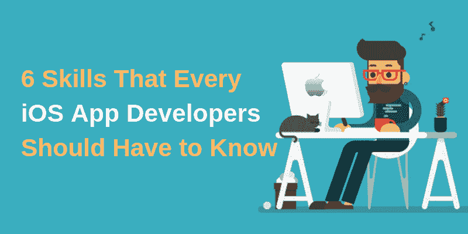

# 每个 iOS 应用开发者都应该知道的 6 个技能

> 原文：<https://dev.to/appdevelopmentagency/6-skills-that-every-ios-app-developers-should-have-to-know-5fpg>

 
随着公司大规模招聘应用程序开发人员，如今的一代人正在应用程序开发领域探索一个要求苛刻的职业选择。流畅运行的商业应用，商业机构依赖 iPhone 应用开发者。诚然，Android 在全球市场上比 iOS 更大，但 iOS 应用程序开发者的名气比其他人更大。

开发应用程序并不适合每个人。这需要一些技巧来学习，它可以让你成为一名专业的 iOS 应用开发者。公司正在为海尔寻找最好的 iPhone 应用程序开发者，因为他们想增加用户体验。如果你想一直受欢迎，那么你必须具备以下六项必备技能。

## 雨燕

Swift 是苹果公司最近推出的一种编程语言，它被广泛用于在 iOS 系统上开发未来项目。对于在 iOS 平台上工作的开发者来说，他们应该学习一门编程语言来开发一个容易被批准的应用商店。为了获得全面的知识，您需要涵盖基本语法、控制流、可选、objective-c 互操作性、类、继承和初始化以及错误处理领域。

## 空间推理

跨国公司都有 iOS 平台的应用程序。面向全球市场的 iOS 应用为您的公司带来好处。因此，iOS 开发者应该获得保持高需求所需的技能。空间逻辑有助于开发人员理解用户的方法并与应用程序进行交互。这种争论允许他们识别错误并积极地解决它们。

## 设计感

当公司寻找最好的 iPhone 应用程序开发人员时，他们也会记住他们的设计技能。设计的一个独特性使其与众不同，并带来成功。然而，规则和指导方针帮助他们根据业务进行设计；颜色的易用性和用户的选择被认为是开发者的特殊技能。

## 联网

拥有网络知识是 iOS 应用开发者的必备技能。您的应用程序需要与网络交互来发送和接收信息。向开发人员展示是一项复杂但重要的任务。

## 主要数据

核心数据是苹果专门设计的，对开发者来说是很重要的东西。它是一个连续的帧，有助于 iOS 平台上旧应用程序的性能。

## 大中枢调度

GCD 是为了让你的应用程序多任务处理，它可以一起处理多个任务。寻找最好的 iPhone 应用程序开发人员的公司将不得不看看被选中的开发人员是否有 GCD 想法。作为一名开发者，你应该学习改进你设计的应用程序的技巧