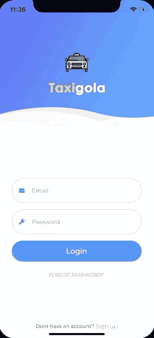

# 我开发了“Taxigola”一个颤振应用程序，实现“登录用户界面”的用户界面/UX 的匿名设计

> 原文：<https://dev.to/crivasgomez/i-developed-taxigola-a-flutter-app-for-implementing-login-ui-uiux-design-by-anonymous-27j4>

这个应用程序是我在 Flutter 中开发的应用程序集合的一部分，目的是掌握在 Android 和 iOS 中实现自定义 UI/UX 设计的必要技能。

你可以在[这篇博客文章](https://dev.to/crivasgomez/flutter-uiux-design-implementations-518i)中找到所有的应用程序，在[这个 GitHub 库](https://github.com/CRivasGomez/flutter-ui-ux-designs)中找到所有的源代码。

## 滑行舟

### [原创设计](https://www.uplabs.com/posts/login-ui-8357f9ec-e05d-47b2-8902-f4229c307e8f)匿名:

### iOS 演示:

### 安卓演示:

