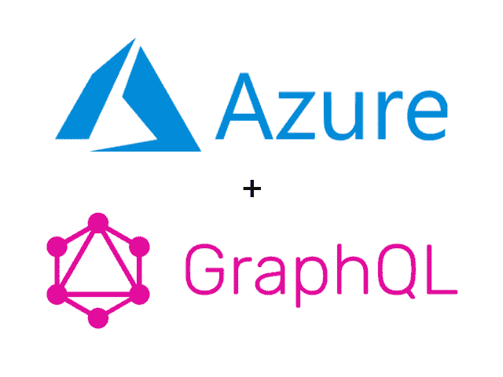

# Azure 上的实时 GraphQL API，带有 Hasura 和 PostgreSQL 的 Azure 数据库

> 原文：<https://dev.to/hasurahq/realtime-graphql-api-on-azure-with-hasura-and-azure-database-for-postgresql-49l6>

我们最近发布了一个[指南](https://docs.hasura.io/1.0/graphql/manual/guides/deployment/azure-container-instances-postgres.html)和一个资源管理器模板，用于在 Azure 数据库支持的 Azure 上为 [PostgreSQL](https://hasura.io/learn/database/postgresql/introduction/) 和 Azure 容器实例部署 Hasura。这可用于现有数据库或自动供应的新数据库。

只需点击下面的按钮，就可以开始使用 Azure 上的 Hasura GraphQL 引擎和 Azure Database for PostgreSQL *(按钮带你进入 Azure 门户)*。

在 Azure 博客上阅读更多关于集成的信息。