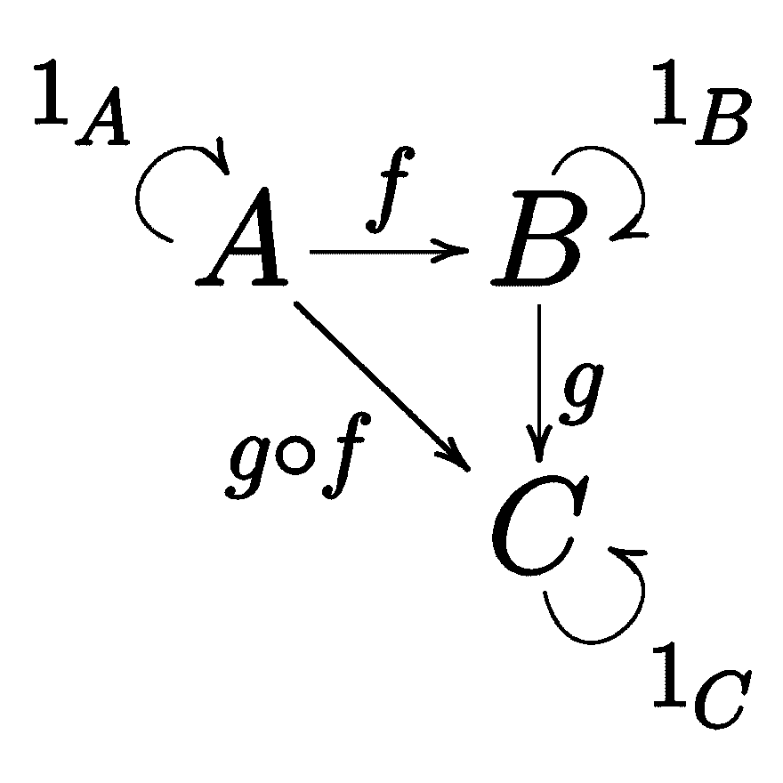

# 函子剖析与范畴理论

> 原文：<https://dev.to/mmenestret/anatomy-of-functors-and-category-theory-2gf0>

[查看我博客上的文章[这里](http://geekocephale.com/blog/)

我将尝试在解剖图谱中，将我最近在一系列文章中经常解释的函数式编程的基本概念进行分组。

这里的想法是为需要解释的人提供一个位置，并通过尽我所能解释它们来增加我自己对这些主题的理解。我会努力让读者感受到一种直觉，一种对概念的感觉，而不是我的解释的完美、严格的正确性。

*   第一部分:[剖析函数式编程](https://dev.to/mmenestret/anatomy-of-functional-programming-1bpg)
*   第二部分:[解析一个代数](https://dev.to/mmenestret/anatomy-of-an-algebra-3cd9)
*   第三部分:[解剖一个铅字类](https://dev.to/mmenestret/anatomy-of-a-type-class-440j)
*   第四部分:[半群和幺半群的解剖](https://dev.to/mmenestret/anatomy-of-semigroups-and-monoids-22i8)
*   第五部分:[函子剖析与范畴理论](https://dev.to/mmenestret/anatomy-of-functors-and-category-theory-2gf0)
*   第 6 部分:剖析无标签的最终编码——即将到来！

# 什么是*函子*？

Bartosz Milewski 在 Quora 上有一个很好的回答[，我将保留其中的一些部分:](https://www.quora.com/Functional-Programming-What-is-a-functor)

> 我喜欢把*函子*看作容器的一般化。常规容器包含零个或多个某种类型的值。一个*仿函数*可能包含也可能不包含某种类型的值(...) .
> 
> 那么你能用这样的容器做什么呢？您可能认为，至少应该能够检索值。但是每个容器都有自己的访问值的接口。如果你试图指定这个接口，你就是在分割容器。你把它们分成堆栈、队列、智能指针、期货等等。所以值检索太具体了。
> 
> 事实证明，与容器交互的最常见方式是使用函数修改其内容。

## 让我们试着换一种说法

*   *函子*代表容器
*   现在，我们不会关心它们的特殊性，我们需要知道的是，在某个时候，它们可能会在“内部”保存一个或多个值(但请记住，每个容器都有特殊性，我将在最后提到这一点)
*   定义一个关于如何访问容器内的值的通用接口没有任何意义，因为一些容器的值将通过索引(例如，*数组*)来访问，另一些容器的值仅通过获取第一个元素(例如，*堆栈*)来访问，还有一些容器的值仅通过获取存在的值来访问(*选项*)，等等。
*   **然而**，我们可以定义一个接口来定义容器中的值是如何被一个函数修改的，尽管它们在容器中

总而言之，*函子*是一种可以被函数映射的容器。

但是*函子*必须尊重一些规则，叫做*函子*定律...

*   **Identity**:Identity 函数(返回参数不变的函数)映射的*仿函数*与原来的*仿函数*相同(容器及其内容保持不变)
*   **合成**:映射到两个函数合成上的*函子*与映射到第一个函数上然后映射到第二个函数上的*函子*相同

> 关于*函子* / *容器*并行的快速说明:类比便于获得直觉，但不是所有的*函子*都不适合那个模型，把它放在你头脑的一个角落，这样你就不会措手不及。

# 实际情况如何

在接下来的章节中，我将提供的例子和代码片段将会出现在 *Scala* 中。

## 让我们探讨一些例子

我们将尝试使用`Int`值的具体容器来理解这个概念。

```
val halve: Int => Float = x => x.toFloat / 2 
```

这里我们定义了从`Int`到`Float`的函数，我们将用它来映射我们的容器

*   我们的第一只豚鼠是`Option[Int]`，是(0 或 1) `Int`的容器。

```
val intOpt: Option[Int] = Some(99)
val mappedResult1: Option[Float] = intOpt.map(halve) 
```

我们可以看到一个`Option[Int]`变成了一个`Option[Float]`，当用一个函数从`Int`映射到`Float`时，容器的内部值从`Int`修改为`Float`...

*   我们的第二只豚鼠是`List[Int]`，是(0 或更多)`Int`的容器。

```
val intList: List[Int] = List(1, 2, 3)
val mappedResult2: List[Float] = intList.map(halve) 
```

我们可以看到一个`List[Int]`变成了一个`List[Float]`，当用一个函数从`Int`映射到`Float`时，容器的内部值从`Int`修改为`Float`...

*   我们的第三个是手工制作的`UselessContainer[Int]`，正好是 1 个`Int`的容器。

```
final case class UselessContainer[A](innerValue: A)
val intContainer: UselessContainer[Int] = UselessContainer(99)
val mappedResult3: UselessContainer[Float] = intContainer.map(halve) 
```

我们可以看到一个`UselessContainer[Int]`变成了一个`UselessContainer[Float]`，当用一个函数从`Int`映射到`Float`时，容器的内部值从`Int`修改为`Float`...(为了清楚起见，我故意隐藏了一个实现细节，我将在后面介绍)

因此，我们可以观察我们之前描述模式:

**一个*仿函数*，姑且称之为`F[A]`，是一个包含类型`A`的值的结构，它可以被类型`A => B`的函数映射，返回一个包含类型`B`的值的*仿函数* `F[B]`。**

## 我们如何对那种能力进行抽象和编码？

*函子*通常由一个*类型类*表示。

提醒一下，*类型类*是一组提供相同能力(接口)的类型，这使它们成为提供相同能力类型的同一类(组，“俱乐部”)的一部分(见我关于*类型类* [的文章，这里](http://geekocephale.com/blog/2018/10/05/typeclasses))。

这是*函子类型类*的实现:

```
trait Functor[F[_]]{
    def map[A, B](fa: F[A], func: A => B): F[B]
} 
```

1.  我们的*函子* *类型类*抽象过来的类型是*类型构造函数* ( `F[_]`，我们的容器类型)
2.  *类型类*公开了一个`map`函数，它接受一个`A`类型值的容器`F[A]`，一个`A => B`类型的函数，并返回一个`F[B]`，一个`B`类型值的容器:我们刚刚描述过的模式。

> **关于*型构造器*** 的说明:*型构造器*是一个*型*，你必须向其提供另一个*型*才能得到一个新的*型*。你可以把它想象成取值产生值的函数。这是有意义的，因为我们必须向容器类型提供它将“保存”的值的类型！
> 
> 使用最多的混凝土*型构造器*有`List[_]`、`Option[_]`、`Either[_,_]`、`Map[_, _]`等。

为了说明它在你的 *Scala* 代码中的含义，让我们把`UselessContainer`变成*仿函数* :

```
implicit val ucFunctor = new Functor[UselessContainer] {
    override def map[A, B](fa: UselessContainer[A],
                           func: A => B): UselessContainer[B] =
      UselessContainer(func(fa.innerValue))
} 
```

小心，如果你试图创建自己的*仿函数*，这是不够的。**你必须证明你的*仿函数*实例尊重我们之前陈述的*仿函数*定律**(通常通过基于属性的测试)，因此:

*   对于类型`UselessContainer`的所有值`uc`:

```
ucFunctor.map(uc, identity) == uc 
```

*   对于类型为`UselessContainer`的所有值`uc`以及类型为`A => B`的任意两个函数`f`和类型为`B => C`的`g`:

```
ucFunctor.map(uc, g compose f) == ucFunctor.map(ucFunctor.map(uc, f), g) 
```

然而，你可以安全地使用由*猫*或 *Scalaz* 带给你的*仿函数*实例，因为它们的实现**合法性**已经为你测试过了。

(你可以在这里找到*猫* *函子*定律[和它们的测试](https://github.com/typelevel/cats/blob/master/laws/src/main/scala/cats/laws/FunctorLaws.scala)[这里](https://github.com/typelevel/cats/blob/master/laws/src/main/scala/cats/laws/discipline/FunctorTests.scala)。他们接受[学科](https://typelevel.org/cats/typeclasses/lawtesting.html)的测试。)

现在你知道了什么是*函子*以及它是如何在 Scala 中实现的，让我们来谈谈范畴理论吧！

# 洞察*函子背后的理论*

在本文中，我们只讨论了最广为人知的一种*函子*、*同变内函子*。不要介意复杂的名字，它们是你开始享受函数式编程乐趣所需要知道的全部。

然而，如果你想掌握一点点*函子*背后的理论，请继续阅读。

***函子*是类别之间的保结构映射。**

## 成范畴论的微型速成班

范畴理论是一个数学领域，它研究事物一般如何相互联系以及它们的关系如何组成。

一个类别包括:

*   **对象**(把它看作是某种纯粹抽象的东西，绝对的任何东西，比如点)
*   **箭头**或**形态**(从一个物体到另一个物体的路径)
*   和两个基本属性:
    *   **组合**:将这些箭头组合起来的一种方式。这意味着，如果存在一个从对象`a`到对象`b`的箭头和一个从对象`b`到对象`c`的箭头，则存在一个从`a`到`c`的箭头，并且合成的顺序无关紧要(给定 3 个可合成的态射`f`、`g`、`h`，那么(`h`)。`g`)。`f` ) == `h`。(`g`)。`f`))
    *   **身份**:类别中的每个对象都有一个身份箭头，即从该对象到其自身的箭头

[](https://res.cloudinary.com/practicaldev/image/fetch/s--MN7xGNrl--/c_limit%2Cf_auto%2Cfl_progressive%2Cq_auto%2Cw_880/https://upload.wikimedia.org/wikipedia/commons/thumb/f/ff/Category_SVG.svg/1024px-Category_SVG.svg.png)

*   `A`、`B`、`C`是这个类别的**对象**
*   `f`和`g`是它的**箭头**或**变体**
*   `g . f`是`f`和`g`的合成，因为`f`从`A`到`B`并且`g`从`B`到`C`(并且它**必须**存在以满足合成法则，因为`f`和`g`存在)
*   `1A`、`1B`、`1C`是`A`、`B`和`C`的身份箭头

## 回 *Scala*

在 *Scala* 的纯函数式编程的环境中，我们可以认为我们工作在一个特定的类别中，我们将称之为`S`(我不会进入这种平行所暗示的理论上的妥协，但是有一些！):

*   `S` **对象**是 *Scala* 的**类型**
*   `S`**是 *Scala* 的**函数**

    *   **同态之间复合**然后是**函数复合**
    *   **恒等式**对于`S`对象的态射是**恒等式函数**** 

 **的确，如果我们考虑对象`a`(类型`A`)和对象`b`(类型`B`)，那么 *Scala* 函数`A => B`就是`a`和`b`之间的变形。

给定我们从`a`到`b`的态射，如果存在一个对象`c`(类型`C`)并且存在`b`和`c`之间的态射(函数`B => C`):

*   那么必然存在一个从`a`到`c`的态射，它是两者的合成。确实如此。它是(伪代码):
    *   对于`g: B => C`和`f: A => B`、`g compose f`
*   且组成是关联:
    *   `(h compose g) compose f`与`h compose (g compose f)`相同

此外，对于每一个对象(每一种类型),它存在一个单位态射，即单位函数，它是类型参数函数:

*   `def id[A](a: A) = a`

我们现在可以理解范畴理论和纯函数式编程是如何联系在一起的了！

## 然后回到我们的*函子*

现在你知道了什么是类别，并且知道了我们在 *Scala* 中进行函数式编程时所使用的类别`S`，请重新考虑一下。

一个*函子* `F`是两个类别之间的结构保持映射，这意味着它将类别`A`中的对象映射到类别`F(A)`(类别`A`被*函子* `F`映射到)中的对象，并将从`A`的态射映射到`F(A)`的态射，同时保持它们之间的关系。

因为我们总是在 Scala 中处理类型和类型之间的函数，所以在那个上下文中的*函子*是来自和到**相同类别**的映射，在`S`和`S`之间，那种特殊的*函子*被称为**内函子**。

让我们探索一下`Option`是如何表现的(但是我们可以用任何*仿函数* `F`来代替`Option`):

**物体**

| `S`(类型)中的对象 | `F(S)`中的对象 |
| --- | --- |
| `A` | `Option[A]` |
| `Int` | `Option[Int]` |
| `String` | `Option[String]` |

所以`Option`类型构造器将`S`中的对象(类型)映射到`S`中的其他对象(类型)。

**态射**

让我们使用之前定义的:

*   `def map[A, B](fa: F[A], func: A => B): F[B]`。

如果我们用一个类型为`A => B`的函数`f`部分地应用`map`，就像这样(伪代码):`map(_, f)`，那么我们剩下一个类型为`F[A] => F[B]`的新函数。

用那种方式，让我们看看态射是如何表现的:

| `S`中的态射(类型之间的函数) | `F(S)`中的态射 |
| --- | --- |
| `A => A`(身份) | `Option[A] => Option[A]` |
| `A => B` | `Option[A] => Option[B]` |
| `Int => Float` | `Option[Int] => Option[Float]` |
| `String => String` | `Option[String] => Option[String]` |

所以`Option`的`map`将`S`中的态射(从类型到类型的函数)映射到`S`中的其他态射(从类型到类型的函数)。

我们不会深入细节，但我们可以展示`Option` *函子*是如何尊重态射合成和恒等式法则的。

## 它给我们买了什么？

*   *函子*是两个类别之间的映射
*   一个*函子*，由于它的理论性质，保留了*态射*和它们在它映射的两个范畴之间的关系
*   当在纯 FP 中编程时，我们在`S`、 *Scala* 的类别、函数和函数组合下。我们使用的*函子*是*内函子*(从`S`到`S`，因为它们将它们之间的 *Scala* 类型和函数映射到它们之间的其他 *Scala* 类型和函数

在编程术语中， *Scala* 中的 *(endo)函子*允许我们从原始类型(`A`，`B`，...)，到新的目标类型(`F[A]`，`F[B]`，...)同时安全地允许我们在目标类型上重用原始函数及其组合。

继续我们的`Option`例子，`Option`类型构造器将我们的类型`A`和`B`映射到`Option[A]`和`Option[B]`类型，同时由于`Options` ' `map`，允许我们重用类型`A => B`的函数，将它们转换成`Option[A] => Option[B]`，并保留它们的组合。

但这还没有结束！让我们离开我们都爱的抽象世界，回到具体的世界。

具体的*函子*实例用新的能力增强了我们的原始类型。**事实上，*仿函数*实例是具有特殊性的具体数据结构**(我们在那篇文章的开头说过我们不关心的那个)，能够为`Option`表示空值，能够为`IO`暂停有效的计算，能够为`List`保存多个值，等等！

好了，那么，总结一下，为什么*函子*很牛逼？我能想到的两个主要原因是:

1.  抽象，抽象，抽象...使用*函子*的代码允许你只关心你所操作的是可映射的。
    *   它增加了代码重用，因为使用*仿函数*的一段代码可以用任何具体的*仿函数*实例调用
    *   这也降低了很多出错的风险，因为你不得不去处理一些具体的、最终的、数据结构的细节，这些数据结构将会被调用
2.  它们将函数添加到现有类型中，同时仍然允许在现有类型上使用函数(您不会希望为每个 *functor* 实例重写它们)，这是一件大事:
    *   `Option`允许你将`null`带入一个具体的值，使代码更加健康(功能更加纯粹)
    *   允许你将计算错误转化为具体的值，使得处理计算错误更加健康(功能更加纯粹)
    *   允许你把一个计算变成一个值，允许更好的组合性和参考透明性
    *   等等...

我希望我说得更清楚一点，在范畴理论的上下文中什么是*函子*，以及如何在 *Scala* 中转化为纯 FP！

# 更多材料

如果你想继续深入，可以在我的 [FP 资源列表](https://github.com/mmenestret/fp-ressources)中找到一些有趣的东西，特别是:

*   [Scala 与 Cats - Functor 章节](https://underscore.io/books/scala-with-cats/)
*   [图片文章](http://adit.io/posts/2013-04-17-functors,_applicatives,_and_monads_in_pictures.html#functors)中的 awesome 函子、应用程序和单子的函子部分
*   [扬·埃斯波西托伟大的《范畴理论与编程》](http://yogsototh.github.io/Category-Theory-Presentation/categories.html)
*   如果你需要更多，请告诉我

# 结论

总而言之，我们看到:

*   一个*函子*是一种容器，可以被一个函数和它必须遵守的规则映射
*   一些例子，并确定了一个共同的模式
*   我们如何在 *Scala* 中将该模式抽象并编码为*类型构造函数*的*类型类*
*   我们对范畴理论有一个适度的概述，范畴理论中的*函子*是什么，以及在 *Scala* 中两者如何与纯 FP 相关
*   我们通过*函子*有多伟大以及出于什么实际原因得出结论

我会尽量保持博客更新。如果有任何我应该纠正的补充、不精确或错误，或者如果您需要更多的解释，请随时通过 Twitter 或邮件联系我！

* * *

编辑:感谢 [Jules Ivanic](https://twitter.com/guizmaii) 的评论:)**