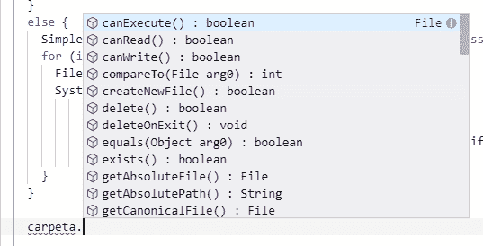
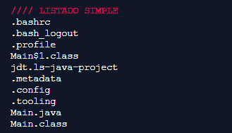

# Java:列出、过滤和获取文件夹和文件信息

> [https://dev . to/campus MVP/Java-CMO-list-filter-y-obtain-informacin-de-folder-y-files-G1](https://dev.to/campusmvp/java-cmo-listar-filtrar-y-obtener-informacin-de-carpetas-y-archivos-g1i)中的 https://dev . to/campus MVP/Java-CMO-list-filter-y-obtain-informacin-de-folder-y-files-G1]

> **原始邮件**:[https://www . campus MVP . es/resources/post/Java-as-list-filter-and-get-information-from-folders-y-files . aspx](https://www.campusmvp.es/recursos/post/java-como-listar-filtrar-y-obtener-informacion-de-carpetas-y-archivos.aspx)

任何程序中我们需要做的一个常见的基本任务是**访问本地文件系统中的文件和文件夹信息**。从查看文件名和文件大小等基本内容到列出任何文件夹的内容。

在 Java 中，通过**类**很容易做到这一点。此类允许我们获取有关文件系统中任何元素的信息。

为了使用它，我们只需把它输入我们的程序标题:

```
import java.io.File; 
```

我们可以在我们的应用中使用它。

要获取有关文件或文件夹的信息，只需通过传递文件或文件夹的路径使用其构造函数即可。如:

```
String sCarpAct = System.getProperty("user.dir");File carpeta = new File(sCarpAct); 
```

在第一行中，我们获取执行代码的当前文件夹，并使用类“`File`”获取有关该文件夹的信息。我们可以将绝对路径或相对路径传递给此构造函数。

[类别`File`](https://docs.oracle.com/javase/10/docs/api/java/io/File.html) 用于表示档案或资料夹，并提供性质和方法，让我们可以存取和操作其资料，例如更名、删除、建立资料夹、列示其内容等-我...。我们可以对该文件或文件夹执行的操作取决于我们对该文件或文件夹的权限。

[](https://res.cloudinary.com/practicaldev/image/fetch/s--zdvLP6aY--/c_limit%2Cf_auto%2Cfl_progressive%2Cq_auto%2Cw_880/https://www.campusmvp.es/recursos/image.axd%3Fpicture%3D/2019/1T/java-file-metodos.png)

这些方法包括:

*   `canExecute()`:根据文件是否可执行，返回`true`或`false`。
*   `canRead()`:是否有读取权限
*   `canWrite()`:你能否在上面写字
*   **`createNewFile()`** :创造一个全新的名字叫做“独立”的建筑。
*   **`delete()`** :删除文件或目录
*   **`exists()`** :确定在我们通过的路径中`File`所代表的文件是否存在。
*   **`getName()`** :档案或资料夹的名称
*   ****:返回包含当前文件或文件夹的“父”文件夹路径的字符串。****
***   **`isDirectory()`** 表示当前对象是否表示文件夹*   **`isFile()`** 表示当前对象是否表示文件*   **`isHidden()`** :如果是文件系统中的隐藏项目*   **`length()`** :文件大小(字节)。如果不存在或您没有权限，则返回 0。对于具有 ext3/ext4 文件系统的 Linux/Mac 上的文件夹，始终返回 4096，因为这是 Linux 上的块大小，是任何磁盘链接(如文件夹)可以占用的最小大小(4KB)。*   **`list()`** :文件夹的子文件和文件夹的名称。*   **`listFiles()`** :和以前一样，但为每个文件或文件夹返回文件对象。*   **`mkdir()`** : crea una 地毯*   **`renameTo()`** :重命名文件或文件夹**

 **有了这些，你可以做很多事情。使用上述链接查看文档中的所有内容。

下面我们来看一个使用以下几种方法列出文件夹“”中所有文件的示例:

```
File carpeta = new File(sCarpAct);String[] listado = carpeta.list();if (listado == null || listado.length == 0) { System.out.println("No hay elementos dentro de la carpeta actual"); return;}else { for (int i=0; i< listado.length; i++) { System.out.println(listado[i]); }} 
```

这个片段所做的是:

1.  创建一个新对象`File`来表示我们感兴趣的文件夹。
2.  使用`list()`方法，我们得到了他们所有孩子的名字
3.  如果不返回任何内容，或者长度为 0，我们将显示一条消息，说明当前文件夹中没有项目(我们还可以使用“`isDirectory()`”检查是否为文件夹)
4.  在条件的另一个分支中，我们在一个简单的循环中遍历所有子元素名称，在控制台中将每个子元素名称显示在一行中。

Verí amos algo como esto:

[](https://res.cloudinary.com/practicaldev/image/fetch/s--1y-MiHt---/c_limit%2Cf_auto%2Cfl_progressive%2Cq_auto%2Cw_880/https://www.campusmvp.es/recursos/image.axd%3Fpicture%3D/2019/1T/java-listado-simple.png)

从命令行复制基本命令`ls` (Linux、Mac)或`dir` (Windows)是可以的，但如果我们想要更多的信息，也没什么用。

我们可以用`File`方法来改进它，该方法将对象`File`返回给我们，因此我们可以显示彼此的更多信息，而无需明确创建，例如:

```
File[] archivos = carpeta.listFiles();if (archivos == null || archivos.length == 0) { System.out.println("No hay elementos dentro de la carpeta actual"); return;}else { SimpleDateFormat sdf = new SimpleDateFormat("dd/MM/yyyy HH:mm:ss"); for (int i=0; i< archivos.length; i++) { File archivo = archivos[i]; System.out.println(String.format("%s (%s) - %d - %s", archivo.getName(), archivo.isDirectory() ? "Carpeta" : "Archivo", archivo.length(), sdf.format(archivo.lastModified()) )); }} 
```

在本例中，代码类似，但我们可以使用我们看到的方法来显示有关每个元素的更多信息。在本例中，我们将显示其名称、目录或文件、大小以及上次修改日期。为了以适当的格式显示日期，我使用包的类别`java.text.SimpleDateFormat`。

-好吧。但是，如果我们不想显示所有文件，而只想显示满足某些条件的文件，会发生什么情况？

为此，我们可以使用过滤器**。过滤器是实现接口`FilenameFilter`(如果我们只想按名称过滤)或`FileFilter`(如果我们想使用 File 对象进行过滤)的类。这个介面唯一定义的是`accept()`方法，在它最简单的超载情况下，它以档案为参数进行筛选，根据档案是否通过筛选，必须传回`true`或`false`。**

 **例如，我们将筛选文件夹中的项目，使其仅返回文件，而不返回文件夹。这是一个简单的条件，但从逻辑上讲，我们可以根据每个项目的可用属性(项目名称、大小、权限)来应用我们感兴趣的任何复杂规则-我...。或两者的组合)。

让我们看看如何做到这一点。

我们首先定义过滤器:

```
FileFilter filtro = new FileFilter() {
 @Override
 public boolean accept(File arch) {
   return arch.isFile();
 }
}; 
```

在这种情况下，我很快就和构造函数一起用文字来创建对象并实现方法`accept()`，但我可以用`implements`来实现接口等，以最常规的方式创建类-什么形状最少。他所做的只是调用每个文件或文件夹的方法`isFIle()`，以便仅在它们是文件的情况下返回`true`。这样，过滤后将只检索文件，而不检索文件夹。

现在使用起来就像将新的过滤对象传递给方法
一样简单，如下所示:

```
archivos = carpeta.listFiles(filtro);

if (archivos == null || archivos.length == 0) {
 System.out.println("No hay elementos dentro de la carpeta actual");
 return;
}
else {
 SimpleDateFormat sdf = new SimpleDateFormat("dd/MM/yyyy HH:mm:ss");
 for (int i=0; i< archivos.length; i++) {
   File archivo = archivos[i];
   System.out.println(String.format("%s (%s) - %d - %s", 
                       archivo.getName(), 
                       archivo.isDirectory() ? "Carpeta" : "Archivo",
                       archivo.length(),
                       sdf.format(archivo.lastModified())
                      ));
 }
} 
```

只改变第一行。其馀部分与前面的示例类似，只是在这种情况下，我们将仅在控制台中看到文件，而不是通过我们应用的筛选器看到目录。

你看这堂课的用法极其简单。

我把所有的示例代码[留在这个折页上。it](https://repl.it/@jmalarcon/Java-File-Basico) ，嵌入在下面。单击顶部的三角形可直接在浏览器中运行该三角形并查看其结果:

> **注**:如果你想知道我怎样在控制台上显示颜色，请阅读这篇文章。

直到结果出来！

> **原始邮件**:[https://www . campus MVP . es/resources/post/Java-as-list-filter-and-get-information-from-folders-y-files . aspx](https://www.campusmvp.es/recursos/post/java-como-listar-filtrar-y-obtener-informacion-de-carpetas-y-archivos.aspx)****