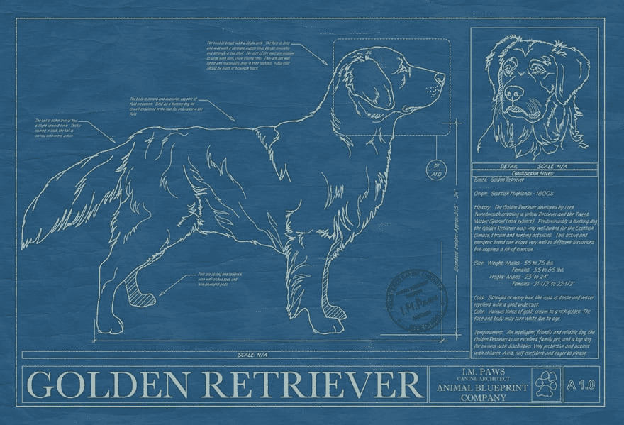

# 面向对象编程基础

> 原文：<https://dev.to/kwmcminn/basics-of-object-oriented-programming-1g85>

当我第一次学习面向对象编程时，我被这个“酷”的名字吸引住了，但是并没有完全理解它是如何工作的。在这篇博客中，我讨论了一些帮助我更好地理解 OOP 的类比。

## 什么是物体？

在编程中，对象只是一个“东西”。我知道，我知道...你怎么能把一个东西定义为一个‘东西’。好吧，让我们想一想——‘物’有什么？属性，对吧？我们以一首歌为例。一首歌是有属性的！它有标题、艺术家、流派等。狗怎么样——狗有四条腿，一种颜色，一个名字，一个主人，一个品种。虽然有数以百万计的狗有着数不清的名字、主人等等，但是将它们联系在一起的一件事就是每一只狗都可以被描述为一只狗。

虽然这看起来像是一个不太翔实的解释，但这些类型的例子最终让我理解了面向对象编程。对象可以执行的一组活动就是对象的行为。如果主人训练的话，狗可以叫、摇尾巴、坐下，甚至摇尾巴。同样，程序员可以创建一个对象，并教给它技巧，以实现某些目标。在 Ruby(我的第一门编程语言)中，一切都是对象。这意味着你遇到的每一段代码都可以在你的命令下执行某些特定的技巧，有些是内置在 Ruby 中的，而有些是你可以随意创建的。

让我们来看看编程中的一个常见元素，一个简单的字符串。正如你所看到的，在字符串被定义之后，我能够在我创建的字符串上调用不同的“方法”或函数。Ruby 在公共对象上有几个内置的方法(比如字符串、整数、数组和散列)。

[https://repl.it/@KevinMcMinn/SlimTenderLicense?lite=true](https://repl.it/@KevinMcMinn/SlimTenderLicense?lite=true)

## 一个物体的蓝图

如前所述，世界上有数百万种不同的狗，但有一点我们都同意，那就是它们都是狗。那么我们如何在电脑程序中创造一只狗、一首歌、一个人等等呢？首先，我们需要拼凑一个“蓝图”来构建我们的对象。在 Ruby 中，你通过定义一个“类”来创建一个蓝图。然后，您可以自由决定您的类中的每个对象应该包含哪些属性。以我们的例子为例，如果我们要创建一个“狗”类，我们可能会决定每只狗都需要有一个名字、品种、颜色和大小。编程中对象的伟大之处在于，对象的每个实例都知道自己的一切。我们可以在程序中创建 1000 只狗，但仍然可以询问每只狗的名字、品种等。这就是面向对象编程的魔力。每次你在程序中的某个地方发送一个对象，你就可以访问它的所有属性并与之交互...就像一个人来到你家，你可以问关于他们的任何事情，他们可以告诉你。

在下面的例子中，我创建了一个 Dog 类，或者说模板，每个 dog *实例*都是从这个类中产生的。每只狗都需要有一个名字和品种，所有的狗都会叫。汪汪！

[https://repl.it/@KevinMcMinn/NativeBlondApplets?lite=true](https://repl.it/@KevinMcMinn/NativeBlondApplets?lite=true)

## 面向对象编程的两大优势

*   重复使用

    -考虑我们的狗的例子。假设我们的程序发展到需要创建其他狗类的程度。我们发现我们需要增加一只服务犬，它有一些普通狗没有的能力。服务犬需要知道如何引导、安慰和感知紧急情况。然而，所有的服务犬仍然有一个名字，品种，并需要能够吠叫。这就是继承发挥作用的地方，我们可以很容易地让我们的“服务”狗类*从我们的狗类继承*一切，并且仍然能够添加服务狗的某些特征。

*   包装

    -“每个对象形成一个独立的实体，其内部工作与系统的其他部分分离。”这意味着只有当程序员明确给出许可时，程序的一部分才能访问特定对象及其所有方法/属性。这创造了一个健康的环境，在这个环境中，所有的对象都相互保护，使得错误识别和调试更加容易。