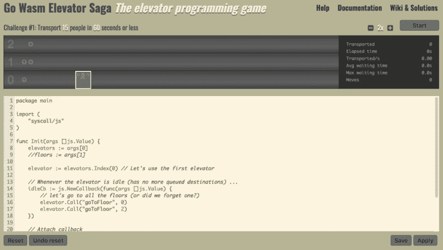

# 用游戏练习你的 Go WebAssembly

> 原文：<https://dev.to/didil/practice-your-go-webassembly-with-a-game-1hij>

#### 电梯传奇移植到围棋 WASM 输入

几天前，我想带着 **Go WebAssembly** 出去兜一圈，但我不确定要造什么。也许是个游戏？但是我真的不想从头开始做一个游戏。于是我想起了几年前偶然发现的 Magnus Wolffelt 的编程游戏 [**电梯传奇**](https://play.elevatorsaga.com/) :目标是通过控制电梯运送人们上下建筑楼层，用 Javascript 编写规则。如果我修改它来接受 WebAssembly 风格的 Go 而不是 JS 会怎么样！

遇见 [Go Wasm 电梯传奇](https://didil.github.io/gowasm-elevatorsaga/)。github 回购可在[这里](https://github.com/didil/gowasm-elevatorsaga)获得。

<figure> 

<figcaption>Go Wasm 电梯传奇</figcaption>

</figure>

### 工作原理

出于本练习的目的，我已经分叉了原始存储库。

最初的 js 游戏是作为一个 Javascript 应用程序编写的，它将用户输入作为文本，对其运行 [js eval()](https://developer.mozilla.org/en-US/docs/Web/JavaScript/Reference/Global_Objects/eval) 以将其转换为 JS 对象，并在屏幕上显示结果，相应地移动电梯。

为了接受 Go WASM 作为输入，我们需要在服务器端编译它。我已经构建了一个小的 **Go API 服务**，它位于 Nginx 反向代理之后，接收用户输入，创建一个. Go 源文件，通过 **Docker Go API** 将其编译到新 docker **容器**中的 WASM，并将输出的二进制文件返回给浏览器。

#### 编纂围棋 WASM

我写了一个样板文件 **main.go** 提供游戏运行所需的设置，并利用了用户提供的函数 **Init** 和 **Updated** :