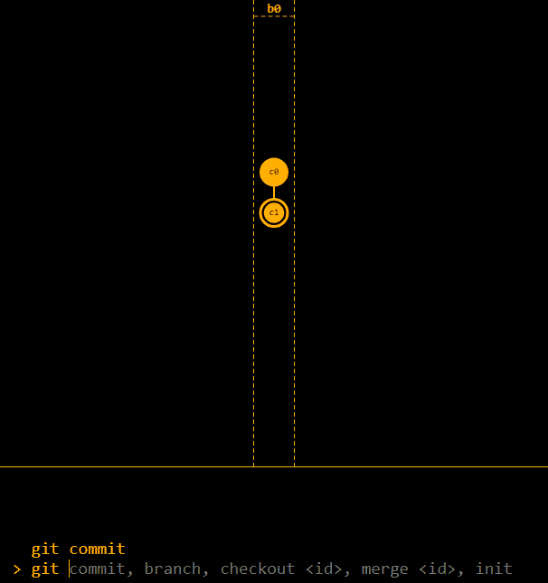
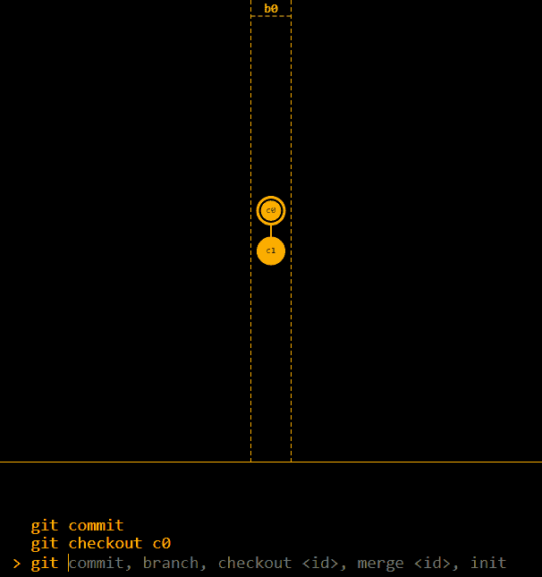
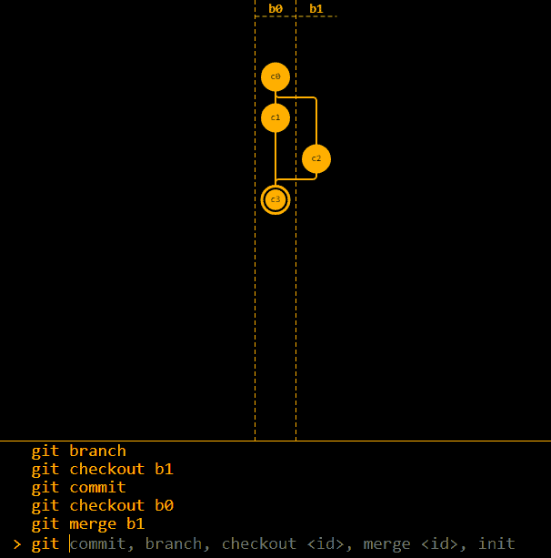
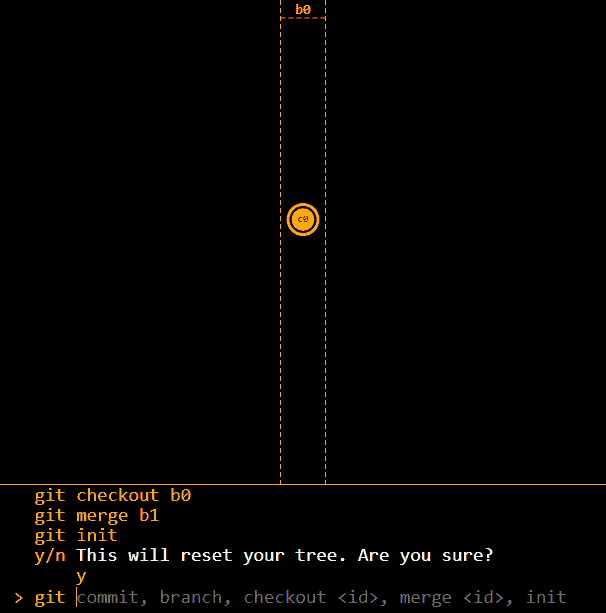

# 去吧，上帝

> 【西班牙语】https://dev . to/nicaliartley/去他妈的上帝去他妈的上帝去他妈的上帝去他妈的上帝去他妈的上帝去他妈的上帝去他妈的上帝去他妈的上帝去他妈的上帝去他妈的上帝去他妈的上帝去他妈的上帝去他妈的上帝去他妈的上帝去他妈的上帝去他妈的上帝去他妈的上帝去他妈的

大家举手，谁知道 git？

不仅仅是你通过标准的`git pull` / `git commit` / `git push`神秘地将你的改变神奇地公之于众，谁真正*理解* git？这里谁了解它的内部树模型，是什么让它工作得这么好？

如果你的手还在，你可以随意跳过这篇文章，或者跳到[源代码](https://github.com/nic-hartley/git-gud)并帮助实现更多的特性。不过，在你做出贡献之前，你可能想拖延一会儿；我正在把它从 WASM 移植到 JavaScript。

但是，如果你不知道它是如何工作的，我可以推荐一些我做的东西吗？它叫做 [Git Gud](https://nic-hartley.github.io/git-gud/) 。

# 什么事？

Git Gud 是一个基于 web 的 Git 模拟器。它向您直观地展示了 git 树，您可以运行命令向您展示它们对树做了什么。您从初始提交开始:

[](https://res.cloudinary.com/practicaldev/image/fetch/s--RrxPKeiU--/c_limit%2Cf_auto%2Cfl_progressive%2Cq_auto%2Cw_880/https://i.imgur.com/op6Yn3B.png)

你会注意到它标有“c0”。这是提交 ID。因为我们没有任何实际的文件要跟踪——那是针对更高版本的——我们没有任何东西要散列，并且在我们最初的构建中，我们只是顺序地提交。第一个自动生成的提交是“c0”，第二个是“c1”，依此类推。说到第二次提交，点击底部区域并尝试输入:

```
commit 
```

您将看到添加了另一个提交:

[](https://res.cloudinary.com/practicaldev/image/fetch/s--E5Zw0E22--/c_limit%2Cf_auto%2Cfl_progressive%2Cq_auto%2Cw_880/https://i.imgur.com/Qb7ZDrd.png)

就像在 Git 中一样，您可以检查单个提交:

```
checkout c0 
```

[](https://res.cloudinary.com/practicaldev/image/fetch/s--TIKp2iy4--/c_limit%2Cf_auto%2Cfl_progressive%2Cq_auto%2Cw_880/https://i.imgur.com/ZsQVEp1.png)

你也可以用`branch`创建一个新的分支，用`checkout b1`检查它，提交它，`merge`它回来，等等。例如，输入以下命令序列:

```
commit
checkout c0
branch
checkout b1
commit
checkout b0
merge 
```

你会得到这个:

[](https://res.cloudinary.com/practicaldev/image/fetch/s--Y2an4CIi--/c_limit%2Cf_auto%2Cfl_progressive%2Cq_auto%2Cw_880/https://i.imgur.com/dsVV63n.png)

如果你想重置，没有 git 命令，但是我们已经改变了`init`:

[](https://res.cloudinary.com/practicaldev/image/fetch/s--JKK2S53b--/c_limit%2Cf_auto%2Cfl_progressive%2Cq_auto%2Cw_880/https://i.imgur.com/F56RC9v.png)

# 为什么？

如果您查看 Git Gud 的提交历史，您会注意到在一个周末的过程中开发出现了巨大的峰值。那个周末是 RIT 的年度黑客马拉松 brick hack T1。这是一次有趣的经历，也是一个让原型启动并运行的好方法。

不过，它确实引入了一些问题。代码并不太好，因为我们没有机会在仅仅 24 小时内真正考虑问题。我们用 WebAssembly 编写它，而不是用开发和调试起来更容易的纯 JavaScript，因为团队中的一个成员只懂 C++并且不确定他能在黑客马拉松前的几天里学好 JavaScript。

事实证明，在黑客马拉松中，他能够在一个小时左右学会，至少足以编辑一些绘图代码。哎呀。或许可以做得更好。

# 下一步

现在，Git Gud 非常简单，如果你尝试的话，你肯定会注意到。有相当多的特性我们想要实现，其中大部分归结起来就是工作起来更像真正的 git。例如:

*   如果您在行首键入`git`(比方说，出于使用 real git 的习惯)，请将其从输入中删除，而不是断开
*   当你做错事情时，信息性的错误消息(在某些情况下，也称为任何错误消息)
*   重置基础
*   提交消息
*   带名称的分支
*   解析标志，如`checkout`上的`-b`
*   文件更改，而不仅仅是抽象的“提交”
*   更多主题。黑色上的琥珀色很漂亮，但是提供多种颜色会更好(真的不会太难)。

有其他想法吗？随着我的进一步发展，你还有什么想让我知道的吗？要么[提出一个问题](https://github.com/nic-hartley/git-gud/issues)，要么对这篇文章发表评论。