# 关系解剖:电脑讲述的单恋故事

> 原文：<https://dev.to/andcomputers_io/relationship-autopsy-a-story-of-unrequited-love-as-told-by-a-computer-146k>

最初发布于[和 computers.io](https://andcomputers.io/unrequited-love-as-told-by-a-computer/?utm_source=dev.to&utm_medium=crossplatformpost&utm_campaign=devtocrosspost)

[](https://res.cloudinary.com/practicaldev/image/fetch/s--WR_oEdmN--/c_limit%2Cf_auto%2Cfl_progressive%2Cq_auto%2Cw_880/https://thepracticaldev.s3.amazonaws.com/i/hpab4zjwnfd2m01u6ufn.png)

#### 快乐的开始

很久以前我遇到了一个人。我们都发了短信。该死的。日。太棒了。除了我的拇指即将受到的灵活性限制，生活正在好转。

我就像“酷”，我可能很快就要结婚了，我应该打电话给我妈妈。

#### 预示最后结果（或败局）的先兆

唉，我错了。完全彻底地。事情开始慢慢失败，直到今天我也不知道为什么，但我应该已经看到它的到来。

不管怎样，这个故事并不是真的关于这个人，而是关于我的电脑告诉我他们并没有那么喜欢我。数据都在那里，它只是需要探索。

下面我将分享我如何建立一个有点通用的工具 <sup>1</sup> 来分析 iPhone 短信和我学到了什么。

#### 真正的结局

外面下着超级大的雨...然而，我的手机是干 asf。我觉得很奇怪。我通常在这个时候收到一些短信。我想。

我绞尽脑汁想记起昨天这个时候我们是否谈过话。

我记不起来了...上周的今天呢？...嗯。

我一无所获...我怎么也想不起来，在过去的一周里，我们是否比平时谈得更多、更少或更少。

[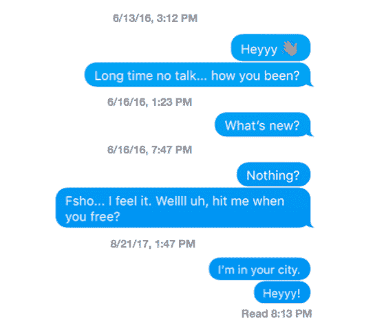](https://res.cloudinary.com/practicaldev/image/fetch/s--7UJsTvs1--/c_limit%2Cf_auto%2Cfl_progressive%2Cq_auto%2Cw_880/https://thepracticaldev.s3.amazonaws.com/i/b8sucvvp8l7wdojuo21i.png)

我们新生的关系是逐渐消失还是逐渐升温？

我的直觉告诉我是前者，但我想用一些定量的支持来亲眼看看。

经过几分钟的思考，我准确地知道了我将如何度过接下来的几个晚上。

#### 任务

我做的第一件事是打开电脑上的 iMessages 应用程序，开始将对话复制并粘贴到一个文本文件中。

一个他妈的可怕的想法。几分钟后，我意识到在我把整个对话转换成可读文件之前，我至少要这样做 9 个半小时；有成千上万的文本。

必须有一个更有效的方法来做到这一点。我希望(出于我的好奇心和我迅速恶化的正常感)我不是世界上唯一一个想把他们所有的短信都转储到`.txt`文件中的人。

经过一些谷歌搜索和 stackoverflow 调查，事情看起来不太妙。我去了 Github，一个人们共享项目代码的网站，最终偶然发现了这个[瑰宝](https://github.com/PeterKaminski09/baskup)。

##  [彼得·卡明斯 09 ](https://github.com/PeterKaminski09) / [突袭](https://github.com/PeterKaminski09/baskup)

### 全面的 iMessage 备份

<article class="markdown-body entry-content container-lg" itemprop="text">

## 什么是巴斯库普？<g-emoji class="g-emoji" alias="calling" fallback-src="https://github.githubassets.cimg/icons/emoji/unicode/1f4f2.png">📲</g-emoji> + <g-emoji class="g-emoji" alias="speech_balloon" fallback-src="https://github.githubassets.cimg/icons/emoji/unicode/1f4ac.png">💬</g-emoji> = <g-emoji class="g-emoji" alias="package" fallback-src="https://github.githubassets.cimg/icons/emoji/unicode/1f4e6.png">📦</g-emoji>

Baskup 是一个 bash 脚本和 macOS 应用程序，旨在将 iMessages(苹果公司以不可读的 iChat 文件存储在您的本地机器上)转换为人类可读的。txt 文件，您可以阅读并在您的计算机上作为备份，无论是群发消息、图片、音频文件、iMessage 或 SMS，Baskup 都会备份。

### *更新:2018 年 12 月 19 日* - <g-emoji class="g-emoji" alias="construction" fallback-src="https://github.githubassets.cimg/icons/emoji/unicode/1f6a7.png">🚧</g-emoji>Mac 版 Baskup 3.0 正在建设中<g-emoji class="g-emoji" alias="construction" fallback-src="https://github.githubassets.cimg/icons/emoji/unicode/1f6a7.png">🚧</g-emoji>

Baskup 的 Mac 版本正在建设中，以努力在苹果的 macOS 应用程序商店分发该应用程序。

与此同时，您仍然可以使用 Github 上的命令行脚本，并关注将发布到该页面的更新。

### *更新:2018 年 11 月 16 日* - macOS Mojave 更新

由于苹果的安全改进，macOS Mojave 用户将需要将该程序添加到系统偏好设置→安全…

</article>

[View on GitHub](https://github.com/PeterKaminski09/baskup)

有人怀着同样可疑的意图为 MAC 开发了一个工具来查找`chat.db`文件。该文件包含您的所有对话；前提是你的 iPhone 和你的 Mac 同步。我很幸运，作为一个崭露头角的苹果粉丝，我的短信肯定在那个文件里。我运行程序，经过几分钟的 bash 脚本魔术——它完成了！

酷，我收到短信了...在这一点上，我已经觉得我刚刚入侵了五角大楼最高安全服务器。旁注:我对感觉自己在电脑上做非常高级的事情有一个非常低的标准。黑屏+白字，我发誓我真的在矩阵里面。

```
> me, inside the matrix.
<code>h4x0r</code>
```

当我写这篇文章的时候，我意识到浏览关于实现的所有血淋淋的细节可能会花费太多的时间。我已经写了一篇更深入的文章，作为一篇独立的博客文章，主要关注技术方面。如果我在这里做，我会非常兴奋，所以我会直接跳到有趣的部分。

#### 量化一段“几乎有点儿不太像”的关系

###### 累积统计

首先，快速浏览一下从第一条发送的文本开始的文本对话长度的统计数据........直到最后。*叹息*

[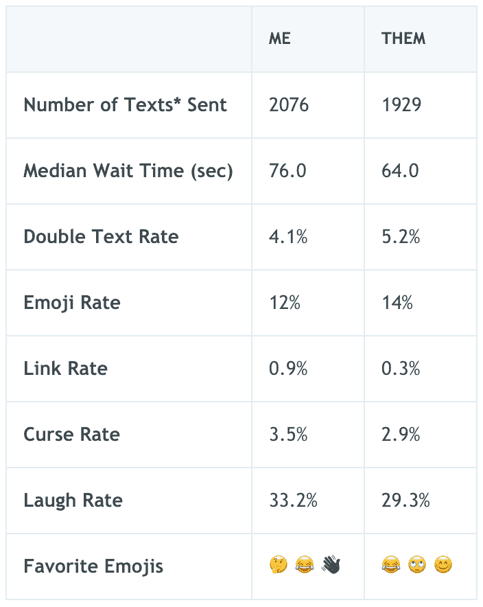](https://res.cloudinary.com/practicaldev/image/fetch/s--RB3oyBLl--/c_limit%2Cf_auto%2Cfl_progressive%2Cq_auto%2Cw_880/https://thepracticaldev.s3.amazonaws.com/i/qfw24gmxh0438cj8e6vd.png)

总的来说，在我看来事情并不太糟。如果你忽略`Link Rate`指标，我们在大多数事情上都差不多；总的来说，我阅读并分享了大量的文章，所以这并不奇怪。

表情符号看起来像是我们在大笑，而我因为令人讨厌而引起了很多眼球转动。同样，这并不奇怪。

有一个星号，因为程序有一个特殊的决策过程来决定“文本”到底是什么。如果你对细节感兴趣，可以看看[的技术报道](the%20other%20articlesSE!)！

当你观察一段时间内的数据时，真正的问题来了。

...*大叹*

###### 一段时间的趋势

我决定把这些课文分成三段，每段大约 15 天。看下面的图表，它显示了两个参与者之间分享了多少条短信，很清楚阶段是什么。回想起来，我意识到如果我停下来进行一些计算机辅助的思考，我可以定量地看到，我们的日子屈指可数了。

**第一阶段**:疯狂大容量发短信，生活美好，无忧无虑

**第二阶段**:持续、稳定、健康的谈话

**第三阶段**:“我很好，爱，享受”

<figure>

[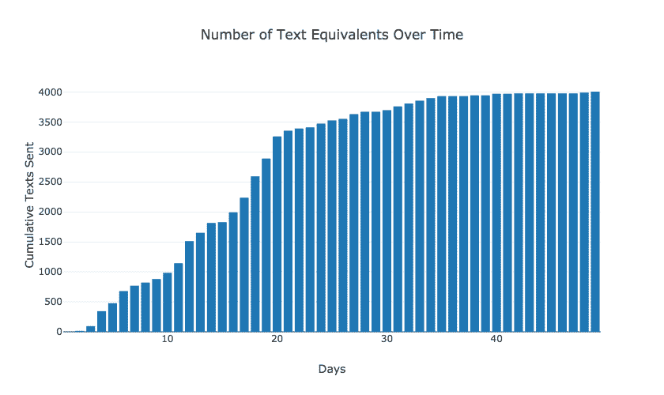](https://res.cloudinary.com/practicaldev/image/fetch/s--Qr29hscZ--/c_limit%2Cf_auto%2Cfl_progressive%2Cq_auto%2Cw_880/https://thepracticaldev.s3.amazonaws.com/i/go0cdhdsi7bmty8lhbxb.png)

<figcaption>Peep the slope to get a feel for conversation pace.</figcaption>

</figure>

我绘制了上述三个阶段的每个指标，以了解这些数字随时间的变化趋势。

[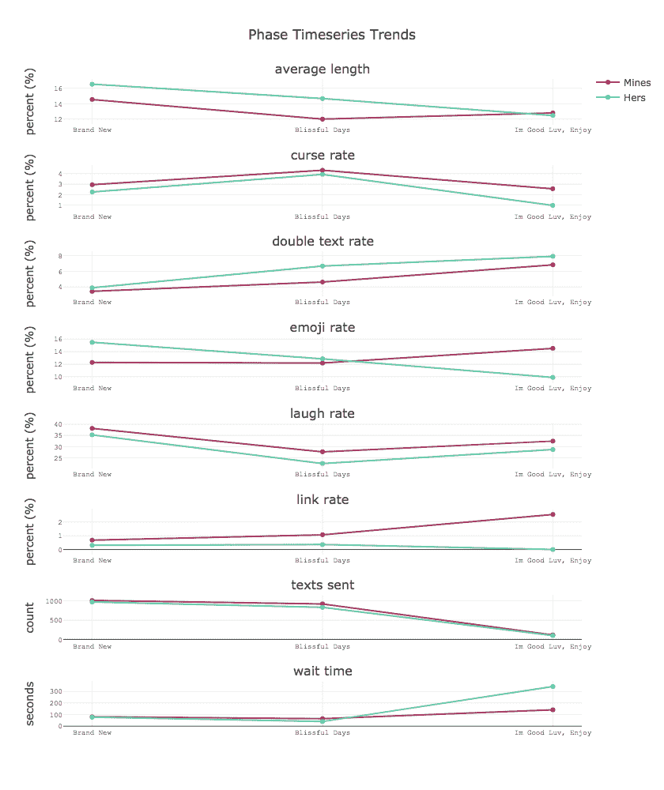](https://res.cloudinary.com/practicaldev/image/fetch/s--ulFzBEMr--/c_limit%2Cf_auto%2Cfl_progressive%2Cq_auto%2Cw_880/https://thepracticaldev.s3.amazonaws.com/i/c1q4xkva21ilz7mcvcbb.png)

**最后阶段的收获**:

`wait time`:双方信息之间的超高延迟。

`link rate` : Lmao，最后一期 0.0%。就我而言，我仍然有很多东西要分享！

我们使用表情符号的趋势完全相反。

很明显，上一阶段发送的短信数量远低于其他任何时期。

随着文本越来越少，每个文本也越来越短。

###### 反光

*   我洗过了。
*   我可能不需要电脑来告诉我这些。
*   我是一个慢性过度分享者。
*   可能更喜欢写代码，而不是与人交谈...？

###### 奖金部分

有一些按星期几和一天中的小时来分割文本的分析，没有提供大量的洞察力，但仍然很有趣，并提供了很酷的可视化选项。我加入了一些额外的情节只是为了好玩，但老实说，我对它们没什么好说的。可以想象，由于篇幅和时间的原因，有很多东西没有包括在本文中，但是有很多方法可以分割这些数据，这里有一些。

<figure>

[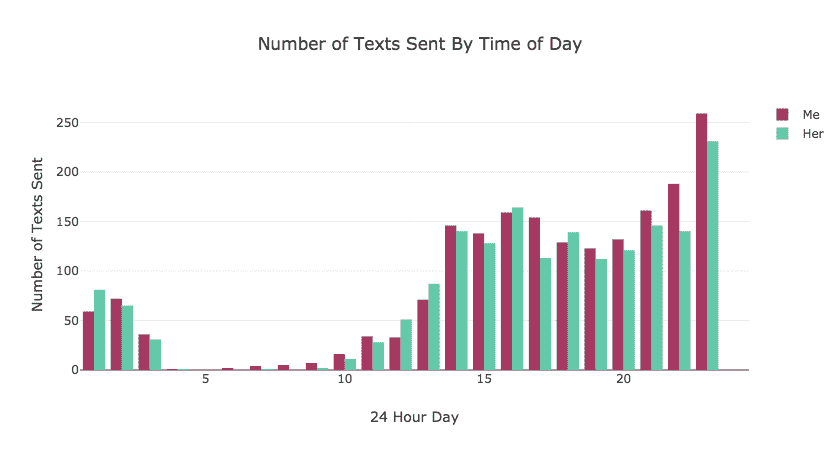](https://res.cloudinary.com/practicaldev/image/fetch/s---u-DPBp6--/c_limit%2Cf_auto%2Cfl_progressive%2Cq_auto%2Cw_880/https://thepracticaldev.s3.amazonaws.com/i/j17h0il6i7pc255al5rb.png)

<figcaption>Check The Late Night Though (RNH) 😎</figcaption>

</figure>

[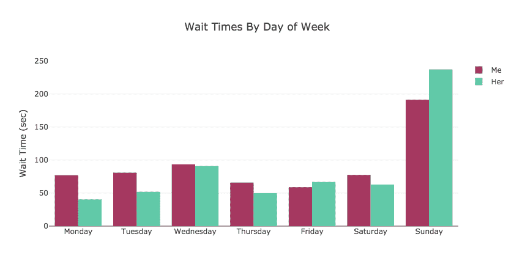](https://res.cloudinary.com/practicaldev/image/fetch/s--wcNxz8Ls--/c_limit%2Cf_auto%2Cfl_progressive%2Cq_auto%2Cw_880/https://thepracticaldev.s3.amazonaws.com/i/pj10gjfwiefcgxkkqxa6.png) 

<figure>

<figcaption>守圣日🙏🏿</figcaption>

</figure>

[此处提供源代码](https://github.com/weallwegot/conversation-analytics)

## [wellwegot](https://github.com/weallwegot)/[对话分析](https://github.com/weallwegot/conversation-analytics)

### 找出你的 iphone 对话的所有重要统计数据和故障。

<article class="markdown-body entry-content container-lg" itemprop="text">

[](https://travis-ci.org/weAllWeGot/conversation-analytics)

[](https://coveralls.io/github/weAllWeGot/conversation-analytics?branch=master)

## [这个项目为什么会存在？](https://andcomputers.io/unrequited-love-as-told-by-a-computer/)

## [开发人员的演练](https://andcomputers.io/conversational-analytics-a-technical-walkthrough/)

#### 按星期几和时间细分的双倍文本价格

[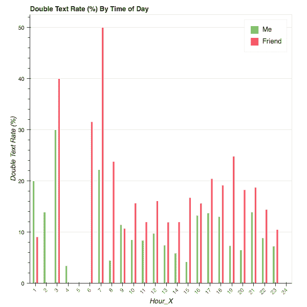 ](https://camo.githubusercontent.com/85d3001995bd71dd69f7bb3b5d3ac97c11ec1bf5/68747470733a2f2f696d6167652e6962622e636f2f6679676d44762f626f6b65685f706c6f745f31312e706e67) [ 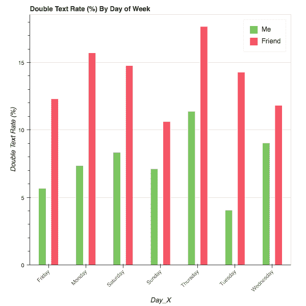](https://camo.githubusercontent.com/6bd4338a61aaa8843630fb545964ee9b8e66f885/68747470733a2f2f696d6167652e6962622e636f2f636471326d462f626f6b65685f706c6f745f31302e706e67)

#### 表情符号的总体使用情况

思考脸、翻白眼的脸、耸肩的人:深色肤色、耸肩的人、沉思的脸、疲倦的脸、喜极而泣的脸、微笑的脸、微笑的眼睛、拥抱的脸、眼睛

top_emojis_Friend:疲惫的脸、喜极而泣的脸、翻白眼的脸、面无表情的脸、思考的脸、人倾手:中深肤色、骷髅头、人倾手、OK 手:中深肤色、拥抱脸

#### 得到回复的平均等待时间

[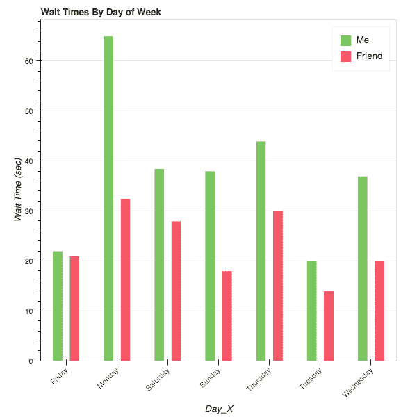](https://camo.githubusercontent.com/25aa44ee3386aad4259ccd5a22262592bd4bd0a8/68747470733a2f2f696d6167652e6962622e636f2f6847735244762f626f6b65685f706c6f745f322e706e67)

[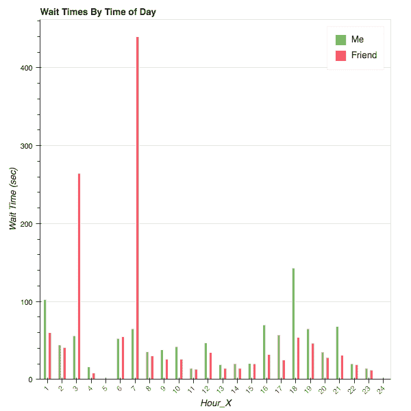](https://camo.githubusercontent.com/4ff7eeb692acc8bd3b4d6ddc624f9bda9e41b747/68747470733a2f2f696d6167652e6962622e636f2f6655634636462f626f6b65685f706c6f745f312e706e67)

#### 笑率按一周中的某一天和一天中的某个时间来划分

[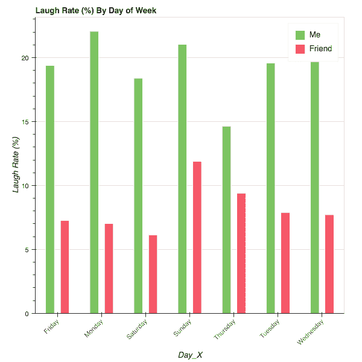](https://camo.githubusercontent.com/4b4ef64b1c75f159d4fa4ae1df96d6791283f569/68747470733a2f2f696d6167652e6962622e636f2f6257797a59762f626f6b65685f706c6f745f392e706e67)

[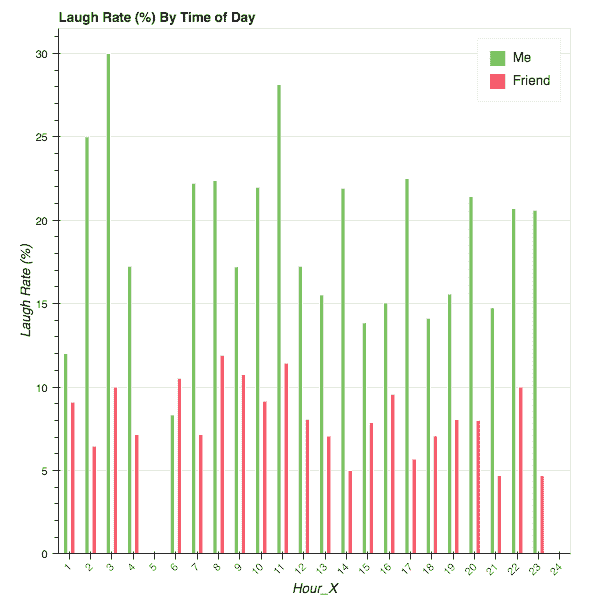](https://camo.githubusercontent.com/248348be9885cde5548f7a2916110de3c5a4d048/68747470733a2f2f696d6167652e6962622e636f2f6e674a4e6d462f626f6b65685f706c6f745f382e706e67)

#### 按一天中的时间发送的文本数量

[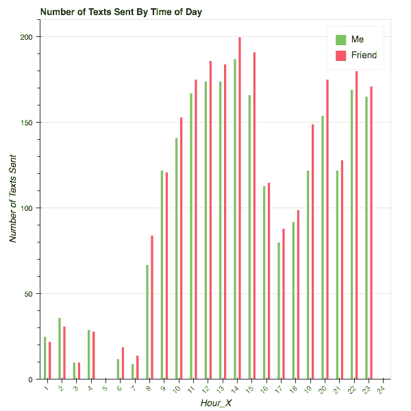](https://camo.githubusercontent.com/15b2d1361fe93d06f40be3c0242cee890fe2f6b8/68747470733a2f2f696d6167652e6962622e636f2f6779775766612f626f6b65685f706c6f745f332e706e67)

#### 诅咒率占发送短信的百分比

[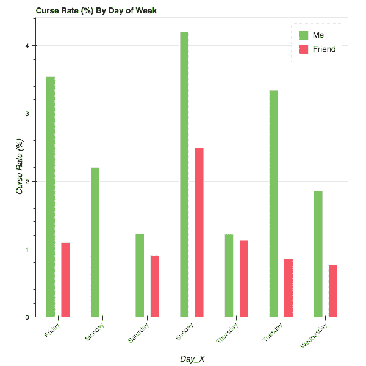](https://camo.githubusercontent.com/66a97d002af3f76a51fcdc5354d1ff0b7b957678/68747470733a2f2f696d6167652e6962622e636f2f6368546f52462f626f6b65685f706c6f745f31352e706e67)

[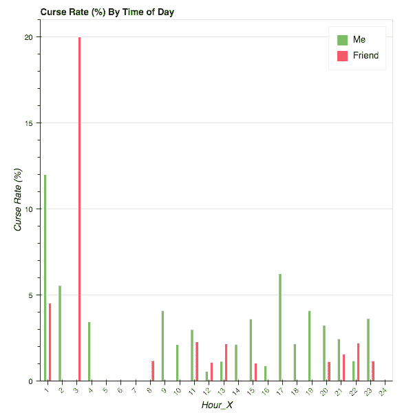](https://camo.githubusercontent.com/7f263620673ff35c709a3dd69e122be44ea58f06/68747470733a2f2f696d6167652e6962622e636f2f6a48774b59762f626f6b65685f706c6f745f31342e706e67)

#### 发送的链接数量占发送文本的百分比

[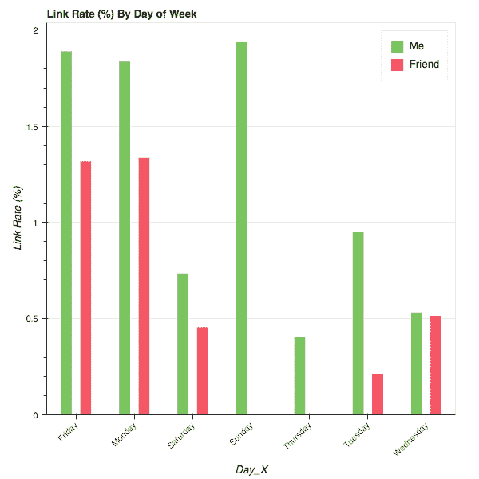](https://camo.githubusercontent.com/dc7641d5fa79b9bd1ffe2273efae13fa89e2f911/68747470733a2f2f696d6167652e6962622e636f2f6d45444e6d462f626f6b65685f706c6f745f31332e706e67)

[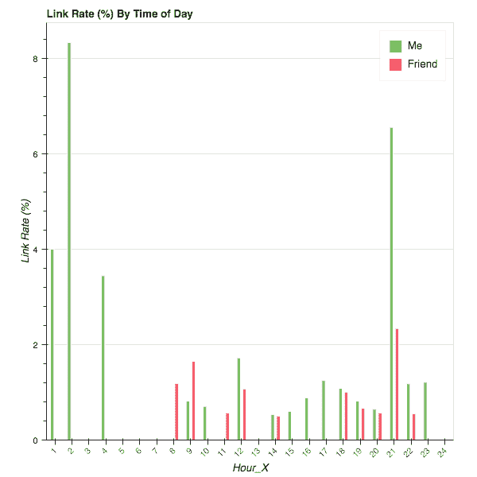](https://camo.githubusercontent.com/e4ee168279d7d33cb031d2c5dacf3af8e8d9b4fd/68747470733a2f2f696d6167652e6962622e636f2f69754f634c612f626f6b65685f706c6f745f31322e706e67)

#### 每小时发送了多少条短信

[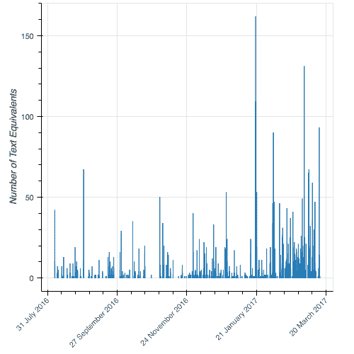](https://camo.githubusercontent.com/aa7a5f1d8eaa41907fb9e9b201a7e9a052b3674f/68747470733a2f2f696d6167652e6962622e636f2f6575696f52462f626f6b65685f706c6f745f342e706e67)

#### 累计发送了多少条短信

[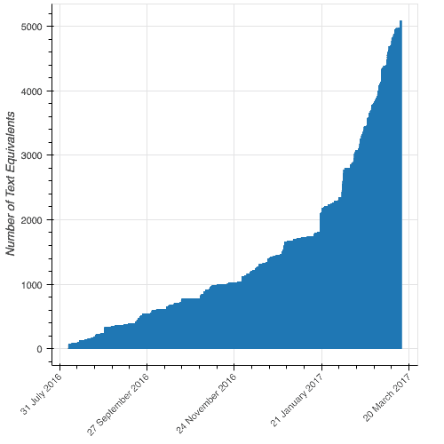](https://camo.githubusercontent.com/be49fae796f673e946f8984c0aa16d661faae3b4/68747470733a2f2f696d6167652e6962622e636f2f6378433430612f626f6b65685f706c6f745f352e706e67)

# 对话分析

了解社会动态…

</article>

[View on GitHub](https://github.com/weallwegot/conversation-analytics)

一如既往地感谢您的阅读，并请分享您的想法！觉得我是个怪人？你见过的最酷的项目？禁止我在 40 岁生日前使用电脑？想要进行你自己的事后关系分析吗？不同指标的建议？

* * *

作为一个差劲的开发者，这个工具只能通过命令行界面(CLI)工作。总有一天我会构建一个 UI，让程序持续运行。只是不是今天..很可能不是明天。