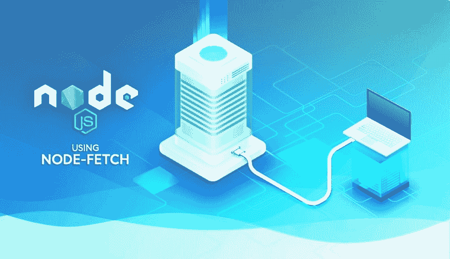

# 使用 NodeJS 发出 API 请求

> 原文：<https://dev.to/hackersandslackers/making-api-requests-with-nodejs-3ndg>

[](https://res.cloudinary.com/practicaldev/image/fetch/s--TiFmk6Yi--/c_limit%2Cf_auto%2Cfl_progressive%2Cq_auto%2Cw_880/https://hackers.nyc3.cdn.digitaloceanspaces.com/posts/2019/02/node-fetch.jpg)

如果你是那种在空闲时间阅读 Javascript 技术文章的人(你就是)，你不需要我告诉你 JQuery 已经死了。JQuery 自己也宣称 JQuery 已经死亡。关于 JQuery 唯一酷的事情是谁能最快地从他们的旧堆栈中删除它，这回避了一个问题:为什么这个网站上第三受欢迎的页面是关于 JQuery 的旧帖子？

维护一个教程博客教会了我很多关于感知和现实之间的差距。虽然我们内容发布者在象牙塔里发布中型帖子，但我们很快就创造了一种“每个人”都在做什么的感觉，但结果是“每个人”只包括那些特别显眼的个人。这部分人口占活跃劳动力的比例远远低于 10-20%。我本以为任何带有“React”这个词的帖子都会立即爆炸，但实际上人们更感兴趣的是使用带有 ExpressJS 的[车把(顺便说一句，我并不为那个帖子感到自豪，请不要读它)。](https://hackersandslackers.com/handlebars-templating-in-expressjs/)

我想提供一种在与 REST APIs 交互时使用 AJAX 调用的替代方法，以消除我一开始就有可能导致不良行为的意识。希望那些迷路的人能从中找到一些东西。考虑到我自己已经在 GraphQL 的兔子洞里陷得有多深，这可能是最后一次有机会写关于 REST 的东西了。

## 选择库:节点-获取

像 Javascript 中的所有东西一样，有太多的包在做同样的事情，解决同样的问题。发出 API 请求也不例外。 **[http](https://www.npmjs.com/package/http)** 有点原始， **[用 Webpack 构建时请求](https://www.npmjs.com/package/request)** 中断， **[r2](https://www.npmjs.com/package/r2)** 看起来像是毫无意义的克隆，等等。不要让我从有 40 种不同方法链接请求的异步库开始。到底是谁把 API 请求发展到我们需要这么多选项来传输或并行 API 请求的地步？

在使用了所有这些库之后， **[节点抓取](https://www.npmjs.com/package/node-fetch)** 是今天的首选武器。简单地说:这很简单，也是唯一一个实际上开箱即用的 Webpack，没有荒谬的配置废话。我所关心的唯一一个好的替代方法是 **[节点等距提取](https://www.npmjs.com/package/isomorphic-fetch)** 。等距提取模仿了**节点提取**的语法，但令人印象深刻的是在*客户端和服务器端都有效。*

### 开始设置

启动一个节点项目并安装节点获取:

```
npm install --save node-fetch 
```

在我们想要发出请求的 JS 文件中，我们可以使用 **require():** 引用 **node-fetch**

```
const fetch = require('node-fetch'); 
```

## 创建节点提取请求

我们将从最基本的 GET 请求开始:

```
fetch('https://example.com')
  .then(response => response.json())
  .then(data => {
    console.log(data)
  })
  .catch(err => ...) 
```

事实上，这是一个基础水平。在没有指定方法的情况下，node-fetch 假设我们正在发出 GET 请求。我们从请求体生成 JSON，并将结果打印到控制台。

如果不向目标端点传递消息头、参数或消息体，您可能不会从任何请求中获得太多价值。下面是我们如何做一个更复杂(更真实)的 POST 调用:

```
var url ='https://example.com';
var headers = {
  "Content-Type": "application/json",
  "client_id": "1001125",
  "client_secret": "876JHG76UKFJYGVHf867rFUTFGHCJ8JHV"
}
var data = {
  "name": "Wade Wilson",
  "occupation": "Murderer",
  "age": "30 (forever)"
}
fetch(url, { method: 'POST', headers: headers, body: data})
  .then((res) => {
     return res.json()
})
.then((json) => {
  console.log(json);
  // Do something with the returned data.
}); 
```

这还差不多:现在我们传递头部和 JSON 主体。如果需要的话， **fetch()** 方法也接受一个`credentials`参数进行认证。

注意，我们通过在我们的 **then()** 箭头函数中保留利用响应 JSON 的逻辑来避免回调地狱。我们可以根据需要将这些语句串联起来。

### 响应的属性

响应对象不仅仅包含响应体 JSON:

```
fetch('https://example.com')
.then(res => {
  res.text() // response body (=> Promise)
  res.json() // parse via JSON (=> Promise)
  res.status //=> 200
  res.statusText //=> 'OK'
  res.redirected //=> false
  res.ok //=> true
  res.url //=> 'https://example.com'
  res.type //=> 'basic'
                   // ('cors' 'default' 'error'
                   // 'opaque' 'opaqueredirect')

  res.headers.get('Content-Type')
}) 
```

在围绕捕获错误构建功能时,`res.status`尤其方便:

```
fetch('https://example.com')
  .then(reportStatus)

function checkStatus (res) {
  if (res.status >= 200 && res.status < 300) {
    return res
  } else {
    let err = new Error(res.statusText)
    err.response = res
    throw err
  }
} 
```