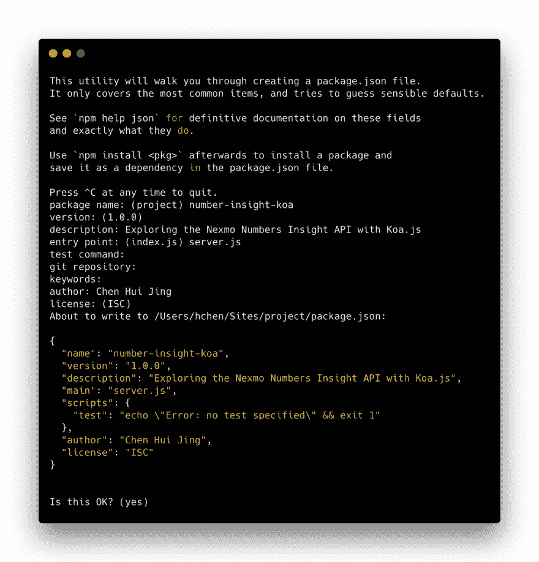
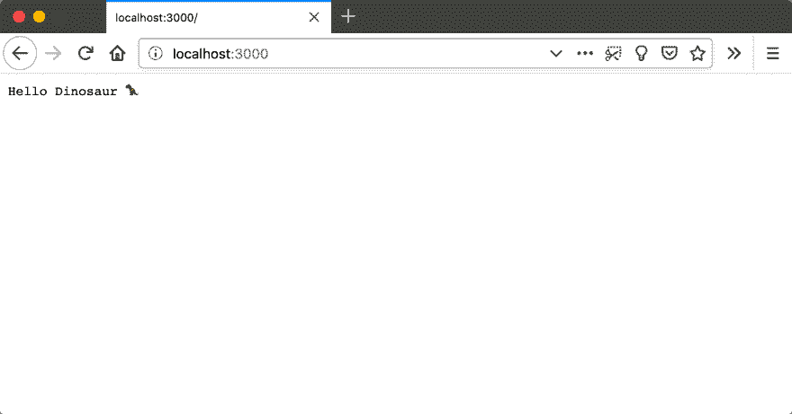
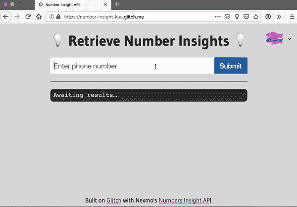
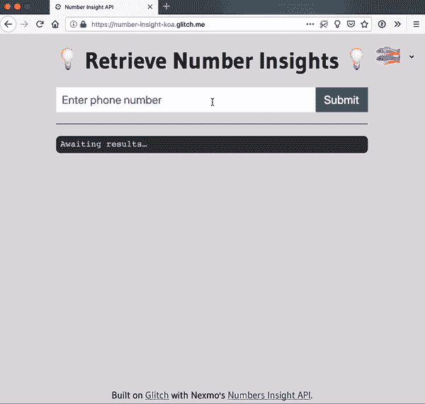
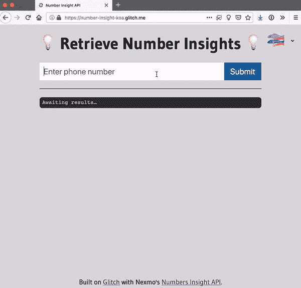

# Koa.js 上的 NEX mo Number Insight API 入门

> 原文：<https://dev.to/vonagedev/getting-started-with-nexmos-number-insight-apis-on-koajs-6f2>

Nexmo 的 [Number Insight API](https://developer.nexmo.com/number-insight/overview) 提供关于电话号码的有效性、可达性和漫游状态的实时智能，并告诉您如何在您的应用程序中正确格式化号码。

有三个级别的 Number Insight API 可用:**基本**、**标准**和**高级**，每一个都返回越来越多的关于被查询电话号码的信息。高级 API 可以异步使用，也可以同步使用。

## 先决条件

*   对 Javascript 的基本理解
*   安装在您机器上的 [Node.js](https://nodejs.org/en/download/)
*   一个 [Nexmo](https://dashboard.nexmo.com/sign-up) 帐户(用于您的 API 凭证)

本教程将带你从头开始这个过程。如果你想看到完成的代码，你可以为这个项目克隆 [git 库](https://github.com/nexmo-community/number-insight-koa)或者[在 Glitch](https://glitch.com/edit/#!/remix/number-insight-koa) 上重新混合它。请注意，它们对于 Glitch 实现略有不同，以适应项目在平台上的托管方式。

## 从零开始一个 Koa.js 项目

在本地计算机上创建一个项目文件夹，然后运行以下命令来设置一个新的 Node.js 项目。

```
npm init 
```

Enter fullscreen mode Exit fullscreen mode

这将触发一系列提示，生成您的`package.json`文件。如果愿意，您可以选择将答案留空以使用默认值。

[](https://res.cloudinary.com/practicaldev/image/fetch/s--_wntLrTI--/c_limit%2Cf_auto%2Cfl_progressive%2Cq_auto%2Cw_880/https://cdn.glitch.com/0d1dc72c-27cc-4eff-9bcd-e771759caed1%252Fnpm-init.png%3F1549339410355)

接下来，安装 [Koa.js](https://koajs.com/) 。请注意，Koa 需要 7.6.0 或更高版本的节点来支持 ES2015 和异步功能。

```
npm install koa --save 
```

Enter fullscreen mode Exit fullscreen mode

在项目文件夹中创建一个`server.js`文件。

```
touch server.js 
```

Enter fullscreen mode Exit fullscreen mode

将以下代码粘贴到新创建的文件中。

```
const Koa = require('koa')

const port = process.env.PORT || 3000
const app = new Koa()

app.use(async ctx => {
  ctx.body = 'Hello Dinosaur 🦖'
})

const listener = app.listen(port, function() {
  console.log('Your app is listening on port ' + listener.address().port)
}) 
```

Enter fullscreen mode Exit fullscreen mode

运行`server.js`文件。

```
node server.js 
```

Enter fullscreen mode Exit fullscreen mode

如果你从浏览器导航到`http://localhost:3000`，你会看到一个空白页面，上面写着“你好，恐龙🦖".

[](https://res.cloudinary.com/practicaldev/image/fetch/s--pbLC8kVR--/c_limit%2Cf_auto%2Cfl_progressive%2Cq_auto%2Cw_880/https://cdn.glitch.com/0d1dc72c-27cc-4eff-9bcd-e771759caed1%252Fkoa-init.png%3F1549340244854)

您还应该安装 [dotenv](https://www.npmjs.com/package/dotenv) ，它允许您将存储在`.env`文件中的环境变量加载到`process.env`中。

```
npm install dotenv --save 
```

Enter fullscreen mode Exit fullscreen mode

现在您可以创建`.env`文件，它至少应该包含以下变量:

```
NEXMO_API_KEY=''
NEXMO_API_SECRET='' 
```

Enter fullscreen mode Exit fullscreen mode

要访问环境变量，你必须需要它，最好是在你的`server.js`文件的顶部。

```
require('dotenv').config() 
```

Enter fullscreen mode Exit fullscreen mode

如果你还没有注册一个 Nexmo 账户，现在是时候了。一旦您登录到仪表板，您首先看到的应该是您的 API 凭证。请务必用引号将您的密钥和机密括起来。

## 了解数字洞察 API

首先，为 Node.js :
安装 [Nexmo REST API 客户端](https://github.com/Nexmo/nexmo-node)

```
npm install nexmo --save 
```

Enter fullscreen mode Exit fullscreen mode

接下来，初始化一个新的 Nexmo 实例。

```
const Nexmo = require('nexmo')

const nexmo = new Nexmo({
  apiKey: process.env.NEXMO_API_KEY,
  apiSecret: process.env.NEXMO_API_SECRET
}) 
```

Enter fullscreen mode Exit fullscreen mode

如前所述，Number Insight API 有三个级别，您可以根据需要的信息类型选择一个级别。这就是 API 的结构。

```
nexmo.numberInsight.get({
  level: 'basic | standard | advancedSync', // set Number Insight level here
  number: INSIGHT_NUMBER // phone number to be queried
}, (error, result) => {
  if (error) {
    console.error(error)
  }
  else {
    console.log(result)
  }
}) 
```

Enter fullscreen mode Exit fullscreen mode

你可以参考我们的 [API 参考](https://developer.nexmo.com/api/number-insight)来看看响应 JSON 是如何构造的。

## 获得数字洞察

您将需要某种方法来输入要查询的电话号码，所以让我们创建一个基本的 web 页面来完成这项工作。

在您的项目中创建一个`public`文件夹，并在该文件夹中添加一个`index.html`、`styles.css`和`scripts.js`。您的项目结构现在应该看起来像这样:

```
PROJECT_FOLDER/
|-- public/
| |-- index.html
| |-- scripts.js
| `-- styles.css
|-- .env
`-- server.js 
```

Enter fullscreen mode Exit fullscreen mode

添加以下您的`index.html`页面:

```
<!DOCTYPE html>
<html lang="en">
  <head>
    Number Insight API
    <meta name="description" content="Exploring Nexmo's Number Insight API">
    <link id="favicon" rel="icon" href="https://www.nexmo.com/favicon.ico" type="image/x-icon">
    <meta charset="utf-8">
    <meta http-equiv="X-UA-Compatible" content="IE=edge">
    <meta name="viewport" content="width=device-width, initial-scale=1">

    <link rel="stylesheet" href="styles.css">
    <script src="scripts.js" defer></script>
  </head>

  <body>
    <main>
      <h1>Retrieve Number Insights</h1>
      <form>
        <input type="tel" placeholder="Enter phone number">
        <button type="button">Submit</button>
      </form>
      <hr>
      <pre><code>Awaiting results…</code></pre>
    </main>
  </body>
</html> 
```

Enter fullscreen mode Exit fullscreen mode

您还可以通过向`styles.css`文件添加以下内容来向页面添加一些基本样式:

```
@import url('https://fonts.googleapis.com/css?family=Gudea:400,700');

html {
  box-sizing: border-box;
  height: 100%;
  font-size: calc(1vmin + 1em);
}

*,
*::before,
*::after {
  box-sizing: inherit;
  margin: 0;
  padding: 0;
}

body {
  font-family: 'Gudea', sans-serif;
  height: 100%;
  display: flex;
  flex-direction: column;
  min-width: 15em;
  background-color: gainsboro;
}

main {
  flex: 1;
  margin: auto;
  padding: 1em;
}

h1 {
  margin-bottom: 0.5em;
}

form {
  display: flex;
  align-items: center;
  width: 100%;
  min-width: 10em;
}

input {
  font-size: inherit;
  padding: 0.5em;
  border: 0;
  flex: 1;
}

button {
  font-size: inherit;
  height: 100%;
  background-color: #2e689b;
  color: #fff;
  padding: 0.5em 0.75em;
  border: 0;
}

hr {
  margin: 1em 0;
}

pre {
  background-color: #333;
  padding: 0.5em;
  border-radius: 0.5em;
  color: lightblue;
  white-space: pre-wrap;
} 
```

Enter fullscreen mode Exit fullscreen mode

下一步是将输入发送到服务器，以便您可以将其插入 Number Insight API 并进行检查。为此，触发一个对处理表单内容的路由的`POST`请求。下面的示例代码为此使用了[获取 API](https://developer.mozilla.org/en-US/docs/Web/API/Fetch_API) 。

```
const phone = document.querySelector('input')
const submit = document.querySelector('button')
const insights = document.querySelector('code')

submit.addEventListener('click', send, false)

function send(event) {
  fetch('/submit', {
    method: 'post',
    headers: {
      'Content-Type': 'application/json'
    },
    body: JSON.stringify({
      phone: phone.value
    })
  })
  .then(function(res){ return res.json() })
  .then(function(insight){ parseInsight(insight) })
  .catch(function(error){ console.log(error) })
}

function parseInsight(data) {
  insights.innerHTML = JSON.stringify(data, null, 2)
} 
```

Enter fullscreen mode Exit fullscreen mode

您需要在服务器端处理这个`POST`请求。与 Express 或 Hapi.js 等其他流行的 Node.js 框架不同，Koa.js 更加模块化。支持路由或服务静态文件等功能，但在单独的模块中，需要安装:

```
npm install koa-router koa-bodyparser koa-static --save 
```

Enter fullscreen mode Exit fullscreen mode

更新您的`server.js`文件以使用这些新的依赖项。首先，不是提供一个“你好恐龙！🦖”消息，修改您的`server.js`文件，通过替换
来使用`index.html`文件

```
app.use(async ctx => {
  ctx.body = 'Hello Dinosaur 🦖'
}) 
```

Enter fullscreen mode Exit fullscreen mode

用

```
const serve = require('koa-static')
app.use(serve('./public')) 
```

Enter fullscreen mode Exit fullscreen mode

接下来，设置传入 POST 请求到`/submit`的路由。

```
const bodyParser = require('koa-bodyparser')
const Router = require('koa-router')

const router = new Router()

app.use(bodyParser())

router.post('/submit', async (ctx, next) => {
  const payload = await ctx.request.body
  const number = await payload.phone
  const insight = await getInsight(number)
  ctx.status = 200
  ctx.body = insight
})

async function getInsight(number) {
  return new Promise(function(resolve, reject){
    nexmo.numberInsight.get({
      level: 'basic', 
      number: number
    }, (error, result) => {
      if (error) {
        console.error(error)
        reject(error)
      }  
      else {
        resolve(result)
      }
    })
  })
}

app.use(router.routes()).use(router.allowedMethods()) 
```

Enter fullscreen mode Exit fullscreen mode

### 基础 API

如果一切都设置正确，您应该能够输入一个电话号码，并在您的网页上获得有关该号码的结果信息。使用基本 API，您可以确定:

*   号码注册的国家
*   该号码的本地和国际表示

有了这些信息，您可以发现号码属于哪个国家，并使用这些信息正确地格式化号码。

[](https://res.cloudinary.com/practicaldev/image/fetch/s--C10UQ5cC--/c_limit%2Cf_auto%2Cfl_progressive%2Cq_66%2Cw_880/https://cdn.glitch.com/0d1dc72c-27cc-4eff-9bcd-e771759caed1%252Fresult.gif%3F1549545606840)

### 标准 API

Number Insight Standard API 提供了 Number Insight Basic API 的所有信息以及以下附加数据:

*   线路类型(移动/固定电话/虚拟号码/高级/免费)
*   移动国家代码(MCC)和移动网络代码(MNC)
*   呼叫者的姓名(仅限美国)

这方面的一个常见用例是确定一个号码的最佳通信类型(短信或语音)并阻止虚拟号码。

[](https://res.cloudinary.com/practicaldev/image/fetch/s--tW4jdJLh--/c_limit%2Cf_auto%2Cfl_progressive%2Cq_66%2Cw_880/https://cdn.glitch.com/0d1dc72c-27cc-4eff-9bcd-e771759caed1%252Fstandard.gif%3F1549547118621)

### 高级 API

最后，Number Insight Advanced API 提供了 Number Insight Standard API 中的所有数据以及以下附加信息:

*   如果该号码可能有效
*   如果号码被转移
*   如果号码是可接通的
*   如果该号码正在漫游，如果是，则包括运营商和国家

通常，此类信息用于确定与数字相关的风险。

[](https://res.cloudinary.com/practicaldev/image/fetch/s--g2Qcg5uq--/c_limit%2Cf_auto%2Cfl_progressive%2Cq_66%2Cw_880/https://cdn.glitch.com/0d1dc72c-27cc-4eff-9bcd-e771759caed1%252Fadvanced.gif%3F1549547775312)

高级数字 API 还可以通过 webhook 异步使用[来返回可用的洞察数据。请注意，该特性不适用于基本和标准 API。](https://developer.nexmo.com/number-insight/building-blocks/number-insight-advanced-async)

## 下一步去哪里？

如果您热衷于使用这些 API 做更多的事情，下面是一些可能对您有帮助的链接:

*   [开发者门户上 Number Insight API 的文档](https://developer.nexmo.com/number-insight/overview)
*   各种 Nexmo APIs 的系列教程
*   如果你需要我们，试试 [Nexmo 社区 Slack 频道](https://developer.nexmo.com/community/slack)
*   请发推文到 [@NexmoDev](https://twitter.com/nexmodev) 让我们知道你的想法