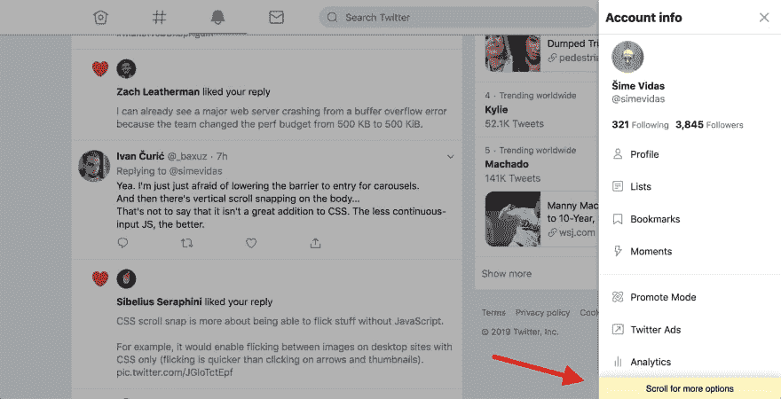

# Twitter 的 PWA 并没有表明有更多的菜单选项

> 原文：<https://dev.to/simevidas/twitters-pwa-does-not-indicate-that-more-menu-options-are-available-47cn>

在 Twitter 的渐进式网络应用程序([mobile.twitter.com](https://mobile.twitter.com))中，主菜单显示在一个可滚动的容器中，但默认情况下，在某些平台上<mark>滚动条是不可见的</mark>。取决于用户的视口高度，菜单可能看起来是完整的，并且用户可能无法发现最初不可见的附加菜单选项。

[https://www.youtube.com/embed/YuHZxkjibA8](https://www.youtube.com/embed/YuHZxkjibA8)

YouTube 网站通过在用户将鼠标光标悬停在菜单上时显示滚动条来解决这个问题。

[https://www.youtube.com/embed/KXacQJLojGk](https://www.youtube.com/embed/KXacQJLojGk)

在用户不能用鼠标悬停菜单的移动平台上，Twitter 可以在菜单底部显示一条消息，通知用户下面有更多的菜单选项。

* * *

*此内容最初发布于 [https://webplatform.news](https://webplatform.news) 。*