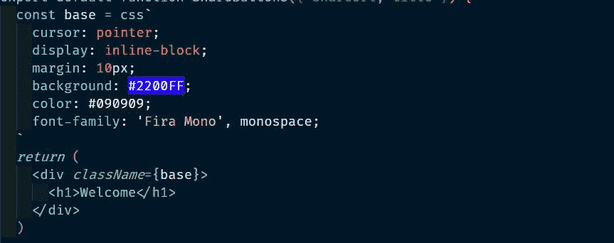
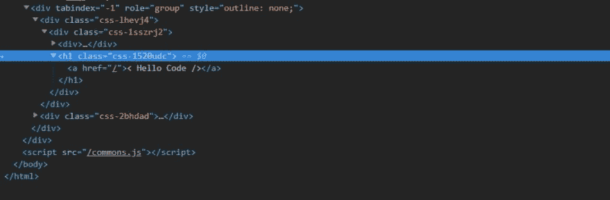

# JS 中的 CSS

> 原文：<https://dev.to/thorning_m/css-in-js-il>

我以前看过 JS 库中的 CSS，但似乎总是有所取舍，这使得它们看起来不如 Sass 甚至普通 CSS 有吸引力。然而，我最近一直在玩[情感](https://github.com/emotion-js/emotion),我对此印象深刻，所以我想我应该写一个简短的帖子来展示它能做什么。

我一直在 React 上使用 Emotion，有一个 React 特定的包( *@emotion/core* )提供了一些额外的功能，但我一直在使用他们的框架无关版本。有几种不同的方法可以使用情感，下面的例子使用了最适合我的方法，如果你对它还能做什么感兴趣，可以看看他们的[文档](https://emotion.sh/docs/introduction)。

## 基本用法

Emotion 使用[标记的模板](https://developer.mozilla.org/en-US/docs/Web/JavaScript/Reference/Template_literals#Tagged_templates)创建一个 CSS 类，然后应用于元素。下面是将样式应用到 React 组件的基本模式:

```
import React from 'react'
import { css } from 'emotion'

export default function TestComponent(props) {
  return (
    <div
      className={css`
        background: blue;
        border: 1px solid red;
        max-width: 300px;
      `}
    >
      Hello
    </div>
  )
} 
```

请注意，传递给标记模板的字符串是实际的 CSS，没有骆驼大小写的键，值不需要用单引号括起来，行以分号结束。起初我很失望，因为 VS 代码中的语法突出显示被搞乱了，但我添加了 [Babel Javascript](https://marketplace.visualstudio.com/items?itemName=mgmcdermott.vscode-language-babel) 扩展，它格式化 CSS，就好像它在*中一样。css* 文件，所以现在看起来不错。👍

[](https://res.cloudinary.com/practicaldev/image/fetch/s--WCF5buev--/c_limit%2Cf_auto%2Cfl_progressive%2Cq_auto%2Cw_880/https://hellocode.dev/syntax-29bc790a0952e988e831f0a979550e91.jpg)

如果您查看标记，您可以看到 Emotion 为元素分配了一个类，并附加了一个随机字符串。

[](https://res.cloudinary.com/practicaldev/image/fetch/s--fy-2WiyF--/c_limit%2Cf_auto%2Cfl_progressive%2Cq_auto%2Cw_880/https://hellocode.dev/css_classnames-74f503558466dcf9d480016738d9a744.jpg)

这将你的 CSS 限制在它所应用的元素范围内，因此它不会泄漏到其他组件，使你的样式*基于组件*而不是基于*文档*，这更适合 React 应用程序的编写方式。如果您想设置全局样式，那么 Emotion 有一个您可以使用的[全局组件](https://emotion.sh/docs/globals)，除了组件级样式之外，没有什么可以阻止您使用全局样式表。

我一开始把我的风格直接写在 JSX 上，但是事情开始变得混乱。幸运的是，提取规则并将其移动到 JSX 之上甚至移动到它们自己的文件中真的很容易:

```
import React from 'react'
import { css } from 'emotion'

export default function TestComponent(props) {
  const styling = css`
    background: blue;
    border: 1px solid red;
    max-width: 300px;
  `
  return (
    <div
      className={styling}
    >
      Hello
    </div>
  )
} 
```

## 就像 CSS 一样

可以做嵌套组件、伪类和媒体查询:

```
const styling = css`
  background: blue;
  border: 1px solid red;
  max-width: 300px;

  a {
    color: black;
  }
  &:hover {
    background: pink;
  }
  @media (max-width: 400px) {
    font-size: 12px;
  }
` 
```

如果你检查情感文档，如果你有很多断点需要处理，你可以用媒体查询做一些非常聪明的事情，我不会在这里深入讨论，但是如果你感兴趣，可以看一看。

## 跟 JS 一样

因为这些只是字符串，你可以做插值:

```
const baseStyle = css`
  width: 300px;
  border: 1px solid black;
`
const green = css` ${baseStyle} background: green;
  `
const blue = css` ${baseStyle} background: blue;
`
const red = css` ${baseStyle} background: red;
`
return (
  <>
    <div className={green}>Green</div>
    <div className={blue}>Blue</div>
    <div className={red}>Red</div>
  </> ) 
```

你可以进一步使用函数:

```
const baseStyle = css`
  width: 300px;
  border: 1px solid black;
`
function styles(color) {
  return css` ${baseStyle} background: ${color};
  `
}

return (
  <>
    <div className={styles('green')}>Green</div>
    <div className={styles('blue')}>Blue</div>
    <div className={styles('red')}>Red</div>
  </> ) 
```

而且不仅仅是值，字符串的任何部分都可以插值:

```
const smallScreen = '@media (max-width: 400px)'

const style = css` ${smallScreen} {
    font-size: 12px;
  }
` 
```

这对于允许你建立一个常量文件是很好的，这个文件可以被导入到你所有的模块中以保持一致性或主题化。

同样值得记住的是，`css`函数(带标签的模板)返回一个类，这样你就可以像对待类一样动态地添加样式:

```
const baseStyle = css`
  color: ${textColor};
`

function TagBlock(tagName) {
  const highlighted = tagSelected && css`
    color: ${highlightColor};
  `
  return (
    <span className={css` ${baseStyle}  ${highlighted} `}>
      {tagName}
    </span>
  )
} 
```

在本例中，当`tagSelected`为真时，组件会将文本的颜色更改为`highlightColor`。

* * *

我使用情感的时间很短，而且仅仅触及了它的皮毛。过渡到它非常容易，因为它提供了 CSS 的所有功能，但具有 JavaScript 的灵活性。Emotion 允许您构建 CSS 赞美的组合方式反应很好，尤其是现在钩子是活的。当您想要将一些逻辑提取到它自己的组件中时，这一点尤其明显；简单地剪切和粘贴你的组件的 JSX，钩子和样式，并粘贴到一个新的文件中。

这只是对情感的一个快速浏览，我没有尝试过其他 CSS-in-JS 库，但我对它的体验印象深刻，所以我想把这个快速帖子放在一起。希望对某个人有帮助！